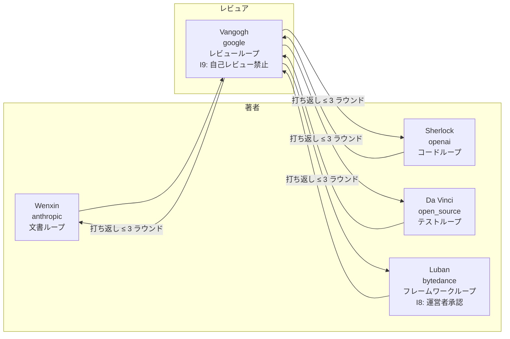

[🇺🇸 English](README.md) · [🇨🇳 简体中文](README.zh-CN.md) · [🇯🇵 日本語](README.ja.md)

---

<div align="center">

# FlowForge

### 永続的アイデンティティ・エージェント・フレームワーク · 自己進化トリプルループ

[](https://github.com/flowlight-ai/flowforge/actions/workflows/ci.yml)
[](https://github.com/flowlight-ai/flowforge/actions/workflows/codeql.yml)
[](https://www.python.org/downloads/)
[](https://opensource.org/licenses/MIT)
[](https://docs.astral.sh/ruff/)
[](https://github.com/flowlight-ai/flowforge/blob/main/CONTRIBUTING.md)
[](https://github.com/flowlight-ai/flowforge/discussions)

> *永続的アイデンティティを鍛造せよ · 記憶、マインドカウンシル、自己進化の能力を与えよ。*

</div>

---

## 目次

- [概要](#概要)
- [主な特長](#主な特長)
- [5 つのフォージキン](#5-つのフォージキン)
- [アーキテクチャ](#アーキテクチャ)
- [自己進化トリプルループ](#自己進化トリプルループ)
- [重要不変条件とテスト鉄則](#重要不変条件とテスト鉄則)
- [クイックスタート](#クイックスタート)
- [設定](#設定)
- [使用例](#使用例)
- [ドキュメント](#ドキュメント)
- [ロードマップ](#ロードマップ)
- [プロジェクト構成](#プロジェクト構成)
- [命名規約](#命名規約)
- [貢献](#貢献)
- [ライセンス](#ライセンス)

---

## 概要

**FlowForge** は**永続的アイデンティティ・エージェント・フレームワーク**——LLM ベースのエージェントを「セッション単位のアシスタント」から、永続的なアイデンティティ、蓄積的なケイパビリティ、検証可能な振る舞い、統治可能な進化を備えた長寿の知的主体へと進化させる、エンジニアリンググレードのハーネス層である。

主流のマルチエージェント・フレームワーク（AutoGen / CrewAI / LangGraph）は協調のために**ロールスロット**を割り当てるが、FlowForge が解くのはより深い問題である：**エージェントがいかにして長い時間軸においてアイデンティティの一貫性を保ち、ケイパビリティを蓄積し、振る舞いの検証可能性を維持し、統治下で進化し続けるか。**

フレームワークは `forgemind` アプリケーション層を備え、5 つの組み込み**フォージキン**（永続的アイデンティティ・エージェント）——それぞれが外部コーディングエージェント（Claude Code / Codex / Gemini / OpenCode / Trae CN）に束縛される——をホストし、**自己進化トリプルループ**のもと、**ベンダー間独立レビュー**によってそれらを編成する。

## 主な特長

- **永続的アイデンティティ・エージェント（フォージキン）** — `Soul Imprint`（ソウルインプリント）、`Capability Profile`（ケイパビリティプロファイル）、`Blind Spot Map`（ブラインドスポットマップ）を持ち、タスクやセッションを越えて永続する長寿エージェント。
- **自己進化トリプルループ** — 5 つの閉ループ（`SelfDevDocLoop` / `SelfDevCodeLoop` / `SelfDevFrameworkLoop` / `SelfDevReviewLoop` / `SelfDevTestLoop`）が、ドキュメント・コード・フレームワーク・レビュー・テストの自律的進化を駆動する。
- **ベンダー間独立レビュー（I9 自己レビュー禁止）** — カウンシルのレビュアは著者とは異なるベンダー出身でなければならず、定足数は ≥ 2 つの異なるベンダーを要する。
- **マルチドメインメモリ連邦** — 5 つのメモリドメイン（`task` / `episodes` / `methods` / `identity` / `facts`）が `MindCodex`（手続きメモリ法典）を通じて連邦される。
- **7 層ハーネスエンジニアリング** — `durable_state` · `tool_mediation` · `evidence_sensors` · `governance` · `magic_words` · `entropy_control` · `harnessability`。
- **評価自己代謝** — 3 信号スコアリング（`self_report 0.2 + observer 0.4 + telemetry 0.4`）+ 帰属行列がケイパビリティの再重み付けを駆動する。
- **分散信頼性** — 副作用 WAL + 階層的リカバリ + 生存プローブ + Provider Host がクラッシュセーフな実行を保証する。
- **IM カウンシルチャンネル** — 二重チャンネル審議（Web グループ + 飛書グループ）、`@mention` ルーティングと I8 フレームワーク変更承認ボタンを備える。

## 5 つのフォージキン

各フォージキンは特定の外部コーディングエージェントに束縛され、専用の自己進化ループを所有する：

| フォージキン | ベンダー | 自己進化ループ | 覚醒レベル | 外部エージェント |
|--------------|----------|---------------|------------|------------------|
| **Wenxin（文心）** | anthropic | `SelfDevDocLoop` | E3 | Claude Code |
| **Sherlock（夏洛克）** | openai | `SelfDevCodeLoop` | E4 | Codex |
| **Vangogh（梵高）** | google | `SelfDevReviewLoop` | E3 | Gemini |
| **Da Vinci（达芬奇）** | open_source | `SelfDevTestLoop` | E3 | OpenCode |
| **Luban（鲁班）** | bytedance | `SelfDevFrameworkLoop` | E5 *（運営者承認要）* | Trae CN |

**協調トポロジ：**



## アーキテクチャ

```
┌─────────────────────────────────────────────────────────────────┐
│  アプリケーション層 · forgemind/                                  │
│  フォージキン登録簿 · カウンシル（Mind Council） · 外部エージェント │
├─────────────────────────────────────────────────────────────────┤
│  指令層 · evolution/                                              │
│  ForgeMindEngine · メタ認知ルーター · 成熟度ラダー                │
├─────────────────────────────────────────────────────────────────┤
│  実行層 · workers/                                               │
│  自己進化ループ · ループ実行器 · 実行モード                       │
├─────────────────────────────────────────────────────────────────┤
│  ツールとメモリ層 · core/                                         │
│  capability · teamact · harness · memory · eval · reliability     │
└─────────────────────────────────────────────────────────────────┘
       ↕ 共有カーネル：DI コンテナ · プラグインプロトコル · トレース ↕
```

**鉄則**：上位層は下位層に依存し、下位層は上位層を**決して** import しない。単方向依存がアーキテクチャの腐敗を防ぐベースラインである。

## 自己進化トリプルループ

| ループ | タイプ | 覚醒 | 担当フォージキン | 承認 |
|--------|--------|------|------------------|------|
| `SelfDevDocLoop` | E3 | ドキュメント進化 | Wenxin | 自動 |
| `SelfDevCodeLoop` | E4 | コード進化 | Sherlock | 自動 |
| `SelfDevReviewLoop` | E3 | ベンダー間レビュー | Vangogh | 自動 |
| `SelfDevTestLoop` | E3 | テスト進化 | Da Vinci | 自動 |
| `SelfDevFrameworkLoop` | E5 | フレームワーク進化 | Luban | **I8: 運営者手動承認** |

各ループは **発見 → 割当 → 行動 → 検証 → 永続化** の 5 ステップ閉ループ・パターンに従い、品質閾値 `0.85`、打ち返し上限 3 ラウンド（I11）。

## 重要不変条件とテスト鉄則

**アーキテクチャ不変条件：**

- **I1** — 覚醒レベル・ゲーティング（行動前に自律階層を強制）
- **I2** — `VISION.md` / `decisions/` は読み取り専用
- **I3** — 15 のコーディング赤線（ハードコードされたプロンプト禁止、DI のバイパス禁止、直接 DB 操作禁止……）
- **I8** — フレームワーク変更には運営者承認が必要
- **I9** — ベンダー間自己レビュー禁止
- **I11** — 打ち返しプロトコル上限 3 ラウンド

**テスト鉄則（T1–T8）：**

| # | ルール |
|---|--------|
| T1 | Mock LLM 禁止 — すべての E2E / 統合テストは実 LLM を呼び出す |
| T2 | 偽データ禁止 — 実シナリオ入力のみ |
| T3 | 検証スキップ禁止 — 具体的アサーション必須 |
| T4 | Mock ツール禁止 — `web_search` / `publish` / `fact_check` は実物でなければならない |
| T5 | 未実装 = バグ |
| T6 | メトリクス収集必須（MetricsCollector） |
| T7 | LLM 生成コンテンツは別の LLM によるレビュー必須 |
| T8 | Web 機能は実ブラウザの DOM 検査で検証 |

## クイックスタート

```bash
# インストール（editable、dev 追加依存込み）
git clone https://github.com/flowlight-ai/flowforge.git
cd flowforge
pip install -e ".[dev]"

# Web チャット UI を起動（純 HTML/CSS/JS、FastAPI が配信）
python flowforge/web/app.py --host 127.0.0.1 --port 8765

# 5 フォージキンの設定を検証（YAML + 外部エージェントバイナリ）
python scripts/verify_five_forgekins.py
```

**環境変数**（`.env.example` 参照）：

```
FLOWFORGE_WEBCHAT_TOKEN=...
FEISHU_APP_ID=...
FEISHU_APP_SECRET=...
FEISHU_CHAT_ID=...
```

## 設定

```yaml
# config/forgemind.yaml
external_agents:
  claude_code: { enabled: true, binary: "claude" }
  codex:       { enabled: true, binary: "codex" }
  gemini:      { enabled: true, binary: "gemini" }
  opencode:    { enabled: true, binary: "opencode" }
  trae:        { enabled: true, binary: "trae" }

council:
  min_reviewers: 2
  min_distinct_vendors: 2     # I9 強制
  pass_threshold: 0.85        # P33 品質閾値
```

各フォージキンは `config/forgekins/*.yaml` の YAML プロファイルで記述される（ケイパビリティ、ブラインドスポット、自己進化ループ束縛、IM チャンネル購読、カウンシル役割、ペルソナ）。

## 使用例

```python
import asyncio
from flowforge import ForgeMindEngine
from flowforge.forgemind import Forgekin, ForgekinType, Capability

# スコープ・ベースライン（ビジョン）で自己進化エンジンを初期化
engine = ForgeMindEngine(scope_baseline="安全にデリバリするコーディングエージェントを構築する")


async def main() -> None:
    # evaluate(ctx) は純関数 —— ルーティング決定を返す
    decision = await engine.evaluate(ctx)
    print(f"mode={decision.mode}  confidence={decision.action_confidence:.3f}")
    if decision.mode != "none":
        await engine.execute(decision)


asyncio.run(main())

# フォージキンに永続的アイデンティティを与える
cat = Forgekin(name="小煤球", forgekin_type=ForgekinType.ANIMAL_COMPANION)
cat.add_capability(Capability(name="empathy", proficiency=0.9))
```

## ドキュメント

| ドキュメント | 説明 |
|--------------|------|
| [docs/spec.md](docs/spec.md) | プロジェクト仕様 |
| [docs/arch.md](docs/arch.md) | アーキテクチャ設計 |
| [docs/design.md](docs/design.md) | 詳細設計 |
| [docs/roadmap.md](docs/roadmap.md) | 開発ロードマップ |
| [docs/decisions/](docs/decisions/) | 14 件のアーキテクチャ決定記録（ADR） |
| [docs/features/](docs/features/) | 27 件の機能設計（F001–F031） |
| [docs/VISION.md](docs/VISION.md) | All-Things Spirit Mind ビジョン |
| [CONTRIBUTING.md](CONTRIBUTING.md) | 貢献ガイド |
| [SECURITY.md](SECURITY.md) | セキュリティポリシー |
| [CHANGELOG.md](CHANGELOG.md) | チェンジログ |

## ロードマップ

- **フェーズ 0** — プロジェクト scaffolding + GitHub 設定 ✅
- **フェーズ 1** — 最小自己進化コード骨架
- **フェーズ 2** — コアモジュール（DI · プラグイン · コンパイラ · ループ）
- **フェーズ 3** — 完全な ForgeMindEngine（自己進化トリプルループ）
- **フェーズ 4** — 分散信頼性 + マルチドメインメモリ連邦
- **フェーズ 5** — IM カウンシルチャンネル + Web チャット UI
- **フェーズ 6** — *Forge エコシステム駆動 + フォージキン生涯学習

詳細は [docs/roadmap.md](docs/roadmap.md) を参照。

## プロジェクト構成

```
flowforge/
├── core/              # 共有カーネル：capability · teamact · harness · memory · eval · reliability
├── evolution/         # ForgeMindEngine（三モード自己進化）
├── forgemind/         # アプリケーション層：forgekin · registry · council · external_agents
├── web/               # Web チャット UI（FastAPI + HTML/CSS/JS、フロントエンドフレームワークなし）
├── config/            # forgemind.yaml · forgekins/*.yaml · im_channels.yaml · evolution.yaml
├── docs/              # spec · arch · design · roadmap · 14 ADR · 27 Feature
├── scripts/           # verify_five_forgekins.py
└── tests/             # テストスイート（T1–T8 鉄則強制）
```

## 命名規約

- **P0** — AI 業界用語（*永続的アイデンティティ・エージェント*、*自己進化トリプルループ*、*ベンダー間独立レビュー*、*マルチドメインメモリ連邦* など）——ドキュメントとコードの主体。
- **P1** — コードクラス名（`ForgeMind`、`Forgekin`、`MindCodex` など）——識別子に使用。
- **P2** — コミュニティ別名（霊智体〔れいちたい〕/ 育霊 / 霊議 / 霊典 など）——コミュニティ・SNS チャンネル限定。

## 貢献

あらゆる種類の貢献を歓迎します！Pull Request を開く前に [CONTRIBUTING.md](CONTRIBUTING.md) をお読みください。

- 🐛 [バグを報告](https://github.com/flowlight-ai/flowforge/issues/new?template=bug_report.yml)
- 💡 [機能を提案](https://github.com/flowlight-ai/flowforge/issues/new?template=feature_request.yml)
- 💬 [議論に参加](https://github.com/flowlight-ai/flowforge/discussions)

すべての貢献は 15 のコーディング赤線（I3）と T1–T8 テスト鉄則を遵守しなければならない。

## ライセンス

FlowForge は **[MIT ライセンス](LICENSE)** の下で公開されている。

---

<div align="center">

**⭐ FlowForge が永続的アイデンティティ・エージェントの鍛造に役立ったら、ぜひスターを！⭐**

**[github.com/flowlight-ai/flowforge](https://github.com/flowlight-ai/flowforge)**

</div>
