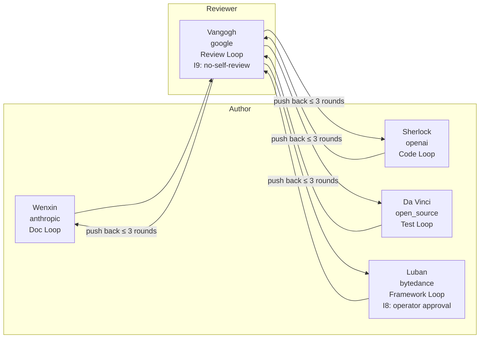

<div align="center">

# FlowForge

### Persistent Identity Agent Framework with Self-Devolution Triple-Loop
#### 持久身份智能体框架 · 自进化三闭环

[](https://github.com/flowlight-ai/flowforge/actions/workflows/ci.yml)
[](https://github.com/flowlight-ai/flowforge/actions/workflows/codeql.yml)
[](https://www.python.org/downloads/)
[](https://opensource.org/licenses/MIT)
[](https://docs.astral.sh/ruff/)
[](https://github.com/flowlight-ai/flowforge/blob/main/CONTRIBUTING.md)
[](https://github.com/flowlight-ai/flowforge/discussions)

> *Forge a Persistent Identity. Endow it with Memory, Council, and Self-Devolution.*
> *锻造持久身份 · 赋予记忆、MindCouncil 与自进化能力。*

</div>

---

## Table of Contents

- [Overview](#overview)
- [Key Features](#key-features)
- [The Five Forgekins](#the-five-forgekins)
- [Architecture](#architecture)
- [Self-Devolution Triple-Loop](#self-devolution-triple-loop)
- [Key Invariants & Testing Ironclad Rules](#key-invariants--testing-ironclad-rules)
- [Quick Start](#quick-start)
- [Configuration](#configuration)
- [Usage Example](#usage-example)
- [Documentation](#documentation)
- [Roadmap](#roadmap)
- [Contributing](#contributing)
- [License](#license)

---

## Overview

**FlowForge** is a **Persistent Identity Agent Framework** — an engineering-grade Harness Layer that evolves LLM-based agents from session-scoped assistants into long-lived intelligent subjects with persistent identity, accumulative capability, verifiable behavior, and governable evolution.

While mainstream multi-agent frameworks (AutoGen / CrewAI / LangGraph) allocate **role slots** for collaboration, FlowForge solves a deeper problem: **how an agent preserves identity consistency, accumulates capability, remains behaviorally verifiable, and evolves under governance over long time horizons.**

The framework ships a `forgemind` application layer that hosts five built-in **Forgekins** (Persistent Identity Agents) — each bound to an external coding agent (Claude Code / Codex / Gemini / OpenCode / Trae CN) — and orchestrates them through a **Self-Devolution Triple-Loop** supervised by **Cross-Vendor Review**.

## Key Features

- **Persistent Identity Agent (Forgekin)** — Long-lived agents with `Soul Imprint`, `Capability Profile`, and `Blind Spot Map` that persist across tasks and sessions.
- **Self-Devolution Triple-Loop** — Five closed loops (`SelfDevDocLoop` / `SelfDevCodeLoop` / `SelfDevFrameworkLoop` / `SelfDevReviewLoop` / `SelfDevTestLoop`) drive autonomous documentation, code, framework, review, and test evolution.
- **Cross-Vendor Independent Review (I9 no-self-review)** — Council reviewers must come from a different vendor than the author; quorum requires ≥ 2 distinct vendors.
- **Multi-Domain Memory Federation** — Five memory domains (`task` / `episodes` / `methods` / `identity` / `facts`) federated through the `MindCodex` (procedural memory codex).
- **Seven-Layer Harness Engineering** — `durable_state` · `tool_mediation` · `evidence_sensors` · `governance` · `magic_words` · `entropy_control` · `harnessability`.
- **Eval Self-Metabolism** — Three-Signals scoring (`self_report 0.2 + observer 0.4 + telemetry 0.4`) + Attribution Matrix drive capability reweighting.
- **Distributed Reliability** — Side-Effect WAL + Tier Recovery + Liveness Probe + Provider Host guarantee crash-safe execution.
- **IM Council Channels** — Dual-channel deliberation (web group + Feishu group) with `@mention` routing and I8 framework-change approval buttons.

## The Five Forgekins

Each Forgekin is bound to a specific external coding agent and owns a dedicated Self-Devolution Loop:

| Forgekin | Vendor | Self-Dev Loop | Awakening Stage | External Agent |
|----------|--------|---------------|-----------------|----------------|
| **Wenxin** (文心) | anthropic | `SelfDevDocLoop` | E3 | Claude Code |
| **Sherlock** (夏洛克) | openai | `SelfDevCodeLoop` | E4 | Codex |
| **Vangogh** (梵高) | google | `SelfDevReviewLoop` | E3 | Gemini |
| **Da Vinci** (达芬奇) | open_source | `SelfDevTestLoop` | E3 | OpenCode |
| **Luban** (鲁班) | bytedance | `SelfDevFrameworkLoop` | E5 *(operator-approved)* | Trae CN |

**Collaboration Topology:**



## Architecture

```
┌─────────────────────────────────────────────────────────────────┐
│  Application Layer · forgemind/                                 │
│  Forgekin Registry · Council (Mind Council) · External Agents   │
├─────────────────────────────────────────────────────────────────┤
│  Command Layer · evolution/                                     │
│  ForgeMindEngine · Metacognition Router · Maturity Ladder       │
├─────────────────────────────────────────────────────────────────┤
│  Execution Layer · workers/                                     │
│  Self-Dev Loops · Loop Executor · Execution Modes               │
├─────────────────────────────────────────────────────────────────┤
│  Tools & Memory Layer · core/                                   │
│  capability · teamact · harness · memory · eval · reliability   │
└─────────────────────────────────────────────────────────────────┘
       ↕ Shared Kernel: DI Container · Plugin Protocol · Tracing ↕
```

**Iron Rule**: Upper layers depend on lower layers; lower layers **never** import upper layers. Single-direction dependency is the baseline that prevents architectural rot.

## Self-Devolution Triple-Loop

| Loop | Type | Awakening | Owner Forgekin | Approval |
|------|------|-----------|----------------|----------|
| `SelfDevDocLoop` | E3 | Documentation evolution | Wenxin | Auto |
| `SelfDevCodeLoop` | E4 | Code evolution | Sherlock | Auto |
| `SelfDevReviewLoop` | E3 | Cross-vendor review | Vangogh | Auto |
| `SelfDevTestLoop` | E3 | Test evolution | Da Vinci | Auto |
| `SelfDevFrameworkLoop` | E5 | Framework evolution | Luban | **I8: operator manual approval** |

Every loop follows the **Discover → Assign → Act → Verify → Persist** five-step closed pattern, with quality threshold `0.85` and push-back upper bound of 3 rounds (I11).

## Key Invariants & Testing Ironclad Rules

**Architectural Invariants:**

- **I1** — Awakening-stage gating (autonomy tier enforced before action)
- **I2** — `VISION.md` / `decisions/` are read-only
- **I3** — The 15 coding red lines (no hard-coded prompts, no bypassing DI, no direct DB ops, …)
- **I8** — Framework changes require operator approval
- **I9** — Cross-vendor no-self-review
- **I11** — Push-back protocol capped at 3 rounds

**Testing Ironclad Rules (T1–T8):**

| # | Rule |
|---|------|
| T1 | No Mock LLM — all E2E/integration tests call real LLMs |
| T2 | No fake data — real-scenario inputs only |
| T3 | No skipped verification — concrete assertions required |
| T4 | No Mock tools — `web_search` / `publish` / `fact_check` must be real |
| T5 | Unimplemented = Bug |
| T6 | Metrics collection mandatory (MetricsCollector) |
| T7 | LLM-generated content must be reviewed by another LLM |
| T8 | Web features verified via real browser DOM inspection |

## Quick Start

```bash
# Install (editable, with dev extras)
git clone https://github.com/flowlight-ai/flowforge.git
cd flowforge
pip install -e ".[dev]"

# Launch the web chat interface (pure HTML/CSS/JS, served by FastAPI)
python flowforge/web/app.py --host 127.0.0.1 --port 8765

# Verify the five Forgekins configuration (YAML + external agent binaries)
python scripts/verify_five_forgekins.py
```

**Environment variables** (see `.env.example`):

```
FLOWFORGE_WEBCHAT_TOKEN=...
FEISHU_APP_ID=...
FEISHU_APP_SECRET=...
FEISHU_CHAT_ID=...
```

## Configuration

```yaml
# config/forgemind.yaml
external_agents:
  claude_code: { enabled: true, binary: "claude" }
  codex:       { enabled: true, binary: "codex" }
  gemini:      { enabled: true, binary: "gemini" }
  opencode:    { enabled: true, binary: "opencode" }
  trae:        { enabled: true, binary: "trae" }

council:
  min_reviewers: 2
  min_distinct_vendors: 2     # I9 enforcement
  pass_threshold: 0.85        # P33 quality threshold
```

Each Forgekin is described by a YAML profile under `config/forgekins/*.yaml` (capabilities, blind spots, self-dev loop binding, IM channel subscriptions, council role, persona).

## Usage Example

```python
import asyncio
from flowforge import ForgeMindEngine
from flowforge.forgemind import Forgekin, ForgekinType, Capability

# Initialize the self-evolution engine with a scope baseline (vision)
engine = ForgeMindEngine(scope_baseline="Build a coding agent that ships safely")


async def main() -> None:
    # evaluate(ctx) is a pure function — it returns a routing decision
    decision = await engine.evaluate(ctx)
    print(f"mode={decision.mode}  confidence={decision.action_confidence:.3f}")
    if decision.mode != "none":
        await engine.execute(decision)


asyncio.run(main())

# Endow a Forgekin with persistent identity
cat = Forgekin(name="小煤球", forgekin_type=ForgekinType.ANIMAL_COMPANION)
cat.add_capability(Capability(name="empathy", proficiency=0.9))
```

## Documentation

| Document | Description |
|----------|-------------|
| [docs/spec.md](docs/spec.md) | Project specification |
| [docs/arch.md](docs/arch.md) | Architecture design |
| [docs/design.md](docs/design.md) | Detailed design |
| [docs/roadmap.md](docs/roadmap.md) | Development roadmap |
| [docs/decisions/](docs/decisions/) | 14 Architecture Decision Records (ADRs) |
| [docs/features/](docs/features/) | 27 Feature designs (F001–F031) |
| [docs/VISION.md](docs/VISION.md) | All-Things Spirit Mind vision |
| [CONTRIBUTING.md](CONTRIBUTING.md) | Contribution guide |
| [SECURITY.md](SECURITY.md) | Security policy |
| [CHANGELOG.md](CHANGELOG.md) | Changelog |

## Roadmap

- **Phase 0** — Project scaffolding + GitHub configuration ✅
- **Phase 1** — Minimal self-evolution code skeleton
- **Phase 2** — Core modules (DI · Plugin · Compiler · Loop)
- **Phase 3** — Complete ForgeMindEngine (Self-Devolution Triple-Loop)
- **Phase 4** — Distributed reliability + Multi-Domain Memory Federation
- **Phase 5** — IM Council Channels + Web chat UI
- **Phase 6** — Drive *Forge ecosystem + Forgekin lifelong learning

See [docs/roadmap.md](docs/roadmap.md) for details.

## Project Structure

```
flowforge/
├── core/              # Shared kernel: capability · teamact · harness · memory · eval · reliability
├── evolution/         # ForgeMindEngine (three-mode self-evolution)
├── forgemind/         # Application layer: forgekin · registry · council · external_agents
├── web/               # Web chat UI (FastAPI + HTML/CSS/JS, no frontend framework)
├── config/            # forgemind.yaml · forgekins/*.yaml · im_channels.yaml · evolution.yaml
├── docs/              # spec · arch · design · roadmap · 14 ADRs · 27 Features
├── scripts/           # verify_five_forgekins.py
└── tests/             # Test suite (T1–T8 ironclad rules enforced)
```

## Naming Convention

- **P0** — AI industry terms (e.g., *Persistent Identity Agent*, *Self-Devolution Triple-Loop*, *Cross-Vendor Review*, *Multi-Domain Memory Federation*) — primary in docs and code.
- **P1** — Code class names (e.g., `ForgeMind`, `Forgekin`, `MindCodex`) — used in identifiers.
- **P2** — Community aliases (e.g., Chinese aliases for Forgekin / Forge Nurturing / MindCouncil / MindCodex) — community & social channels only.

## Contributing

We welcome contributions! Please read [CONTRIBUTING.md](CONTRIBUTING.md) before opening a Pull Request.

- 🐛 [Report a Bug](https://github.com/flowlight-ai/flowforge/issues/new?template=bug_report.yml)
- 💡 [Request a Feature](https://github.com/flowlight-ai/flowforge/issues/new?template=feature_request.yml)
- 💬 [Join Discussions](https://github.com/flowlight-ai/flowforge/discussions)

All contributions must respect the 15 coding red lines (I3) and the T1–T8 testing ironclad rules.

## License

FlowForge is released under the **[MIT License](LICENSE)**.

---

<div align="center">

**⭐ If FlowForge helps you forge a Persistent Identity Agent, please give it a star! ⭐**

**[github.com/flowlight-ai/flowforge](https://github.com/flowlight-ai/flowforge)**

</div>
