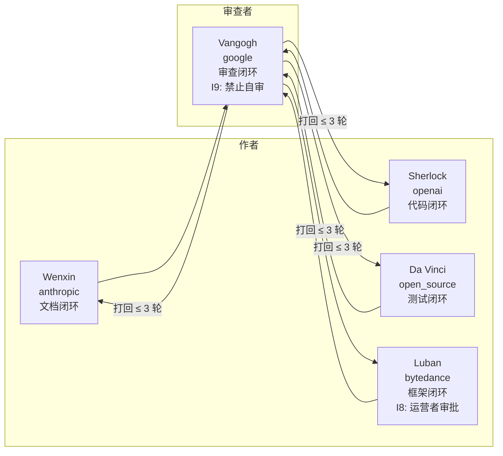

[🇺🇸 English](README.md) · [🇨🇳 简体中文](README.zh-CN.md) · [🇯🇵 日本語](README.ja.md)

---

<div align="center">

# FlowForge

### 持久身份智能体框架 · 自进化三闭环

[](https://github.com/flowlight-ai/flowforge/actions/workflows/ci.yml)
[](https://github.com/flowlight-ai/flowforge/actions/workflows/codeql.yml)
[](https://www.python.org/downloads/)
[](https://opensource.org/licenses/MIT)
[](https://docs.astral.sh/ruff/)
[](https://github.com/flowlight-ai/flowforge/blob/main/CONTRIBUTING.md)
[](https://github.com/flowlight-ai/flowforge/discussions)

> *锻造持久身份 · 赋予记忆、灵议与自进化能力。*

</div>

---

## 目录

- [概述](#概述)
- [核心特性](#核心特性)
- [五个灵智体](#五个灵智体)
- [架构](#架构)
- [自进化三闭环](#自进化三闭环)
- [关键不变量与测试铁律](#关键不变量与测试铁律)
- [快速开始](#快速开始)
- [配置](#配置)
- [使用示例](#使用示例)
- [文档](#文档)
- [路线图](#路线图)
- [项目结构](#项目结构)
- [命名规范](#命名规范)
- [贡献](#贡献)
- [许可证](#许可证)

---

## 概述

**FlowForge** 是一个**持久身份智能体框架**——一套工程级工具链层（Harness Layer），将基于 LLM 的智能体从「会话级助手」演化为具备持久身份、能力积累、行为可验证、进化可治理的长寿智能主体。

主流多智能体框架（AutoGen / CrewAI / LangGraph）通过**角色槽位**实现协作，而 FlowForge 解决的是一个更深层的问题：**一个智能体如何在长时间跨度内保持身份一致性、积累能力、保持行为可验证，并在治理下持续进化。**

框架内置 `forgemind` 应用层，托管五个内置**灵智体**（持久身份智能体）——每个绑定一个外部编码智能体（Claude Code / Codex / Gemini / OpenCode / Trae CN）——并通过**自进化三闭环**在**跨厂商审查**下编排它们。

## 核心特性

- **持久身份智能体（灵智体）** — 拥有 `Soul Imprint`（灵印）、`Capability Profile`（能力画像）与 `Blind Spot Map`（盲区地图）的长寿智能体，跨任务、跨会话持久存在。
- **自进化三闭环** — 五条闭环（`SelfDevDocLoop` / `SelfDevCodeLoop` / `SelfDevFrameworkLoop` / `SelfDevReviewLoop` / `SelfDevTestLoop`）驱动文档、代码、框架、审查与测试的自主进化。
- **跨厂商独立审查（I9 禁止自审）** — 灵议审查者必须来自与作者不同的厂商；法定人数要求 ≥ 2 个不同厂商。
- **多域记忆联邦** — 五个记忆域（`task` / `episodes` / `methods` / `identity` / `facts`）通过 `MindCodex`（程序性记忆法典）联邦。
- **七层工具链工程** — `durable_state` · `tool_mediation` · `evidence_sensors` · `governance` · `magic_words` · `entropy_control` · `harnessability`。
- **评估自代谢** — 三信号评分（`self_report 0.2 + observer 0.4 + telemetry 0.4`）+ 归因矩阵驱动能力重加权。
- **分布式可靠性** — 副作用 WAL + 分级恢复 + 存活探针 + Provider Host 保证崩溃安全执行。
- **IM 灵议频道** — 双频道议事（Web 群 + 飞书群），支持 `@mention` 路由与 I8 框架变更审批按钮。

## 五个灵智体

每个灵智体绑定一个特定外部编码智能体，并拥有专属的自进化闭环：

| 灵智体 | 厂商 | 自进化闭环 | 觉醒阶 | 外部智能体 |
|--------|------|-----------|--------|-----------|
| **Wenxin（文心）** | anthropic | `SelfDevDocLoop` | E3 | Claude Code |
| **Sherlock（夏洛克）** | openai | `SelfDevCodeLoop` | E4 | Codex |
| **Vangogh（梵高）** | google | `SelfDevReviewLoop` | E3 | Gemini |
| **Da Vinci（达芬奇）** | open_source | `SelfDevTestLoop` | E3 | OpenCode |
| **Luban（鲁班）** | bytedance | `SelfDevFrameworkLoop` | E5 *（需运营者审批）* | Trae CN |

**协作拓扑：**



## 架构

```
┌─────────────────────────────────────────────────────────────────┐
│  应用层 · forgemind/                                             │
│  灵智体注册表 · 灵议（Mind Council） · 外部智能体                  │
├─────────────────────────────────────────────────────────────────┤
│  指令层 · evolution/                                             │
│  ForgeMindEngine · 元认知路由 · 成熟度阶梯                        │
├─────────────────────────────────────────────────────────────────┤
│  执行层 · workers/                                              │
│  自进化闭环 · 闭环执行器 · 执行模式                              │
├─────────────────────────────────────────────────────────────────┤
│  工具与记忆层 · core/                                           │
│  capability · teamact · harness · memory · eval · reliability    │
└─────────────────────────────────────────────────────────────────┘
       ↕ 共享内核：DI 容器 · 插件协议 · 链路追踪 ↕
```

**铁律**：上层依赖下层；下层**绝不**导入上层。单向依赖是防止架构腐化的基线。

## 自进化三闭环

| 闭环 | 类型 | 觉醒阶 | 负责灵智体 | 审批 |
|------|------|--------|-----------|------|
| `SelfDevDocLoop` | E3 | 文档进化 | Wenxin | 自动 |
| `SelfDevCodeLoop` | E4 | 代码进化 | Sherlock | 自动 |
| `SelfDevReviewLoop` | E3 | 跨厂商审查 | Vangogh | 自动 |
| `SelfDevTestLoop` | E3 | 测试进化 | Da Vinci | 自动 |
| `SelfDevFrameworkLoop` | E5 | 框架进化 | Luban | **I8: 运营者手动审批** |

每条闭环都遵循 **发现 → 指派 → 行动 → 验证 → 持久化** 五步闭环模式，质量阈值 `0.85`，打回上限 3 轮（I11）。

## 关键不变量与测试铁律

**架构不变量：**

- **I1** — 觉醒阶门控（行动前强制自治层级）
- **I2** — `VISION.md` / `decisions/` 只读
- **I3** — 15 条编码红线（无硬编码提示词、无绕过 DI、无直接 DB 操作……）
- **I8** — 框架变更需运营者审批
- **I9** — 跨厂商禁止自审
- **I11** — 打回协议上限 3 轮

**测试铁律（T1–T8）：**

| # | 规则 |
|---|------|
| T1 | 禁止 Mock LLM — 所有 E2E / 集成测试调用真实 LLM |
| T2 | 禁止假数据 — 仅用真实场景输入 |
| T3 | 禁止跳过验证 — 需具体断言 |
| T4 | 禁止 Mock 工具 — `web_search` / `publish` / `fact_check` 必须真实 |
| T5 | 未实现 = Bug |
| T6 | 指标采集强制（MetricsCollector） |
| T7 | LLM 生成内容必须由另一 LLM 审查 |
| T8 | Web 功能通过真实浏览器 DOM 检查验证 |

## 快速开始

```bash
# 安装（editable，含 dev 额外依赖）
git clone https://github.com/flowlight-ai/flowforge.git
cd flowforge
pip install -e ".[dev]"

# 启动 Web 聊天界面（纯 HTML/CSS/JS，由 FastAPI 提供）
python flowforge/web/app.py --host 127.0.0.1 --port 8765

# 验证五个灵智体配置（YAML + 外部智能体二进制）
python scripts/verify_five_forgekins.py
```

**环境变量**（参见 `.env.example`）：

```
FLOWFORGE_WEBCHAT_TOKEN=...
FEISHU_APP_ID=...
FEISHU_APP_SECRET=...
FEISHU_CHAT_ID=...
```

## 配置

```yaml
# config/forgemind.yaml
external_agents:
  claude_code: { enabled: true, binary: "claude" }
  codex:       { enabled: true, binary: "codex" }
  gemini:      { enabled: true, binary: "gemini" }
  opencode:    { enabled: true, binary: "opencode" }
  trae:        { enabled: true, binary: "trae" }

council:
  min_reviewers: 2
  min_distinct_vendors: 2     # I9 强制
  pass_threshold: 0.85        # P33 质量阈值
```

每个灵智体由 `config/forgekins/*.yaml` 下的一份 YAML 画像描述（能力、盲区、自进化闭环绑定、IM 频道订阅、灵议角色、人格）。

## 使用示例

```python
import asyncio
from flowforge import ForgeMindEngine
from flowforge.forgemind import Forgekin, ForgekinType, Capability

# 用范围基线（愿景）初始化自进化引擎
engine = ForgeMindEngine(scope_baseline="构建一个安全交付的编码智能体")


async def main() -> None:
    # evaluate(ctx) 是纯函数 —— 返回路由决策
    decision = await engine.evaluate(ctx)
    print(f"mode={decision.mode}  confidence={decision.action_confidence:.3f}")
    if decision.mode != "none":
        await engine.execute(decision)


asyncio.run(main())

# 赋予灵智体持久身份
cat = Forgekin(name="小煤球", forgekin_type=ForgekinType.ANIMAL_COMPANION)
cat.add_capability(Capability(name="empathy", proficiency=0.9))
```

## 文档

| 文档 | 说明 |
|------|------|
| [docs/spec.md](docs/spec.md) | 项目规格说明 |
| [docs/arch.md](docs/arch.md) | 架构设计 |
| [docs/design.md](docs/design.md) | 详细设计 |
| [docs/roadmap.md](docs/roadmap.md) | 开发路线图 |
| [docs/decisions/](docs/decisions/) | 14 份架构决策记录（ADRs） |
| [docs/features/](docs/features/) | 27 份特性设计（F001–F031） |
| [docs/VISION.md](docs/VISION.md) | All-Things Spirit Mind 愿景 |
| [CONTRIBUTING.md](CONTRIBUTING.md) | 贡献指南 |
| [SECURITY.md](SECURITY.md) | 安全策略 |
| [CHANGELOG.md](CHANGELOG.md) | 更新日志 |

## 路线图

- **阶段 0** — 项目脚手架 + GitHub 配置 ✅
- **阶段 1** — 最小自进化代码骨架
- **阶段 2** — 核心模块（DI · 插件 · 编译器 · 闭环）
- **阶段 3** — 完整 ForgeMindEngine（自进化三闭环）
- **阶段 4** — 分布式可靠性 + 多域记忆联邦
- **阶段 5** — IM 灵议频道 + Web 聊天 UI
- **阶段 6** — 驱动 *Forge 生态 + 灵智体终身学习

详见 [docs/roadmap.md](docs/roadmap.md)。

## 项目结构

```
flowforge/
├── core/              # 共享内核：capability · teamact · harness · memory · eval · reliability
├── evolution/         # ForgeMindEngine（三模式自进化）
├── forgemind/         # 应用层：forgekin · registry · council · external_agents
├── web/               # Web 聊天 UI（FastAPI + HTML/CSS/JS，无前端框架）
├── config/            # forgemind.yaml · forgekins/*.yaml · im_channels.yaml · evolution.yaml
├── docs/              # spec · arch · design · roadmap · 14 ADRs · 27 Features
├── scripts/           # verify_five_forgekins.py
└── tests/             # 测试套件（T1–T8 铁律强制执行）
```

## 命名规范

- **P0** — AI 行业术语（如 *持久身份智能体*、*自进化三闭环*、*跨厂商审查*、*多域记忆联邦*）——文档与代码主要使用。
- **P1** — 代码类名（如 `ForgeMind`、`Forgekin`、`MindCodex`）——用于标识符。
- **P2** — 社区别名（如 灵智体 / 育灵 / 灵议 / 灵典）——仅用于社区与社交渠道。

## 贡献

我们欢迎任何类型的贡献！提交 Pull Request 前请先阅读 [CONTRIBUTING.md](CONTRIBUTING.md)。

- 🐛 [报告 Bug](https://github.com/flowlight-ai/flowforge/issues/new?template=bug_report.yml)
- 💡 [提交功能建议](https://github.com/flowlight-ai/flowforge/issues/new?template=feature_request.yml)
- 💬 [加入讨论](https://github.com/flowlight-ai/flowforge/discussions)

所有贡献必须遵守 15 条编码红线（I3）与 T1–T8 测试铁律。

## 许可证

FlowForge 基于 **[MIT 许可证](LICENSE)** 发布。

---

<div align="center">

**⭐ 如果 FlowForge 帮你锻造了持久身份智能体，请给它一颗星！⭐**

**[github.com/flowlight-ai/flowforge](https://github.com/flowlight-ai/flowforge)**

</div>
