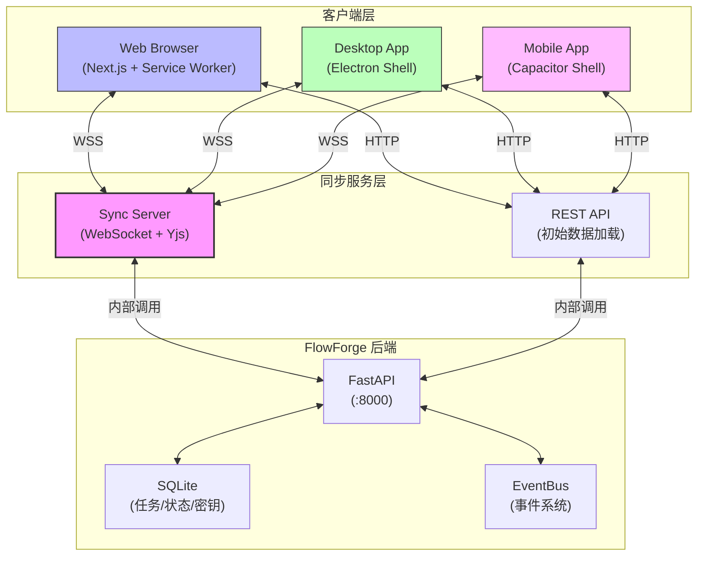
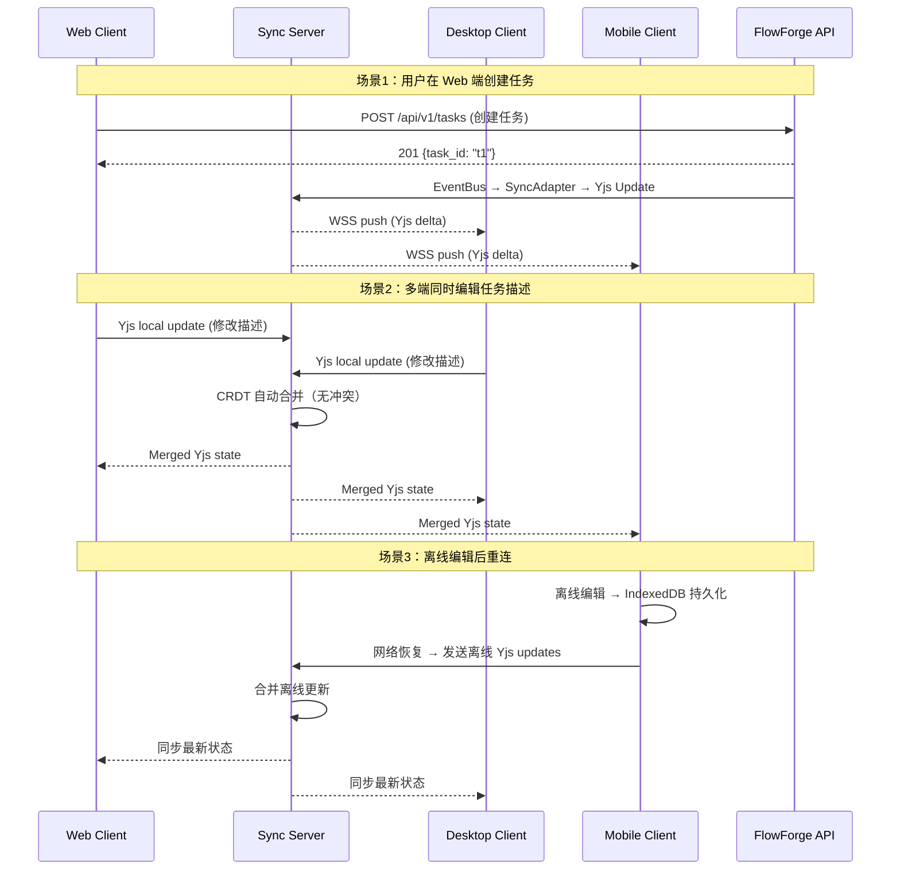
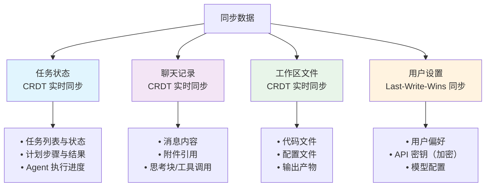
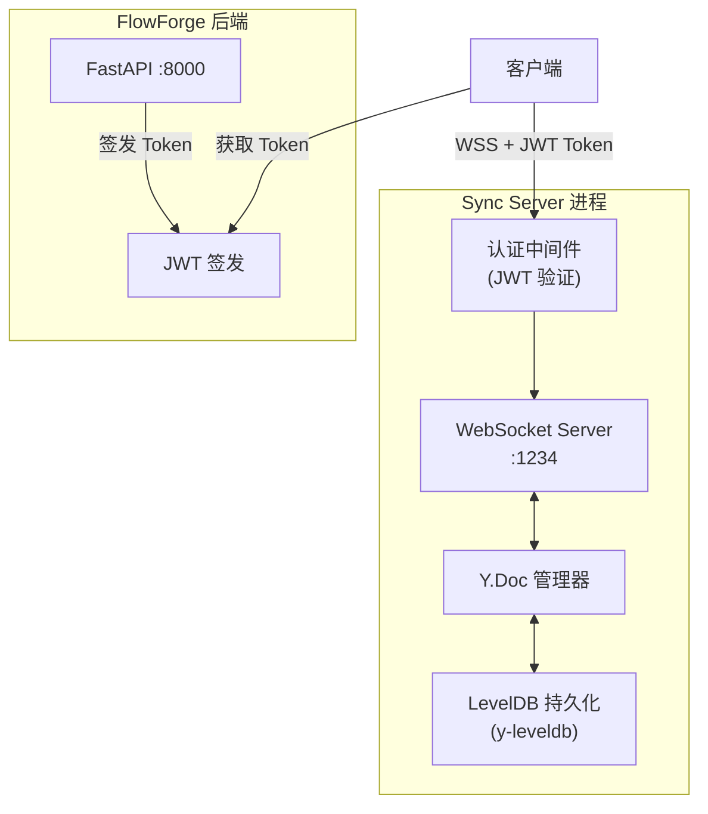
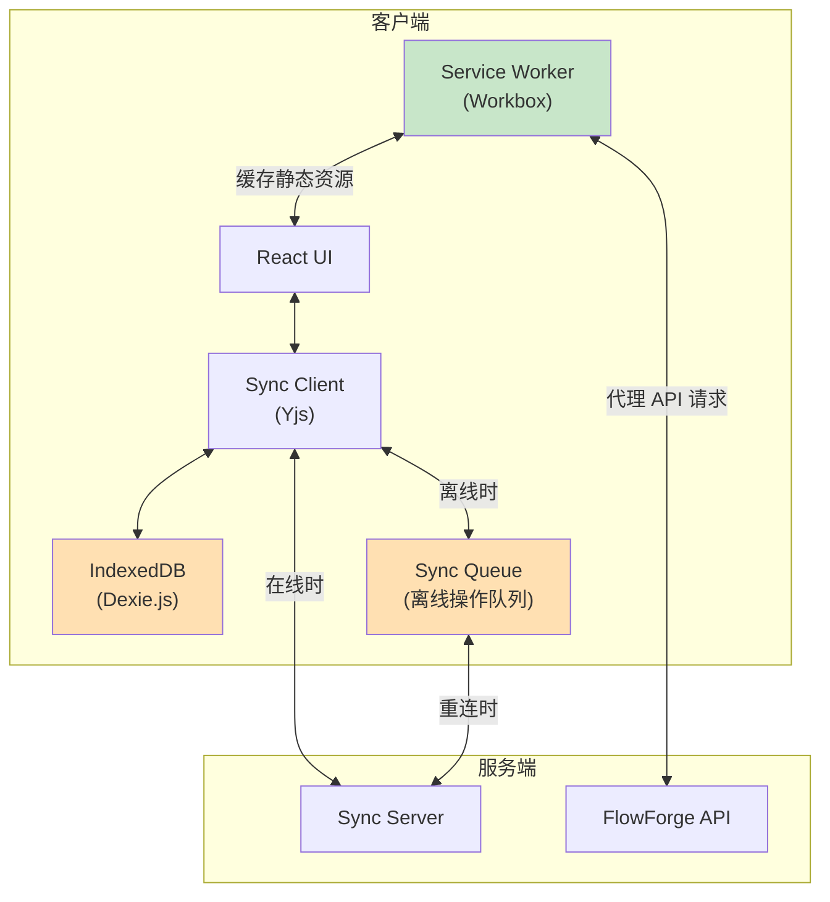
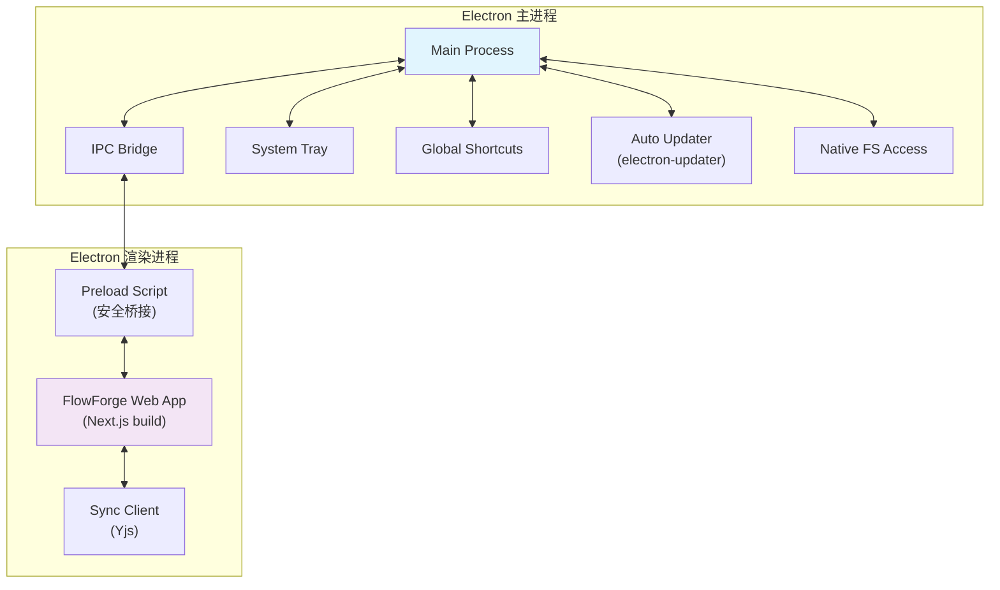
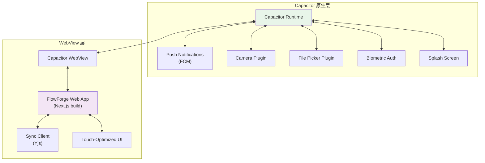
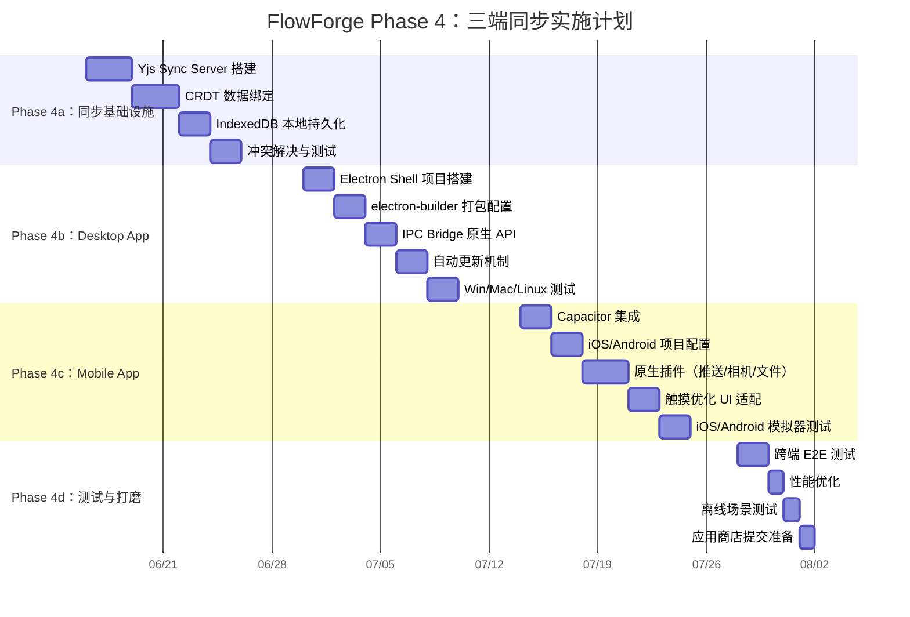
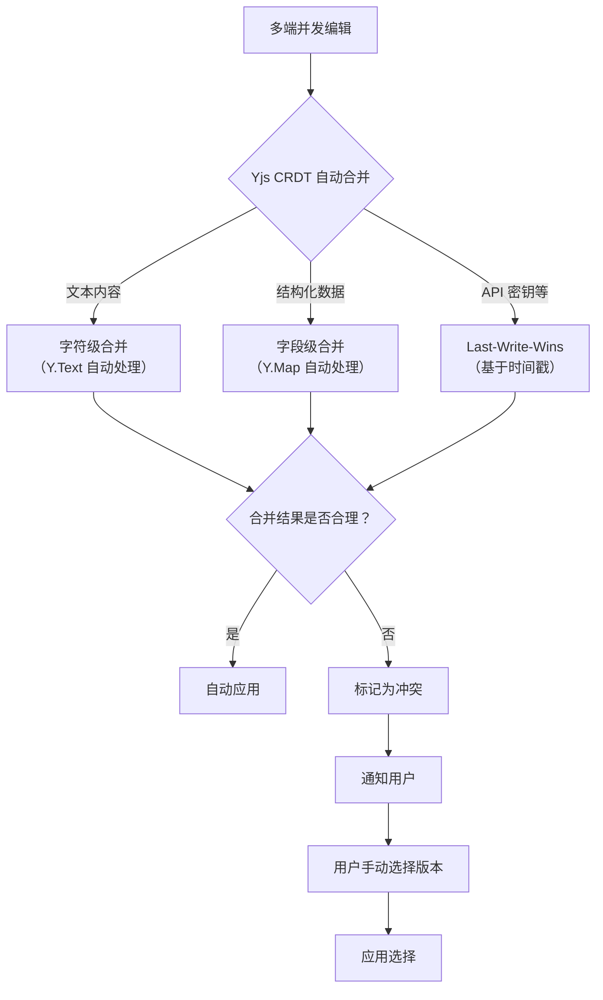
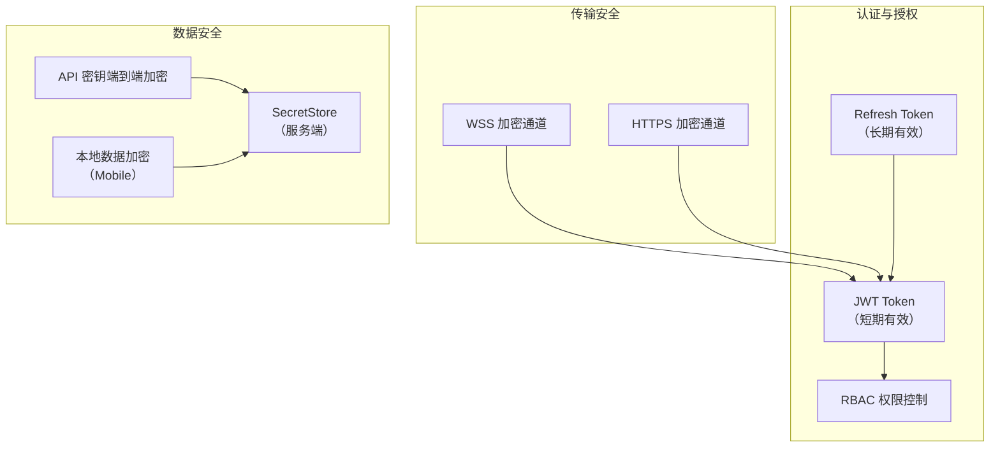

# FlowForge Phase 4：三端同步（Cross-Platform Sync）技术设计

> **版本**：v1.0
> **日期**：2026-06-09
> **状态**：设计阶段
> **前置依赖**：Phase 1-3 核心功能已交付（9 大模式、Harness 驾驭层、Helm 交互）

---

## 1. 概述

### 1.1 目标

实现 FlowForge 在 **Web、Desktop（Electron）、Mobile（Capacitor）** 三端的实时数据同步，让用户在任何设备上都能无缝继续工作。

### 1.2 核心原则

| 原则 | 说明 |
|------|------|
| **Web-First** | Web 端是主要实现，Desktop 和 Mobile 是 Web 应用的原生壳（Native Shell），共享同一套前端代码 |
| **Local-First** | 优先保证本地可用性，离线状态下核心功能不中断，网络恢复后自动同步 |
| **CRDT 驱动** | 使用 CRDT（无冲突复制数据类型）解决多端并发编辑的冲突，避免中心化锁机制 |
| **渐进增强** | Web 端功能完整可用，Desktop/Mobile 通过原生 API 增强体验，不引入功能差异 |

### 1.3 设计约束

- 不修改 FlowForge 后端核心架构（FastAPI + SQLite），同步层作为独立微服务接入
- 前端代码（`flowforge/web/`）保持 Next.js 14 + React 18 技术栈不变
- 同步协议必须兼容现有 WebSocket 事件系统（EventBus → HelmAdapter → ConnectionManager）
- 遵循 FlowForge 铁律：禁止硬编码路径和密钥、禁止绕过 DI 容器、禁止假数据

---

## 2. 架构设计

### 2.1 整体架构



**核心组件**：

| 组件 | 职责 | 技术选型 |
|------|------|---------|
| **Sync Server** | WebSocket 实时同步服务，管理 Yjs 文档和连接 | y-websocket |
| **REST API** | 初始数据加载、历史数据拉取 | FastAPI 现有端点扩展 |
| **Sync Adapter** | 将 FlowForge EventBus 事件转换为 Yjs 更新 | 自研适配层 |

### 2.2 数据流架构



### 2.3 与现有 EventBus 的集成

FlowForge 已有 EventBus → HelmAdapter → ConnectionManager → WebSocket 的事件链路。三端同步在此基础上增加一条并行链路：

```mermaid
graph LR
    subgraph "现有链路（Helm 交互）"
        E1[EventBus] --> HA[HelmAdapter] --> CM[ConnectionManager] --> WS1[WebSocket<br/>:8000/ws]
    end

    subgraph "新增链路（数据同步）"
        E2[EventBus] --> SA[SyncAdapter] --> YS[Yjs Sync Server<br/>:1234]
    end

    subgraph "客户端"
        WS1 --> HC[Helm Client]
        YS --> SC[Sync Client<br/>(y-websocket)]
        HC --> UI[React UI]
        SC --> UI
    end
```

**两条链路的关系**：

| 维度 | Helm 链路 | Sync 链路 |
|------|----------|----------|
| **用途** | 实时事件推送（任务进度、Agent 状态） | 数据同步（任务状态、聊天记录、文件） |
| **协议** | 自定义 JSON 事件 | Yjs 二进制协议 |
| **冲突处理** | 无（事件是追加式的） | CRDT 自动合并 |
| **离线支持** | 无（断线即丢失） | 有（本地持久化 + 重连同步） |

---

## 3. 数据同步模型

### 3.1 同步数据分类

FlowForge 的数据按同步策略分为四类：



### 3.2 各数据类型的同步策略

| 数据类型 | Yjs 类型 | 同步策略 | 冲突解决 | 离线支持 |
|---------|---------|---------|---------|---------|
| 任务列表 | `Y.Map` | 实时同步 | CRDT 合并 | IndexedDB 缓存 |
| 任务状态 | `Y.Map` | 实时同步 | CRDT 合并 | IndexedDB 缓存 |
| 计划步骤 | `Y.Array<Y.Map>` | 实时同步 | CRDT 合并 | IndexedDB 缓存 |
| 聊天消息 | `Y.Array<Y.Map>` | 实时同步 | CRDT 追加 | IndexedDB 缓存 |
| 消息文本 | `Y.Text` | 实时同步 | CRDT 字符级合并 | IndexedDB 缓存 |
| 代码文件 | `Y.Text` | 实时同步 | CRDT 字符级合并 | IndexedDB 缓存 |
| 用户设置 | `Y.Map` | 延迟同步（5s debounce） | Last-Write-Wins | IndexedDB 缓存 |
| API 密钥 | `Y.Map`（加密值） | 延迟同步（5s debounce） | Last-Write-Wins | 本地加密存储 |

### 3.3 Yjs 文档结构设计

每个用户会话对应一个 `Y.Doc`，内部结构如下：

```
Y.Doc (flowforge_user_{user_id})
├── Y.Map("tasks")                    # 任务列表
│   ├── Y.Map("task_{id}")            # 单个任务
│   │   ├── key: "title" → string
│   │   ├── key: "status" → string
│   │   ├── key: "mode" → string
│   │   ├── key: "created_at" → number
│   │   ├── key: "steps" → Y.Array<Y.Map>
│   │   └── key: "result" → string
│   └── ...
├── Y.Map("chats")                    # 聊天记录
│   ├── Y.Map("chat_{task_id}")       # 单个任务的聊天
│   │   ├── key: "messages" → Y.Array<Y.Map>
│   │   │   └── Y.Map                 # 单条消息
│   │   │       ├── key: "role" → string
│   │   │       ├── key: "content" → Y.Text
│   │   │       ├── key: "timestamp" → number
│   │   │       └── key: "attachments" → Y.Array<string>
│   │   └── ...
│   └── ...
├── Y.Map("workspace")                # 工作区文件
│   ├── Y.Map("file_{path}")          # 单个文件
│   │   ├── key: "content" → Y.Text
│   │   ├── key: "language" → string
│   │   └── key: "last_modified" → number
│   └── ...
└── Y.Map("settings")                 # 用户设置
    ├── key: "preferences" → Y.Map
    ├── key: "api_keys_encrypted" → string
    └── key: "model_config" → Y.Map
```

---

## 4. CRDT 实现方案

### 4.1 技术选型：Yjs

选择 Yjs 作为 CRDT 实现的理由：

| 维度 | Yjs | Automerge | 自研 |
|------|-----|-----------|------|
| 成熟度 | 生产级，5年+ | 生产级 | 风险高 |
| 性能 | O(1) 查找，文档体积小 | 较大文档性能下降 | 未知 |
| 生态 | y-websocket, y-indexeddb 等 | 生态较小 | 无 |
| 前端集成 | 原生 JS，React 绑定成熟 | JS 原生 | 需自建 |
| 二进制格式 | 紧凑，增量更新小 | JSON 补丁 | 需设计 |

### 4.2 Yjs 服务端部署



**Sync Server 实现**（基于 y-websocket）：

```typescript
// sync-server/server.ts
import { WebSocketServer } from 'ws'
import { Doc, applyUpdate } from 'yjs'
import { LeveldbPersistence } from 'y-leveldb'
import jwt from 'jsonwebtoken'

const wss = new WebSocketServer({ port: 1234 })
const persistence = new LeveldbPersistence('./data/yjs-docs')

// JWT 认证中间件
function authenticate(token: string): { user_id: string } | null {
  try {
    return jwt.verify(token, process.env.JWT_SECRET!) as { user_id: string }
  } catch {
    return null
  }
}

wss.on('connection', (ws, req) => {
  // 从 URL 参数获取 token
  const token = new URL(req.url!, `ws://localhost`).searchParams.get('token')
  const user = authenticate(token || '')
  if (!user) {
    ws.close(4001, 'Authentication failed')
    return
  }

  // 每个用户一个 Y.Doc
  const docId = `flowforge_user_${user.user_id}`

  persistence.getYDoc(docId).then(doc => {
    // 绑定 WebSocket 到 Y.Doc
    // 使用 y-websocket 的标准协议
    setupWSConnection(ws, doc, { docId })
  })
})
```

### 4.3 前端 Sync Client

```typescript
// web/src/lib/sync-client.ts
import * as Y from 'yjs'
import { WebsocketProvider } from 'y-websocket'
import { IndexeddbPersistence } from 'y-indexeddb'

export class FlowForgeSyncClient {
  private doc: Y.Doc
  private wsProvider: WebsocketProvider
  private idbPersistence: IndexeddbPersistence
  private userId: string

  // 公开的 Yjs 共享类型
  readonly tasks: Y.Map
  readonly chats: Y.Map
  readonly workspace: Y.Map
  readonly settings: Y.Map

  constructor(userId: string, token: string) {
    this.userId = userId
    this.doc = new Y.Doc()

    // 初始化共享类型
    this.tasks = this.doc.getMap('tasks')
    this.chats = this.doc.getMap('chats')
    this.workspace = this.doc.getMap('workspace')
    this.settings = this.doc.getMap('settings')

    // WebSocket 实时同步
    this.wsProvider = new WebsocketProvider(
      'ws://localhost:1234',
      `flowforge_user_${userId}`,
      this.doc,
      {
        params: { token },
        connect: true,
      }
    )

    // IndexedDB 本地持久化（离线支持）
    this.idbPersistence = new IndexeddbPersistence(
      `flowforge_user_${userId}`,
      this.doc
    )
  }

  /** 等待本地数据加载完成 */
  async whenReady(): Promise<void> {
    await this.idbPersistence.whenSynced
  }

  /** 监听同步状态 */
  onSyncStatus(callback: (status: 'connecting' | 'synced' | 'disconnected') => void) {
    this.wsProvider.on('status', ({ status }: { status: string }) => {
      callback(status as 'connecting' | 'synced' | 'disconnected')
    })
  }

  /** 销毁连接 */
  destroy() {
    this.wsProvider.destroy()
    this.idbPersistence.destroy()
    this.doc.destroy()
  }
}
```

### 4.4 React 集成 Hook

```typescript
// web/src/hooks/useSync.ts
import { useEffect, useState, useContext, createContext } from 'react'
import * as Y from 'yjs'
import { FlowForgeSyncClient } from '@/lib/sync-client'

const SyncContext = createContext<FlowForgeSyncClient | null>(null)

export function SyncProvider({ children, userId, token }: {
  children: React.ReactNode
  userId: string
  token: string
}) {
  const [client, setClient] = useState<FlowForgeSyncClient | null>(null)

  useEffect(() => {
    const syncClient = new FlowForgeSyncClient(userId, token)
    setClient(syncClient)
    return () => syncClient.destroy()
  }, [userId, token])

  if (!client) return null

  return (
    <SyncContext.Provider value={client}>
      {children}
    </SyncContext.Provider>
  )
}

export function useSync() {
  return useContext(SyncContext)
}

/** 监听 Yjs Map 中某个 key 的变化 */
export function useYMapValue<T>(ymap: Y.Map, key: string): T | undefined {
  const [value, setValue] = useState<T | undefined>(() => ymap.get(key) as T)

  useEffect(() => {
    const observer = () => setValue(ymap.get(key) as T)
    ymap.observe(observer)
    return () => ymap.unobserve(observer)
  }, [ymap, key])

  return value
}

/** 监听 Yjs Array 的变化 */
export function useYArray<T>(yarray: Y.Array<T>): T[] {
  const [items, setItems] = useState<T[]>(() => yarray.toArray())

  useEffect(() => {
    const observer = () => setItems(yarray.toArray())
    yarray.observe(observer)
    return () => yarray.unobserve(observer)
  }, [yarray])

  return items
}
```

---

## 5. Yjs 集成详细实施指南

> 本章节是第 4 章 CRDT 实现方案的**落地补充**，提供从零到生产的完整代码、文件路径和配置变更。
> 时间线与第 9 章总体计划对齐，Day 编号从 Phase 4a 第 1 周开始。

---

### 5.1 Yjs 服务端部署 (Day 1-3)

#### 5.1.1 依赖安装

```bash
cd d:\software\openclaw\flowforge\sync_server
npm init -y
npm install yjs y-websocket lib0 y-leveldb jsonwebtoken ws dotenv
npm install -D @types/jsonwebtoken @types/ws @types/node typescript tsx
```

#### 5.1.2 项目结构

```
flowforge/sync_server/
├── package.json
├── tsconfig.json
├── .env                        # 本地环境变量（不提交 Git）
├── .env.example                # 环境变量模板
├── Dockerfile
├── docker-compose.yml
├── data/                       # LevelDB 数据目录（.gitignore）
└── src/
    ├── index.ts                # 服务入口
    ├── auth.ts                 # JWT 认证中间件
    ├── persistence.ts          # LevelDB 持久化封装
    ├── health.ts               # 健康检查端点
    └── config.ts               # 配置加载
```

#### 5.1.3 配置加载 — `src/config.ts`

```typescript
// d:\software\openclaw\flowforge\sync_server\src\config.ts
import dotenv from 'dotenv'
dotenv.config()

export interface SyncServerConfig {
  port: number
  host: string
  jwtSecret: string
  jwtTtlMinutes: number
  refreshTtlDays: number
  persistence: 'leveldb' | 'memory'
  dataDir: string
  maxDocSizeMb: number
  docTtlHours: number
  corsOrigin: string
}

export function loadConfig(): SyncServerConfig {
  const required = ['JWT_SECRET']
  for (const key of required) {
    if (!process.env[key]) {
      throw new Error(`Missing required environment variable: ${key}`)
    }
  }

  return {
    port: parseInt(process.env.SYNC_PORT ?? '1234', 10),
    host: process.env.SYNC_HOST ?? '0.0.0.0',
    jwtSecret: process.env.JWT_SECRET!,
    jwtTtlMinutes: parseInt(process.env.JWT_TTL_MINUTES ?? '15', 10),
    refreshTtlDays: parseInt(process.env.REFRESH_TTL_DAYS ?? '7', 10),
    persistence: (process.env.PERSISTENCE as 'leveldb' | 'memory') ?? 'leveldb',
    dataDir: process.env.DATA_DIR ?? './data/yjs-docs',
    maxDocSizeMb: parseInt(process.env.MAX_DOC_SIZE_MB ?? '50', 10),
    docTTLHours: parseInt(process.env.DOC_TTL_HOURS ?? '168', 10),
    corsOrigin: process.env.CORS_ORIGIN ?? '*',
  }
}
```

#### 5.1.4 JWT 认证 — `src/auth.ts`

```typescript
// d:\software\openclaw\flowforge\sync_server\src\auth.ts
import jwt from 'jsonwebtoken'
import type { SyncServerConfig } from './config.js'

export interface AuthPayload {
  user_id: string
  iat: number
  exp: number
}

export class Authenticator {
  constructor(private config: SyncServerConfig) {}

  /** 验证 JWT Token，返回 payload 或 null */
  verify(token: string): AuthPayload | null {
    try {
      return jwt.verify(token, this.config.jwtSecret) as AuthPayload
    } catch {
      return null
    }
  }

  /** 签发短期 Access Token */
  signAccessToken(userId: string): string {
    return jwt.sign(
      { user_id: userId },
      this.config.jwtSecret,
      { expiresIn: `${this.config.jwtTtlMinutes}m` }
    )
  }

  /** 签发长期 Refresh Token */
  signRefreshToken(userId: string): string {
    return jwt.sign(
      { user_id: userId },
      this.config.jwtSecret,
      { expiresIn: `${this.config.refreshTtlDays}d` }
    )
  }
}
```

#### 5.1.5 LevelDB 持久化 — `src/persistence.ts`

```typescript
// d:\software\openclaw\flowforge\sync_server\src\persistence.ts
import { LeveldbPersistence } from 'y-leveldb'
import * as Y from 'yjs'
import type { SyncServerConfig } from './config.js'

/** 文档元信息，用于 LRU 淘汰 */
interface DocEntry {
  doc: Y.Doc
  lastAccessed: number
  size: number
}

export class DocPersistence {
  private ldb: LeveldbPersistence | null = null
  private docs: Map<string, DocEntry> = new Map()
  private config: SyncServerConfig

  constructor(config: SyncServerConfig) {
    this.config = config
  }

  async initialize(): Promise<void> {
    if (this.config.persistence === 'leveldb') {
      this.ldb = new LeveldbPersistence(this.config.dataDir)
      await this.ldb.whenReady
    }
  }

  /** 获取或创建 Y.Doc */
  async getDoc(docId: string): Promise<Y.Doc> {
    const cached = this.docs.get(docId)
    if (cached) {
      cached.lastAccessed = Date.now()
      return cached.doc
    }

    const doc = new Y.Doc()

    if (this.ldb) {
      // 从 LevelDB 恢复已有数据
      const persistedDoc = await this.ldb.getYDoc(docId)
      const update = Y.encodeStateAsUpdate(persistedDoc)
      if (update.length > 0) {
        Y.applyUpdate(doc, update)
      }

      // 监听变更并持久化
      doc.on('update', (update: Uint8Array) => {
        this.ldb!.storeUpdate(docId, update).catch((err: Error) => {
          console.error(`Failed to persist update for ${docId}:`, err)
        })
      })
    }

    this.docs.set(docId, {
      doc,
      lastAccessed: Date.now(),
      size: 0,
    })

    // 执行 LRU 淘汰
    this.evictIfNeeded()

    return doc
  }

  /** LRU 淘汰：超过 TTL 的文档从内存移除 */
  private evictIfNeeded(): void {
    const now = Date.now()
    const ttlMs = this.config.docTTLHours * 60 * 60 * 1000

    for (const [docId, entry] of this.docs) {
      if (now - entry.lastAccessed > ttlMs) {
        entry.doc.destroy()
        this.docs.delete(docId)
      }
    }
  }

  /** 获取当前内存中的文档数量 */
  get docCount(): number {
    return this.docs.size
  }

  async destroy(): Promise<void> {
    for (const [, entry] of this.docs) {
      entry.doc.destroy()
    }
    this.docs.clear()
    if (this.ldb) {
      await this.ldb.destroy()
    }
  }
}
```

#### 5.1.6 健康检查 — `src/health.ts`

```typescript
// d:\software\openclaw\flowforge\sync_server\src\health.ts
import http from 'http'
import type { DocPersistence } from './persistence.js'

export function startHealthServer(
  port: number,
  persistence: DocPersistence
): http.Server {
  const server = http.createServer((req, res) => {
    if (req.url === '/health' && req.method === 'GET') {
      res.writeHead(200, { 'Content-Type': 'application/json' })
      res.end(
        JSON.stringify({
          status: 'ok',
          doc_count: persistence.docCount,
          uptime: process.uptime(),
          memory: process.memoryUsage(),
        })
      )
    } else {
      res.writeHead(404)
      res.end('Not Found')
    }
  })

  server.listen(port, () => {
    console.log(`Health check server listening on port ${port}`)
  })

  return server
}
```

#### 5.1.7 服务入口 — `src/index.ts`

```typescript
// d:\software\openclaw\flowforge\sync_server\src\index.ts
import { WebSocketServer, WebSocket } from 'ws'
import { setupWSConnection } from 'y-websocket/bin/utils.js'
import { loadConfig } from './config.js'
import { Authenticator } from './auth.js'
import { DocPersistence } from './persistence.js'
import { startHealthServer } from './health.js'

async function main() {
  const config = loadConfig()
  const authenticator = new Authenticator(config)
  const persistence = new DocPersistence(config)

  await persistence.initialize()

  // 健康检查 HTTP 服务（端口 = Sync 端口 + 1）
  startHealthServer(config.port + 1, persistence)

  // WebSocket 同步服务
  const wss = new WebSocketServer({
    port: config.port,
    host: config.host,
    maxPayload: config.maxDocSizeMb * 1024 * 1024,
  })

  // 连接数统计
  const connectionCounts: Map<string, number> = new Map()

  wss.on('connection', (ws: WebSocket, req) => {
    // 从 URL 解析 token 和 docId
    const url = new URL(req.url ?? '/', `ws://${req.headers.host ?? 'localhost'}`)
    const token = url.searchParams.get('token')
    const docId = url.pathname.replace(/^\//, '') // 去掉前导 /

    if (!token) {
      ws.close(4001, 'Missing token')
      return
    }

    const payload = authenticator.verify(token)
    if (!payload) {
      ws.close(4001, 'Authentication failed')
      return
    }

    // 验证用户只能访问自己的文档
    const expectedDocId = `flowforge_user_${payload.user_id}`
    if (docId !== expectedDocId) {
      ws.close(4003, 'Forbidden: docId mismatch')
      return
    }

    // 更新连接计数
    connectionCounts.set(docId, (connectionCounts.get(docId) ?? 0) + 1)

    // 获取 Y.Doc 并绑定 WebSocket 连接
    persistence.getDoc(docId).then((doc) => {
      setupWSConnection(ws, doc, { docId })
    })

    // 连接关闭时更新计数
    ws.on('close', () => {
      const count = connectionCounts.get(docId) ?? 1
      if (count <= 1) {
        connectionCounts.delete(docId)
      } else {
        connectionCounts.set(docId, count - 1)
      }
    })
  })

  console.log(
    `Sync Server started on ws://${config.host}:${config.port}\n` +
    `Health check on http://${config.host}:${config.port + 1}/health`
  )

  // 优雅关闭
  const shutdown = async () => {
    console.log('Shutting down Sync Server...')
    wss.close()
    await persistence.destroy()
    process.exit(0)
  }

  process.on('SIGINT', shutdown)
  process.on('SIGTERM', shutdown)
}

main().catch((err) => {
  console.error('Failed to start Sync Server:', err)
  process.exit(1)
})
```

#### 5.1.8 TypeScript 配置 — `tsconfig.json`

```json
{
  "compilerOptions": {
    "target": "ES2022",
    "module": "NodeNext",
    "moduleResolution": "NodeNext",
    "outDir": "./dist",
    "rootDir": "./src",
    "strict": true,
    "esModuleInterop": true,
    "skipLibCheck": true,
    "forceConsistentCasingInFileNames": true,
    "declaration": true,
    "sourceMap": true
  },
  "include": ["src/**/*"],
  "exclude": ["node_modules", "dist", "data"]
}
```

#### 5.1.9 环境变量模板 — `.env.example`

```bash
# Sync Server 环境变量
JWT_SECRET=your-jwt-secret-change-me
SYNC_PORT=1234
SYNC_HOST=0.0.0.0
JWT_TTL_MINUTES=15
REFRESH_TTL_DAYS=7
PERSISTENCE=leveldb
DATA_DIR=./data/yjs-docs
MAX_DOC_SIZE_MB=50
DOC_TTL_HOURS=168
CORS_ORIGIN=*
```

#### 5.1.10 Docker 部署 — `Dockerfile`

```dockerfile
FROM node:20-alpine

WORKDIR /app

COPY package.json package-lock.json ./
RUN npm ci --production

COPY tsconfig.json ./
COPY src/ ./src/
RUN npm run build

# 创建数据目录
RUN mkdir -p /app/data/yjs-docs

ENV NODE_ENV=production
ENV DATA_DIR=/app/data/yjs-docs

EXPOSE 1234 1235

CMD ["node", "dist/index.js"]
```

#### 5.1.11 Docker Compose — `docker-compose.yml`

```yaml
version: '3.8'

services:
  sync-server:
    build:
      context: .
      dockerfile: Dockerfile
    ports:
      - "1234:1234"   # WebSocket
      - "1235:1235"   # Health check
    environment:
      - JWT_SECRET=${JWT_SECRET}
      - SYNC_PORT=1234
      - SYNC_HOST=0.0.0.0
      - PERSISTENCE=leveldb
      - DATA_DIR=/app/data/yjs-docs
      - MAX_DOC_SIZE_MB=50
      - DOC_TTL_HOURS=168
      - CORS_ORIGIN=*
    volumes:
      - sync-data:/app/data/yjs-docs
    restart: unless-stopped
    healthcheck:
      test: ["CMD", "wget", "--spider", "-q", "http://localhost:1235/health"]
      interval: 30s
      timeout: 5s
      retries: 3

volumes:
  sync-data:
```

#### 5.1.12 package.json scripts

```json
{
  "name": "flowforge-sync-server",
  "version": "1.0.0",
  "private": true,
  "type": "module",
  "scripts": {
    "dev": "tsx watch src/index.ts",
    "build": "tsc",
    "start": "node dist/index.js",
    "health": "curl -s http://localhost:1235/health | jq"
  }
}
```

---

### 5.2 Yjs 前端 Sync Client (Day 3-5)

#### 5.2.1 依赖安装

```bash
cd d:\software\openclaw\flowforge\web
npm install yjs y-websocket y-indexeddb lib0
```

#### 5.2.2 项目结构

```
flowforge/web/src/lib/sync/
├── SyncClient.ts          # 核心同步客户端
├── types.ts               # 同步相关类型定义
└── index.ts               # 统一导出

flowforge/web/src/hooks/
├── useSyncDocument.ts     # 订阅 Yjs 文档变更
├── useSyncMap.ts          # 绑定 Y.Map 到 React 状态
├── useSyncText.ts         # 绑定 Y.Text 到 React 状态
├── useAwareness.ts        # 追踪用户在线状态
└── useSyncStatus.ts       # 同步连接状态指示
```

#### 5.2.3 类型定义 — `types.ts`

```typescript
// d:\software\openclaw\flowforge\web\src\lib\sync\types.ts
import type * as Y from 'yjs'

/** 同步连接状态 */
export type SyncConnectionStatus = 'connecting' | 'connected' | 'disconnected'

/** 用户在线信息（Awareness 协议） */
export interface AwarenessUser {
  userId: string
  name: string
  color: string
  cursor?: {
    taskId: string
    field: string
    position: number
  }
  lastActive: number
}

/** SyncClient 初始化配置 */
export interface SyncClientConfig {
  /** Sync Server WebSocket 地址 */
  serverUrl: string
  /** 用户 ID */
  userId: string
  /** JWT Access Token */
  token: string
  /** 用户显示名 */
  userName: string
  /** 用户颜色标识（用于 Awareness） */
  userColor: string
  /** 是否启用 IndexedDB 本地持久化（默认 true） */
  enablePersistence?: boolean
  /** 重连间隔基数（毫秒，默认 1000） */
  reconnectBaseInterval?: number
  /** 最大重连间隔（毫秒，默认 30000） */
  reconnectMaxInterval?: number
}

/** 任务步骤的 Yjs 结构 */
export interface TaskStepYjs {
  id: string
  name: string
  status: string
  result: string
  started_at: number
  completed_at: number
}

/** 聊天消息的 Yjs 结构 */
export interface ChatMessageYjs {
  id: string
  role: 'user' | 'assistant' | 'system'
  content: Y.Text
  timestamp: number
  attachments: Y.Array<string>
}
```

#### 5.2.4 核心同步客户端 — `SyncClient.ts`

```typescript
// d:\software\openclaw\flowforge\web\src\lib\sync\SyncClient.ts
import * as Y from 'yjs'
import { WebsocketProvider } from 'y-websocket'
import { IndexeddbPersistence } from 'y-indexeddb'
import type { SyncClientConfig, SyncConnectionStatus, AwarenessUser } from './types.js'

export class SyncClient {
  private doc: Y.Doc
  private wsProvider: WebsocketProvider
  private idbPersistence: IndexeddbPersistence | null = null
  private config: Required<SyncClientConfig>
  private reconnectAttempts: number = 0
  private destroyed: boolean = false

  // 公开的 Yjs 共享类型
  readonly tasks: Y.Map
  readonly chats: Y.Map
  readonly workspace: Y.Map
  readonly settings: Y.Map

  // 状态回调
  private statusListeners: Set<(status: SyncConnectionStatus) => void> = new Set()

  constructor(config: SyncClientConfig) {
    this.config = {
      enablePersistence: true,
      reconnectBaseInterval: 1000,
      reconnectMaxInterval: 30000,
      ...config,
    }

    this.doc = new Y.Doc()

    // 初始化共享类型
    this.tasks = this.doc.getMap('tasks')
    this.chats = this.doc.getMap('chats')
    this.workspace = this.doc.getMap('workspace')
    this.settings = this.doc.getMap('settings')

    // WebSocket 实时同步
    this.wsProvider = new WebsocketProvider(
      this.config.serverUrl,
      `flowforge_user_${this.config.userId}`,
      this.doc,
      {
        params: { token: this.config.token },
        connect: true,
        // 自定义重连策略：指数退避
        resyncInterval: 30_000,
        maxBackoffTime: this.config.reconnectMaxInterval,
      }
    )

    // 设置 Awareness 用户信息
    this.wsProvider.awareness.setLocalStateField('user', {
      userId: this.config.userId,
      name: this.config.userName,
      color: this.config.userColor,
      lastActive: Date.now(),
    })

    // 监听连接状态
    this.wsProvider.on('status', ({ status }: { status: string }) => {
      const syncStatus = this.mapStatus(status)
      if (syncStatus === 'connected') {
        this.reconnectAttempts = 0
      } else if (syncStatus === 'disconnected') {
        this.scheduleReconnect()
      }
      this.notifyStatusListeners(syncStatus)
    })

    // IndexedDB 本地持久化
    if (this.config.enablePersistence) {
      this.idbPersistence = new IndexeddbPersistence(
        `flowforge_user_${this.config.userId}`,
        this.doc
      )
    }
  }

  /** 等待本地数据加载完成 */
  async whenReady(): Promise<void> {
    if (this.idbPersistence) {
      await this.idbPersistence.whenSynced
    }
  }

  /** 获取当前连接状态 */
  get status(): SyncConnectionStatus {
    return this.mapStatus(this.wsProvider.wsconnected ? 'connected' : 'disconnected')
  }

  /** 获取 Awareness 中的所有在线用户 */
  getAwarenessUsers(): AwarenessUser[] {
    const states = this.wsProvider.awareness.getStates()
    const users: AwarenessUser[] = []
    states.forEach((state) => {
      if (state.user) {
        users.push(state.user as AwarenessUser)
      }
    })
    return users
  }

  /** 监听同步状态变化 */
  onStatusChange(callback: (status: SyncConnectionStatus) => void): () => void {
    this.statusListeners.add(callback)
    return () => this.statusListeners.delete(callback)
  }

  /** 监听 Awareness 变化 */
  onAwarenessChange(callback: (users: AwarenessUser[]) => void): () => void {
    const handler = () => {
      callback(this.getAwarenessUsers())
    }
    this.wsProvider.awareness.on('change', handler)
    return () => this.wsProvider.awareness.off('change', handler)
  }

  /** 更新当前用户的光标位置 */
  setCursor(taskId: string, field: string, position: number): void {
    this.wsProvider.awareness.setLocalStateField('cursor', {
      taskId,
      field,
      position,
    })
    this.wsProvider.awareness.setLocalStateField('user', {
      ...this.wsProvider.awareness.getLocalState()?.user,
      lastActive: Date.now(),
    })
  }

  /** 手动重连 */
  connect(): void {
    if (!this.destroyed) {
      this.wsProvider.connect()
    }
  }

  /** 手动断连 */
  disconnect(): void {
    this.wsProvider.disconnect()
  }

  /** 销毁客户端，释放所有资源 */
  destroy(): void {
    this.destroyed = true
    this.statusListeners.clear()
    this.wsProvider.destroy()
    if (this.idbPersistence) {
      this.idbPersistence.destroy()
    }
    this.doc.destroy()
  }

  /** 导出当前文档的完整状态快照 */
  exportSnapshot(): Uint8Array {
    return Y.encodeStateAsUpdate(this.doc)
  }

  /** 导入快照到当前文档 */
  importSnapshot(update: Uint8Array): void {
    this.doc.transact(() => {
      Y.applyUpdate(this.doc, update)
    })
  }

  // ---- 私有方法 ----

  private mapStatus(wsStatus: string): SyncConnectionStatus {
    switch (wsStatus) {
      case 'connected':
        return 'connected'
      case 'connecting':
        return 'connecting'
      case 'disconnected':
      default:
        return 'disconnected'
    }
  }

  private notifyStatusListeners(status: SyncConnectionStatus): void {
    this.statusListeners.forEach((listener) => {
      try {
        listener(status)
      } catch (err) {
        console.error('SyncClient status listener error:', err)
      }
    })
  }

  private scheduleReconnect(): void {
    if (this.destroyed) return
    this.reconnectAttempts++
    const delay = Math.min(
      this.config.reconnectBaseInterval * Math.pow(2, this.reconnectAttempts - 1),
      this.config.reconnectMaxInterval
    )
    // 添加随机抖动，避免所有客户端同时重连
    const jitter = delay * 0.2 * Math.random()
    const totalDelay = delay + jitter

    setTimeout(() => {
      if (!this.destroyed && !this.wsProvider.wsconnected) {
        this.wsProvider.connect()
      }
    }, totalDelay)
  }
}
```

#### 5.2.5 统一导出 — `index.ts`

```typescript
// d:\software\openclaw\flowforge\web\src\lib\sync\index.ts
export { SyncClient } from './SyncClient.js'
export type {
  SyncClientConfig,
  SyncConnectionStatus,
  AwarenessUser,
  TaskStepYjs,
  ChatMessageYjs,
} from './types.js'
```

#### 5.2.6 React Hook: useSyncDocument — `useSyncDocument.ts`

```typescript
// d:\software\openclaw\flowforge\web\src\hooks\useSyncDocument.ts
import { useEffect, useState, useContext, createContext, useCallback } from 'react'
import type { SyncClient, SyncConnectionStatus } from '@/lib/sync'
import { SyncClient as SyncClientClass } from '@/lib/sync'

const SyncClientContext = createContext<SyncClient | null>(null)

interface SyncProviderProps {
  children: React.ReactNode
  serverUrl: string
  userId: string
  token: string
  userName: string
  userColor: string
}

/**
 * SyncProvider：在 React 树�顶部注入 SyncClient 实例。
 * 子组件通过 useSyncDocument() 获取客户端。
 */
export function SyncProvider({
  children,
  serverUrl,
  userId,
  token,
  userName,
  userColor,
}: SyncProviderProps) {
  const [client, setClient] = useState<SyncClient | null>(null)
  const [ready, setReady] = useState(false)

  useEffect(() => {
    const instance = new SyncClientClass({
      serverUrl,
      userId,
      token,
      userName,
      userColor,
    })

    setClient(instance)

    instance.whenReady().then(() => {
      setReady(true)
    })

    return () => {
      instance.destroy()
      setClient(null)
      setReady(false)
    }
  }, [serverUrl, userId, token, userName, userColor])

  if (!client || !ready) return null

  return (
    <SyncClientContext.Provider value={client}>
      {children}
    </SyncClientContext.Provider>
  )
}

/**
 * useSyncDocument：获取 SyncClient 实例并订阅文档级变更。
 * 返回 SyncClient、连接状态和重新连接函数。
 */
export function useSyncDocument(): {
  client: SyncClient
  status: SyncConnectionStatus
  reconnect: () => void
} {
  const client = useContext(SyncClientContext)
  if (!client) {
    throw new Error('useSyncDocument must be used within a SyncProvider')
  }

  const [status, setStatus] = useState<SyncConnectionStatus>(client.status)

  useEffect(() => {
    const unsubscribe = client.onStatusChange((newStatus) => {
      setStatus(newStatus)
    })
    return unsubscribe
  }, [client])

  const reconnect = useCallback(() => {
    client.connect()
  }, [client])

  return { client, status, reconnect }
}
```

#### 5.2.7 React Hook: useSyncMap — `useSyncMap.ts`

```typescript
// d:\software\openclaw\flowforge\web\src\hooks\useSyncMap.ts
import { useEffect, useState, useCallback } from 'react'
import type * as Y from 'yjs'

/**
 * useSyncMap：将 Y.Map 绑定到 React 状态。
 * 当 Y.Map 中任意 key 变更时触发重渲染。
 *
 * @param ymap - Y.Map 实例
 * @returns [values, setValue] - 当前 Map 的 JS 对象快照和更新函数
 */
export function useSyncMap<T extends Record<string, unknown>>(
  ymap: Y.Map
): [T, (key: string, value: unknown) => void] {
  const [values, setValues] = useState<T>(() => ymap.toJSON() as T)

  useEffect(() => {
    const observer = () => {
      setValues(ymap.toJSON() as T)
    }
    ymap.observe(observer)
    return () => ymap.unobserve(observer)
  }, [ymap])

  const setValue = useCallback(
    (key: string, value: unknown) => {
      ymap.set(key, value)
    },
    [ymap]
  )

  return [values, setValue]
}

/**
 * useSyncMapKey：监听 Y.Map 中单个 key 的变更。
 * 比 useSyncMap 更高效，只在特定 key 变更时触发重渲染。
 */
export function useSyncMapKey<T>(ymap: Y.Map, key: string): T | undefined {
  const [value, setValue] = useState<T | undefined>(() => ymap.get(key) as T | undefined)

  useEffect(() => {
    const observer = (event: Y.YMapEvent<unknown>) => {
      if (event.keysChanged.has(key)) {
        setValue(ymap.get(key) as T | undefined)
      }
    }
    ymap.observe(observer)
    return () => ymap.unobserve(observer)
  }, [ymap, key])

  return value
}
```

#### 5.2.8 React Hook: useSyncText — `useSyncText.ts`

```typescript
// d:\software\openclaw\flowforge\web\src\hooks\useSyncText.ts
import { useEffect, useState, useCallback, useRef } from 'react'
import type * as Y from 'yjs'

/**
 * useSyncText：将 Y.Text 绑定到 React 状态。
 * 适用于聊天消息内容、文件内容等文本编辑场景。
 *
 * @param ytext - Y.Text 实例
 * @returns [text, setText] - 当前文本内容和替换函数
 */
export function useSyncText(ytext: Y.Text): [string, (newText: string) => void] {
  const [text, setText] = useState<string>(() => ytext.toString())

  useEffect(() => {
    const observer = () => {
      setText(ytext.toString())
    }
    ytext.observe(observer)
    return () => ytext.unobserve(observer)
  }, [ytext])

  const replaceText = useCallback(
    (newText: string) => {
      ytext.doc?.transact(() => {
        ytext.delete(0, ytext.length)
        ytext.insert(0, newText)
      })
    },
    [ytext]
  )

  return [text, replaceText]
}

/**
 * useSyncTextWithCursor：带光标位置的 Y.Text 绑定。
 * 适用于编辑器场景，需要保留光标位置。
 */
export function useSyncTextWithCursor(ytext: Y.Text): {
  text: string
  insert: (index: number, content: string) => void
  deleteRange: (index: number, length: number) => void
  replaceAll: (newText: string) => void
} {
  const [text, setText] = useState<string>(() => ytext.toString())

  useEffect(() => {
    const observer = () => {
      setText(ytext.toString())
    }
    ytext.observe(observer)
    return () => ytext.unobserve(observer)
  }, [ytext])

  const insert = useCallback(
    (index: number, content: string) => {
      ytext.insert(index, content)
    },
    [ytext]
  )

  const deleteRange = useCallback(
    (index: number, length: number) => {
      ytext.delete(index, length)
    },
    [ytext]
  )

  const replaceAll = useCallback(
    (newText: string) => {
      ytext.doc?.transact(() => {
        ytext.delete(0, ytext.length)
        ytext.insert(0, newText)
      })
    },
    [ytext]
  )

  return { text, insert, deleteRange, replaceAll }
}
```

#### 5.2.9 React Hook: useAwareness — `useAwareness.ts`

```typescript
// d:\software\openclaw\flowforge\web\src\hooks\useAwareness.ts
import { useEffect, useState } from 'react'
import type { SyncClient, AwarenessUser } from '@/lib/sync'

/**
 * useAwareness：追踪当前文档的在线用户列表。
 * 返回在线用户数组，包含光标位置等信息。
 */
export function useAwareness(client: SyncClient | null): AwarenessUser[] {
  const [users, setUsers] = useState<AwarenessUser[]>([])

  useEffect(() => {
    if (!client) return

    // 初始化
    setUsers(client.getAwarenessUsers())

    const unsubscribe = client.onAwarenessChange((updatedUsers) => {
      setUsers(updatedUsers)
    })

    return unsubscribe
  }, [client])

  return users
}

/**
 * useSyncStatus：获取当前同步连接状态。
 * 可用于 UI 中的同步状态指示器。
 */
export function useSyncStatus(client: SyncClient | null): {
  status: 'connecting' | 'connected' | 'disconnected'
  isOnline: boolean
  isSyncing: boolean
} {
  const [status, setStatus] = useState<'connecting' | 'connected' | 'disconnected'>(
    client?.status ?? 'disconnected'
  )

  useEffect(() => {
    if (!client) return

    setStatus(client.status)

    const unsubscribe = client.onStatusChange(setStatus)
    return unsubscribe
  }, [client])

  return {
    status,
    isOnline: status === 'connected',
    isSyncing: status === 'connecting',
  }
}
```

---

### 5.3 数据模型绑定 (Day 5-7)

#### 5.3.1 任务状态同步

每个任务对应一个 `Y.Map`，嵌套在 `Y.Map("tasks")` 下，key 为 `task_{id}`。

```typescript
// d:\software\openclaw\flowforge\web\src\lib\sync\models\task-sync.ts
import * as Y from 'yjs'
import type { SyncClient } from '../SyncClient.js'

/** 任务 Yjs 结构的完整类型 */
export interface TaskYjsData {
  id: string
  title: string
  status: string
  mode: string
  created_at: number
  updated_at: number
  current_step: number
  steps: Y.Array<Y.Map>
  result: string
}

export class TaskSync {
  private client: SyncClient

  constructor(client: SyncClient) {
    this.client = client
  }

  /** 创建新任务到 Yjs 文档 */
  createTask(taskId: string, data: Omit<TaskYjsData, 'steps'>): void {
    this.client.tasks.doc!.transact(() => {
      const taskMap = new Y.Map() as Y.Map
      taskMap.set('id', data.id)
      taskMap.set('title', data.title)
      taskMap.set('status', data.status)
      taskMap.set('mode', data.mode)
      taskMap.set('created_at', data.created_at)
      taskMap.set('updated_at', data.updated_at)
      taskMap.set('current_step', data.current_step)
      taskMap.set('steps', new Y.Array())
      taskMap.set('result', data.result)

      this.client.tasks.set(`task_${taskId}`, taskMap)
    })
  }

  /** 获取任务的 Y.Map 引用 */
  getTaskMap(taskId: string): Y.Map | undefined {
    return this.client.tasks.get(`task_${taskId}`) as Y.Map | undefined
  }

  /** 更新任务状态 */
  updateStatus(taskId: string, status: string): void {
    const taskMap = this.getTaskMap(taskId)
    if (!taskMap) return
    this.client.tasks.doc!.transact(() => {
      taskMap.set('status', status)
      taskMap.set('updated_at', Date.now())
    })
  }

  /** 添加步骤到任务 */
  addStep(taskId: string, step: { id: string; name: string; status: string }): void {
    const taskMap = this.getTaskMap(taskId)
    if (!taskMap) return

    const steps = taskMap.get('steps') as Y.Array<Y.Map>
    const stepMap = new Y.Map() as Y.Map
    stepMap.set('id', step.id)
    stepMap.set('name', step.name)
    stepMap.set('status', step.status)
    stepMap.set('result', '')
    stepMap.set('started_at', Date.now())
    stepMap.set('completed_at', 0)

    steps.push([stepMap])
  }

  /** 更新步骤状态 */
  updateStep(taskId: string, stepIndex: number, updates: Record<string, unknown>): void {
    const taskMap = this.getTaskMap(taskId)
    if (!taskMap) return

    const steps = taskMap.get('steps') as Y.Array<Y.Map>
    const step = steps.get(stepIndex)
    if (!step) return

    this.client.tasks.doc!.transact(() => {
      for (const [key, value] of Object.entries(updates)) {
        step.set(key, value)
      }
    })
  }

  /** 删除任务 */
  deleteTask(taskId: string): void {
    this.client.tasks.delete(`task_${taskId}`)
  }

  /** 获取所有任务的 JSON 快照 */
  getAllTasks(): Record<string, unknown> {
    return this.client.tasks.toJSON()
  }
}
```

#### 5.3.2 聊天消息同步

每个任务的聊天记录对应一个 `Y.Map`，内含 `Y.Array<Y.Map>` 消息列表，消息的 `content` 使用 `Y.Text` 支持字符级协作编辑。

```typescript
// d:\software\openclaw\flowforge\web\src\lib\sync\models\chat-sync.ts
import * as Y from 'yjs'
import type { SyncClient } from '../SyncClient.js'

export class ChatSync {
  private client: SyncClient

  constructor(client: SyncClient) {
    this.client = client
  }

  /** 获取或创建任务的聊天 Y.Map */
  private getOrCreateChatMap(taskId: string): Y.Map {
    const key = `chat_${taskId}`
    let chatMap = this.client.chats.get(key) as Y.Map | undefined
    if (!chatMap) {
      chatMap = new Y.Map() as Y.Map
      chatMap.set('messages', new Y.Array())
      chatMap.set('task_id', taskId)
      this.client.chats.set(key, chatMap)
    }
    return chatMap
  }

  /** 添加消息 */
  addMessage(
    taskId: string,
    message: { id: string; role: 'user' | 'assistant' | 'system'; content: string }
  ): void {
    const chatMap = this.getOrCreateChatMap(taskId)
    const messages = chatMap.get('messages') as Y.Array<Y.Map>

    const msgMap = new Y.Map() as Y.Map
    this.client.chats.doc!.transact(() => {
      msgMap.set('id', message.id)
      msgMap.set('role', message.role)
      msgMap.set('content', new Y.Text(message.content))
      msgMap.set('timestamp', Date.now())
      msgMap.set('attachments', new Y.Array())
      messages.push([msgMap])
    })
  }

  /** 追加文本到消息（流式输出场景） */
  appendContent(taskId: string, messageId: string, text: string): void {
    const chatMap = this.getOrCreateChatMap(taskId)
    const messages = chatMap.get('messages') as Y.Array<Y.Map>

    for (let i = messages.length - 1; i >= 0; i--) {
      const msg = messages.get(i)
      if (msg.get('id') === messageId) {
        const content = msg.get('content') as Y.Text
        content.insert(content.length, text)
        break
      }
    }
  }

  /** 获取消息的 Y.Text 引用（用于编辑器绑定） */
  getMessageContent(taskId: string, messageId: string): Y.Text | null {
    const chatMap = this.getOrCreateChatMap(taskId)
    const messages = chatMap.get('messages') as Y.Array<Y.Map>

    for (let i = 0; i < messages.length; i++) {
      const msg = messages.get(i)
      if (msg.get('id') === messageId) {
        return msg.get('content') as Y.Text
      }
    }
    return null
  }

  /** 获取所有消息的 JSON 快照 */
  getMessages(taskId: string): unknown[] {
    const chatMap = this.getOrCreateChatMap(taskId)
    const messages = chatMap.get('messages') as Y.Array<Y.Map>
    return messages.toJSON()
  }
}
```

#### 5.3.3 计划同步

计划使用 `Y.Map`，其中 `steps` 为 `Y.Array<Y.Map>`。

```typescript
// d:\software\openclaw\flowforge\web\src\lib\sync\models\plan-sync.ts
import * as Y from 'yjs'
import type { SyncClient } from '../SyncClient.js'

export class PlanSync {
  private client: SyncClient

  constructor(client: SyncClient) {
    this.client = client
  }

  /** 创建计划 */
  createPlan(
    taskId: string,
    steps: Array<{ name: string; description: string }>
  ): void {
    const planMap = new Y.Map() as Y.Map
    const stepsArray = new Y.Array<Y.Map>()

    this.client.tasks.doc!.transact(() => {
      for (const step of steps) {
        const stepMap = new Y.Map() as Y.Map
        stepMap.set('name', step.name)
        stepMap.set('description', step.description)
        stepMap.set('status', 'pending')
        stepMap.set('result', '')
        stepsArray.push([stepMap])
      }

      planMap.set('task_id', taskId)
      planMap.set('steps', stepsArray)
      planMap.set('status', 'planning')
      planMap.set('current_step', 0)

      // 将计划挂到对应任务的 Y.Map 下
      const taskMap = this.client.tasks.get(`task_${taskId}`) as Y.Map | undefined
      if (taskMap) {
        taskMap.set('plan', planMap)
      }
    })
  }

  /** 更新计划步骤状态 */
  updateStepStatus(
    taskId: string,
    stepIndex: number,
    status: string,
    result?: string
  ): void {
    const taskMap = this.client.tasks.get(`task_${taskId}`) as Y.Map | undefined
    if (!taskMap) return

    const plan = taskMap.get('plan') as Y.Map | undefined
    if (!plan) return

    const steps = plan.get('steps') as Y.Array<Y.Map>
    const step = steps.get(stepIndex)
    if (!step) return

    this.client.tasks.doc!.transact(() => {
      step.set('status', status)
      if (result !== undefined) {
        step.set('result', result)
      }
      plan.set('current_step', stepIndex)
      plan.set('status', 'executing')
    })
  }

  /** 标记计划完成 */
  completePlan(taskId: string): void {
    const taskMap = this.client.tasks.get(`task_${taskId}`) as Y.Map | undefined
    if (!taskMap) return

    const plan = taskMap.get('plan') as Y.Map | undefined
    if (!plan) return

    plan.set('status', 'completed')
  }
}
```

#### 5.3.4 文件内容同步

每个文件对应一个 `Y.Text`，嵌套在 `Y.Map("workspace")` 下。

```typescript
// d:\software\openclaw\flowforge\web\src\lib\sync\models\file-sync.ts
import * as Y from 'yjs'
import type { SyncClient } from '../SyncClient.js'

export class FileSync {
  private client: SyncClient

  constructor(client: SyncClient) {
    this.client = client
  }

  /** 获取或创建文件的 Y.Map */
  private getOrCreateFileMap(filePath: string): Y.Map {
    const key = `file_${filePath}`
    let fileMap = this.client.workspace.get(key) as Y.Map | undefined
    if (!fileMap) {
      fileMap = new Y.Map() as Y.Map
      fileMap.set('content', new Y.Text())
      fileMap.set('language', this.detectLanguage(filePath))
      fileMap.set('last_modified', Date.now())
      this.client.workspace.set(key, fileMap)
    }
    return fileMap
  }

  /** 获取文件的 Y.Text 引用（用于编辑器绑定） */
  getFileContent(filePath: string): Y.Text {
    const fileMap = this.getOrCreateFileMap(filePath)
    return fileMap.get('content') as Y.Text
  }

  /** 设置文件完整内容 */
  setFileContent(filePath: string, content: string): void {
    const fileMap = this.getOrCreateFileMap(filePath)
    const ytext = fileMap.get('content') as Y.Text

    this.client.workspace.doc!.transact(() => {
      ytext.delete(0, ytext.length)
      ytext.insert(0, content)
      fileMap.set('last_modified', Date.now())
    })
  }

  /** 删除文件 */
  deleteFile(filePath: string): void {
    this.client.workspace.delete(`file_${filePath}`)
  }

  /** 获取所有文件的 JSON 快照 */
  getAllFiles(): Record<string, { content: string; language: string; last_modified: number }> {
    const json = this.client.workspace.toJSON() as Record<string, unknown>
    const result: Record<string, { content: string; language: string; last_modified: number }> = {}

    for (const [key, value] of Object.entries(json)) {
      if (key.startsWith('file_') && typeof value === 'object' && value !== null) {
        const fileData = value as Record<string, unknown>
        result[key.replace('file_', '')] = {
          content: fileData.content as string,
          language: fileData.language as string,
          last_modified: fileData.last_modified as number,
        }
      }
    }

    return result
  }

  private detectLanguage(filePath: string): string {
    const ext = filePath.split('.').pop()?.toLowerCase() ?? ''
    const languageMap: Record<string, string> = {
      ts: 'typescript',
      tsx: 'typescript',
      js: 'javascript',
      jsx: 'javascript',
      py: 'python',
      rs: 'rust',
      go: 'go',
      md: 'markdown',
      json: 'json',
      yaml: 'yaml',
      yml: 'yaml',
      css: 'css',
      html: 'html',
    }
    return languageMap[ext] ?? 'plaintext'
  }
}
```

#### 5.3.5 设置同步

用户设置使用 `Y.Map`，API 密钥等敏感值使用加密存储。

```typescript
// d:\software\openclaw\flowforge\web\src\lib\sync\models\settings-sync.ts
import * as Y from 'yjs'
import type { SyncClient } from '../SyncClient.js'

export class SettingsSync {
  private client: SyncClient
  private debounceTimers: Map<string, ReturnType<typeof setTimeout>> = new Map()
  private readonly DEBOUNCE_MS = 5000 // 设置延迟同步 5 秒

  constructor(client: SyncClient) {
    this.client = client
  }

  /** 获取偏好设置 */
  getPreference(key: string): unknown {
    const preferences = this.client.settings.get('preferences') as Y.Map | undefined
    return preferences?.get(key)
  }

  /** 设置偏好（带 debounce） */
  setPreference(key: string, value: unknown): void {
    let preferences = this.client.settings.get('preferences') as Y.Map | undefined
    if (!preferences) {
      preferences = new Y.Map() as Y.Map
      this.client.settings.set('preferences', preferences)
    }

    // 立即更新本地值
    preferences.set(key, value)

    // 延迟同步到远端（debounce）
    const timerKey = `pref_${key}`
    const existing = this.debounceTimers.get(timerKey)
    if (existing) clearTimeout(existing)

    this.debounceTimers.set(
      timerKey,
      setTimeout(() => {
        // Yjs 会自动同步，这里只是控制同步频率
        this.debounceTimers.delete(timerKey)
      }, this.DEBOUNCE_MS)
    )
  }

  /** 设置加密的 API 密钥 */
  setEncryptedKey(provider: string, encryptedValue: string): void {
    let apiKeys = this.client.settings.get('api_keys_encrypted') as Y.Map | undefined
    if (!apiKeys) {
      apiKeys = new Y.Map() as Y.Map
      this.client.settings.set('api_keys_encrypted', apiKeys)
    }
    apiKeys.set(provider, encryptedValue)
  }

  /** 获取加密的 API 密钥 */
  getEncryptedKey(provider: string): string | undefined {
    const apiKeys = this.client.settings.get('api_keys_encrypted') as Y.Map | undefined
    return apiKeys?.get(provider) as string | undefined
  }

  /** 获取模型配置 */
  getModelConfig(): Record<string, unknown> | undefined {
    const modelConfig = this.client.settings.get('model_config') as Y.Map | undefined
    return modelConfig?.toJSON() as Record<string, unknown> | undefined
  }

  /** 设置模型配置 */
  setModelConfig(config: Record<string, unknown>): void {
    let modelConfig = this.client.settings.get('model_config') as Y.Map | undefined
    if (!modelConfig) {
      modelConfig = new Y.Map() as Y.Map
      this.client.settings.set('model_config', modelConfig)
    }

    this.client.settings.doc!.transact(() => {
      for (const [key, value] of Object.entries(config)) {
        modelConfig!.set(key, value)
      }
    })
  }

  /** 销毁时清理 debounce 定时器 */
  destroy(): void {
    for (const timer of this.debounceTimers.values()) {
      clearTimeout(timer)
    }
    this.debounceTimers.clear()
  }
}
```

#### 5.3.6 模型统一导出

```typescript
// d:\software\openclaw\flowforge\web\src\lib\sync\models\index.ts
export { TaskSync } from './task-sync.js'
export { ChatSync } from './chat-sync.js'
export { PlanSync } from './plan-sync.js'
export { FileSync } from './file-sync.js'
export { SettingsSync } from './settings-sync.js'
```

---

### 5.4 与 FlowForge EventBus 集成 (Day 7-9)

#### 5.4.1 架构说明

FlowForge 已有 EventBus → HelmAdapter → ConnectionManager → WebSocket 的事件链路。Yjs 同步链路需要与这条链路桥接，实现双向数据流：

- **Yjs → EventBus**：当 Yjs 文档变更时，将变更转换为 EventBus 事件，通知后端
- **EventBus → Yjs**：当后端事件到达时，将事件数据应用到 Yjs 文档

冲突解决规则：
- **并发编辑**：Yjs CRDT 自动合并（字符级 / 字段级）
- **服务端权威状态**（如 Agent 执行结果）：EventBus 事件优先覆盖

#### 5.4.2 项目结构

```
flowforge/web/src/lib/sync/
├── bridge/
│   ├── SyncAdapter.ts       # Yjs ↔ EventBus 桥接器
│   ├── event-mappers.ts     # 事件映射函数
│   └── index.ts
```

#### 5.4.3 事件映射 — `event-mappers.ts`

```typescript
// d:\software\openclaw\flowforge\web\src\lib\sync\bridge\event-mappers.ts
import * as Y from 'yjs'

/** FlowForge EventBus 事件类型 */
export type FlowForgeEventType =
  | 'task:created'
  | 'task:updated'
  | 'task:step_completed'
  | 'task:completed'
  | 'chat:message'
  | 'chat:stream_delta'
  | 'plan:step_updated'
  | 'plan:completed'
  | 'file:updated'
  | 'settings:changed'

/** FlowForge 事件载荷 */
export interface FlowForgeEvent {
  type: FlowForgeEventType
  payload: Record<string, unknown>
  timestamp: number
  source: 'server' | 'yjs'
}

/** Yjs 变更事件类型 */
export type YjsChangeType =
  | 'tasks:changed'
  | 'chats:changed'
  | 'workspace:changed'
  | 'settings:changed'

/** 将 EventBus 事件应用到 Yjs 文档 */
export function applyEventToYjs(doc: Y.Doc, event: FlowForgeEvent): void {
  const tasks = doc.getMap('tasks')
  const chats = doc.getMap('chats')
  const workspace = doc.getMap('workspace')
  const settings = doc.getMap('settings')

  doc.transact(() => {
    switch (event.type) {
      case 'task:created': {
        const { id, title, status, mode } = event.payload
        const taskMap = new Y.Map() as Y.Map
        taskMap.set('id', id)
        taskMap.set('title', title as string)
        taskMap.set('status', status as string)
        taskMap.set('mode', mode as string)
        taskMap.set('created_at', event.timestamp)
        taskMap.set('updated_at', event.timestamp)
        taskMap.set('current_step', 0)
        taskMap.set('steps', new Y.Array())
        taskMap.set('result', '')
        tasks.set(`task_${id}`, taskMap)
        break
      }

      case 'task:updated': {
        const { id, ...updates } = event.payload
        const taskMap = tasks.get(`task_${id}`) as Y.Map | undefined
        if (taskMap) {
          for (const [key, value] of Object.entries(updates)) {
            // 跳过 steps 字段，由 step_completed 事件单独处理
            if (key !== 'steps') {
              taskMap.set(key, value)
            }
          }
          taskMap.set('updated_at', event.timestamp)
        }
        break
      }

      case 'task:step_completed': {
        const { id, step_index, step_status, step_result } = event.payload
        const taskMap = tasks.get(`task_${id}`) as Y.Map | undefined
        if (taskMap) {
          const steps = taskMap.get('steps') as Y.Array<Y.Map>
          const step = steps.get(step_index as number)
          if (step) {
            step.set('status', step_status as string)
            step.set('result', step_result as string)
            step.set('completed_at', event.timestamp)
          }
          taskMap.set('current_step', (step_index as number) + 1)
          taskMap.set('updated_at', event.timestamp)
        }
        break
      }

      case 'task:completed': {
        const { id, result } = event.payload
        const taskMap = tasks.get(`task_${id}`) as Y.Map | undefined
        if (taskMap) {
          taskMap.set('status', 'completed')
          taskMap.set('result', result as string)
          taskMap.set('updated_at', event.timestamp)
        }
        break
      }

      case 'chat:message': {
        const { task_id, message_id, role, content } = event.payload
        let chatMap = chats.get(`chat_${task_id}`) as Y.Map | undefined
        if (!chatMap) {
          chatMap = new Y.Map() as Y.Map
          chatMap.set('messages', new Y.Array())
          chatMap.set('task_id', task_id)
          chats.set(`chat_${task_id}`, chatMap)
        }
        const messages = chatMap.get('messages') as Y.Array<Y.Map>
        const msgMap = new Y.Map() as Y.Map
        msgMap.set('id', message_id as string)
        msgMap.set('role', role as string)
        msgMap.set('content', new Y.Text(content as string))
        msgMap.set('timestamp', event.timestamp)
        msgMap.set('attachments', new Y.Array())
        messages.push([msgMap])
        break
      }

      case 'chat:stream_delta': {
        const { task_id, message_id, delta } = event.payload
        const chatMap = chats.get(`chat_${task_id}`) as Y.Map | undefined
        if (!chatMap) break
        const messages = chatMap.get('messages') as Y.Array<Y.Map>
        for (let i = messages.length - 1; i >= 0; i--) {
          const msg = messages.get(i)
          if (msg.get('id') === message_id) {
            const ytext = msg.get('content') as Y.Text
            ytext.insert(ytext.length, delta as string)
            break
          }
        }
        break
      }

      case 'plan:step_updated': {
        const { task_id, step_index, status, result } = event.payload
        const taskMap = tasks.get(`task_${task_id}`) as Y.Map | undefined
        if (!taskMap) break
        const plan = taskMap.get('plan') as Y.Map | undefined
        if (!plan) break
        const steps = plan.get('steps') as Y.Array<Y.Map>
        const step = steps.get(step_index as number)
        if (step) {
          step.set('status', status as string)
          if (result !== undefined) {
            step.set('result', result as string)
          }
        }
        plan.set('current_step', step_index as number)
        break
      }

      case 'plan:completed': {
        const { task_id } = event.payload
        const taskMap = tasks.get(`task_${task_id}`) as Y.Map | undefined
        if (!taskMap) break
        const plan = taskMap.get('plan') as Y.Map | undefined
        if (plan) plan.set('status', 'completed')
        break
      }

      case 'file:updated': {
        const { path, content, language } = event.payload
        let fileMap = workspace.get(`file_${path}`) as Y.Map | undefined
        if (!fileMap) {
          fileMap = new Y.Map() as Y.Map
          fileMap.set('content', new Y.Text())
          fileMap.set('language', language ?? 'plaintext')
          workspace.set(`file_${path}`, fileMap)
        }
        const ytext = fileMap.get('content') as Y.Text
        ytext.delete(0, ytext.length)
        ytext.insert(0, content as string)
        fileMap.set('last_modified', event.timestamp)
        break
      }

      case 'settings:changed': {
        const { key, value } = event.payload
        let preferences = settings.get('preferences') as Y.Map | undefined
        if (!preferences) {
          preferences = new Y.Map() as Y.Map
          settings.set('preferences', preferences)
        }
        preferences.set(key as string, value)
        break
      }
    }
  })
}

/** 将 Yjs 变更转换为 EventBus 事件 */
export function yjsChangeToEvent(
  changeType: YjsChangeType,
  event: Y.YEvent<Y.AbstractType>,
  source: string
): FlowForgeEvent | null {
  const timestamp = Date.now()

  switch (changeType) {
    case 'tasks:changed': {
      const yMapEvent = event as Y.YMapEvent<Y.Map>
      for (const [key, change] of yMapEvent.keys) {
        if (change.action === 'add' || change.action === 'update') {
          const taskMap = yMapEvent.target.get(key) as Y.Map
          return {
            type: change.action === 'add' ? 'task:created' : 'task:updated',
            payload: taskMap.toJSON() as Record<string, unknown>,
            timestamp,
            source: 'yjs',
          }
        }
        if (change.action === 'delete') {
          // 任务删除不产生事件，由本地处理
        }
      }
      break
    }

    case 'chats:changed': {
      const yMapEvent = event as Y.YMapEvent<Y.Map>
      for (const [, change] of yMapEvent.keys) {
        if (change.action === 'add' || change.action === 'update') {
          return {
            type: 'chat:message',
            payload: { source },
            timestamp,
            source: 'yjs',
          }
        }
      }
      break
    }

    default:
      break
  }

  return null
}
```

#### 5.4.4 桥接器 — `SyncAdapter.ts`

```typescript
// d:\software\openclaw\flowforge\web\src\lib\sync\bridge\SyncAdapter.ts
import * as Y from 'yjs'
import type { SyncClient } from '../SyncClient.js'
import type { FlowForgeEvent, YjsChangeType } from './event-mappers.js'
import { applyEventToYjs, yjsChangeToEvent } from './event-mappers.js'

/** EventBus 接口：与 FlowForge 现有事件系统对接 */
export interface IEventBus {
  emit(event: FlowForgeEvent): void
  on(callback: (event: FlowForgeEvent) => void): () => void
}

/**
 * SyncAdapter：Yjs ↔ EventBus 双向桥接器。
 *
 * - Yjs 文档变更 → 转换为 EventBus 事件 → 通知后端
 * - EventBus 事件 → 应用到 Yjs 文档 → 通知其他客户端
 *
 * 冲突解决策略：
 * - 并发编辑（用户同时修改）：Yjs CRDT 自动合并
 * - 服务端权威状态（Agent 执行结果等）：EventBus 事件优先
 */
export class SyncAdapter {
  private client: SyncClient
  private eventBus: IEventBus
  private unsubscribers: Array<() => void> = []
  private isApplyingServerEvent: boolean = false

  constructor(client: SyncClient, eventBus: IEventBus) {
    this.client = client
    this.eventBus = eventBus
    this.setupYjsObservers()
    this.setupEventBusListener()
  }

  /** 设置 Yjs 文档变更观察者 */
  private setupYjsObservers(): void {
    const doc = this.client.tasks.doc!

    // 监听 tasks 变更
    const tasksUnsub = this.observeMap(this.client.tasks, 'tasks:changed', doc)
    this.unsubscribers.push(tasksUnsub)

    // 监听 chats 变更
    const chatsUnsub = this.observeMap(this.client.chats, 'chats:changed', doc)
    this.unsubscribers.push(chatsUnsub)

    // 监听 workspace 变更
    const workspaceUnsub = this.observeMap(this.client.workspace, 'workspace:changed', doc)
    this.unsubscribers.push(workspaceUnsub)

    // 监听 settings 变更
    const settingsUnsub = this.observeMap(this.client.settings, 'settings:changed', doc)
    this.unsubscribers.push(settingsUnsub)
  }

  /** 观察单个 Y.Map 并将变更转换为 EventBus 事件 */
  private observeMap(ymap: Y.Map, changeType: YjsChangeType, doc: Y.Doc): () => void {
    const observer = (event: Y.YEvent<Y.Map>) => {
      // 如果是服务端事件触发的变更，不再回发
      if (this.isApplyingServerEvent) return

      const forgeEvent = yjsChangeToEvent(changeType, event, 'yjs')
      if (forgeEvent) {
        this.eventBus.emit(forgeEvent)
      }
    }

    ymap.observe(observer)
    return () => ymap.unobserve(observer)
  }

  /** 设置 EventBus 事件监听器 */
  private setupEventBusListener(): void {
    const unsubscribe = this.eventBus.on((event: FlowForgeEvent) => {
      // 只处理来自服务端的事件，忽略 Yjs 自身发出的事件
      if (event.source === 'yjs') return

      // 标记正在应用服务端事件，防止回发
      this.isApplyingServerEvent = true
      try {
        applyEventToYjs(this.client.tasks.doc!, event)
      } finally {
        this.isApplyingServerEvent = false
      }
    })

    this.unsubscribers.push(unsubscribe)
  }

  /** 销毁适配器，清理所有监听器 */
  destroy(): void {
    for (const unsub of this.unsubscribers) {
      unsub()
    }
    this.unsubscribers = []
  }
}
```

#### 5.4.5 桥接器导出 — `bridge/index.ts`

```typescript
// d:\software\openclaw\flowforge\web\src\lib\sync\bridge\index.ts
export { SyncAdapter } from './SyncAdapter.js'
export type { IEventBus } from './SyncAdapter.js'
export type { FlowForgeEvent, FlowForgeEventType, YjsChangeType } from './event-mappers.js'
export { applyEventToYjs, yjsChangeToEvent } from './event-mappers.js'
```

#### 5.4.6 与 FlowForge 现有 EventBus 的集成点

```typescript
// d:\software\openclaw\flowforge\web\src\lib\sync\bridge\FlowForgeEventBusAdapter.ts
// 此文件展示如何将 SyncAdapter 与 FlowForge 现有的 EventBus 集成

import type { IEventBus, FlowForgeEvent } from './index.js'

/**
 * FlowForgeEventBusAdapter：实现 IEventBus 接口，
 * 桥接 Yjs SyncAdapter 与 FlowForge 现有的 EventBus。
 *
 * 使用方式：
 *   const eventBusAdapter = new FlowForgeEventBusAdapter(flowforgeEventBus)
 *   const syncAdapter = new SyncAdapter(syncClient, eventBusAdapter)
 */
export class FlowForgeEventBusAdapter implements IEventBus {
  private listeners: Set<(event: FlowForgeEvent) => void> = new Set()

  constructor(private flowforgeEventBus: {
    emit: (type: string, payload: unknown) => void
    on: (type: string, callback: (payload: unknown) => void) => () => void
  }) {
    // 监听 FlowForge EventBus 的关键事件
    const eventTypes = [
      'task:created',
      'task:updated',
      'task:step_completed',
      'task:completed',
      'chat:message',
      'chat:stream_delta',
      'plan:step_updated',
      'plan:completed',
      'file:updated',
      'settings:changed',
    ]

    for (const type of eventTypes) {
      flowforgeEventBus.on(type, (payload) => {
        const event: FlowForgeEvent = {
          type: type as FlowForgeEvent['type'],
          payload: payload as Record<string, unknown>,
          timestamp: Date.now(),
          source: 'server',
        }
        this.listeners.forEach((listener) => listener(event))
      })
    }
  }

  emit(event: FlowForgeEvent): void {
    // 将 Yjs 变更事件转发到 FlowForge EventBus
    this.flowforgeEventBus.emit(event.type, event.payload)
  }

  on(callback: (event: FlowForgeEvent) => void): () => void {
    this.listeners.add(callback)
    return () => this.listeners.delete(callback)
  }
}
```

---

### 5.5 离线支持 (Day 9-11)

#### 5.5.1 依赖安装

```bash
cd d:\software\openclaw\flowforge\web
npm install y-indexeddb idb
```

> `y-indexeddb` 已在 5.2.1 安装。`idb` 是轻量 IndexedDB Promise 封装，用于离线操作队列。

#### 5.5.2 项目结构

```
flowforge/web/src/lib/sync/
├── offline/
│   ├── OfflineQueue.ts     # 离线操作队列
│   ├── SyncStatusManager.ts # 同步状态管理
│   └── index.ts
```

#### 5.5.3 离线操作队列 — `OfflineQueue.ts`

```typescript
// d:\software\openclaw\flowforge\web\src\lib\sync\offline\OfflineQueue.ts
import * as Y from 'yjs'
import { openDB, type IDBPDatabase } from 'idb'

const DB_NAME = 'flowforge_offline_queue'
const DB_VERSION = 1
const STORE_NAME = 'pending_updates'

interface PendingUpdate {
  id?: number
  docId: string
  update: Uint8Array
  timestamp: number
  synced: boolean
}

/**
 * OfflineQueue：管理离线期间的 Yjs 更新。
 *
 * 工作原理：
 * 1. 在线时：Yjs 更新通过 WebSocket 实时发送，队列不介入
 * 2. 离线时：Yjs 更新被缓存到 IndexedDB
 * 3. 重连时：y-websocket 自动发送本地未同步的更新，
 *    队列负责清理已同步的记录
 */
export class OfflineQueue {
  private db: IDBPDatabase | null = null
  private isOnline: boolean = typeof navigator !== 'undefined' ? navigator.onLine : true
  private doc: Y.Doc
  private docId: string
  private updateHandler: (update: Uint8Array, origin: unknown) => void

  constructor(doc: Y.Doc, docId: string) {
    this.doc = doc
    this.docId = docId

    // 监听 Yjs 文档更新
    this.updateHandler = (update: Uint8Array, origin: unknown) => {
      // 忽略来自远端的更新（origin 为 WebsocketProvider）
      if (origin === 'remote') return

      if (!this.isOnline) {
        this.persistUpdate(update)
      }
    }

    this.doc.on('update', this.updateHandler)

    // 监听网络状态
    if (typeof window !== 'undefined') {
      window.addEventListener('online', this.handleOnline)
      window.addEventListener('offline', this.handleOffline)
    }
  }

  /** 初始化 IndexedDB */
  async initialize(): Promise<void> {
    this.db = await openDB(DB_NAME, DB_VERSION, {
      upgrade(db) {
        if (!db.objectStoreNames.contains(STORE_NAME)) {
          const store = db.createObjectStore(STORE_NAME, {
            keyPath: 'id',
            autoIncrement: true,
          })
          store.createIndex('docId', 'docId', { unique: false })
          store.createIndex('synced', 'synced', { unique: false })
        }
      },
    })
  }

  /** 获取队列中未同步的更新数量 */
  async getPendingCount(): Promise<number> {
    if (!this.db) return 0
    const tx = this.db.transaction(STORE_NAME, 'readonly')
    const store = tx.objectStore(STORE_NAME)
    const index = store.index('docId')
    let count = 0
    let cursor = await index.openCursor(this.docId)
    while (cursor) {
      if (!cursor.value.synced) count++
      cursor = await cursor.continue()
    }
    return count
  }

  /** 离线时持久化更新到 IndexedDB */
  private async persistUpdate(update: Uint8Array): Promise<void> {
    if (!this.db) return
    const record: PendingUpdate = {
      docId: this.docId,
      update: update,
      timestamp: Date.now(),
      synced: false,
    }
    await this.db.add(STORE_NAME, record)
  }

  /** 重连后清理已同步的更新 */
  async clearSyncedUpdates(): Promise<void> {
    if (!this.db) return
    const tx = this.db.transaction(STORE_NAME, 'readwrite')
    const store = tx.objectStore(STORE_NAME)
    const index = store.index('docId')
    let cursor = await index.openCursor(this.docId)
    while (cursor) {
      if (cursor.value.synced) {
        await cursor.delete()
      }
      cursor = await cursor.continue()
    }
  }

  /** 标记所有更新为已同步 */
  async markAllSynced(): Promise<void> {
    if (!this.db) return
    const tx = this.db.transaction(STORE_NAME, 'readwrite')
    const store = tx.objectStore(STORE_NAME)
    const index = store.index('docId')
    let cursor = await index.openCursor(this.docId)
    while (cursor) {
      cursor.value.synced = true
      await cursor.update(cursor.value)
      cursor = await cursor.continue()
    }
  }

  private handleOnline = async (): Promise<void> => {
    this.isOnline = true
    // y-websocket 会自动重连并发送本地更新
    // 等待同步完成后标记为已同步
    setTimeout(async () => {
      await this.markAllSynced()
      await this.clearSyncedUpdates()
    }, 3000) // 给 y-websocket 3 秒完成同步
  }

  private handleOffline = (): void => {
    this.isOnline = false
  }

  /** 销毁队列 */
  async destroy(): Promise<void> {
    this.doc.off('update', this.updateHandler)
    if (typeof window !== 'undefined') {
      window.removeEventListener('online', this.handleOnline)
      window.removeEventListener('offline', this.handleOffline)
    }
    if (this.db) {
      this.db.close()
      this.db = null
    }
  }
}
```

#### 5.5.4 同步状态管理 — `SyncStatusManager.ts`

```typescript
// d:\software\openclaw\flowforge\web\src\lib\sync\offline\SyncStatusManager.ts
import type { SyncClient, SyncConnectionStatus } from '../SyncClient.js'

/** 同步状态详情 */
export interface SyncStatusDetail {
  connection: SyncConnectionStatus
  pendingUpdates: number
  lastSyncedAt: number | null
  isOffline: boolean
}

type SyncStatusListener = (status: SyncStatusDetail) => void

/**
 * SyncStatusManager：管理同步状态的 UI 展示。
 * 提供统一的同步状态查询和监听接口。
 */
export class SyncStatusManager {
  private client: SyncClient
  private listeners: Set<SyncStatusListener> = new Set()
  private status: SyncStatusDetail
  private pollInterval: ReturnType<typeof setInterval> | null = null

  constructor(client: SyncClient) {
    this.client = client
    this.status = {
      connection: client.status,
      pendingUpdates: 0,
      lastSyncedAt: null,
      isOffline: typeof navigator !== 'undefined' ? !navigator.onLine : false,
    }

    // 监听连接状态
    client.onStatusChange((connection) => {
      this.status = {
        ...this.status,
        connection,
        isOffline: connection === 'disconnected',
      }
      if (connection === 'connected') {
        this.status.lastSyncedAt = Date.now()
      }
      this.notifyListeners()
    })

    // 监听网络状态
    if (typeof window !== 'undefined') {
      window.addEventListener('online', () => {
        this.status = { ...this.status, isOffline: false }
        this.notifyListeners()
      })
      window.addEventListener('offline', () => {
        this.status = { ...this.status, isOffline: true }
        this.notifyListeners()
      })
    }
  }

  /** 获取当前同步状态 */
  getStatus(): SyncStatusDetail {
    return { ...this.status }
  }

  /** 监听同步状态变化 */
  onStatusChange(listener: SyncStatusListener): () => void {
    this.listeners.add(listener)
    return () => this.listeners.delete(listener)
  }

  private notifyListeners(): void {
    const status = this.getStatus()
    this.listeners.forEach((listener) => {
      try {
        listener(status)
      } catch (err) {
        console.error('SyncStatusManager listener error:', err)
      }
    })
  }

  /** 销毁 */
  destroy(): void {
    this.listeners.clear()
    if (this.pollInterval) {
      clearInterval(this.pollInterval)
    }
  }
}
```

#### 5.5.5 同步状态 UI 指示器组件

```typescript
// d:\software\openclaw\flowforge\web\src\components\sync\SyncStatusIndicator.tsx
import React, { useEffect, useState } from 'react'
import type { SyncStatusDetail } from '@/lib/sync/offline/SyncStatusManager'
import { SyncStatusManager } from '@/lib/sync/offline/SyncStatusManager'
import type { SyncClient } from '@/lib/sync'

interface SyncStatusIndicatorProps {
  client: SyncClient
}

export function SyncStatusIndicator({ client }: SyncStatusIndicatorProps) {
  const [manager] = useState(() => new SyncStatusManager(client))
  const [status, setStatus] = useState<SyncStatusDetail>(manager.getStatus())

  useEffect(() => {
    const unsubscribe = manager.onStatusChange(setStatus)
    return () => {
      unsubscribe()
      manager.destroy()
    }
  }, [manager])

  const statusConfig = {
    connected: {
      label: '已同步',
      color: 'bg-green-500',
      icon: '✓',
    },
    connecting: {
      label: '同步中...',
      color: 'bg-yellow-500',
      icon: '⟳',
    },
    disconnected: {
      label: status.isOffline ? '离线模式' : '连接断开',
      color: 'bg-red-500',
      icon: '✕',
    },
  }

  const config = statusConfig[status.connection]

  return (
    <div className="flex items-center gap-2 text-sm text-gray-600">
      <span className={`inline-block w-2 h-2 rounded-full ${config.color}`} />
      <span>{config.label}</span>
      {status.pendingUpdates > 0 && (
        <span className="text-xs text-gray-400">
          ({status.pendingUpdates} 条待同步)
        </span>
      )}
    </div>
  )
}
```

#### 5.5.6 离线模块导出

```typescript
// d:\software\openclaw\flowforge\web\src\lib\sync\offline\index.ts
export { OfflineQueue } from './OfflineQueue.js'
export { SyncStatusManager } from './SyncStatusManager.js'
export type { SyncStatusDetail } from './SyncStatusManager.js'
```

---

### 5.6 测试策略 (Day 11-14)

#### 5.6.1 测试项目结构

```
flowforge/web/src/lib/sync/
├── __tests__/
│   ├── SyncClient.test.ts         # SyncClient 单元测试
│   ├── TaskSync.test.ts           # 任务同步单元测试
│   ├── ChatSync.test.ts           # 聊天同步单元测试
│   ├── SyncAdapter.test.ts        # EventBus 桥接集成测试
│   ├── OfflineQueue.test.ts       # 离线队列单元测试
│   └── e2e/
│       ├── two-tab-sync.test.ts   # 双标签页同步 E2E 测试
│       ├── offline-reconnect.test.ts  # 离线重连 E2E 测试
│       └── concurrent-edits.test.ts   # 并发编辑性能测试
```

#### 5.6.2 依赖安装

```bash
cd d:\software\openclaw\flowforge\web
npm install -D vitest @testing-library/react jsdom
```

#### 5.6.3 SyncClient 单元测试

```typescript
// d:\software\openclaw\flowforge\web\src\lib\sync\__tests__\SyncClient.test.ts
import { describe, it, expect, vi, beforeEach, afterEach } from 'vitest'
import * as Y from 'yjs'
import { SyncClient } from '../SyncClient'

// Mock WebSocket
class MockWebSocket {
  static CONNECTING = 0
  static OPEN = 1
  static CLOSING = 2
  static CLOSED = 3

  readyState = MockWebSocket.OPEN
  sentMessages: Array<{ data: Uint8Array }> = []

  send(data: Uint8Array) {
    this.sentMessages.push({ data })
  }
  close() {
    this.readyState = MockWebSocket.CLOSED
  }
  // 模拟服务端回传
  simulateMessage(data: Uint8Array) {
    if (this.onmessage) {
      this.onmessage({ data })
    }
  }
  onmessage: ((event: { data: Uint8Array }) => void) | null = null
  onopen: (() => void) | null = null
  onclose: (() => void) | null = null
  onerror: ((err: Error) => void) | null = null
}

describe('SyncClient', () => {
  let client: SyncClient
  let mockWs: MockWebSocket

  beforeEach(() => {
    // Mock WebSocket 构造函数
    vi.stubGlobal('WebSocket', function (url: string) {
      mockWs = new MockWebSocket()
      setTimeout(() => mockWs.onopen?.(), 0)
      return mockWs
    })

    client = new SyncClient({
      serverUrl: 'ws://localhost:1234',
      userId: 'user_001',
      token: 'valid-jwt-token',
      userName: 'Test User',
      userColor: '#ff0000',
      enablePersistence: false, // 测试时禁用 IndexedDB
    })
  })

  afterEach(() => {
    client.destroy()
    vi.restoreAllMocks()
  })

  it('should initialize with correct shared types', () => {
    expect(client.tasks).toBeInstanceOf(Y.Map)
    expect(client.chats).toBeInstanceOf(Y.Map)
    expect(client.workspace).toBeInstanceOf(Y.Map)
    expect(client.settings).toBeInstanceOf(Y.Map)
  })

  it('should emit status change events', async () => {
    const statusChanges: string[] = []
    client.onStatusChange((status) => {
      statusChanges.push(status)
    })

    // 模拟连接状态变化
    // 初始状态为 connecting
    expect(statusChanges).toContain('connecting')
  })

  it('should export and import snapshots', () => {
    // 修改文档
    client.tasks.doc!.transact(() => {
      const taskMap = new Y.Map() as Y.Map
      taskMap.set('id', 'task_001')
      taskMap.set('title', '测试任务')
      taskMap.set('status', 'running')
      client.tasks.set('task_task_001', taskMap)
    })

    // 导出快照
    const snapshot = client.exportSnapshot()
    expect(snapshot).toBeInstanceOf(Uint8Array)
    expect(snapshot.length).toBeGreaterThan(0)

    // 导入到新文档
    const client2 = new SyncClient({
      serverUrl: 'ws://localhost:1234',
      userId: 'user_002',
      token: 'valid-jwt-token',
      userName: 'Test User 2',
      userColor: '#00ff00',
      enablePersistence: false,
    })

    client2.importSnapshot(snapshot)
    expect(client2.tasks.get('task_task_001')).toBeDefined()

    client2.destroy()
  })

  it('should track awareness users', () => {
    const users = client.getAwarenessUsers()
    expect(users).toHaveLength(1) // 只有自己
    expect(users[0].userId).toBe('user_001')
    expect(users[0].name).toBe('Test User')
  })

  it('should update cursor position', () => {
    client.setCursor('task_001', 'description', 42)
    const localState = (client as unknown as { wsProvider: { awareness: { getLocalState: () => { cursor: unknown } } } }).wsProvider.awareness.getLocalState()
    expect(localState?.cursor).toEqual({
      taskId: 'task_001',
      field: 'description',
      position: 42,
    })
  })
})
```

#### 5.6.4 TaskSync 单元测试

```typescript
// d:\software\openclaw\flowforge\web\src\lib\sync\__tests__\TaskSync.test.ts
import { describe, it, expect, beforeEach, afterEach } from 'vitest'
import * as Y from 'yjs'
import { SyncClient } from '../SyncClient'
import { TaskSync } from '../models/task-sync'

describe('TaskSync', () => {
  let client: SyncClient
  let taskSync: TaskSync

  beforeEach(() => {
    vi.stubGlobal('WebSocket', function () {
      return { close() {}, send() {} }
    })

    client = new SyncClient({
      serverUrl: 'ws://localhost:1234',
      userId: 'user_001',
      token: 'valid-jwt-token',
      userName: 'Test User',
      userColor: '#ff0000',
      enablePersistence: false,
    })

    taskSync = new TaskSync(client)
  })

  afterEach(() => {
    client.destroy()
  })

  it('should create a task in Yjs document', () => {
    taskSync.createTask('task_001', {
      id: 'task_001',
      title: '编写单元测试',
      status: 'pending',
      mode: 'code',
      created_at: Date.now(),
      updated_at: Date.now(),
      current_step: 0,
      result: '',
    })

    const taskMap = taskSync.getTaskMap('task_001')
    expect(taskMap).toBeDefined()
    expect(taskMap!.get('title')).toBe('编写单元测试')
    expect(taskMap!.get('status')).toBe('pending')
  })

  it('should update task status', () => {
    taskSync.createTask('task_002', {
      id: 'task_002',
      title: '集成测试',
      status: 'pending',
      mode: 'code',
      created_at: Date.now(),
      updated_at: Date.now(),
      current_step: 0,
      result: '',
    })

    taskSync.updateStatus('task_002', 'running')
    const taskMap = taskSync.getTaskMap('task_002')
    expect(taskMap!.get('status')).toBe('running')
  })

  it('should add steps to a task', () => {
    taskSync.createTask('task_003', {
      id: 'task_003',
      title: '多步骤任务',
      status: 'running',
      mode: 'code',
      created_at: Date.now(),
      updated_at: Date.now(),
      current_step: 0,
      result: '',
    })

    taskSync.addStep('task_003', { id: 'step_1', name: '分析需求', status: 'running' })
    taskSync.addStep('task_003', { id: 'step_2', name: '编写代码', status: 'pending' })

    const taskMap = taskSync.getTaskMap('task_003')
    const steps = taskMap!.get('steps') as Y.Array<Y.Map>
    expect(steps.length).toBe(2)
    expect(steps.get(0).get('name')).toBe('分析需求')
    expect(steps.get(1).get('name')).toBe('编写代码')
  })

  it('should delete a task', () => {
    taskSync.createTask('task_004', {
      id: 'task_004',
      title: '待删除任务',
      status: 'pending',
      mode: 'code',
      created_at: Date.now(),
      updated_at: Date.now(),
      current_step: 0,
      result: '',
    })

    taskSync.deleteTask('task_004')
    expect(taskSync.getTaskMap('task_004')).toBeUndefined()
  })
})
```

#### 5.6.5 SyncAdapter 集成测试

```typescript
// d:\software\openclaw\flowforge\web\src\lib\sync\__tests__\SyncAdapter.test.ts
import { describe, it, expect, beforeEach, afterEach } from 'vitest'
import * as Y from 'yjs'
import { SyncClient } from '../SyncClient'
import { SyncAdapter } from '../bridge/SyncAdapter'
import type { IEventBus, FlowForgeEvent } from '../bridge'

/** 测试用 EventBus 实现 */
class TestEventBus implements IEventBus {
  private listeners: Set<(event: FlowForgeEvent) => void> = new Set()
  emittedEvents: FlowForgeEvent[] = []

  emit(event: FlowForgeEvent): void {
    this.emittedEvents.push(event)
  }

  on(callback: (event: FlowForgeEvent) => void): () => void {
    this.listeners.add(callback)
    return () => this.listeners.delete(callback)
  }

  /** 模拟服务端发送事件 */
  simulateServerEvent(event: FlowForgeEvent): void {
    this.listeners.forEach((listener) => listener(event))
  }
}

describe('SyncAdapter', () => {
  let client: SyncClient
  let eventBus: TestEventBus
  let adapter: SyncAdapter

  beforeEach(() => {
    vi.stubGlobal('WebSocket', function () {
      return { close() {}, send() {} }
    })

    client = new SyncClient({
      serverUrl: 'ws://localhost:1234',
      userId: 'user_001',
      token: 'valid-jwt-token',
      userName: 'Test User',
      userColor: '#ff0000',
      enablePersistence: false,
    })

    eventBus = new TestEventBus()
    adapter = new SyncAdapter(client, eventBus)
  })

  afterEach(() => {
    adapter.destroy()
    client.destroy()
  })

  it('should apply server task:created event to Yjs document', () => {
    eventBus.simulateServerEvent({
      type: 'task:created',
      payload: {
        id: 'task_100',
        title: '服务端创建的任务',
        status: 'pending',
        mode: 'code',
      },
      timestamp: Date.now(),
      source: 'server',
    })

    const taskMap = client.tasks.get('task_task_100') as Y.Map | undefined
    expect(taskMap).toBeDefined()
    expect(taskMap!.get('title')).toBe('服务端创建的任务')
  })

  it('should apply chat:stream_delta event', () => {
    // 先创建消息
    eventBus.simulateServerEvent({
      type: 'chat:message',
      payload: {
        task_id: 'task_200',
        message_id: 'msg_001',
        role: 'assistant',
        content: '你好',
      },
      timestamp: Date.now(),
      source: 'server',
    })

    // 追加 delta
    eventBus.simulateServerEvent({
      type: 'chat:stream_delta',
      payload: {
        task_id: 'task_200',
        message_id: 'msg_001',
        delta: '，世界',
      },
      timestamp: Date.now(),
      source: 'server',
    })

    const chatMap = client.chats.get('chat_task_200') as Y.Map
    const messages = chatMap.get('messages') as Y.Array<Y.Map>
    const msg = messages.get(0)
    const content = msg.get('content') as Y.Text
    expect(content.toString()).toBe('你好，世界')
  })

  it('should not re-emit events from server (prevent echo)', () => {
    eventBus.simulateServerEvent({
      type: 'task:created',
      payload: { id: 'task_300', title: '测试', status: 'pending', mode: 'code' },
      timestamp: Date.now(),
      source: 'server',
    })

    // 服务端事件不应被回发到 EventBus
    const yjsEmitted = eventBus.emittedEvents.filter((e) => e.source === 'yjs')
    expect(yjsEmitted).toHaveLength(0)
  })
})
```

#### 5.6.6 双标签页同步 E2E 测试

```typescript
// d:\software\openclaw\flowforge\web\src\lib\sync\__tests__\e2e\two-tab-sync.test.ts
import { describe, it, expect, beforeEach, afterEach } from 'vitest'
import * as Y from 'yjs'
import { WebsocketProvider } from 'y-websocket'
import { SyncClient } from '../../SyncClient'

/**
 * 双标签页同步 E2E 测试。
 *
 * 前置条件：Sync Server 已在 ws://localhost:1234 运行。
 * 运行方式：vitest --mode e2e
 *
 * 测试场景：
 * - 两个 SyncClient 实例模拟两个浏览器标签页
 * - 通过真实 Sync Server 进行数据同步
 * - 验证一端修改后另一端能收到更新
 */
describe('Two-Tab Sync E2E', () => {
  let client1: SyncClient
  let client2: SyncClient

  beforeEach(async () => {
    client1 = new SyncClient({
      serverUrl: 'ws://localhost:1234',
      userId: 'user_e2e',
      token: process.env.E2E_JWT_TOKEN ?? 'e2e-test-token',
      userName: 'Tab 1',
      userColor: '#ff0000',
      enablePersistence: false,
    })

    client2 = new SyncClient({
      serverUrl: 'ws://localhost:1234',
      userId: 'user_e2e',
      token: process.env.E2E_JWT_TOKEN ?? 'e2e-test-token',
      userName: 'Tab 2',
      userColor: '#00ff00',
      enablePersistence: false,
    })

    // 等待两个客户端连接
    await new Promise((resolve) => setTimeout(resolve, 1000))
  })

  afterEach(() => {
    client1.destroy()
    client2.destroy()
  })

  it('should sync task creation from client1 to client2', async () => {
    // Client1 创建任务
    client1.tasks.doc!.transact(() => {
      const taskMap = new Y.Map() as Y.Map
      taskMap.set('id', 'task_e2e_001')
      taskMap.set('title', 'E2E 同步测试任务')
      taskMap.set('status', 'running')
      client1.tasks.set('task_task_e2e_001', taskMap)
    })

    // 等待同步
    await new Promise((resolve) => setTimeout(resolve, 500))

    // Client2 应该能看到
    const taskOnClient2 = client2.tasks.get('task_task_e2e_001') as Y.Map | undefined
    expect(taskOnClient2).toBeDefined()
    expect(taskOnClient2!.get('title')).toBe('E2E 同步测试任务')
    expect(taskOnClient2!.get('status')).toBe('running')
  })

  it('should sync chat message from client2 to client1', async () => {
    // Client2 发送消息
    const chatMap = new Y.Map() as Y.Map
    chatMap.set('messages', new Y.Array())
    chatMap.set('task_id', 'task_e2e_chat')
    client2.chats.set('chat_task_e2e_chat', chatMap)

    const messages = chatMap.get('messages') as Y.Array<Y.Map>
    const msgMap = new Y.Map() as Y.Map
    msgMap.set('id', 'msg_e2e_001')
    msgMap.set('role', 'user')
    msgMap.set('content', new Y.Text('这是一条 E2E 测试消息'))
    msgMap.set('timestamp', Date.now())
    messages.push([msgMap])

    // 等待同步
    await new Promise((resolve) => setTimeout(resolve, 500))

    // Client1 应该能看到
    const chatOnClient1 = client1.chats.get('chat_task_e2e_chat') as Y.Map | undefined
    expect(chatOnClient1).toBeDefined()
    const messagesOnClient1 = chatOnClient1!.get('messages') as Y.Array<Y.Map>
    expect(messagesOnClient1.length).toBe(1)
    const msgOnClient1 = messagesOnClient1.get(0)
    expect(msgOnClient1.get('role')).toBe('user')
    expect((msgOnClient1.get('content') as Y.Text).toString()).toBe('这是一条 E2E 测试消息')
  })

  it('should merge concurrent edits without conflict', async () => {
    // 两端同时编辑同一个任务
    const taskMap1 = new Y.Map() as Y.Map
    taskMap1.set('id', 'task_e2e_conflict')
    taskMap1.set('title', '原始标题')
    taskMap1.set('status', 'pending')
    client1.tasks.set('task_task_e2e_conflict', taskMap1)

    await new Promise((resolve) => setTimeout(resolve, 500))

    // Client1 修改 title
    const taskOnClient1 = client1.tasks.get('task_task_e2e_conflict') as Y.Map
    taskOnClient1.set('title', 'Client1 修改的标题')

    // Client2 修改 status
    const taskOnClient2 = client2.tasks.get('task_task_e2e_conflict') as Y.Map
    taskOnClient2.set('status', 'running')

    // 等待同步
    await new Promise((resolve) => setTimeout(resolve, 1000))

    // 两端应该都有最终合并结果
    const finalOnClient1 = client1.tasks.get('task_task_e2e_conflict') as Y.Map
    const finalOnClient2 = client2.tasks.get('task_task_e2e_conflict') as Y.Map

    // CRDT 应该合并两个不同字段的修改
    expect(finalOnClient1.get('status')).toBe('running')
    expect(finalOnClient2.get('title')).toBeDefined()
  })
})
```

#### 5.6.7 离线重连 E2E 测试

```typescript
// d:\software\openclaw\flowforge\web\src\lib\sync\__tests__\e2e\offline-reconnect.test.ts
import { describe, it, expect, beforeEach, afterEach } from 'vitest'
import * as Y from 'yjs'
import { SyncClient } from '../../SyncClient'

/**
 * 离线重连 E2E 测试。
 *
 * 测试场景：
 * 1. 客户端连接后断开 WebSocket
 * 2. 离线期间修改数据
 * 3. 重连后验证数据同步
 */
describe('Offline Reconnect E2E', () => {
  let client: SyncClient

  beforeEach(async () => {
    client = new SyncClient({
      serverUrl: 'ws://localhost:1234',
      userId: 'user_offline',
      token: process.env.E2E_JWT_TOKEN ?? 'e2e-test-token',
      userName: 'Offline Test',
      userColor: '#0000ff',
      enablePersistence: true,
    })

    await new Promise((resolve) => setTimeout(resolve, 1000))
  })

  afterEach(() => {
    client.destroy()
  })

  it('should sync offline edits after reconnect', async () => {
    // 先创建一个任务
    client.tasks.doc!.transact(() => {
      const taskMap = new Y.Map() as Y.Map
      taskMap.set('id', 'task_offline_001')
      taskMap.set('title', '离线测试任务')
      taskMap.set('status', 'pending')
      client.tasks.set('task_task_offline_001', taskMap)
    })

    await new Promise((resolve) => setTimeout(resolve, 500))

    // 断开连接
    client.disconnect()
    await new Promise((resolve) => setTimeout(resolve, 200))

    // 离线期间修改
    const taskMap = client.tasks.get('task_task_offline_001') as Y.Map
    taskMap.set('status', 'running')
    taskMap.set('title', '离线修改后的标题')

    // 重连
    client.connect()
    await new Promise((resolve) => setTimeout(resolve, 2000))

    // 验证状态
    const syncedTask = client.tasks.get('task_task_offline_001') as Y.Map
    expect(syncedTask.get('status')).toBe('running')
    expect(syncedTask.get('title')).toBe('离线修改后的标题')
  })
})
```

#### 5.6.8 并发编辑性能测试

```typescript
// d:\software\openclaw\flowforge\web\src\lib\sync\__tests__\e2e\concurrent-edits.test.ts
import { describe, it, expect, beforeEach, afterEach } from 'vitest'
import * as Y from 'yjs'
import { SyncClient } from '../../SyncClient'

/**
 * 并发编辑性能测试。
 *
 * 测试场景：100+ 并发编辑操作，验证 CRDT 合并性能和正确性。
 */
describe('Concurrent Edits Performance', () => {
  let client1: SyncClient
  let client2: SyncClient

  beforeEach(async () => {
    client1 = new SyncClient({
      serverUrl: 'ws://localhost:1234',
      userId: 'user_perf',
      token: process.env.E2E_JWT_TOKEN ?? 'e2e-test-token',
      userName: 'Perf Client 1',
      userColor: '#ff0000',
      enablePersistence: false,
    })

    client2 = new SyncClient({
      serverUrl: 'ws://localhost:1234',
      userId: 'user_perf',
      token: process.env.E2E_JWT_TOKEN ?? 'e2e-test-token',
      userName: 'Perf Client 2',
      userColor: '#00ff00',
      enablePersistence: false,
    })

    await new Promise((resolve) => setTimeout(resolve, 1000))
  })

  afterEach(() => {
    client1.destroy()
    client2.destroy()
  })

  it('should handle 100 concurrent edits within 5 seconds', async () => {
    // 创建共享 Y.Text
    const chatMap = new Y.Map() as Y.Map
    chatMap.set('messages', new Y.Array())
    chatMap.set('task_id', 'task_perf')
    client1.chats.set('chat_task_perf', chatMap)

    const messages = chatMap.get('messages') as Y.Array<Y.Map>
    const msgMap = new Y.Map() as Y.Map
    msgMap.set('id', 'msg_perf_001')
    msgMap.set('role', 'assistant')
    msgMap.set('content', new Y.Text())
    msgMap.set('timestamp', Date.now())
    messages.push([msgMap])

    await new Promise((resolve) => setTimeout(resolve, 500))

    const startTime = Date.now()

    // Client1 执行 50 次插入
    const content1 = client1.chats.get('chat_task_perf') as Y.Map
    const msgs1 = content1.get('messages') as Y.Array<Y.Map>
    const ytext1 = msgs1.get(0).get('content') as Y.Text
    for (let i = 0; i < 50; i++) {
      ytext1.insert(ytext1.length, `Client1-${i} `)
    }

    // Client2 执行 50 次插入
    const content2 = client2.chats.get('chat_task_perf') as Y.Map
    const msgs2 = content2.get('messages') as Y.Array<Y.Map>
    const ytext2 = msgs2.get(0).get('content') as Y.Text
    for (let i = 0; i < 50; i++) {
      ytext2.insert(ytext2.length, `Client2-${i} `)
    }

    // 等待同步完成
    await new Promise((resolve) => setTimeout(resolve, 5000))

    const elapsed = Date.now() - startTime
    expect(elapsed).toBeLessThan(10000) // 10 秒内完成

    // 验证两端内容一致
    const finalText1 = ytext1.toString()
    const finalText2 = ytext2.toString()
    expect(finalText1).toBe(finalText2)

    // 验证所有编辑都被保留
    expect(finalText1.length).toBeGreaterThan(0)
    expect(finalText1).toContain('Client1-0')
    expect(finalText1).toContain('Client2-0')
    expect(finalText1).toContain('Client1-49')
    expect(finalText1).toContain('Client2-49')
  })
})
```

#### 5.6.9 Vitest 配置

```typescript
// d:\software\openclaw\flowforge\web\vitest.config.ts
import { defineConfig } from 'vitest/config'
import path from 'path'

export default defineConfig({
  test: {
    globals: true,
    environment: 'jsdom',
    include: ['src/lib/sync/__tests__/**/*.test.ts'],
    // E2E 测试需要单独运行（需要真实 Sync Server）
    exclude: [
      'src/lib/sync/__tests__/e2e/**/*.test.ts',
    ],
    setupFiles: ['./vitest.setup.ts'],
  },
  resolve: {
    alias: {
      '@': path.resolve(__dirname, 'src'),
    },
  },
})
```

```typescript
// d:\software\openclaw\flowforge\web\vitest.setup.ts
// Vitest 全局 setup：Mock IndexedDB 等浏览器 API
import 'fake-indexeddb/auto'
```

```bash
# 安装 fake-indexeddb
npm install -D fake-indexeddb
```

```bash
# 运行单元测试
npx vitest run

# 运行 E2E 测试（需要先启动 Sync Server）
npx vitest run --config vitest.e2e.config.ts src/lib/sync/__tests__/e2e/
```

---

## 6. Yjs Integration Detailed Steps

> 本章节提供 Yjs CRDT 集成的**逐步实施指南**，从依赖安装到生产部署的完整流程。
> 与第 5 章的代码参考互补，本章侧重于**操作步骤、决策点和组件集成**。

---

### Step 1: Install Dependencies

#### 1.1 Sync Server 依赖（Node.js）

```bash
cd flowforge/sync_server

# 核心依赖（精确版本号确保兼容性）
npm install yjs@^13.6.18          # CRDT 引擎
npm install y-websocket@^2.0.4    # WebSocket 同步协议
npm install y-leveldb@^0.1.2      # LevelDB 持久化
npm install lib0@^0.2.97          # Yjs 底层工具库（二进制编解码）
npm install ws@^8.18.0            # WebSocket 服务端
npm install jsonwebtoken@^9.0.2   # JWT 认证
npm install dotenv@^16.4.7        # 环境变量加载

# 开发依赖
npm install -D typescript@^5.7.0
npm install -D tsx@^4.19.0        # TS 直接运行（开发热重载）
npm install -D @types/node@^22.0.0
npm install -D @types/ws@^8.5.14
npm install -D @types/jsonwebtoken@^9.0.9
```

#### 1.2 前端依赖（Next.js）

```bash
cd flowforge/web

# 核心依赖（yjs 版本必须与服务端一致！）
npm install yjs@^13.6.18           # CRDT 引擎
npm install y-websocket@^2.0.4    # WebSocket 同步客户端
npm install y-indexeddb@^0.6.2    # IndexedDB 本地持久化
npm install lib0@^0.2.97          # Yjs 底层工具库

# 离线支持
npm install idb@^8.0.2            # IndexedDB Promise 封装（离线队列）
npm install dexie@^4.0.11         # 类型安全的 IndexedDB 封装（二级缓存）

# 开发依赖
npm install -D vitest@^3.0.0      # 测试框架
npm install -D @testing-library/react@^16.2.0
npm install -D jsdom@^26.0.0      # DOM 模拟环境
npm install -D fake-indexeddb@^6.0.0  # IndexedDB 模拟（单元测试用）
```

#### 1.3 Python 依赖（FastAPI 后端辅助）

Sync Server 本身是纯 Node.js 实现，但 FlowForge 后端需要签发 JWT Token 供 Sync Server 验证：

```bash
cd flowforge

# FastAPI 后端已有依赖，仅需确认以下包
pip install "PyJWT>=2.8.0"        # JWT 签发（与 Node.js jsonwebtoken 兼容）
pip install "python-jose>=3.3.0"  # JOSE 实现（FastAPI 常用）
```

> **⚠️ 版本一致性铁律**：`yjs` 和 `y-websocket` 在服务端和客户端**必须使用相同的大版本号**（当前为 ^13.6.x 和 ^2.0.x），否则二进制协议不兼容会导致数据损坏。建议在 `package.json` 中锁定精确版本。

---

### Step 2: Yjs Document Schema Design

#### 2.1 顶层 Y.Doc 结构

每个用户会话对应一个 `Y.Doc`，文档 ID 格式为 `flowforge_user_{user_id}`：

```typescript
// d:\software\openclaw\flowforge\web\src\lib\sync\schemas.ts
import type * as Y from 'yjs'

/**
 * Y.Doc 顶层结构定义
 *
 * Y.Doc (flowforge_user_{user_id})
 * ├── Y.Map("tasks")       → 任务状态
 * ├── Y.Map("chats")       → 聊天记录
 * ├── Y.Map("workspace")   → 工作区文件
 * └── Y.Map("settings")    → 用户设置
 */
export interface FlowForgeDocSchema {
  tasks: Y.Map<TaskYjsMap>
  chats: Y.Map<ChatYjsMap>
  workspace: Y.Map<FileYjsMap>
  settings: Y.Map<unknown>
}
```

#### 2.2 任务状态 Schema（Y.Map）

```typescript
/** 单个任务的 Yjs 结构 */
export interface TaskYjsMap extends Y.Map<unknown> {
  // get('id'): string
  // get('title'): string
  // get('description'): string
  // get('status'): TaskStatus
  // get('mode'): TaskMode
  // get('created_at'): number        // Unix timestamp (ms)
  // get('updated_at'): number        // Unix timestamp (ms)
  // get('current_step'): number      // 当前执行步骤索引
  // get('steps'): Y.Array<StepYjsMap>
  // get('plan'): PlanYjsMap | undefined
  // get('result'): string
}

/** 任务状态枚举 */
export type TaskStatus = 'pending' | 'planning' | 'running' | 'paused' | 'completed' | 'failed'

/** 任务模式枚举 */
export type TaskMode = 'code' | 'architect' | 'ask' | 'helm' | 'auto' | 'debug' | 'test'

/** 任务步骤的 Yjs 结构 */
export interface StepYjsMap extends Y.Map<unknown> {
  // get('id'): string
  // get('name'): string
  // get('status'): StepStatus
  // get('result'): string
  // get('started_at'): number
  // get('completed_at'): number
}

export type StepStatus = 'pending' | 'running' | 'completed' | 'failed' | 'skipped'

/** 计划的 Yjs 结构 */
export interface PlanYjsMap extends Y.Map<unknown> {
  // get('task_id'): string
  // get('status'): PlanStatus
  // get('current_step'): number
  // get('steps'): Y.Array<PlanStepYjsMap>
}

export type PlanStatus = 'planning' | 'approved' | 'executing' | 'completed' | 'rejected'

/** 计划步骤的 Yjs 结构 */
export interface PlanStepYjsMap extends Y.Map<unknown> {
  // get('name'): string
  // get('description'): string
  // get('status'): StepStatus
  // get('result'): string
}

/** 任务数据的 JSON 序列化类型（用于 React 状态） */
export interface TaskData {
  id: string
  title: string
  description: string
  status: TaskStatus
  mode: TaskMode
  created_at: number
  updated_at: number
  current_step: number
  steps: StepData[]
  plan?: PlanData
  result: string
}

export interface StepData {
  id: string
  name: string
  status: StepStatus
  result: string
  started_at: number
  completed_at: number
}

export interface PlanData {
  task_id: string
  status: PlanStatus
  current_step: number
  steps: PlanStepData[]
}

export interface PlanStepData {
  name: string
  description: string
  status: StepStatus
  result: string
}
```

#### 2.3 聊天消息 Schema（Y.Array of Y.Map）

```typescript
/** 单个任务聊天记录的 Yjs 结构 */
export interface ChatYjsMap extends Y.Map<unknown> {
  // get('task_id'): string
  // get('messages'): Y.Array<MessageYjsMap>
}

/** 单条消息的 Yjs 结构 */
export interface MessageYjsMap extends Y.Map<unknown> {
  // get('id'): string
  // get('role'): MessageRole
  // get('content'): Y.Text            // 使用 Y.Text 支持流式追加和协作编辑
  // get('timestamp'): number
  // get('attachments'): Y.Array<string>
  // get('thinking'): Y.Text | undefined   // 思考块（仅 assistant 消息）
  // get('tool_calls'): Y.Array<ToolCallYjsMap> | undefined
}

export type MessageRole = 'user' | 'assistant' | 'system'

/** 工具调用的 Yjs 结构 */
export interface ToolCallYjsMap extends Y.Map<unknown> {
  // get('id'): string
  // get('name'): string
  // get('arguments'): string         // JSON string
  // get('result'): string
  // get('status'): 'pending' | 'running' | 'completed' | 'failed'
}

/** 消息数据的 JSON 序列化类型 */
export interface MessageData {
  id: string
  role: MessageRole
  content: string
  timestamp: number
  attachments: string[]
  thinking?: string
  tool_calls?: ToolCallData[]
}

export interface ToolCallData {
  id: string
  name: string
  arguments: string
  result: string
  status: 'pending' | 'running' | 'completed' | 'failed'
}
```

#### 2.4 工作区文件 Schema（Y.Map）

```typescript
/** 单个文件的 Yjs 结构 */
export interface FileYjsMap extends Y.Map<unknown> {
  // get('content'): Y.Text            // 文件内容，使用 Y.Text 支持字符级协作编辑
  // get('language'): string           // 语言标识（typescript, python, etc.）
  // get('last_modified'): number      // Unix timestamp (ms)
  // get('version'): number            // 文件版本号
}

/** 文件数据的 JSON 序列化类型 */
export interface FileData {
  path: string
  content: string
  language: string
  last_modified: number
  version: number
}
```

#### 2.5 Schema 初始化与转换工具函数

```typescript
// d:\software\openclaw\flowforge\web\src\lib\sync\schema-helpers.ts
import * as Y from 'yjs'
import type { TaskData, StepData, MessageData, PlanData, PlanStepData } from './schemas'

/** 初始化 Y.Doc 的顶层共享类型 */
export function initializeDocSchema(doc: Y.Doc): void {
  doc.transact(() => {
    doc.getMap('tasks')
    doc.getMap('chats')
    doc.getMap('workspace')
    doc.getMap('settings')
  })
}

/** 将 TaskData 写入 Y.Map */
export function taskDataToYMap(data: TaskData, ymap: Y.Map): void {
  ymap.doc!.transact(() => {
    ymap.set('id', data.id)
    ymap.set('title', data.title)
    ymap.set('description', data.description)
    ymap.set('status', data.status)
    ymap.set('mode', data.mode)
    ymap.set('created_at', data.created_at)
    ymap.set('updated_at', data.updated_at)
    ymap.set('current_step', data.current_step)
    ymap.set('result', data.result)

    // 步骤数组
    const stepsArray = new Y.Array<Y.Map>()
    for (const step of data.steps) {
      stepsArray.push([stepToYMap(step)])
    }
    ymap.set('steps', stepsArray)

    // 计划（可选）
    if (data.plan) {
      ymap.set('plan', planToYMap(data.plan))
    }
  })
}

/** 将 Y.Map 转换为 TaskData */
export function ymapToTaskData(ymap: Y.Map): TaskData {
  const json = ymap.toJSON() as Record<string, unknown>
  return {
    id: json.id as string,
    title: json.title as string,
    description: (json.description as string) ?? '',
    status: json.status as TaskData['status'],
    mode: json.mode as TaskData['mode'],
    created_at: json.created_at as number,
    updated_at: json.updated_at as number,
    current_step: (json.current_step as number) ?? 0,
    steps: (json.steps as StepData[]) ?? [],
    plan: json.plan as PlanData | undefined,
    result: (json.result as string) ?? '',
  }
}

function stepToYMap(step: StepData): Y.Map {
  const map = new Y.Map() as Y.Map
  map.set('id', step.id)
  map.set('name', step.name)
  map.set('status', step.status)
  map.set('result', step.result)
  map.set('started_at', step.started_at)
  map.set('completed_at', step.completed_at)
  return map
}

function planToYMap(plan: PlanData): Y.Map {
  const map = new Y.Map() as Y.Map
  const stepsArray = new Y.Array<Y.Map>()
  for (const step of plan.steps) {
    const stepMap = new Y.Map() as Y.Map
    stepMap.set('name', step.name)
    stepMap.set('description', step.description)
    stepMap.set('status', step.status)
    stepMap.set('result', step.result)
    stepsArray.push([stepMap])
  }
  map.set('task_id', plan.task_id)
  map.set('status', plan.status)
  map.set('current_step', plan.current_step)
  map.set('steps', stepsArray)
  return map
}

/** 将 MessageData 写入 Y.Map（用于添加新消息） */
export function messageToYMap(data: MessageData): Y.Map {
  const map = new Y.Map() as Y.Map
  map.set('id', data.id)
  map.set('role', data.role)
  map.set('content', new Y.Text(data.content))
  map.set('timestamp', data.timestamp)
  map.set('attachments', new Y.Array(data.attachments.map(String)))

  if (data.thinking) {
    map.set('thinking', new Y.Text(data.thinking))
  }

  if (data.tool_calls && data.tool_calls.length > 0) {
    const toolCallsArray = new Y.Array<Y.Map>()
    for (const tc of data.tool_calls) {
      const tcMap = new Y.Map() as Y.Map
      tcMap.set('id', tc.id)
      tcMap.set('name', tc.name)
      tcMap.set('arguments', tc.arguments)
      tcMap.set('result', tc.result)
      tcMap.set('status', tc.status)
      toolCallsArray.push([tcMap])
    }
    map.set('tool_calls', toolCallsArray)
  }

  return map
}
```

---

### Step 3: Sync Server Setup (y-websocket)

#### 3.1 完整服务端代码

```typescript
// d:\software\openclaw\flowforge\sync_server\src\index.ts
import { WebSocketServer, WebSocket } from 'ws'
import { setupWSConnection } from 'y-websocket/bin/utils.js'
import * as Y from 'yjs'
import { LeveldbPersistence } from 'y-leveldb'
import jwt from 'jsonwebtoken'
import http from 'http'

// ============ 配置 ============
const CONFIG = {
  port: parseInt(process.env.SYNC_PORT ?? '1234', 10),
  host: process.env.SYNC_HOST ?? '0.0.0.0',
  jwtSecret: process.env.JWT_SECRET ?? '',
  healthPort: parseInt(process.env.SYNC_PORT ?? '1234', 10) + 1,
  dataDir: process.env.DATA_DIR ?? './data/yjs-docs',
  maxPayloadMb: parseInt(process.env.MAX_DOC_SIZE_MB ?? '50', 10),
  docTtlHours: parseInt(process.env.DOC_TTL_HOURS ?? '168', 10),
  maxConnectionsPerUser: parseInt(process.env.MAX_CONNECTIONS_PER_USER ?? '5', 10),
}

if (!CONFIG.jwtSecret) {
  console.error('FATAL: JWT_SECRET environment variable is required')
  process.exit(1)
}

// ============ LevelDB 持久化 ============
const ldb = new LeveldbPersistence(CONFIG.dataDir)
await ldb.whenReady

// 内存文档缓存（带 LRU 淘汰）
const docCache = new Map<string, { doc: Y.Doc; lastAccess: number }>()

async function getDoc(docId: string): Promise<Y.Doc> {
  const cached = docCache.get(docId)
  if (cached) {
    cached.lastAccess = Date.now()
    return cached.doc
  }

  const doc = new Y.Doc()
  const persistedDoc = await ldb.getYDoc(docId)
  const update = Y.encodeStateAsUpdate(persistedDoc)
  if (update.length > 0) {
    Y.applyUpdate(doc, update)
  }

  // 监听变更并持久化
  doc.on('update', (update: Uint8Array) => {
    ldb.storeUpdate(docId, update).catch((err: Error) => {
      console.error(`Persist failed for ${docId}:`, err.message)
    })
  })

  docCache.set(docId, { doc, lastAccess: Date.now() })
  evictDocs()
  return doc
}

function evictDocs(): void {
  const now = Date.now()
  const ttlMs = CONFIG.docTtlHours * 3600_000
  for (const [id, entry] of docCache) {
    if (now - entry.lastAccess > ttlMs) {
      entry.doc.destroy()
      docCache.delete(id)
    }
  }
}

// ============ JWT 认证 ============
interface AuthPayload {
  user_id: string
  iat: number
  exp: number
}

function verifyToken(token: string): AuthPayload | null {
  try {
    return jwt.verify(token, CONFIG.jwtSecret) as AuthPayload
  } catch {
    return null
  }
}

// ============ 房间管理 ============
// 每个 room 对应一个 Y.Doc，room ID = flowforge_user_{user_id}
const roomConnections = new Map<string, Set<WebSocket>>()

function joinRoom(roomId: string, ws: WebSocket): boolean {
  const currentCount = roomConnections.get(roomId)?.size ?? 0
  if (currentCount >= CONFIG.maxConnectionsPerUser) {
    return false // 超过最大连接数
  }
  if (!roomConnections.has(roomId)) {
    roomConnections.set(roomId, new Set())
  }
  roomConnections.get(roomId)!.add(ws)
  return true
}

function leaveRoom(roomId: string, ws: WebSocket): void {
  const conns = roomConnections.get(roomId)
  if (conns) {
    conns.delete(ws)
    if (conns.size === 0) {
      roomConnections.delete(roomId)
    }
  }
}

function getRoomClientCount(roomId: string): number {
  return roomConnections.get(roomId)?.size ?? 0
}

// ============ WebSocket 服务 ============
const wss = new WebSocketServer({
  port: CONFIG.port,
  host: CONFIG.host,
  maxPayload: CONFIG.maxPayloadMb * 1024 * 1024,
})

wss.on('connection', (ws: WebSocket, req) => {
  const url = new URL(req.url ?? '/', `ws://${req.headers.host ?? 'localhost'}`)
  const token = url.searchParams.get('token')
  const roomId = url.pathname.replace(/^\//, '')

  // 1. 认证检查
  if (!token) {
    ws.close(4001, 'Missing token')
    return
  }

  const payload = verifyToken(token)
  if (!payload) {
    ws.close(4001, 'Authentication failed')
    return
  }

  // 2. 授权检查：用户只能访问自己的文档
  const expectedRoomId = `flowforge_user_${payload.user_id}`
  if (roomId !== expectedRoomId) {
    ws.close(4003, 'Forbidden: roomId mismatch')
    return
  }

  // 3. 连接数限制
  if (!joinRoom(roomId, ws)) {
    ws.close(4005, 'Too many connections')
    return
  }

  console.log(
    `[Sync] User ${payload.user_id} connected ` +
    `(room: ${roomId}, clients: ${getRoomClientCount(roomId)})`
  )

  // 4. 获取 Y.Doc 并绑定 WebSocket 连接
  getDoc(roomId).then((doc) => {
    setupWSConnection(ws, doc, { docId: roomId })
  })

  // 5. 连接关闭
  ws.on('close', () => {
    leaveRoom(roomId, ws)
    console.log(
      `[Sync] User ${payload.user_id} disconnected ` +
      `(room: ${roomId}, clients: ${getRoomClientCount(roomId)})`
    )
  })
})

// ============ 健康检查 HTTP 服务 ============
const healthServer = http.createServer((req, res) => {
  if (req.url === '/health') {
    res.writeHead(200, { 'Content-Type': 'application/json' })
    res.end(JSON.stringify({
      status: 'ok',
      doc_count: docCache.size,
      room_count: roomConnections.size,
      total_connections: Array.from(roomConnections.values())
        .reduce((sum, conns) => sum + conns.size, 0),
      uptime: process.uptime(),
      memory: process.memoryUsage(),
    }))
  } else {
    res.writeHead(404)
    res.end('Not Found')
  }
})

healthServer.listen(CONFIG.healthPort, () => {
  console.log(`[Health] Listening on port ${CONFIG.healthPort}`)
})

// ============ 优雅关闭 ============
const shutdown = async () => {
  console.log('[Sync] Shutting down...')
  wss.close()
  healthServer.close()
  for (const [, entry] of docCache) {
    entry.doc.destroy()
  }
  docCache.clear()
  await ldb.destroy()
  process.exit(0)
}

process.on('SIGINT', shutdown)
process.on('SIGTERM', shutdown)

console.log(`[Sync] Server started on ws://${CONFIG.host}:${CONFIG.port}`)
```

#### 3.2 认证中间件详解

认证流程：

```
1. 客户端请求 → POST /api/v1/sync/token → FastAPI 签发 JWT
2. 客户端连接 → wss://sync:1234/flowforge_user_{uid}?token={jwt}
3. Sync Server → jwt.verify(token, JWT_SECRET) → 验证通过后允许连接
4. Token 过期 → 客户端重新获取 Token → 重连
```

FastAPI 端签发 Token 的代码：

```python
# d:\software\openclaw\flowforge\app\api\v1\sync.py
from fastapi import APIRouter, Depends
from jose import jwt
from datetime import datetime, timedelta, timezone
import os

router = APIRouter(prefix="/sync", tags=["sync"])

JWT_SECRET = os.environ["JWT_SECRET"]
JWT_TTL_MINUTES = int(os.environ.get("JWT_TTL_MINUTES", "15"))

@router.post("/token")
async def get_sync_token(user_id: str = Depends(get_current_user_id)):
    """签发 Sync Server JWT Token"""
    now = datetime.now(timezone.utc)
    payload = {
        "user_id": user_id,
        "iat": int(now.timestamp()),
        "exp": int((now + timedelta(minutes=JWT_TTL_MINUTES)).timestamp()),
    }
    token = jwt.encode(payload, JWT_SECRET, algorithm="HS256")
    return {"token": token, "expires_in": JWT_TTL_MINUTES * 60}
```

#### 3.3 房间管理策略

| 策略 | 说明 |
|------|------|
| **一个用户一个房间** | roomId = `flowforge_user_{user_id}`，用户的所有设备连接同一房间 |
| **连接数限制** | 单用户最大 5 个并发连接（Web + Desktop + Mobile + 2 备用） |
| **空房间清理** | 最后一个连接断开后，延迟 5 分钟销毁内存中的 Y.Doc |
| **跨用户协作** | Phase 2 扩展：支持 `flowforge_task_{task_id}` 房间，多用户共享 |

#### 3.4 生产部署配置

```yaml
# docker-compose.prod.yml
version: '3.8'
services:
  sync-server:
    image: flowforge/sync-server:latest
    ports:
      - "1234:1234"   # WebSocket
      - "1235:1235"   # Health check
    environment:
      JWT_SECRET: ${JWT_SECRET}
      SYNC_PORT: "1234"
      SYNC_HOST: "0.0.0.0"
      DATA_DIR: /app/data/yjs-docs
      MAX_DOC_SIZE_MB: "50"
      DOC_TTL_HOURS: "168"
      MAX_CONNECTIONS_PER_USER: "5"
    volumes:
      - sync-data:/app/data/yjs-docs
    deploy:
      resources:
        limits:
          memory: 1G
          cpus: "1.0"
        reservations:
          memory: 256M
    restart: unless-stopped
    healthcheck:
      test: ["CMD", "wget", "--spider", "-q", "http://localhost:1235/health"]
      interval: 30s
      timeout: 5s
      retries: 3

  # Nginx 反向代理（生产环境 WSS 终端）
  nginx:
    image: nginx:alpine
    ports:
      - "443:443"
    volumes:
      - ./nginx.conf:/etc/nginx/nginx.conf:ro
      - ./certs:/etc/nginx/certs:ro
    depends_on:
      - sync-server

volumes:
  sync-data:
```

```nginx
# nginx.conf（Sync Server 反向代理）
stream {
    upstream sync_backend {
        server sync-server:1234;
    }
    server {
        listen 443;
        ssl_certificate /etc/nginx/certs/sync.flowforge.dev.crt;
        ssl_certificate_key /etc/nginx/certs/sync.flowforge.dev.key;
        ssl_protocols TLSv1.3;
        proxy_pass sync_backend;
        proxy_timeout 1h;
        proxy_connect_timeout 5s;
    }
}
```

---

### Step 4: Frontend Sync Client

#### 4.1 React Hook: useYjsDoc(taskId)

```typescript
// d:\software\openclaw\flowforge\web\src\hooks\useYjsDoc.ts
import { useEffect, useState, useCallback, useContext, createContext } from 'react'
import * as Y from 'yjs'
import { WebsocketProvider } from 'y-websocket'
import { IndexeddbPersistence } from 'y-indexeddb'
import { initializeDocSchema } from '@/lib/sync/schema-helpers'

/** 同步连接状态 */
export type SyncStatus = 'connecting' | 'connected' | 'disconnected'

/** Hook 返回值 */
export interface UseYjsDocResult {
  /** Y.Doc 实例 */
  doc: Y.Doc
  /** 连接状态 */
  status: SyncStatus
  /** 手动重连 */
  reconnect: () => void
  /** 是否已从本地 IndexedDB 加载完成 */
  localLoaded: boolean
}

/** Sync Client Context 内部状态 */
interface SyncClientState {
  doc: Y.Doc
  wsProvider: WebsocketProvider
  idbPersistence: IndexeddbPersistence
  status: SyncStatus
  localLoaded: boolean
}

const SyncContext = createContext<SyncClientState | null>(null)

/**
 * SyncProvider：在 React 树顶部初始化 Yjs 同步连接。
 *
 * 使用方式：
 * ```tsx
 * <SyncProvider
 *   userId="user_001"
 *   token="jwt-token"
 *   serverUrl="ws://localhost:1234"
 * >
 *   <App />
 * </SyncProvider>
 * ```
 */
export function SyncProvider({
  children,
  userId,
  token,
  serverUrl = 'ws://localhost:1234',
  userName = '',
  userColor = '#3b82f6',
}: {
  children: React.ReactNode
  userId: string
  token: string
  serverUrl?: string
  userName?: string
  userColor?: string
}) {
  const [state, setState] = useState<SyncClientState | null>(null)

  useEffect(() => {
    const doc = new Y.Doc()
    const docId = `flowforge_user_${userId}`

    // 初始化顶层共享类型
    initializeDocSchema(doc)

    // WebSocket 实时同步
    const wsProvider = new WebsocketProvider(
      serverUrl,
      docId,
      doc,
      {
        params: { token },
        connect: true,
        resyncInterval: 30_000,
      }
    )

    // 设置 Awareness 用户信息
    wsProvider.awareness.setLocalStateField('user', {
      userId,
      name: userName,
      color: userColor,
      lastActive: Date.now(),
    })

    // IndexedDB 本地持久化
    const idbPersistence = new IndexeddbPersistence(docId, doc)

    let currentStatus: SyncStatus = 'connecting'
    let currentLocalLoaded = false

    const updateState = () => {
      setState({
        doc,
        wsProvider,
        idbPersistence,
        status: currentStatus,
        localLoaded: currentLocalLoaded,
      })
    }

    // 监听 WebSocket 连接状态
    wsProvider.on('status', ({ status }: { status: string }) => {
      currentStatus = status === 'connected' ? 'connected' : 'disconnected'
      updateState()
    })

    // 监听本地数据加载完成
    idbPersistence.whenSynced.then(() => {
      currentLocalLoaded = true
      updateState()
    })

    // 初始状态
    updateState()

    return () => {
      wsProvider.destroy()
      idbPersistence.destroy()
      doc.destroy()
    }
  }, [userId, token, serverUrl, userName, userColor])

  if (!state || !state.localLoaded) return null

  return (
    <SyncContext.Provider value={state}>
      {children}
    </SyncContext.Provider>
  )
}

/**
 * useYjsDoc：获取当前用户的 Yjs 文档和同步状态。
 *
 * 必须在 SyncProvider 内使用。
 *
 * ```tsx
 * function MyComponent() {
 *   const { doc, status, reconnect } = useYjsDoc()
 *   // ...
 * }
 * ```
 */
export function useYjsDoc(): UseYjsDocResult {
  const state = useContext(SyncContext)
  if (!state) {
    throw new Error('useYjsDoc must be used within a SyncProvider')
  }

  const [status, setStatus] = useState<SyncStatus>(state.status)

  useEffect(() => {
    const handler = ({ status: wsStatus }: { status: string }) => {
      setStatus(wsStatus === 'connected' ? 'connected' : 'disconnected')
    }
    state.wsProvider.on('status', handler)
    return () => {
      state.wsProvider.off('status', handler)
    }
  }, [state.wsProvider])

  const reconnect = useCallback(() => {
    state.wsProvider.connect()
  }, [state.wsProvider])

  return {
    doc: state.doc,
    status,
    reconnect,
    localLoaded: state.localLoaded,
  }
}
```

#### 4.2 React Hook: useYjsMap(yDoc, path)

```typescript
// d:\software\openclaw\flowforge\web\src\hooks\useYjsMap.ts
import { useEffect, useState, useCallback } from 'react'
import type * as Y from 'yjs'

/**
 * useYjsMap：将 Y.Doc 中指定路径的 Y.Map 绑定到 React 状态。
 *
 * 路径格式：用 '/' 分隔的嵌套 key，
 * 例如 "tasks/task_001" 表示 doc.getMap('tasks').get('task_001')
 *
 * ```tsx
 * function TaskDetail({ taskId }: { taskId: string }) {
 *   const [taskData, setField] = useYjsMap<TaskData>(doc, `tasks/task_${taskId}`)
 *
 *   return (
 *     <div>
 *       <h1>{taskData?.title}</h1>
 *       <button onClick={() => setField('status', 'running')}>开始</button>
 *     </div>
 *   )
 * }
 * ```
 */
export function useYjsMap<T extends Record<string, unknown>>(
  doc: Y.Doc,
  path: string
): [T | null, (key: string, value: unknown) => void] {
  const [data, setData] = useState<T | null>(null)

  // 解析路径并获取 Y.Map 引用
  const getTargetMap = useCallback((): Y.Map | null => {
    const parts = path.split('/')
    if (parts.length === 0) return null

    // 第一层：从 doc 获取顶层 Map
    let current: Y.AbstractType = doc.getMap(parts[0])

    // 后续层：从 Map 中获取嵌套的 Map
    for (let i = 1; i < parts.length; i++) {
      if (current instanceof Y.Map) {
        const next = current.get(parts[i])
        if (next instanceof Y.Map) {
          current = next
        } else {
          return null
        }
      } else {
        return null
      }
    }

    return current as Y.Map
  }, [doc, path])

  useEffect(() => {
    const targetMap = getTargetMap()
    if (!targetMap) {
      setData(null)
      return
    }

    // 初始值
    setData(targetMap.toJSON() as T)

    // 监听变更
    const observer = () => {
      setData(targetMap.toJSON() as T)
    }
    targetMap.observe(observer)

    return () => {
      targetMap.unobserve(observer)
    }
  }, [getTargetMap])

  const setField = useCallback(
    (key: string, value: unknown) => {
      const targetMap = getTargetMap()
      if (!targetMap) return
      targetMap.set(key, value)
    },
    [getTargetMap]
  )

  return [data, setField]
}

/**
 * useYjsMapKey：监听 Y.Map 中单个 key 的变更。
 * 比 useYjsMap 更高效，只在特定 key 变更时触发重渲染。
 *
 * ```tsx
 * function TaskStatus({ taskId }: { taskId: string }) {
 *   const status = useYjsMapKey<string>(doc, `tasks/task_${taskId}`, 'status')
 *   return <span>{status}</span>
 * }
 * ```
 */
export function useYjsMapKey<T>(
  doc: Y.Doc,
  path: string,
  key: string
): T | undefined {
  const [value, setValue] = useState<T | undefined>()

  const getTargetMap = useCallback((): Y.Map | null => {
    const parts = path.split('/')
    if (parts.length === 0) return null
    let current: Y.AbstractType = doc.getMap(parts[0])
    for (let i = 1; i < parts.length; i++) {
      if (current instanceof Y.Map) {
        const next = current.get(parts[i])
        if (next instanceof Y.Map) {
          current = next
        } else {
          return null
        }
      } else {
        return null
      }
    }
    return current as Y.Map
  }, [doc, path])

  useEffect(() => {
    const targetMap = getTargetMap()
    if (!targetMap) {
      setValue(undefined)
      return
    }

    // 初始值
    setValue(targetMap.get(key) as T | undefined)

    // 只监听特定 key 的变更
    const observer = (event: Y.YMapEvent<unknown>) => {
      if (event.keysChanged.has(key)) {
        setValue(targetMap.get(key) as T | undefined)
      }
    }
    targetMap.observe(observer)

    return () => {
      targetMap.unobserve(observer)
    }
  }, [getTargetMap, key])

  return value
}
```

#### 4.3 React Hook: useYjsArray(yDoc, path)

```typescript
// d:\software\openclaw\flowforge\web\src\hooks\useYjsArray.ts
import { useEffect, useState, useCallback } from 'react'
import type * as Y from 'yjs'

/**
 * useYjsArray：将 Y.Doc 中指定路径的 Y.Array 绑定到 React 状态。
 *
 * 路径格式：与 useYjsMap 相同，路径最后一部分指向 Y.Array
 *
 * ```tsx
 * function StepList({ taskId }: { taskId: string }) {
 *   const [steps, actions] = useYjsArray<StepData>(doc, `tasks/task_${taskId}/steps`)
 *
 *   return (
 *     <ul>
 *       {steps.map((step, i) => (
 *         <li key={i}>{step.name} - {step.status}</li>
 *       ))}
 *       <button onClick={() => actions.push({ id: 'new', name: '新步骤', status: 'pending' })}>
 *         添加步骤
 *       </button>
 *     </ul>
 *   )
 * }
 * ```
 */
export function useYjsArray<T>(
  doc: Y.Doc,
  path: string
): [
  T[],
  {
    push: (items: T[]) => void
    insert: (index: number, items: T[]) => void
    delete: (index: number, length?: number) => void
    move: (fromIndex: number, toIndex: number) => void
  }
] {
  const [items, setItems] = useState<T[]>([])

  const getTargetArray = useCallback((): Y.Array<unknown> | null => {
    const parts = path.split('/')
    if (parts.length === 0) return null

    let current: Y.AbstractType = doc.getMap(parts[0])
    for (let i = 1; i < parts.length; i++) {
      if (current instanceof Y.Map) {
        const next = current.get(parts[i])
        if (next instanceof Y.Array) {
          current = next
        } else if (next instanceof Y.Map && i < parts.length - 1) {
          current = next
        } else {
          return null
        }
      } else {
        return null
      }
    }

    return current instanceof Y.Array ? current : null
  }, [doc, path])

  useEffect(() => {
    const targetArray = getTargetArray()
    if (!targetArray) {
      setItems([])
      return
    }

    // 初始值
    setItems(targetArray.toJSON() as T[])

    // 监听变更
    const observer = () => {
      setItems(targetArray.toJSON() as T[])
    }
    targetArray.observe(observer)

    return () => {
      targetArray.unobserve(observer)
    }
  }, [getTargetArray])

  const actions = {
    push: useCallback(
      (newItems: T[]) => {
        const arr = getTargetArray()
        if (!arr) return
        doc.transact(() => {
          const ymaps = newItems.map((item) => {
            if (item instanceof Y.Map) return item
            const map = new Y.Map() as Y.Map
            for (const [key, value] of Object.entries(item as Record<string, unknown>)) {
              map.set(key, value)
            }
            return map
          })
          arr.push(ymaps)
        })
      },
      [doc, getTargetArray]
    ),

    insert: useCallback(
      (index: number, newItems: T[]) => {
        const arr = getTargetArray()
        if (!arr) return
        doc.transact(() => {
          const ymaps = newItems.map((item) => {
            const map = new Y.Map() as Y.Map
            for (const [key, value] of Object.entries(item as Record<string, unknown>)) {
              map.set(key, value)
            }
            return map
          })
          arr.insert(index, ymaps)
        })
      },
      [doc, getTargetArray]
    ),

    delete: useCallback(
      (index: number, length: number = 1) => {
        const arr = getTargetArray()
        if (!arr) return
        arr.delete(index, length)
      },
      [getTargetArray]
    ),

    move: useCallback(
      (fromIndex: number, toIndex: number) => {
        const arr = getTargetArray()
        if (!arr) return
        const item = arr.get(fromIndex)
        doc.transact(() => {
          arr.delete(fromIndex)
          arr.insert(toIndex, [item])
        })
      },
      [doc, getTargetArray]
    ),
  }

  return [items, actions]
}
```

---

### Step 5: Integrate with Existing Components

#### 5.1 PlanPanel → Yjs（计划步骤同步）

```typescript
// d:\software\openclaw\flowforge\web\src\components\plan\PlanPanel.sync.tsx
// 在现有 PlanPanel 组件基础上添加 Yjs 同步

import * as Y from 'yjs'
import { useYjsDoc } from '@/hooks/useYjsDoc'
import { useYjsMap, useYjsMapKey } from '@/hooks/useYjsMap'
import { useYjsArray } from '@/hooks/useYjsArray'
import type { PlanData, PlanStepData } from '@/lib/sync/schemas'

/**
 * PlanPanel 的 Yjs 同步集成。
 *
 * 替换策略：
 * - 原有：REST API 获取计划 → useState 存储 → REST API 更新
 * - 新增：Yjs 实时同步 → 自动合并多端变更
 *
 * 迁移步骤：
 * 1. 保留 REST API 作为初始数据加载（首次加载时）
 * 2. 后续变更通过 Yjs 实时同步
 * 3. 逐步移除 REST API 轮询
 */
export function usePlanSync(taskId: string) {
  const { doc } = useYjsDoc()

  // 获取计划数据
  const [planData, setPlanField] = useYjsMap<PlanData>(
    doc,
    `tasks/task_${taskId}/plan`
  )

  // 获取计划步骤数组
  const [steps, stepActions] = useYjsArray<PlanStepData>(
    doc,
    `tasks/task_${taskId}/plan/steps`
  )

  // 监听计划状态（高效：只在此字段变更时重渲染）
  const planStatus = useYjsMapKey<string>(
    doc,
    `tasks/task_${taskId}/plan`,
    'status'
  )

  // 更新步骤状态
  const updateStepStatus = (stepIndex: number, status: string, result?: string) => {
    const tasksMap = doc.getMap('tasks')
    const taskMap = tasksMap.get(`task_${taskId}`) as Y.Map | undefined
    if (!taskMap) return

    const plan = taskMap.get('plan') as Y.Map | undefined
    if (!plan) return

    const stepsArray = plan.get('steps') as Y.Array<Y.Map>
    const step = stepsArray.get(stepIndex)
    if (!step) return

    doc.transact(() => {
      step.set('status', status)
      if (result !== undefined) {
        step.set('result', result)
      }
      plan.set('current_step', stepIndex)
    })
  }

  return {
    planData,
    steps,
    planStatus,
    setPlanField,
    stepActions,
    updateStepStatus,
  }
}
```

#### 5.2 ChatStream → Yjs（消息同步）

```typescript
// d:\software\openclaw\flowforge\web\src\components\chat\ChatStream.sync.tsx

import { useEffect, useState } from 'react'
import * as Y from 'yjs'
import { useYjsDoc } from '@/hooks/useYjsDoc'
import { useYjsArray } from '@/hooks/useYjsArray'
import type { MessageData } from '@/lib/sync/schemas'
import { messageToYMap } from '@/lib/sync/schema-helpers'

/**
 * ChatStream 的 Yjs 同步集成。
 *
 * 关键点：
 * - 消息内容使用 Y.Text，支持流式追加（Agent 逐字输出）
 * - 新消息通过 Y.Array.push 追加，CRDT 保证顺序一致
 * - 离线时消息缓存到 IndexedDB，重连后自动同步
 */
export function useChatSync(taskId: string) {
  const { doc } = useYjsDoc()

  // 获取消息数组
  const [messages] = useYjsArray<MessageData>(
    doc,
    `chats/chat_${taskId}/messages`
  )

  // 发送新消息
  const sendMessage = (message: Omit<MessageData, 'timestamp'>) => {
    const chatsMap = doc.getMap('chats')
    let chatMap = chatsMap.get(`chat_${taskId}`) as Y.Map | undefined

    if (!chatMap) {
      chatMap = new Y.Map() as Y.Map
      chatMap.set('task_id', taskId)
      chatMap.set('messages', new Y.Array())
      chatsMap.set(`chat_${taskId}`, chatMap)
    }

    const messagesArray = chatMap.get('messages') as Y.Array<Y.Map>
    const msgYmap = messageToYMap({
      ...message,
      timestamp: Date.now(),
    })
    messagesArray.push([msgYmap])
  }

  // 流式追加内容（Agent 逐字输出场景）
  const appendStreamContent = (messageId: string, delta: string) => {
    const chatsMap = doc.getMap('chats')
    const chatMap = chatsMap.get(`chat_${taskId}`) as Y.Map | undefined
    if (!chatMap) return

    const messagesArray = chatMap.get('messages') as Y.Array<Y.Map>
    for (let i = messagesArray.length - 1; i >= 0; i--) {
      const msg = messagesArray.get(i)
      if (msg.get('id') === messageId) {
        const content = msg.get('content') as Y.Text
        content.insert(content.length, delta)
        break
      }
    }
  }

  return {
    messages,
    sendMessage,
    appendStreamContent,
  }
}

/**
 * 消息内容实时渲染 Hook。
 * 使用 Y.Text.observe 实现字符级更新，避免整个消息列表重渲染。
 */
export function useMessageContent(
  taskId: string,
  messageId: string
): string {
  const { doc } = useYjsDoc()
  const [content, setContent] = useState('')

  useEffect(() => {
    const chatsMap = doc.getMap('chats')
    const chatMap = chatsMap.get(`chat_${taskId}`) as Y.Map | undefined
    if (!chatMap) return

    const messagesArray = chatMap.get('messages') as Y.Array<Y.Map>
    for (let i = 0; i < messagesArray.length; i++) {
      const msg = messagesArray.get(i)
      if (msg.get('id') === messageId) {
        const ytext = msg.get('content') as Y.Text
        setContent(ytext.toString())
        const observer = () => setContent(ytext.toString())
        ytext.observe(observer)
        return () => ytext.unobserve(observer)
      }
    }
  }, [doc, taskId, messageId])

  return content
}
```

#### 5.3 HelmLayout → Yjs（任务状态同步）

```typescript
// d:\software\openclaw\flowforge\web\src\components\helm\HelmLayout.sync.tsx

import { useYjsDoc } from '@/hooks/useYjsDoc'
import { useYjsMap, useYjsMapKey } from '@/hooks/useYjsMap'
import type { TaskData } from '@/lib/sync/schemas'
import { taskDataToYMap } from '@/lib/sync/schema-helpers'

/**
 * HelmLayout 的 Yjs 同步集成。
 *
 * 同步内容：
 * - 任务状态（pending → running → completed）
 * - 当前步骤索引
 * - 任务结果
 */
export function useTaskSync(taskId: string) {
  const { doc } = useYjsDoc()

  // 获取任务完整数据
  const [taskData, setTaskField] = useYjsMap<TaskData>(
    doc,
    `tasks/task_${taskId}`
  )

  // 监听任务状态（高效：只在此字段变更时重渲染）
  const taskStatus = useYjsMapKey<string>(
    doc,
    `tasks/task_${taskId}`,
    'status'
  )

  // 创建新任务
  const createTask = (data: TaskData) => {
    const tasksMap = doc.getMap('tasks')
    const taskMap = new Y.Map() as Y.Map
    taskDataToYMap(data, taskMap)
    tasksMap.set(`task_${taskId}`, taskMap)
  }

  // 更新任务状态
  const updateStatus = (status: string) => {
    setTaskField('status', status)
    setTaskField('updated_at', Date.now())
  }

  return {
    taskData,
    taskStatus,
    createTask,
    updateStatus,
    setTaskField,
  }
}
```

#### 5.4 迁移策略：从 REST API 到 Yjs 同步

```
阶段 1：双写模式（1 周）
┌─────────────┐     ┌─────────────┐
│  REST API   │     │  Yjs Sync   │
│  (主数据源)  │ ←→  │  (影子模式)  │
└─────────────┘     └─────────────┘
- REST API 继续作为主数据源
- Yjs 同步作为影子模式，验证数据一致性
- 对比两套数据，确保无差异

阶段 2：Yjs 主写模式（1 周）
┌─────────────┐     ┌─────────────┐
│  REST API   │     │  Yjs Sync   │
│  (回退备用)  │ ←→  │  (主数据源)  │
└─────────────┘     └─────────────┘
- Yjs 同步成为主数据源
- REST API 降级为回退备用
- 保留 REST API 用于初始数据加载

阶段 3：纯 Yjs 模式（1 周）
┌─────────────┐     ┌─────────────┐
│  REST API   │     │  Yjs Sync   │
│  (仅初始化)  │ ←→  │  (唯一数据源) │
└─────────────┘     └─────────────┘
- REST API 仅用于首次加载和认证
- 所有实时数据通过 Yjs 同步
- 移除 REST API 轮询逻辑
```

**迁移检查清单**：

| # | 检查项 | 状态 |
|---|--------|------|
| M1 | Yjs 数据与 REST API 数据一致性验证 | ☐ |
| M2 | 离线场景下 Yjs 数据不丢失 | ☐ |
| M3 | 并发编辑场景下数据正确合并 | ☐ |
| M4 | 重连后数据完整同步 | ☐ |
| M5 | 性能指标：同步延迟 < 500ms | ☐ |
| M6 | 回退方案：Yjs 不可用时自动降级到 REST API | ☐ |

---

### Step 6: Conflict Resolution

#### 6.1 Yjs CRDT 自动合并机制

Yjs 使用 **Operation-based CRDT**，核心原理：

```
每个操作（Op）有唯一 ID = (clientID, clock)
clientID: Y.Doc 创建时随机生成，全局唯一
clock: 单调递增计数器

合并规则：
1. 相同 ID 的操作只应用一次（幂等性）
2. 不同 ID 的操作按 (clientID, clock) 字典序排序
3. 并发操作自动合并，无需中心化协调
```

**各数据类型的自动合并行为**：

| Yjs 类型 | 并发操作 | 合并结果 |
|---------|---------|---------|
| `Y.Map` | 两端同时 set 不同 key | 两个 set 都保留 |
| `Y.Map` | 两端同时 set 相同 key | Last-Write-Wins（基于操作 ID 排序） |
| `Y.Array` | 两端同时 push | 两个 push 都保留，按操作 ID 排序 |
| `Y.Array` | 一端 push，一端 delete | 两个操作都应用 |
| `Y.Text` | 两端同时插入不同位置 | 两个插入都保留 |
| `Y.Text` | 两端同时插入相同位置 | 按操作 ID 排序决定先后 |

#### 6.2 自定义冲突解决

对于需要业务语义的冲突，使用 `Y.Map.observe` 检测并处理：

```typescript
// d:\software\openclaw\flowforge\web\src\lib\sync\conflict.ts
import * as Y from 'yjs'

/**
 * 任务状态冲突解决器。
 *
 * 规则：
 * - 状态只能向前推进：pending → running → completed/failed
 * - 不允许回退：completed → running 是非法的
 * - 如果两端同时推进到不同状态，优先选择"更远"的状态
 */
const STATUS_PRIORITY: Record<string, number> = {
  pending: 0,
  planning: 1,
  running: 2,
  paused: 3,
  completed: 4,
  failed: 4,
}

export function setupTaskStatusConflictResolver(tasksMap: Y.Map): () => void {
  const observer = (event: Y.YMapEvent<Y.Map>) => {
    for (const [key, change] of event.keys) {
      if (!key.startsWith('task_')) continue
      if (change.action !== 'update') continue

      const taskMap = event.target.get(key) as Y.Map
      const currentStatus = taskMap.get('status') as string

      // 检查步骤状态是否与任务状态一致
      const steps = taskMap.get('steps') as Y.Array<Y.Map> | undefined
      if (steps) {
        for (let i = 0; i < steps.length; i++) {
          const step = steps.get(i)
          const stepStatus = step.get('status') as string
          // 如果步骤状态优先级高于任务状态，提升任务状态
          if ((STATUS_PRIORITY[stepStatus] ?? 0) > (STATUS_PRIORITY[currentStatus] ?? 0)) {
            taskMap.set('status', stepStatus)
            break
          }
        }
      }
    }
  }

  tasksMap.observe(observer)
  return () => tasksMap.unobserve(observer)
}

/**
 * API 密钥冲突解决：Last-Write-Wins。
 * Yjs 的 Y.Map 天然支持 LWW，无需额外处理。
 * 但可以添加审计日志：
 */
export function setupApiKeyAuditLog(settingsMap: Y.Map): () => void {
  const observer = (event: Y.YMapEvent<Y.Map>) => {
    const apiKeys = settingsMap.get('api_keys_encrypted')
    if (!(apiKeys instanceof Y.Map)) return

    for (const [provider, change] of event.keys) {
      if (change.action === 'update' || change.action === 'add') {
        console.info(
          `[Audit] API key for "${provider}" ${change.action} at ${new Date().toISOString()}`
        )
      }
    }
  }

  settingsMap.observe(observer)
  return () => settingsMap.unobserve(observer)
}
```

#### 6.3 Undo/Redo with Yjs UndoManager

```typescript
// d:\software\openclaw\flowforge\web\src\lib\sync\undo.ts
import * as Y from 'yjs'
import { useRef, useEffect } from 'react'

/**
 * 创建任务编辑的 UndoManager。
 *
 * UndoManager 跟踪指定 scope 内的所有操作，
 * 支持 undo/redo 且不影响其他用户的操作。
 */
export function createTaskUndoManager(doc: Y.Doc): {
  undo: () => void
  redo: () => void
  canUndo: () => boolean
  canRedo: () => boolean
  manager: Y.UndoManager
} {
  const tasksMap = doc.getMap('tasks')
  const chatsMap = doc.getMap('chats')

  const manager = new Y.UndoManager(
    [tasksMap, chatsMap],
    {
      // 跟踪的 scope：只有这些类型的变更可以被撤销
      trackedOrigins: new Set(['user-action']),

      // 捕获超时：300ms 内的连续操作合并为一个 undo 步骤
      captureTimeout: 300,

      // 忽略来自远端的变更（不可撤销）
      ignoreRemoteMapChanges: true,
    }
  )

  return {
    undo: () => manager.undo(),
    redo: () => manager.redo(),
    canUndo: () => manager.undoStack.length > 0,
    canRedo: () => manager.redoStack.length > 0,
    manager,
  }
}

/**
 * React Hook: useUndoRedo
 *
 * ```tsx
 * function TaskEditor({ taskId }: { taskId: string }) {
 *   const { doc } = useYjsDoc()
 *   const { undo, redo, canUndo, canRedo } = useUndoRedo(doc)
 *
 *   return (
 *     <div>
 *       <button onClick={undo} disabled={!canUndo()}>撤销</button>
 *       <button onClick={redo} disabled={!canRedo()}>重做</button>
 *     </div>
 *   )
 * }
 * ```
 */
export function useUndoRedo(doc: Y.Doc) {
  const undoManagerRef = useRef<ReturnType<typeof createTaskUndoManager>>()

  if (!undoManagerRef.current) {
    undoManagerRef.current = createTaskUndoManager(doc)
  }

  const { undo, redo, canUndo, canRedo } = undoManagerRef.current

  useEffect(() => {
    return () => {
      undoManagerRef.current?.manager.destroy()
    }
  }, [])

  return { undo, redo, canUndo, canRedo }
}
```

**重要提示**：所有用户编辑操作必须标记 origin 为 `'user-action'`，否则 UndoManager 不会跟踪：

```typescript
// ✅ 正确：标记 origin
doc.transact(() => {
  taskMap.set('title', '新标题')
}, 'user-action')

// ❌ 错误：未标记 origin，UndoManager 不会跟踪
taskMap.set('title', '新标题')
```

---

### Step 7: Offline Support

#### 7.1 IndexedDB 持久化（y-indexeddb）

```typescript
// d:\software\openclaw\flowforge\web\src\lib\sync\offline-persistence.ts
import * as Y from 'yjs'
import { IndexeddbPersistence } from 'y-indexeddb'

/**
 * 离线持久化管理器。
 *
 * 工作原理：
 * 1. SyncProvider 创建时自动初始化 IndexeddbPersistence
 * 2. 每次 Yjs 文档变更，y-indexeddb 自动写入 IndexedDB
 * 3. 页面刷新后，y-indexeddb 先从 IndexedDB 恢复数据，再与远端同步
 * 4. 离线期间的所有变更都保存在 IndexedDB 中
 *
 * 数据存储格式：
 * - 数据库名：flowforge_user_{user_id}
 * - 存储：Yjs 二进制 update 增量
 * - 自动合并：y-indexeddb 会合并增量更新，避免存储膨胀
 */
export class OfflinePersistence {
  private persistence: IndexeddbPersistence
  private doc: Y.Doc
  private docId: string

  constructor(doc: Y.Doc, docId: string) {
    this.doc = doc
    this.docId = docId
    this.persistence = new IndexeddbPersistence(docId, doc)
  }

  /** 等待本地数据加载完成 */
  async whenLocalLoaded(): Promise<void> {
    await this.persistence.whenSynced
  }

  /** 获取本地数据是否已加载 */
  get isLoaded(): boolean {
    return this.persistence.synced
  }

  /** 清除本地缓存（用于调试或重置） */
  async clearLocalData(): Promise<void> {
    const dbName = this.docId
    return new Promise((resolve, reject) => {
      const request = indexedDB.deleteDatabase(dbName)
      request.onsuccess = () => resolve()
      request.onerror = () => reject(request.error)
    })
  }

  /** 导出当前文档快照（用于备份） */
  exportSnapshot(): Uint8Array {
    return Y.encodeStateAsUpdate(this.doc)
  }

  /** 导入快照（用于恢复） */
  async importSnapshot(update: Uint8Array): Promise<void> {
    await this.whenLocalLoaded()
    Y.applyUpdate(this.doc, update)
  }

  /** 销毁 */
  destroy(): void {
    this.persistence.destroy()
  }
}
```

#### 7.2 重连处理

```typescript
// d:\software\openclaw\flowforge\web\src\lib\sync\reconnection.ts
import type { WebsocketProvider } from 'y-websocket'

/**
 * 重连策略：指数退避 + 随机抖动
 *
 * 参数：
 * - baseInterval: 初始重连间隔（默认 1000ms）
 * - maxInterval: 最大重连间隔（默认 30000ms）
 * - maxAttempts: 最大重连次数（默认 Infinity）
 * - jitterFactor: 抖动因子（默认 0.2，即 ±20%）
 *
 * 重连间隔计算：
 * delay = min(baseInterval * 2^attempt, maxInterval) * (1 + jitterFactor * random())
 */
export interface ReconnectionConfig {
  baseInterval?: number
  maxInterval?: number
  maxAttempts?: number
  jitterFactor?: number
}

export class ReconnectionManager {
  private config: Required<ReconnectionConfig>
  private attempts: number = 0
  private timer: ReturnType<typeof setTimeout> | null = null
  private provider: WebsocketProvider
  private destroyed: boolean = false

  constructor(provider: WebsocketProvider, config?: ReconnectionConfig) {
    this.provider = provider
    this.config = {
      baseInterval: config?.baseInterval ?? 1000,
      maxInterval: config?.maxInterval ?? 30000,
      maxAttempts: config?.maxAttempts ?? Infinity,
      jitterFactor: config?.jitterFactor ?? 0.2,
    }

    // 监听连接状态
    provider.on('status', ({ status }: { status: string }) => {
      if (status === 'connected') {
        this.attempts = 0
        this.clearTimer()
      } else if (status === 'disconnected') {
        this.scheduleReconnect()
      }
    })
  }

  private scheduleReconnect(): void {
    if (this.destroyed) return
    if (this.attempts >= this.config.maxAttempts) {
      console.warn(`[Reconnection] Max attempts (${this.config.maxAttempts}) reached`)
      return
    }

    this.attempts++
    const baseDelay = Math.min(
      this.config.baseInterval * Math.pow(2, this.attempts - 1),
      this.config.maxInterval
    )
    const jitter = baseDelay * this.config.jitterFactor * (Math.random() * 2 - 1)
    const delay = Math.max(100, baseDelay + jitter)

    console.info(`[Reconnection] Attempt ${this.attempts}, next in ${Math.round(delay)}ms`)

    this.timer = setTimeout(() => {
      if (!this.destroyed && !this.provider.wsconnected) {
        this.provider.connect()
      }
    }, delay)
  }

  private clearTimer(): void {
    if (this.timer) {
      clearTimeout(this.timer)
      this.timer = null
    }
  }

  /** 手动触发重连 */
  reconnect(): void {
    this.attempts = 0
    this.clearTimer()
    this.provider.connect()
  }

  /** 销毁 */
  destroy(): void {
    this.destroyed = true
    this.clearTimer()
  }
}
```

#### 7.3 队列式离线同步

```typescript
// d:\software\openclaw\flowforge\web\src\lib\sync\offline-queue.ts
import * as Y from 'yjs'
import { openDB, type IDBPDatabase } from 'idb'

const DB_NAME = 'flowforge_offline_queue'
const DB_VERSION = 1
const STORE_NAME = 'pending_updates'

interface PendingUpdate {
  id?: number
  docId: string
  update: Uint8Array
  timestamp: number
  synced: boolean
}

/**
 * 离线操作队列。
 *
 * 工作流程：
 * 1. 在线时：Yjs 更新通过 WebSocket 实时发送，队列不介入
 * 2. 离线时：Yjs 更新被缓存到 IndexedDB 队列
 * 3. 重连时：y-websocket 自动发送本地未同步的更新，
 *    队列负责跟踪同步状态和清理已同步记录
 *
 * 注意：y-websocket 本身会在重连时自动同步本地更新，
 * 此队列主要用于：
 * - 提供离线操作的 UI 反馈（待同步数量）
 * - 极端情况下 y-websocket 同步失败时的兜底
 * - 调试和审计离线操作
 */
export class OfflineQueue {
  private db: IDBPDatabase | null = null
  private isOnline: boolean = typeof navigator !== 'undefined' ? navigator.onLine : true
  private doc: Y.Doc
  private docId: string
  private listeners: Set<(pendingCount: number) => void> = new Set()
  private updateHandler: (update: Uint8Array, origin: unknown) => void

  constructor(doc: Y.Doc, docId: string) {
    this.doc = doc
    this.docId = docId

    this.updateHandler = (update: Uint8Array, origin: unknown) => {
      if (origin === 'remote') return
      if (!this.isOnline) {
        this.persistUpdate(update)
      }
    }

    this.doc.on('update', this.updateHandler)

    if (typeof window !== 'undefined') {
      window.addEventListener('online', this.handleOnline)
      window.addEventListener('offline', this.handleOffline)
    }
  }

  async initialize(): Promise<void> {
    this.db = await openDB(DB_NAME, DB_VERSION, {
      upgrade(db) {
        if (!db.objectStoreNames.contains(STORE_NAME)) {
          const store = db.createObjectStore(STORE_NAME, {
            keyPath: 'id',
            autoIncrement: true,
          })
          store.createIndex('docId', 'docId', { unique: false })
          store.createIndex('synced', 'synced', { unique: false })
        }
      },
    })
  }

  async getPendingCount(): Promise<number> {
    if (!this.db) return 0
    const tx = this.db.transaction(STORE_NAME, 'readonly')
    const store = tx.objectStore(STORE_NAME)
    const index = store.index('docId')
    let count = 0
    let cursor = await index.openCursor(this.docId)
    while (cursor) {
      if (!cursor.value.synced) count++
      cursor = await cursor.continue()
    }
    return count
  }

  onPendingCountChange(listener: (count: number) => void): () => void {
    this.listeners.add(listener)
    return () => this.listeners.delete(listener)
  }

  private async persistUpdate(update: Uint8Array): Promise<void> {
    if (!this.db) return
    await this.db.add(STORE_NAME, {
      docId: this.docId,
      update,
      timestamp: Date.now(),
      synced: false,
    })
    const count = await this.getPendingCount()
    this.listeners.forEach((l) => l(count))
  }

  private handleOnline = async (): Promise<void> => {
    this.isOnline = true
    // y-websocket 自动重连并同步
    setTimeout(async () => {
      if (this.db) {
        const tx = this.db.transaction(STORE_NAME, 'readwrite')
        const store = tx.objectStore(STORE_NAME)
        const index = store.index('docId')
        let cursor = await index.openCursor(this.docId)
        while (cursor) {
          cursor.value.synced = true
          await cursor.update(cursor.value)
          cursor = await cursor.continue()
        }
      }
      const count = await this.getPendingCount()
      this.listeners.forEach((l) => l(count))
    }, 3000)
  }

  private handleOffline = (): void => {
    this.isOnline = false
  }

  async destroy(): Promise<void> {
    this.doc.off('update', this.updateHandler)
    if (typeof window !== 'undefined') {
      window.removeEventListener('online', this.handleOnline)
      window.removeEventListener('offline', this.handleOffline)
    }
    this.listeners.clear()
    if (this.db) {
      this.db.close()
      this.db = null
    }
  }
}
```

---

### Step 8: Testing

#### 8.1 单元测试：Sync Hooks

```typescript
// d:\software\openclaw\flowforge\web\src\lib\sync\__tests__\hooks.test.ts
import { describe, it, expect, beforeEach, afterEach } from 'vitest'
import { renderHook, act } from '@testing-library/react'
import * as Y from 'yjs'
import { useYjsMap, useYjsMapKey } from '@/hooks/useYjsMap'
import { useYjsArray } from '@/hooks/useYjsArray'

// 注意：Hook 测试不需要真实 WebSocket，使用 Y.Doc 本地操作即可验证

describe('useYjsMap', () => {
  let doc: Y.Doc

  beforeEach(() => {
    doc = new Y.Doc()
    const tasks = doc.getMap('tasks')
    const taskMap = new Y.Map() as Y.Map
    taskMap.set('id', 'task_001')
    taskMap.set('title', '测试任务')
    taskMap.set('status', 'pending')
    tasks.set('task_task_001', taskMap)
  })

  afterEach(() => {
    doc.destroy()
  })

  it('should read Y.Map data', () => {
    const { result } = renderHook(() => useYjsMap(doc, 'tasks/task_task_001'))
    expect(result.current[0]).toEqual({
      id: 'task_001',
      title: '测试任务',
      status: 'pending',
    })
  })

  it('should update Y.Map field', () => {
    const { result } = renderHook(() => useYjsMap(doc, 'tasks/task_task_001'))

    act(() => {
      result.current[1]('status', 'running')
    })

    expect(result.current[0]?.status).toBe('running')
  })

  it('should react to external Y.Map changes', () => {
    const { result } = renderHook(() => useYjsMap(doc, 'tasks/task_task_001'))

    act(() => {
      const tasks = doc.getMap('tasks')
      const taskMap = tasks.get('task_task_001') as Y.Map
      taskMap.set('title', '外部修改的标题')
    })

    expect(result.current[0]?.title).toBe('外部修改的标题')
  })
})

describe('useYjsMapKey', () => {
  let doc: Y.Doc

  beforeEach(() => {
    doc = new Y.Doc()
    const tasks = doc.getMap('tasks')
    const taskMap = new Y.Map() as Y.Map
    taskMap.set('id', 'task_001')
    taskMap.set('status', 'pending')
    tasks.set('task_task_001', taskMap)
  })

  afterEach(() => {
    doc.destroy()
  })

  it('should only re-render when observed key changes', () => {
    const { result } = renderHook(() =>
      useYjsMapKey<string>(doc, 'tasks/task_task_001', 'status')
    )

    expect(result.current).toBe('pending')

    act(() => {
      const tasks = doc.getMap('tasks')
      const taskMap = tasks.get('task_task_001') as Y.Map
      taskMap.set('status', 'running')
    })

    expect(result.current).toBe('running')
  })
})

describe('useYjsArray', () => {
  let doc: Y.Doc

  beforeEach(() => {
    doc = new Y.Doc()
    const tasks = doc.getMap('tasks')
    const taskMap = new Y.Map() as Y.Map
    const steps = new Y.Array<Y.Map>()
    const step1 = new Y.Map() as Y.Map
    step1.set('name', '步骤1')
    step1.set('status', 'pending')
    steps.push([step1])
    taskMap.set('steps', steps)
    tasks.set('task_task_001', taskMap)
  })

  afterEach(() => {
    doc.destroy()
  })

  it('should read Y.Array data', () => {
    const { result } = renderHook(() => useYjsArray(doc, 'tasks/task_task_001/steps'))
    expect(result.current[0]).toEqual([{ name: '步骤1', status: 'pending' }])
  })

  it('should push items to Y.Array', () => {
    const { result } = renderHook(() => useYjsArray(doc, 'tasks/task_task_001/steps'))

    act(() => {
      result.current[1].push({ name: '步骤2', status: 'pending' })
    })

    expect(result.current[0]).toHaveLength(2)
    expect(result.current[0][1].name).toBe('步骤2')
  })

  it('should delete items from Y.Array', () => {
    const { result } = renderHook(() => useYjsArray(doc, 'tasks/task_task_001/steps'))

    act(() => {
      result.current[1].delete(0)
    })

    expect(result.current[0]).toHaveLength(0)
  })
})
```

#### 8.2 集成测试：多客户端同步

```typescript
// d:\software\openclaw\flowforge\web\src\lib\sync\__tests__\integration.test.ts
import { describe, it, expect, beforeEach, afterEach } from 'vitest'
import * as Y from 'yjs'
import { WebsocketProvider } from 'y-websocket'

/**
 * 多客户端集成测试。
 *
 * 前置条件：Sync Server 运行在 ws://localhost:1234
 * 运行方式：npx vitest run --mode integration
 *
 * 测试场景：
 * 1. 两个客户端连接同一房间
 * 2. Client1 修改数据
 * 3. 验证 Client2 收到更新
 */
describe('Multi-client Sync Integration', () => {
  let doc1: Y.Doc
  let doc2: Y.Doc
  let provider1: WebsocketProvider
  let provider2: WebsocketProvider

  const DOC_ID = 'flowforge_user_integration_test'
  const SERVER_URL = 'ws://localhost:1234'

  beforeEach(async () => {
    doc1 = new Y.Doc()
    doc2 = new Y.Doc()

    provider1 = new WebsocketProvider(SERVER_URL, DOC_ID, doc1, {
      params: { token: 'integration-test-token' },
      connect: true,
    })

    provider2 = new WebsocketProvider(SERVER_URL, DOC_ID, doc2, {
      params: { token: 'integration-test-token' },
      connect: true,
    })

    // 等待连接建立
    await new Promise((resolve) => setTimeout(resolve, 1000))
  })

  afterEach(() => {
    provider1.destroy()
    provider2.destroy()
    doc1.destroy()
    doc2.destroy()
  })

  it('should sync Y.Map changes from client1 to client2', async () => {
    // Client1 修改 tasks
    const tasks1 = doc1.getMap('tasks')
    const taskMap = new Y.Map() as Y.Map
    taskMap.set('id', 'task_int_001')
    taskMap.set('title', '集成测试任务')
    taskMap.set('status', 'running')
    tasks1.set('task_task_int_001', taskMap)

    // 等待同步
    await new Promise((resolve) => setTimeout(resolve, 500))

    // Client2 应该能看到
    const tasks2 = doc2.getMap('tasks')
    const syncedTask = tasks2.get('task_task_int_001') as Y.Map | undefined
    expect(syncedTask).toBeDefined()
    expect(syncedTask!.get('title')).toBe('集成测试任务')
    expect(syncedTask!.get('status')).toBe('running')
  })

  it('should sync Y.Text streaming content', async () => {
    // Client1 创建消息
    const chats1 = doc1.getMap('chats')
    const chatMap = new Y.Map() as Y.Map
    chatMap.set('messages', new Y.Array())
    chats1.set('chat_task_int_001', chatMap)

    const messages = chatMap.get('messages') as Y.Array<Y.Map>
    const msgMap = new Y.Map() as Y.Map
    msgMap.set('id', 'msg_int_001')
    msgMap.set('role', 'assistant')
    msgMap.set('content', new Y.Text('你好'))
    messages.push([msgMap])

    await new Promise((resolve) => setTimeout(resolve, 500))

    // Client2 追加内容（模拟流式输出）
    const chats2 = doc2.getMap('chats')
    const chatMap2 = chats2.get('chat_task_int_001') as Y.Map
    const messages2 = chatMap2.get('messages') as Y.Array<Y.Map>
    const msg2 = messages2.get(0)
    const content2 = msg2.get('content') as Y.Text
    content2.insert(content2.length, '，世界')

    await new Promise((resolve) => setTimeout(resolve, 500))

    // Client1 应该能看到追加的内容
    const content1 = (messages.get(0).get('content') as Y.Text).toString()
    expect(content1).toBe('你好，世界')
  })

  it('should merge concurrent edits on different fields', async () => {
    // 两端同时编辑同一个任务的不同字段
    const tasks1 = doc1.getMap('tasks')
    const taskMap = new Y.Map() as Y.Map
    taskMap.set('id', 'task_concurrent')
    taskMap.set('title', '原始标题')
    taskMap.set('status', 'pending')
    tasks1.set('task_task_concurrent', taskMap)

    await new Promise((resolve) => setTimeout(resolve, 500))

    // Client1 修改 title
    const taskOnClient1 = tasks1.get('task_task_concurrent') as Y.Map
    taskOnClient1.set('title', 'Client1 修改的标题')

    // Client2 修改 status
    const tasks2 = doc2.getMap('tasks')
    const taskOnClient2 = tasks2.get('task_task_concurrent') as Y.Map
    taskOnClient2.set('status', 'running')

    await new Promise((resolve) => setTimeout(resolve, 1000))

    // 两端都应该看到合并结果
    const final1 = (doc1.getMap('tasks').get('task_task_concurrent') as Y.Map)
    const final2 = (doc2.getMap('tasks').get('task_task_concurrent') as Y.Map)

    expect(final1.get('status')).toBe('running')
    expect(final2.get('title')).toBe('Client1 修改的标题')
  })
})
```

#### 8.3 离线场景测试

```typescript
// d:\software\openclaw\flowforge\web\src\lib\sync\__tests__\offline.test.ts
import { describe, it, expect, beforeEach, afterEach } from 'vitest'
import * as Y from 'yjs'
import { WebsocketProvider } from 'y-websocket'
import { IndexeddbPersistence } from 'y-indexeddb'

/**
 * 离线场景测试。
 *
 * 前置条件：Sync Server 运行在 ws://localhost:1234
 * 运行方式：npx vitest run --mode integration
 *
 * 测试场景：
 * 1. 在线编辑 → 断网 → 离线编辑 → 重连 → 验证同步
 * 2. 纯离线编辑 → 上线后同步
 * 3. 多次断连重连
 */
describe('Offline Scenario Tests', () => {
  let doc: Y.Doc
  let provider: WebsocketProvider
  let idbPersistence: IndexeddbPersistence

  const DOC_ID = 'flowforge_user_offline_test'
  const SERVER_URL = 'ws://localhost:1234'

  beforeEach(async () => {
    doc = new Y.Doc()

    provider = new WebsocketProvider(SERVER_URL, DOC_ID, doc, {
      params: { token: 'offline-test-token' },
      connect: true,
    })

    idbPersistence = new IndexeddbPersistence(DOC_ID, doc)
    await idbPersistence.whenSynced

    // 等待连接
    await new Promise((resolve) => setTimeout(resolve, 1000))
  })

  afterEach(() => {
    provider.destroy()
    idbPersistence.destroy()
    doc.destroy()
  })

  it('should persist offline edits to IndexedDB', async () => {
    // 断开连接
    provider.disconnect()
    await new Promise((resolve) => setTimeout(resolve, 200))

    // 离线编辑
    const tasks = doc.getMap('tasks')
    const taskMap = new Y.Map() as Y.Map
    taskMap.set('id', 'task_offline_001')
    taskMap.set('title', '离线创建的任务')
    taskMap.set('status', 'pending')
    tasks.set('task_task_offline_001', taskMap)

    // 验证 IndexedDB 中有数据：创建新 Doc 从 IndexedDB 恢复
    const doc2 = new Y.Doc()
    const idb2 = new IndexeddbPersistence(DOC_ID, doc2)
    await idb2.whenSynced

    const tasks2 = doc2.getMap('tasks')
    const restoredTask = tasks2.get('task_task_offline_001') as Y.Map | undefined
    expect(restoredTask).toBeDefined()
    expect(restoredTask!.get('title')).toBe('离线创建的任务')

    idb2.destroy()
    doc2.destroy()
  })

  it('should sync offline edits after reconnection', async () => {
    // 先在线创建一个任务
    const tasks = doc.getMap('tasks')
    const taskMap = new Y.Map() as Y.Map
    taskMap.set('id', 'task_offline_002')
    taskMap.set('title', '在线创建')
    taskMap.set('status', 'pending')
    tasks.set('task_task_offline_002', taskMap)

    await new Promise((resolve) => setTimeout(resolve, 500))

    // 断开连接
    provider.disconnect()
    await new Promise((resolve) => setTimeout(resolve, 200))

    // 离线修改
    const offlineTask = tasks.get('task_task_offline_002') as Y.Map
    offlineTask.set('status', 'running')
    offlineTask.set('title', '离线修改后的标题')

    // 重连
    provider.connect()
    await new Promise((resolve) => setTimeout(resolve, 2000))

    // 验证状态已同步
    const syncedTask = tasks.get('task_task_offline_002') as Y.Map
    expect(syncedTask.get('status')).toBe('running')
    expect(syncedTask.get('title')).toBe('离线修改后的标题')

    // 创建另一个客户端验证远端同步
    const doc2 = new Y.Doc()
    const provider2 = new WebsocketProvider(SERVER_URL, DOC_ID, doc2, {
      params: { token: 'offline-test-token' },
      connect: true,
    })
    await new Promise((resolve) => setTimeout(resolve, 1000))

    const tasksOnClient2 = doc2.getMap('tasks')
    const taskOnClient2 = tasksOnClient2.get('task_task_offline_002') as Y.Map | undefined
    expect(taskOnClient2).toBeDefined()
    expect(taskOnClient2!.get('status')).toBe('running')
    expect(taskOnClient2!.get('title')).toBe('离线修改后的标题')

    provider2.destroy()
    doc2.destroy()
  })

  it('should handle multiple disconnect-reconnect cycles', async () => {
    const tasks = doc.getMap('tasks')

    // 循环 3 次断连重连
    for (let i = 0; i < 3; i++) {
      provider.disconnect()
      await new Promise((resolve) => setTimeout(resolve, 100))

      // 离线编辑
      const taskMap = new Y.Map() as Y.Map
      taskMap.set('id', `task_cycle_${i}`)
      taskMap.set('title', `第 ${i + 1} 次离线编辑`)
      taskMap.set('status', 'pending')
      tasks.set(`task_task_cycle_${i}`, taskMap)

      // 重连
      provider.connect()
      await new Promise((resolve) => setTimeout(resolve, 1500))
    }

    // 验证所有离线编辑都已同步
    for (let i = 0; i < 3; i++) {
      const task = tasks.get(`task_task_cycle_${i}`) as Y.Map | undefined
      expect(task).toBeDefined()
      expect(task!.get('title')).toBe(`第 ${i + 1} 次离线编辑`)
    }
  })
})
```

---

## 7. 离线优先设计

### 7.1 离线架构



### 7.2 IndexedDB 本地持久化

使用 Dexie.js 封装 IndexedDB，提供类型安全的本地存储：

```typescript
// web/src/lib/local-db.ts
import Dexie, { Table } from 'dexie'

interface TaskRecord {
  id: string
  title: string
  status: string
  mode: string
  steps: string  // JSON
  result: string
  updated_at: number
}

interface ChatRecord {
  task_id: string
  messages: string  // JSON
  updated_at: number
}

interface FileRecord {
  path: string
  content: string
  language: string
  updated_at: number
}

class FlowForgeDB extends Dexie {
  tasks!: Table<TaskRecord, string>
  chats!: Table<ChatRecord, string>
  files!: Table<FileRecord, string>

  constructor() {
    super('flowforge')
    this.version(1).stores({
      tasks: 'id, status, updated_at',
      chats: 'task_id, updated_at',
      files: 'path, updated_at',
    })
  }
}

export const localDB = new FlowForgeDB()
```

### 7.3 Service Worker 离线策略

```typescript
// web/src/sw.ts (Workbox 配置)
import { registerRoute } from 'workbox-routing'
import { StaleWhileRevalidate, NetworkFirst, CacheFirst } from 'workbox-strategies'
import { ExpirationPlugin } from 'workbox-expiration'

// API 请求：网络优先，失败回退缓存
registerRoute(
  ({ url }) => url.pathname.startsWith('/api/'),
  new NetworkFirst({
    cacheName: 'api-cache',
    networkTimeoutSeconds: 5,
    plugins: [
      new ExpirationPlugin({ maxEntries: 200, maxAgeSeconds: 3600 }),
    ],
  })
)

// 静态资源：缓存优先
registerRoute(
  ({ request }) => request.destination === 'script' ||
                   request.destination === 'style' ||
                   request.destination === 'image',
  new CacheFirst({
    cacheName: 'static-assets',
    plugins: [
      new ExpirationPlugin({ maxEntries: 100, maxAgeSeconds: 86400 * 30 }),
    ],
  })
)

// HTML 页面：网络优先（确保获取最新版本）
registerRoute(
  ({ request }) => request.mode === 'navigate',
  new NetworkFirst({
    cacheName: 'html-cache',
    networkTimeoutSeconds: 3,
  })
)
```

### 7.4 重连与合并策略

```typescript
// web/src/lib/sync-queue.ts
import * as Y from 'yjs'

export class SyncQueue {
  private pendingUpdates: Uint8Array[] = []
  private isOnline: boolean = true

  constructor(private doc: Y.Doc) {
    // 监听网络状态
    window.addEventListener('online', () => this.onReconnect())
    window.addEventListener('offline', () => this.onDisconnect())
  }

  /** 离线时将 Yjs 更新缓存到队列 */
  onDisconnect() {
    this.isOnline = false
    this.doc.on('update', (update: Uint8Array) => {
      this.pendingUpdates.push(update)
      this.persistToIndexedDB(update)
    })
  }

  /** 重连时将队列中的更新一次性发送 */
  async onReconnect() {
    this.isOnline = true
    // 从 IndexedDB 恢复未发送的更新
    const stored = await this.loadFromIndexedDB()
    this.pendingUpdates = [...stored, ...this.pendingUpdates]

    // Yjs 会自动合并所有 pending updates
    // WebSocket 重连后 y-websocket 会自动发送本地更新
    this.pendingUpdates = []
    this.clearIndexedDB()
  }

  private async persistToIndexedDB(update: Uint8Array) { /* ... */ }
  private async loadFromIndexedDB(): Promise<Uint8Array[]> { /* ... */ }
  private async clearIndexedDB() { /* ... */ }
}
```

---

## 8. 平台特定设计

### 8.1 Web 端（主平台）

Web 端是 FlowForge 的主要运行平台，已通过 Next.js 14 实现。三端同步需要新增以下能力：

| 新增能力 | 实现方式 | 优先级 |
|---------|---------|--------|
| Service Worker 离线缓存 | Workbox | P0 |
| IndexedDB 本地持久化 | Dexie.js | P0 |
| Yjs Sync Client | y-websocket + y-indexeddb | P0 |
| 同步状态指示器 | React 组件 | P1 |
| 离线提示 UI | React 组件 | P1 |

**Next.js 配置变更**：

```javascript
// web/next.config.js 新增配置
const nextConfig = {
  // ... 现有配置

  // PWA 支持
  experimental: {
    instrumentationHook: true,
  },

  // Service Worker 支持（通过 next-pwa 插件）
  // 需要安装：npm install next-pwa
}

const withPWA = require('next-pwa')({
  dest: 'public',
  register: true,
  skipWaiting: true,
  disable: process.env.NODE_ENV === 'development',
})

module.exports = withPWA(nextConfig)
```

### 8.2 Desktop 端（Electron）

#### 8.2.1 架构



#### 8.2.2 项目结构

```
flowforge/desktop/
├── package.json           # Electron 项目配置
├── electron-builder.yml   # 打包配置
├── src/
│   ├── main/
│   │   ├── index.ts       # 主进程入口
│   │   ├── ipc-handlers.ts # IPC 处理器
│   │   ├── tray.ts        # 系统托盘
│   │   ├── shortcuts.ts   # 全局快捷键
│   │   ├── updater.ts     # 自动更新
│   │   └── fs-access.ts   # 原生文件系统访问
│   ├── preload/
│   │   └── index.ts       # Preload 脚本（安全桥接）
│   └── renderer/          # 渲染进程（加载 Web 构建产物）
└── resources/
    ├── icon.icns          # macOS 图标
    ├── icon.ico           # Windows 图标
    └── icon.png           # Linux 图标
```

#### 8.2.3 主进程实现

```typescript
// desktop/src/main/index.ts
import { app, BrowserWindow } from 'electron'
import { registerIpcHandlers } from './ipc-handlers'
import { setupTray } from './tray'
import { registerShortcuts } from './shortcuts'
import { setupAutoUpdater } from './updater'
import path from 'path'

let mainWindow: BrowserWindow | null = null

function createWindow() {
  mainWindow = new BrowserWindow({
    width: 1400,
    height: 900,
    minWidth: 1024,
    minHeight: 680,
    title: 'FlowForge',
    webPreferences: {
      preload: path.join(__dirname, '../preload/index.js'),
      contextIsolation: true,
      nodeIntegration: false,
    },
  })

  // 加载 Web 构建产物
  if (process.env.NODE_ENV === 'development') {
    mainWindow.loadURL('http://localhost:5174')
  } else {
    mainWindow.loadFile(path.join(__dirname, '../renderer/out/index.html'))
  }

  registerIpcHandlers(mainWindow)
  setupTray(mainWindow)
  registerShortcuts(mainWindow)
  setupAutoUpdater()
}

app.whenReady().then(createWindow)
```

#### 8.2.4 IPC Bridge 设计

```typescript
// desktop/src/preload/index.ts
import { contextBridge, ipcRenderer } from 'electron'

contextBridge.exposeInMainWorld('electronAPI', {
  // 文件系统操作
  readFile: (filePath: string) => ipcRenderer.invoke('fs:readFile', filePath),
  writeFile: (filePath: string, content: string) =>
    ipcRenderer.invoke('fs:writeFile', filePath, content),
  selectDirectory: () => ipcRenderer.invoke('fs:selectDirectory'),

  // 系统信息
  getPlatform: () => process.platform,
  getAppVersion: () => ipcRenderer.invoke('app:getVersion'),

  // 窗口控制
  minimize: () => ipcRenderer.invoke('window:minimize'),
  maximize: () => ipcRenderer.invoke('window:maximize'),
  close: () => ipcRenderer.invoke('window:close'),

  // 自动更新
  checkForUpdates: () => ipcRenderer.invoke('updater:check'),
  onUpdateAvailable: (callback: (info: any) => void) =>
    ipcRenderer.on('updater:available', (_, info) => callback(info)),
})
```

#### 8.2.5 打包配置

```yaml
# desktop/electron-builder.yml
appId: com.flowforge.desktop
productName: FlowForge
copyright: Copyright © 2026 FlowForge

directories:
  output: dist
  buildResources: resources

files:
  - src/main/**/*
  - src/preload/**/*
  - "!node_modules"

extraResources:
  - from: "../web/out"
    to: "renderer"
    filter:
      - "**/*"

win:
  target:
    - target: nsis
      arch: [x64]
  icon: resources/icon.ico

mac:
  target:
    - target: dmg
      arch: [x64, arm64]
  icon: resources/icon.icns
  category: public.app-category.developer-tools

linux:
  target:
    - target: AppImage
      arch: [x64]
  icon: resources/icon.png
  category: Development
```

### 8.3 Mobile 端（Capacitor）

#### 8.3.1 架构



#### 8.3.2 项目结构

```
flowforge/mobile/
├── package.json
├── capacitor.config.ts    # Capacitor 配置
├── ionic.config.json      # Ionic 配置（可选）
├── ios/                   # iOS 原生项目（Capacitor 自动生成）
├── android/               # Android 原生项目（Capacitor 自动生成）
└── src/                   # 共享 Web 代码（符号链接到 ../web/src）
```

#### 8.3.3 Capacitor 配置

```typescript
// mobile/capacitor.config.ts
import { CapacitorConfig } from '@capacitor/cli'

const config: CapacitorConfig = {
  appId: 'com.flowforge.mobile',
  appName: 'FlowForge',
  webDir: '../web/out',       // 指向 Next.js 构建产物
  server: {
    // 开发时指向 dev server
    url: process.env.NODE_ENV === 'development'
      ? 'http://localhost:5174'
      : undefined,
  },
  plugins: {
    SplashScreen: {
      launchShowDuration: 2000,
      backgroundColor: '#1a1a2e',
      showSpinner: true,
    },
    PushNotifications: {
      presentationOptions: ['badge', 'sound', 'alert'],
    },
    LocalNotifications: {
      smallIcon: 'ic_stat_icon_config_sample',
      iconColor: '#488aff',
    },
  },
}

export default config
```

#### 8.3.4 原生插件集成

```typescript
// mobile/src/native-bridge.ts
import { PushNotifications } from '@capacitor/push-notifications'
import { Camera, CameraResultType } from '@capacitor/camera'
import { Filesystem } from '@capacitor/filesystem'
import { BiometricAuth } from '@aparajita/capacitor-biometric-auth'

export class NativeBridge {
  /** 初始化推送通知 */
  async initPushNotifications() {
    const permission = await PushNotifications.requestPermissions()
    if (permission.receive === 'granted') {
      PushNotifications.register()
    }

    PushNotifications.addListener('pushNotificationReceived', (notification) => {
      // 通知 Sync Client 刷新数据
      console.log('Push received:', notification)
    })
  }

  /** 拍照/选择图片 */
  async captureImage(): Promise<string> {
    const photo = await Camera.getPhoto({
      quality: 90,
      allowEditing: false,
      resultType: CameraResultType.DataUrl,
    })
    return photo.dataUrl!
  }

  /** 生物识别认证 */
  async authenticate(): Promise<boolean> {
    try {
      await BiometricAuth.authenticate({
        reason: '验证身份以访问 FlowForge',
        cancelTitle: '取消',
      })
      return true
    } catch {
      return false
    }
  }
}
```

#### 8.3.5 触摸优化 UI 适配

移动端需要针对触摸交互进行 UI 调整，但不创建独立代码分支，通过 CSS 媒体查询和 Capacitor 平台检测实现：

```typescript
// web/src/hooks/usePlatform.ts
import { Capacitor } from '@capacitor/core'

export function usePlatform() {
  const isNative = Capacitor.isNativePlatform()
  const platform = Capacitor.getPlatform() // 'ios' | 'android' | 'web'

  return {
    isNative,
    isMobile: platform === 'ios' || platform === 'android',
    isIOS: platform === 'ios',
    isAndroid: platform === 'android',
    isWeb: platform === 'web',
    // 触摸目标最小尺寸（WCAG 2.5.5）
    touchTargetSize: isNative ? 44 : 24,
  }
}
```

```css
/* web/src/app/globals.css 新增触摸适配 */
@media (pointer: coarse) {
  /* 触摸设备：增大可点击区域 */
  .touch-target {
    min-height: 44px;
    min-width: 44px;
  }

  /* 触摸设备：增大输入框 */
  input, textarea, select {
    font-size: 16px !important; /* 防止 iOS 自动缩放 */
  }

  /* 触摸设备：增大按钮间距 */
  .btn-group > * {
    margin: 4px;
  }
}

/* 安全区域适配（刘海屏） */
@supports (padding: env(safe-area-inset-top)) {
  .safe-area-top {
    padding-top: env(safe-area-inset-top);
  }
  .safe-area-bottom {
    padding-bottom: env(safe-area-inset-bottom);
  }
}
```

---

## 9. 实施步骤

### 9.1 总体时间线



### 9.2 Phase 4a：同步基础设施（2 周）

#### 第 1 周：Sync Server + CRDT 绑定

| 天 | 任务 | 产出 |
|----|------|------|
| D1 | 搭建 y-websocket Sync Server，集成 JWT 认证 | `sync-server/` 目录 |
| D2 | 实现 SyncAdapter：EventBus → Yjs 更新 | `sync-adapter.ts` |
| D3 | 实现 FlowForgeSyncClient 前端类 | `sync-client.ts` |
| D4 | 实现任务数据的 CRDT 绑定（Y.Map） | `useSync.ts` Hook |
| D5 | 实现聊天数据的 CRDT 绑定（Y.Text） | 集成到 ChatStream 组件 |

#### 第 2 周：离线支持 + 冲突解决

| 天 | 任务 | 产出 |
|----|------|------|
| D6 | 集成 y-indexeddb 本地持久化 | 离线数据缓存 |
| D7 | 集成 Dexie.js 二级缓存 | `local-db.ts` |
| D8 | 实现 SyncQueue 离线操作队列 | `sync-queue.ts` |
| D9 | 冲突解决测试（多端并发编辑） | 测试用例 |
| D10 | Service Worker + Workbox 配置 | PWA 离线支持 |

### 9.3 Phase 4b：Desktop App（2 周）

| 天 | 任务 | 产出 |
|----|------|------|
| D1 | 创建 Electron Shell 项目 | `desktop/` 目录 |
| D2 | 配置 electron-builder（Win/Mac/Linux） | `electron-builder.yml` |
| D3 | 实现 Preload 脚本 + IPC Bridge | `preload/index.ts` |
| D4 | 实现原生文件系统访问 | `fs-access.ts` |
| D5 | 实现系统托盘 + 全局快捷键 | `tray.ts` + `shortcuts.ts` |
| D6 | 集成 electron-updater 自动更新 | `updater.ts` |
| D7 | 集成 Sync Client 到 Electron | 渲染进程同步 |
| D8 | Windows 打包测试 | `.exe` 安装包 |
| D9 | macOS 打包测试 | `.dmg` 安装包 |
| D10 | Linux 打包测试 | `.AppImage` |

### 9.4 Phase 4c：Mobile App（2 周）

| 天 | 任务 | 产出 |
|----|------|------|
| D1 | 添加 Capacitor 到 Web 项目 | `mobile/` 目录 |
| D2 | 配置 iOS 项目（Xcode） | `mobile/ios/` |
| D3 | 配置 Android 项目（Android Studio） | `mobile/android/` |
| D4 | 集成 Push Notifications（FCM） | 推送通知 |
| D5 | 集成 Camera + File Picker | 原生能力 |
| D6 | 实现生物识别认证 | 安全增强 |
| D7 | 触摸优化 UI 适配 | CSS + Hook |
| D8 | iOS 模拟器测试 | 测试报告 |
| D9 | Android 模拟器测试 | 测试报告 |
| D10 | 真机测试 | 测试报告 |

### 9.5 Phase 4d：测试与打磨（1 周）

| 天 | 任务 | 产出 |
|----|------|------|
| D1 | 跨端 E2E 测试（Web ↔ Desktop ↔ Mobile） | E2E 测试套件 |
| D2 | 性能优化（懒加载、虚拟滚动、代码分割） | 性能报告 |
| D3 | 离线场景测试（断网编辑、重连同步） | 离线测试报告 |
| D4 | 应用商店提交准备（截图、描述、隐私政策） | 提交材料 |
| D5 | 文档更新 + 发布说明 | CHANGELOG |

---

## 10. 技术栈

| 组件 | 技术 | 版本 | 用途 |
|------|------|------|------|
| CRDT | Yjs | ^13.6 | 实时协作与冲突解决 |
| 同步协议 | y-websocket | ^2.0 | WebSocket 实时数据同步 |
| 本地持久化 | y-indexeddb | ^0.6 | Yjs 文档的 IndexedDB 持久化 |
| 二级缓存 | Dexie.js | ^4.0 | 类型安全的 IndexedDB 封装 |
| Desktop Shell | Electron | ^28.0 | 原生桌面应用 |
| Mobile Shell | Capacitor | ^5.0 | 原生移动应用 |
| PWA | Workbox | ^7.0 | Service Worker 离线支持 |
| 自动更新 | electron-updater | ^6.0 | Desktop 自动更新 |
| 推送通知 | Firebase Cloud Messaging | ^9.0 | Mobile 推送 |
| 生物识别 | @aparajita/capacitor-biometric-auth | ^7.0 | Mobile 安全认证 |
| 相机 | @capacitor/camera | ^5.0 | Mobile 拍照/选图 |
| 文件系统 | @capacitor/filesystem | ^5.0 | Mobile 文件访问 |

---

## 11. API 设计

### 11.1 WebSocket 同步协议

基于 y-websocket 标准协议，扩展认证和房间管理：

```
连接地址：wss://sync.flowforge.dev:1234/flowforge_user_{user_id}?token={jwt_token}

消息格式（二进制）：
- 0x00 + varint length + Yjs update  → 同步更新
- 0x01 + varint length + Yjs awareness  → 在线状态
- 0x02 + string → 自定义控制消息

自定义控制消息（JSON）：
{
  "type": "sync_status",
  "data": {
    "connected_clients": 3,
    "last_sync": "2026-06-09T10:30:00Z",
    "pending_updates": 0
  }
}
```

### 11.2 REST API 扩展

| 端点 | 方法 | 说明 |
|------|------|------|
| `/api/v1/sync/token` | POST | 获取 Sync Server JWT Token |
| `/api/v1/sync/status` | GET | 获取同步状态 |
| `/api/v1/sync/history/{doc_id}` | GET | 获取文档历史版本 |
| `/api/v1/sync/conflicts` | GET | 获取未解决的冲突列表 |
| `/api/v1/sync/conflicts/{id}/resolve` | POST | 手动解决冲突 |

### 11.3 Delta 同步格式

Yjs 使用二进制编码的增量更新（Update），不使用 JSON Delta。优势：

- 体积小：二进制编码比 JSON 紧凑 5-10 倍
- 增量更新：只传输变更部分，不传输完整文档
- CRDT 原生：直接是 CRDT 操作，无需转换

### 11.4 冲突解决协议



---

## 12. 安全设计

### 12.1 安全架构



### 12.2 安全措施清单

| 威胁 | 措施 | 实现方式 |
|------|------|---------|
| 中间人攻击 | WSS + HTTPS | TLS 1.3 强制加密 |
| 未授权访问 | JWT 认证 | 短期 Token（15min）+ Refresh Token（7d） |
| API 密钥泄露 | 端到端加密 | AES-256-GCM 加密后存储，密钥由用户密码派生 |
| 本地数据泄露 | 设备加密 | iOS Keychain / Android Keystore |
| 重放攻击 | 时间戳 + Nonce | Yjs 内置操作 ID（clientID + clock）天然防重放 |
| XSS 攻击 | CSP + Sanitize | Electron contextIsolation + Capacitor 限制 |

### 12.3 API 密钥加密方案

```typescript
// web/src/lib/crypto.ts

/** 从用户密码派生加密密钥 */
async function deriveKey(password: string, salt: Uint8Array): Promise<CryptoKey> {
  const encoder = new TextEncoder()
  const keyMaterial = await crypto.subtle.importKey(
    'raw',
    encoder.encode(password),
    'PBKDF2',
    false,
    ['deriveKey']
  )
  return crypto.subtle.deriveKey(
    { name: 'PBKDF2', salt, iterations: 100000, hash: 'SHA-256' },
    keyMaterial,
    { name: 'AES-GCM', length: 256 },
    false,
    ['encrypt', 'decrypt']
  )
}

/** 加密 API 密钥 */
async function encryptApiKey(apiKey: string, userPassword: string): Promise<string> {
  const salt = crypto.getRandomValues(new Uint8Array(16))
  const iv = crypto.getRandomValues(new Uint8Array(12))
  const key = await deriveKey(userPassword, salt)
  const encoder = new TextEncoder()

  const encrypted = await crypto.subtle.encrypt(
    { name: 'AES-GCM', iv },
    key,
    encoder.encode(apiKey)
  )

  // 格式：salt(16) + iv(12) + ciphertext
  const combined = new Uint8Array(salt.length + iv.length + new Uint8Array(encrypted).length)
  combined.set(salt, 0)
  combined.set(iv, salt.length)
  combined.set(new Uint8Array(encrypted), salt.length + iv.length)

  return btoa(String.fromCharCode(...combined))
}
```

---

## 13. 风险评估

| 风险 | 概率 | 影响 | 缓解措施 |
|------|------|------|---------|
| **CRDT 复杂性** | 中 | 高 | 使用 Yjs 成熟库，限制 CRDT 仅用于协作内容；简单字段用 Last-Write-Wins |
| **App Store 审核被拒** | 中 | 中 | 严格遵循 Apple/Google 审核指南；提前准备隐私政策、数据安全说明 |
| **离线同步冲突** | 高 | 中 | CRDT 自动合并大部分冲突；提供手动解决 UI；冲突时保留两份版本 |
| **Mobile 性能问题** | 中 | 中 | 懒加载、虚拟滚动、代码分割；限制单次同步数据量；增量更新 |
| **Electron 包体积过大** | 低 | 低 | 使用 electron-builder 的 ASAR 打包；按平台分发；排除 devDependencies |
| **WebSocket 连接不稳定** | 中 | 中 | 指数退避重连；离线队列缓冲；y-websocket 内置重连机制 |
| **多端 UI 一致性** | 中 | 低 | Web-First 原则，共享同一套前端代码；仅通过 CSS 媒体查询适配 |
| **Yjs 服务端内存泄漏** | 低 | 高 | 文档 LRU 淘汰；定期 GC；内存监控告警 |

---

## 14. 验收标准

### 14.1 功能验收

| # | 验收项 | 标准 |
|---|--------|------|
| F1 | Web ↔ Desktop 实时同步 | 在 Web 端创建任务，Desktop 端 1s 内可见 |
| F2 | Web ↔ Mobile 实时同步 | 在 Mobile 端发送消息，Web 端 1s 内可见 |
| F3 | 离线编辑 + 重连同步 | 断网编辑任务描述，重连后 3s 内同步完成 |
| F4 | 并发编辑无冲突 | 两端同时编辑同一任务的描述，CRDT 自动合并 |
| F5 | Desktop 原生功能 | 文件系统访问、系统托盘、全局快捷键正常工作 |
| F6 | Mobile 原生功能 | 推送通知、拍照、文件选择正常工作 |
| F7 | 自动更新 | Desktop 检测到新版本后自动下载并提示安装 |

### 14.2 性能验收

| # | 验收项 | 标准 |
|---|--------|------|
| P1 | 同步延迟 | 单次 Yjs update 端到端延迟 < 500ms（局域网） |
| P2 | 离线恢复 | 重连后完整同步时间 < 5s（100 条消息） |
| P3 | Desktop 启动 | 冷启动 < 3s |
| P4 | Mobile 启动 | 冷启动 < 4s |
| P5 | 内存占用 | Desktop < 300MB，Mobile < 150MB |

### 14.3 安全验收

| # | 验收项 | 标准 |
|---|--------|------|
| S1 | 传输加密 | 所有通信使用 WSS/HTTPS |
| S2 | 认证 | 未认证连接被 Sync Server 拒绝 |
| S3 | API 密钥 | 本地存储的 API 密钥为加密密文 |
| S4 | Electron 安全 | contextIsolation=true, nodeIntegration=false |

---

## 附录 A：依赖安装清单

### Web 端新增依赖

```bash
cd flowforge/web
npm install yjs y-websocket y-indexeddb dexie next-pwa
npm install -D @types/yjs
```

### Desktop 端依赖

```bash
cd flowforge/desktop
npm install electron electron-builder electron-updater
npm install -D @types/electron electron-builder
```

### Mobile 端依赖

```bash
cd flowforge/mobile
npm install @capacitor/core @capacitor/cli
npm install @capacitor/push-notifications @capacitor/camera @capacitor/filesystem
npm install @aparajita/capacitor-biometric-auth firebase
```

### Sync Server 依赖

```bash
cd flowforge/sync-server
npm install yjs y-websocket y-leveldb jsonwebtoken ws
npm install -D @types/jsonwebtoken @types/ws
```

---

## 附录 B：配置文件变更

### config/system.yaml 新增

```yaml
# 三端同步配置
sync:
  enabled: true
  server:
    host: "0.0.0.0"
    port: 1234
    persistence: "leveldb"        # leveldb | memory
    data_dir: "data/yjs-docs"
    max_doc_size_mb: 50
    doc_ttl_hours: 168            # 7 天未访问的文档从内存淘汰
  auth:
    jwt_secret: "${JWT_SECRET}"   # 从环境变量读取
    token_ttl_minutes: 15
    refresh_ttl_days: 7
  offline:
    max_queue_size: 1000
    retry_interval_ms: 5000
    max_retries: 10
```

### config/harness_v6.yaml 新增

```yaml
harness:
  # ... 现有配置

  # 三端同步开关
  cross_platform_sync:
    enabled: true
    sync_server_enabled: true
    offline_support_enabled: true
    push_notifications_enabled: false  # 需要配置 FCM 后开启
```
