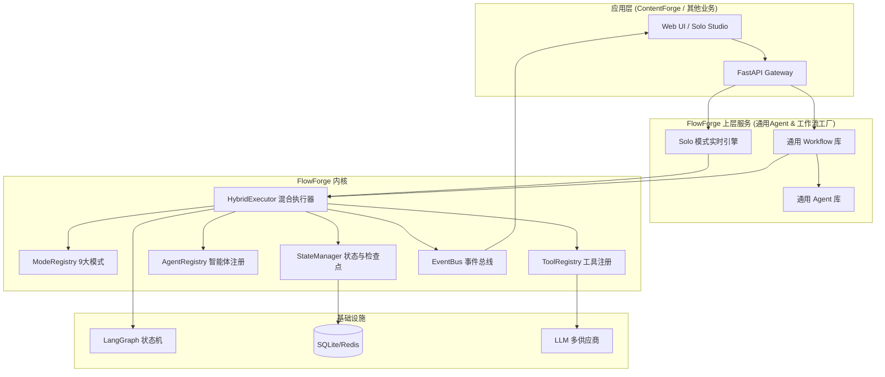

# FlowForge 开源 Agent 编排引擎 — 架构设计文档 v1.0

> **定位**：一个生产级、高可扩展的 Python Agent 编排框架。  
> **哲学**：让架构成为配置，让扩展成为插件。

---

## 1. 项目概述与设计目标

FlowForge 是一个解耦了业务逻辑的通用 Agent 操作系统内核。它封装了业界主流的 9 种 Agent 架构模式，提供统一的工具注册、状态管理、可观测性接口，让开发者通过**声明式配置（YAML/JSON）**即可组合出复杂的智能体工作流，而无需硬编码 if-else。

### 1.1 为什么需要 FlowForge？

当前多数 Agent 项目的痛点：

- **“堆 Prompt”陷阱**：把大量规则塞进系统提示词，导致上下文膨胀、行为不稳定。
- **紧耦合**：Agent 逻辑、工具调用、流程控制互相穿插，牵一发而动全身。
- **不可复用**：为一个业务场景构建的 Agent 逻辑，无法直接用于另一项目。

FlowForge 通过**将控制流（Control Flow）与反馈机制（Feedback Loop）从业务逻辑中完全剥离**，解决了这些问题。

### 1.2 设计目标

| 维度 | 目标 |
|------|------|
| **通用性** | 核心不感知业务概念（专栏、文章、选题），只定义 `TaskContext` 和 `Agent/Tool` 接口。 |
| **完整性** | 内置 9 种主流 Agent 模式（ReAct, Plan-Execute, Reflexion, Multi-Agent, Workflow, Graph of Thoughts, ReWOO, Self-Discover, Agent-as-Judge），支持混合编排。 |
| **可扩展性** | 任何新模式、新工具可通过注册机制热插拔。 |
| **生产就绪** | 内置追踪、指标、检查点、错误处理与级联修复。 |
| **开源友好** | MIT 许可证，完善的文档和例子，支持通过 `pip install flowforge` 安装。 |
| **高性能** | 基于 asyncio 异步执行，支持并行步骤和流式输出。 |

---

## 2. 核心概念与分层架构

```
┌─────────────────────────────────────────────────────────────┐
│                    应用层 (app layer)                       │
│    (ContentForge 等具体业务，通过注册 Agent/Tool 接入)      │
└───────────────────────────┬─────────────────────────────────┘
                            │  依赖注入 & 注册
┌───────────────────────────▼─────────────────────────────────┐
│                    FlowForge 核心引擎                       │
│  ┌───────────────────────────────────────────────────────┐  │
│  │              HybridExecutor (混合执行器)              │  │
│  │  - 自动模式选择 (Self-Discover) / 显式指定           │  │
│  │  - 执行循环（状态、错误、事件）                       │  │
│  └─────────────────────┬─────────────────────────────────┘  │
│                        │ 调度                               │
│  ┌─────────────────────▼─────────────────────────────────┐  │
│  │            ModeRegistry (模式注册中心)                 │  │
│  │  - react, plan_execute, reflexion, multi_agent, ...   │  │
│  │  - graph_of_thoughts, rewoo, self_discover, ...       │  │
│  └─────────────────────┬─────────────────────────────────┘  │
│                        │ 使用工具/Agent                     │
│  ┌─────────────────────▼─────────────────────────────────┐  │
│  │         ToolRegistry & AgentRegistry                 │  │
│  │  - 统一工具接口 (LLM, 搜索, 代码执行, 发布等)        │  │
│  │  - 统一 Agent 接口 (通过 AgentMode 模式执行)         │  │
│  └─────────────────────┬─────────────────────────────────┘  │
│                        │ 状态与事件                         │
│  ┌─────────────────────▼─────────────────────────────────┐  │
│  │      StateManager & EventBus (可观测性)              │  │
│  │  - 检查点 (SQLite/Redis)                             │  │
│  │  - 事件推送 (WebSocket / Console / Log)              │  │
│  └───────────────────────────────────────────────────────┘  │
└─────────────────────────────────────────────────────────────┘
```

**依赖方向**：应用层 → 核心引擎 → 基础设施（数据库、LLM 服务）。严禁反向依赖。

---

## 3. 核心接口设计

### 3.1 TaskContext — 任务上下文

在整个执行过程中传递的上下文对象，包含任务 ID、原始输入、中间状态、检查点管理器、事件发射器等。

```python
class TaskContext:
    task_id: str
    persona: Optional[str] = None   # 业务标签（专栏名）
    input_data: dict                # 原始输入
    metadata: dict                  # 扩展元数据
    state: dict                     # 当前状态（等同于 LangGraph State）
    tools: ToolRegistry             # 可用工具
    agents: AgentRegistry           # 可用 Agent
    mode: Optional[str] = None      # 当前使用的模式
    checkpoint: CheckpointManager   # 检查点
    event_bus: EventBus             # 事件总线
```

### 3.2 BaseAgent — Agent 抽象

所有业务 Agent 必须实现此接口。Agent 本身不关心执行模式，只负责处理输入并返回结果。

```python
class BaseAgent(ABC):
    name: str
    description: str
    # 建议默认使用的模式，可被 SOP 覆盖
    default_mode: Optional[str] = None

    @abstractmethod
    async def execute(self, input: AgentInput, context: TaskContext) -> AgentOutput:
        """核心执行方法"""
        pass
```

### 3.3 BaseTool — 工具抽象

所有外部能力（LLM、检索、发布等）统一封装为 Tool。

```python
class BaseTool(ABC):
    name: str
    description: str
    parameters: dict   # JSON Schema

    @abstractmethod
    async def execute(self, params: dict) -> dict:
        pass
```

### 3.4 BaseModeExecutor — 模式执行器抽象

每个内置模式实现为一个独立的执行器，负责按照特定的控制流调度 Agent 和 Tool。

```python
class BaseModeExecutor(ABC):
    mode_name: str

    @abstractmethod
    async def run(self, context: TaskContext) -> dict:
        """执行模式逻辑，返回最终输出"""
        pass
```

### 3.5 HybridExecutor — 混合调度入口

应用层唯一的调用入口，根据任务的 `mode` 参数（或通过 Self-Discover 自动推断）选择对应的执行器，并负责全生命周期管理。

```python
class HybridExecutor:
    def __init__(self, mode_registry: ModeRegistry, agent_registry: AgentRegistry, tool_registry: ToolRegistry):
        ...

    async def run(self, context: TaskContext, mode_hint: Optional[str] = None) -> dict:
        # 1. 若 mode_hint 为空，则启用 MetaPlanner (Self-Discover) 自动推断最佳模式
        # 2. 从 ModeRegistry 获取执行器实例
        # 3. 包装错误处理、事件发射、状态检查点
        # 4. 返回最终结果
        pass
```

### 3.6 ModeRegistry — 模式注册中心

提供动态注册、查询和推荐模式的功能。

```python
class ModeRegistry:
    def register(self, executor: BaseModeExecutor): ...
    def get(self, mode_name: str) -> BaseModeExecutor: ...
    def suggest_mode(self, task_description: str) -> str: ...
```

---

## 4. 九大内置模式详解

| 模式名称 | 英文 | 核心机制 | 适用场景 |
|---------|------|---------|----------|
| `react` | ReAct | Thought → Action → Observation 循环 | 需要多步动态检索或工具调用 |
| `plan_execute` | Plan-and-Execute | Planner 生成步骤清单，Executor 依次执行 | 路径明确、步骤可预测的任务 |
| `reflexion` | Reflexion | Actor 生成 → Evaluator 评估 → Reflector 反思 -> 记忆 | 需要反复打磨才能达标的任务（代码、文档） |
| `multi_agent` | Multi-Agent | Orchestrator 分发任务给专业 Agent，并行/串行协作 | 需要多角色配合的复杂任务 |
| `workflow` | Workflow / Orchestration | 预定义的 DAG 流程，可混合其他模式 | 长流程、端到端的业务流水线 |
| `graph_of_thoughts` | Graph of Thoughts | 图式推理，多思路聚合、交叉验证 | 复杂推理、数学证明、多源情报融合 |
| `rewoo` | ReWOO | 一次性规划所有工具调用，批量执行 | 确定性多 API 调用，需高吞吐 |
| `self_discover` | Self-Discover | 任务前自动发现最佳推理结构 | 不确定领域，先验知识未知的任务 |
| `agent_judge` | Agent-as-Judge | 用独立 Agent 作为评判者，提供定性反馈 | 无外部评分标准，依赖“审美”或“逻辑”评价 |

### 4.1 模式组合示例

FlowForge 支持在 **SOP YAML** 中为每个步骤指定独立的模式，实现真正的混合编排：

```yaml
steps:
  - name: research
    agent: researcher
    mode: rewoo   # 快速并行检索
  - name: draft
    agent: writer
    mode: reflexion  # 反复打磨生成初稿
  - name: review
    human: true
  - name: publish
    agent: publisher
    mode: plan_execute  # 按固定步骤发布
```

---

## 5. 事件系统与可观测性

### 5.1 EventBus

FlowForge 内置事件总线，在执行过程中推送标准化事件，供前端实时展示（Solo 模式）或日志采集。

**事件类型**：
- `task.start`, `task.complete`, `task.error`
- `mode.enter`, `mode.exit`
- `agent.start`, `agent.end`
- `tool.start`, `tool.end`
- `llm.stream`, `llm.token_usage`
- `draft.update`
- `review.ready`

应用层可通过 `context.event_bus.subscribe()` 监听事件，或实现 `WebSocketEmitter` 将事件推送到前端。

### 5.2 追踪与指标

- **分布式追踪**：基于 OpenTelemetry，每个任务生成唯一 `trace_id`，贯穿所有 Agent 和工具调用。
- **Prometheus 指标**：
  - `flowforge_tasks_total{mode, status}`
  - `flowforge_execution_duration_seconds`
  - `flowforge_token_usage_total{model, provider}`
  - `flowforge_tool_calls_total{tool_name, status}`

### 5.3 检查点与恢复

`StateManager` 提供 `save_checkpoint(task_id, state)` 和 `load_checkpoint(task_id)` 接口。默认使用 SQLite 存储，可替换为 Redis。LangGraph 深度集成时，直接复用其 Checkpointer。

---

## 6. 配置化与启动

FlowForge 完全由 YAML/JSON 驱动，无需编写 Python 代码即可搭建基础 Agent 应用。

### 6.1 配置文件示例 (config.yaml)

```yaml
modes:
  - name: reflexion
    enabled: true
  - name: rewoo
    enabled: true

agents:
  - name: writer
    module: my_agents.writer
    default_mode: reflexion

tools:
  - name: openai
    provider: openrouter
    api_key: "${OPENROUTER_API_KEY}"
  - name: search
    provider: tavily
    api_key: "${TAVILY_API_KEY}"
```

### 6.2 编程式启动

```python
from flowforge import FlowForge

forge = FlowForge.from_config("config.yaml")
result = await forge.run(
    task_id="task-001",
    input_data={"topic": "AI Agent 发展趋势"},
    mode="reflexion"  # 或省略，由引擎自动选择
)
```

---

## 7. 扩展与插件

FlowForge 设计为高度可扩展，所有组件支持插件式加载。

### 7.1 注册自定义模式

```python
from flowforge import BaseModeExecutor, ModeRegistry

class MyCustomMode(BaseModeExecutor):
    mode_name = "my_mode"

    async def run(self, context):
        # 自定义执行逻辑
        return {"result": "ok"}

registry.register(MyCustomMode())
```

### 7.2 第三方插件机制

通过 Python 标准入口点 `flowforge.tools`、`flowforge.modes`，其他库可以自动注册。

```toml
[project.entry-points."flowforge.modes"]
my_mode = "my_package:MyCustomMode"
```

---

## 8. 安全与审计

- **沙箱执行**：可以对特定工具（如代码执行）实施权限控制。
- **审计日志**：所有 Agent、Tool 调用均记录在 `audit_logs` 表中，包含输入参数、输出、trace_id、耗时。
- **人工介入**：Workflow 模式原生支持 `human: true` 节点，配合检查点实现暂停/恢复。

---

## 9. 开源与社区

- **许可证**：MIT
- **文档**：MkDocs + Material 主题，包含详细 API 参考、教程和最佳实践
- **示例仓库**：`flowforge-examples` 包含各类场景的演示项目

---

**以上是 FlowForge 架构设计文档 v1.0 核心内容。** 接下来我将输出完整的《ContentForge 适配和迁移指南》，指导如何将现有系统平滑迁移到 FlowForge 引擎上。


# FlowForge v2.0 深度架构设计

> 这份文档是 FlowForge 的核心设计，目的是明确我们的定位、优势和与现有框架的根本区别，并展示我们作为一个高级团队的技术判断力。

---

## 一、现状反思与架构升级

之前的 v0.1 版本定义了核心接口和 9 种模式的执行器，这是必要的骨架。但一个真正的“Agent 操作系统”，不能只是“执行器”的罗列。如果我们只是提供 `ReActExecutor.run()` 和 `PlanExecuteExecutor.run()`，那么它只是一个玩具。

真正的架构升级，必须解决以下问题：

1.  **模式不只是“执行”，而是要提供“思维框架”**。ReAct 不仅仅是循环调用工具，它是一种**强制思考显式化的机制**。我们的执行器需要能够**引导 Agent 遵循这个思考过程**，而不是简单地调用 API。
2.  **“混合编排”需要原生支持**。用户不应该自己写一个巨大的 `workflow` 来串 `reflexion` 和 `rewoo`。我们的引擎需要能**在模式内部无缝切换**到另一个模式，或者在一个 Workflow 节点中指定一个模式。
3.  **工程化能力是“引擎”的核心**。与 LangGraph 和 Dify 相比，我们的优势不在于又做了一套图形界面，而在于我们**对复杂 Agent 模式的工程化抽象和深度集成**。我们提供的是“高级 Agent 行为的制造工厂”，而不是一个“拖拽节点生成 API 调用的可视化工具”。

---

## 二、核心优势与竞品分析

| 维度 | LangGraph | Dify | CrewAI | **FlowForge** |
| :--- | :--- | :--- | :--- | :--- |
| **核心定位** | 底层状态机“发动机”，提供构建 Agent 的原子能力（Graph, Node, Edge, Checkpoint） | 开箱即用“汽车”，有 UI、模型、工具集成，适合非开发者或低代码场景 | 角色扮演“团队模拟器”，做多 Agent 协作，流程控制较弱 | **Agent “高级制造工厂”**：在底层“发动机”（LangGraph）之上，提供预配置的**高级 Agent 行为模式、可复用的通用 Agent 和工作流**，让业务方用配置组合出复杂能力，而不是从原子构建 |
| **编排方式** | Python/JS 代码，硬编码图结构 | UI 拖拽，生成静态 Pipeline | 硬编码，通过 Prompt 定义角色和顺序 | **声明式配置（YAML）+ 混合执行器**：支持在配置中为每个步骤指定不同的模式（如 Reflextion），引擎自动混合执行 |
| **核心模式** | 无内置模式，需开发者自行实现所有逻辑 | 简单的顺序/条件 Pipeline，无高级 Agent 思维模式 | 顺序对话，无细粒度的单 Agent 思维模式 | **9 种开箱即用的 Agent 模式**（ReAct, Plan-Execute, Reflexion, GoT, Self-Discover 等），解决了从简单到极端复杂任务的工程化实现 |
| **通用Agent** | 无 | 无，需从头构建 | 无，需从头定义角色 | **内置多个经过实战验证的通用 Agent 和工作流**（如深度研究、高级写作、代码生成、AI辩论等），业务方可直接调用或微调 |
| **Solo 交互** | 无配套 UI | 无实时 Agent 思维可视化 | 无 | **原生支持 Solo 模式**：WebSocket 实时推送 Agent 的每一步思考、工具调用、推理流，提供极致透明的人机协同体验 |
| **可扩展性** | 写自定义 Node | 插件市场（应用层） | 写新 Agent 类 | **模式/Agent/Tool 三层插件体系**，新模式和新 Agent 均可通过注册机制热插拔 |
| **确定性 vs 灵活性** | 高确定性，低灵活性 | 中确定性，中灵活性 | 低确定性，高灵活性 | **多模式分层确定性**：Workflow 模式提供最高确定性（用于业务流程），Reflexion/ReAct 提供灵活性（用于创意/复杂推理），在引擎内部统一调度 |
| **目标用户** | 需要从零构建复杂 Agent 的资深 AI 工程师 | 希望快速集成 AI 到业务中的产品经理或非 AI 专业开发者 | 需要模拟多角色协作的研究人员或产品经理 | **需要快速构建具备高级思维能力的 Agent 应用的 AI 工程团队**

**一句话总结**：LangGraph 是“发动机”，Dify 是“整车”，CrewAI 是“剧组”，而 **FlowForge 是“高级 Agent 行为的生产流水线”**。你用 LangGraph 造零件，用 Dify 组装标准车型，用 CrewAI 模拟团队，但**用 FlowForge 来批量制造具有复杂思维能力的专家 Agent**。

我们的核心护城河在于：
1.  **对 9 种高级 Agent 模式的深刻工程化实现**：这不仅仅是调用 API，而是对每种模式的思考过程、反馈循环、终止条件、错误处理的深度编码。
2.  **开箱即用的通用 Agent 和工作流**：我们将 ContentForge 中的业务经验提炼为可复用的基础 Agent，同时引入业界验证过的先进通用 Agent，让上层业务开发者可以直接使用。
3.  **Solo 交互模式**：提供极致的透明度和控制力，这是任何其他框架目前不具备的。

---

## 三、FlowForge 核心能力重组

基于以上分析，我们对 FlowForge 的核心组件进行重组，使其成为一个真正强大的 Agent 操作系统。



**关键变化**：
- **新增“通用 Agent 库”**：从 ContentForge 和业界优秀实践中提炼出可复用的通用 Agent，如 `DeepResearchAgent`（深度研究）、`ArticleWriterAgent`（高级写作）、`CodeReviewAgent`（代码审查）等。
- **新增“通用 Workflow 库”**：预配置的复合工作流，如“深度研究报告生成”、“AI 辩论评审”等，业务方只需传入参数即可启动复杂的 Agent 协作流程。
- **Solo 模式深入内核**：Solo 交互不再是“附加功能”，而是与现代前端深度集成的实时协作模式。

---

## 四、开箱即用的通用 Agent 和 Workflow

### 4.1 通用 Agent

我们从 ContentForge 的实战经验和业界论文中提炼了以下通用 Agent，它们直接继承 `flowforge.BaseAgent`，并预设了高水平的 `system_prompt` 和 `mode`。

| Agent 名称 | 来源 | 能力 | 可配置参数 | 默认模式 |
| :--- | :--- | :--- | :--- | :--- |
| **`DeepResearchAgent`** | ContentForge Topic Agent + 业界最新检索实践 | 基于多级检索策略和 Self-Discover 模式的深度信息收集与综合分析 | `depth` (basic/advanced), `sources` (web/internal/hybrid) | `self_discover` + `rewoo` |
| **`TaskDecompositionAgent`** | Plan-and-Execute + ReWOO 实践 | 将复杂任务分解为可直接交给 `TaskExecutor` 的分步计划 | `decomposition_strategy` (linear/parallel/conditional) | `plan_execute` |
| **`TaskExecutorAgent`** | Reflexion + ReAct 最佳实践 | 在任务分解后，按计划忠实执行每一步，具备自适应重规划能力 | `max_retries`, `fallback_mode` | `react` (with fallback to `rewoo`) |
| **`AdvancedWritingAgent`** | ContentForge Writer/Editor Agent | 三层生成管道 (Draft-Reflect-Polish) 的高级写作助手 | `tone` (formal/casual/persuasive), `target_audience`, `brand_guidelines` | `reflexion` (with `agent_judge`) |
| **`MultiRoleReviewAgent`** | Multi-Agent + Agent-as-Judge 综合模式 | 自动生成多个审查角色（如逻辑、事实、风格），并模拟辩论，生成综合审查报告 | `review_roles` (list), `debate_rounds` | `multi_agent` (with `agent_judge`) |
| **`CodeGenAgent`** | Reflexion + ReAct 最佳实践 | 生成代码 → 运行测试 → 反思/修复 → 重写的闭环代码生成器 | `language`, `test_framework` | `reflexion` |
| **`MetaPlannerAgent`** | Self-Discover 学术实践 | 分析用户请求，不直接给出答案，而是输出解决该问题的最佳“思维框架”或“SOP 蓝图” | `domain` (general/tech/business) | `self_discover` |

**优势**：业务开发者不需要从 `BaseAgent` 一行行写代码，而是直接从这些经过验证的通用 Agent 开始，通过 DI 注入自己的 `Tool` (如 HelixRAG、微信发布) 即可快速构建应用。

### 4.2 通用 Workflow

我们将 ContentForge 中的成功业务模式抽象为可复用的工作流，存储在 `flowforge/workflows/` 目录下。

| Workflow 名称 | 描述 | 内部使用的模式与 Agent |
| :--- | :--- | :--- |
| **`InDepthReportWorkflow`** (深度研报) | 从主题研究、大纲生成、章节并行写作、图表生成，到交叉评审的完整报告生成流程 | `DeepResearchAgent` → `TaskDecompositionAgent` → 并行`AdvancedWritingAgent` → `MultiRoleReviewAgent` → `FinalEditor` |
| **`AIDebateWorkflow`** (AI辩论评审) | 围绕一个议题，创建一个正方、一个反方和一个裁判 Agent，进行多轮辩论，最终输出辩论记录和裁判结论 | 三个专用`DebateAgent` + 一个`JudgeAgent`，包含辩论轮次控制和计分规则 |
| **`CodeReviewWorkflow`** (代码审查) | 分析代码变更 → 生成审查清单 → 并行进行逻辑、安全、性能审查 → 聚合审查报告 | `CodeAnalysisAgent` → 并行`SecurityAgent`、`PerformanceAgent` → `ReportAggregatorAgent` |
| **`ArtifactGenerationWorkflow`** (长篇作品) | 全局规划 → 分章节大纲 → 各个章节并行创作 → 风格一致性审查 → 聚合全篇 | `MetaPlannerAgent` → `TaskDecompositionAgent` → 并行`ChapterWriterAgent` → `StyleConsistencyAgent` → `VolumeAggregatorAgent` |

业务方使用这些 Workflow 就像调用一个函数：

```yaml
# 业务方只需写这样一个配置文件
workflow: "InDepthReportWorkflow"
params:
  topic: "2026年武汉中考政策影响分析"
  persona: "education"
  research_depth: "advanced"
  output_format: "full_report"
```

---

## 五、技术实现细节

### 5.1 `HybridExecutor` 的升级

`HybridExecutor` 不再只是一个简单的“模式选择器”，它现在需要能够：
1.  **动态编译 Workflow**：从 YAML 配置中动态构建 LangGraph 状态图，包括并行节点、条件边、和子图。
2.  **模式间上下文保持**：当一个 Workflow 步骤从 `ReflexionWriter` 切换到 `MultiRoleReview` 时，`TaskContext` 中保留所有历史状态，以便下一个 Agent 能够获取上下文。
3.  **原生流式支持**：当内部模式是 `Reflexion` 或 `ReAct` 时，`HybridExecutor` 能将其内部的 LLM 流式 token 实时转发给 EventBus，支持 Solo 模式的 LLM 思考可视化。

### 5.2 Solo 模式的深度集成

Solo 模式不仅仅是接收 `tool.start` / `tool.end` 事件。对于 `Reflexion` 模式，前端需要显示 **Actor → Evaluator → Reflector** 的完整循环，以及每次反省的**差异对比**。这需要 `EventBus` 提供更丰富的事件类型。

---

## 六、总结

FlowForge 不是 LangGraph、Dify 或 CrewAI 的替代品，而是它们的**互补层**。它提供了它们所缺乏的**高级 Agent 思维模式工程化实现和通用 Agent 基础设施**。我们相信，这套设计将使我们团队在构建复杂 AI 应用方面建立起真正的技术壁垒。