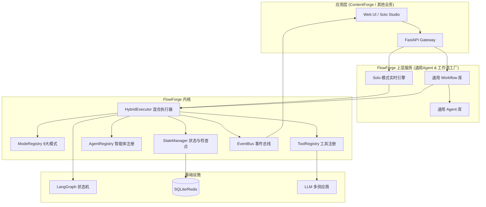
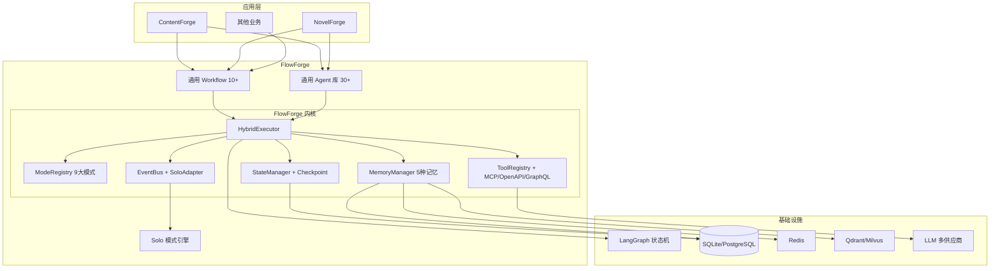

# FlowForge 开源 Agent 编排引擎 — 架构设计文档 v1.0

> **定位**：一个生产级、高可扩展的 Python Agent 编排框架。  
> **哲学**：让架构成为配置，让扩展成为插件。

---

## 1. 项目概述与设计目标

FlowForge 是一个解耦了业务逻辑的通用 Agent 操作系统内核。它封装了业界主流的 9 种 Agent 架构模式，提供统一的工具注册、状态管理、可观测性接口，让开发者通过**声明式配置（YAML/JSON）**即可组合出复杂的智能体工作流，而无需硬编码 if-else。

### 1.1 为什么需要 FlowForge？

当前多数 Agent 项目的痛点：

- **“堆 Prompt”陷阱**：把大量规则塞进系统提示词，导致上下文膨胀、行为不稳定。
- **紧耦合**：Agent 逻辑、工具调用、流程控制互相穿插，牵一发而动全身。
- **不可复用**：为一个业务场景构建的 Agent 逻辑，无法直接用于另一项目。

FlowForge 通过**将控制流（Control Flow）与反馈机制（Feedback Loop）从业务逻辑中完全剥离**，解决了这些问题。

### 1.2 设计目标

| 维度 | 目标 |
|------|------|
| **通用性** | 核心不感知业务概念（专栏、文章、选题），只定义 `TaskContext` 和 `Agent/Tool` 接口。 |
| **完整性** | 内置 9 种主流 Agent 模式（ReAct, Plan-Execute, Reflexion, Multi-Agent, Workflow, Graph of Thoughts, ReWOO, Self-Discover, Agent-as-Judge），支持混合编排。 |
| **可扩展性** | 任何新模式、新工具可通过注册机制热插拔。 |
| **生产就绪** | 内置追踪、指标、检查点、错误处理与级联修复。 |
| **开源友好** | MIT 许可证，完善的文档和例子，支持通过 `pip install flowforge` 安装。 |
| **高性能** | 基于 asyncio 异步执行，支持并行步骤和流式输出。 |

---

## 2. 核心概念与分层架构

```
┌─────────────────────────────────────────────────────────────┐
│                    应用层 (app layer)                       │
│    (ContentForge 等具体业务，通过注册 Agent/Tool 接入)      │
└───────────────────────────┬─────────────────────────────────┘
                            │  依赖注入 & 注册
┌───────────────────────────▼─────────────────────────────────┐
│                    FlowForge 核心引擎                       │
│  ┌───────────────────────────────────────────────────────┐  │
│  │              HybridExecutor (混合执行器)              │  │
│  │  - 自动模式选择 (Self-Discover) / 显式指定           │  │
│  │  - 执行循环（状态、错误、事件）                       │  │
│  └─────────────────────┬─────────────────────────────────┘  │
│                        │ 调度                               │
│  ┌─────────────────────▼─────────────────────────────────┐  │
│  │            ModeRegistry (模式注册中心)                 │  │
│  │  - react, plan_execute, reflexion, multi_agent, ...   │  │
│  │  - graph_of_thoughts, rewoo, self_discover, ...       │  │
│  └─────────────────────┬─────────────────────────────────┘  │
│                        │ 使用工具/Agent                     │
│  ┌─────────────────────▼─────────────────────────────────┐  │
│  │         ToolRegistry & AgentRegistry                 │  │
│  │  - 统一工具接口 (LLM, 搜索, 代码执行, 发布等)        │  │
│  │  - 统一 Agent 接口 (通过 AgentMode 模式执行)         │  │
│  └─────────────────────┬─────────────────────────────────┘  │
│                        │ 状态与事件                         │
│  ┌─────────────────────▼─────────────────────────────────┐  │
│  │      StateManager & EventBus (可观测性)              │  │
│  │  - 检查点 (SQLite/Redis)                             │  │
│  │  - 事件推送 (WebSocket / Console / Log)              │  │
│  └───────────────────────────────────────────────────────┘  │
└─────────────────────────────────────────────────────────────┘
```

**依赖方向**：应用层 → 核心引擎 → 基础设施（数据库、LLM 服务）。严禁反向依赖。

---

## 3. 核心接口设计

### 3.1 TaskContext — 任务上下文

在整个执行过程中传递的上下文对象，包含任务 ID、原始输入、中间状态、检查点管理器、事件发射器等。

```python
class TaskContext:
    task_id: str
    persona: Optional[str] = None   # 业务标签（专栏名）
    input_data: dict                # 原始输入
    metadata: dict                  # 扩展元数据
    state: dict                     # 当前状态（等同于 LangGraph State）
    tools: ToolRegistry             # 可用工具
    agents: AgentRegistry           # 可用 Agent
    mode: Optional[str] = None      # 当前使用的模式
    checkpoint: CheckpointManager   # 检查点
    event_bus: EventBus             # 事件总线
```

### 3.2 BaseAgent — Agent 抽象

所有业务 Agent 必须实现此接口。Agent 本身不关心执行模式，只负责处理输入并返回结果。

```python
class BaseAgent(ABC):
    name: str
    description: str
    # 建议默认使用的模式，可被 SOP 覆盖
    default_mode: Optional[str] = None

    @abstractmethod
    async def execute(self, input: AgentInput, context: TaskContext) -> AgentOutput:
        """核心执行方法"""
        pass
```

### 3.3 BaseTool — 工具抽象

所有外部能力（LLM、检索、发布等）统一封装为 Tool。

```python
class BaseTool(ABC):
    name: str
    description: str
    parameters: dict   # JSON Schema

    @abstractmethod
    async def execute(self, params: dict) -> dict:
        pass
```

### 3.4 BaseModeExecutor — 模式执行器抽象

每个内置模式实现为一个独立的执行器，负责按照特定的控制流调度 Agent 和 Tool。

```python
class BaseModeExecutor(ABC):
    mode_name: str

    @abstractmethod
    async def run(self, context: TaskContext) -> dict:
        """执行模式逻辑，返回最终输出"""
        pass
```

### 3.5 HybridExecutor — 混合调度入口

应用层唯一的调用入口，根据任务的 `mode` 参数（或通过 Self-Discover 自动推断）选择对应的执行器，并负责全生命周期管理。

```python
class HybridExecutor:
    def __init__(self, mode_registry: ModeRegistry, agent_registry: AgentRegistry, tool_registry: ToolRegistry):
        ...

    async def run(self, context: TaskContext, mode_hint: Optional[str] = None) -> dict:
        # 1. 若 mode_hint 为空，则启用 MetaPlanner (Self-Discover) 自动推断最佳模式
        # 2. 从 ModeRegistry 获取执行器实例
        # 3. 包装错误处理、事件发射、状态检查点
        # 4. 返回最终结果
        pass
```

### 3.6 ModeRegistry — 模式注册中心

提供动态注册、查询和推荐模式的功能。

```python
class ModeRegistry:
    def register(self, executor: BaseModeExecutor): ...
    def get(self, mode_name: str) -> BaseModeExecutor: ...
    def suggest_mode(self, task_description: str) -> str: ...
```

---

## 4. 九大内置模式详解

| 模式名称 | 英文 | 核心机制 | 适用场景 |
|---------|------|---------|----------|
| `react` | ReAct | Thought → Action → Observation 循环 | 需要多步动态检索或工具调用 |
| `plan_execute` | Plan-and-Execute | Planner 生成步骤清单，Executor 依次执行 | 路径明确、步骤可预测的任务 |
| `reflexion` | Reflexion | Actor 生成 → Evaluator 评估 → Reflector 反思 -> 记忆 | 需要反复打磨才能达标的任务（代码、文档） |
| `multi_agent` | Multi-Agent | Orchestrator 分发任务给专业 Agent，并行/串行协作 | 需要多角色配合的复杂任务 |
| `workflow` | Workflow / Orchestration | 预定义的 DAG 流程，可混合其他模式 | 长流程、端到端的业务流水线 |
| `graph_of_thoughts` | Graph of Thoughts | 图式推理，多思路聚合、交叉验证 | 复杂推理、数学证明、多源情报融合 |
| `rewoo` | ReWOO | 一次性规划所有工具调用，批量执行 | 确定性多 API 调用，需高吞吐 |
| `self_discover` | Self-Discover | 任务前自动发现最佳推理结构 | 不确定领域，先验知识未知的任务 |
| `agent_judge` | Agent-as-Judge | 用独立 Agent 作为评判者，提供定性反馈 | 无外部评分标准，依赖“审美”或“逻辑”评价 |

### 4.1 模式组合示例

FlowForge 支持在 **SOP YAML** 中为每个步骤指定独立的模式，实现真正的混合编排：

```yaml
steps:
  - name: research
    agent: researcher
    mode: rewoo   # 快速并行检索
  - name: draft
    agent: writer
    mode: reflexion  # 反复打磨生成初稿
  - name: review
    human: true
  - name: publish
    agent: publisher
    mode: plan_execute  # 按固定步骤发布
```

---

## 5. 事件系统与可观测性

### 5.1 EventBus

FlowForge 内置事件总线，在执行过程中推送标准化事件，供前端实时展示（Solo 模式）或日志采集。

**事件类型**：
- `task.start`, `task.complete`, `task.error`
- `mode.enter`, `mode.exit`
- `agent.start`, `agent.end`
- `tool.start`, `tool.end`
- `llm.stream`, `llm.token_usage`
- `draft.update`
- `review.ready`

应用层可通过 `context.event_bus.subscribe()` 监听事件，或实现 `WebSocketEmitter` 将事件推送到前端。

### 5.2 追踪与指标

- **分布式追踪**：基于 OpenTelemetry，每个任务生成唯一 `trace_id`，贯穿所有 Agent 和工具调用。
- **Prometheus 指标**：
  - `flowforge_tasks_total{mode, status}`
  - `flowforge_execution_duration_seconds`
  - `flowforge_token_usage_total{model, provider}`
  - `flowforge_tool_calls_total{tool_name, status}`

### 5.3 检查点与恢复

`StateManager` 提供 `save_checkpoint(task_id, state)` 和 `load_checkpoint(task_id)` 接口。默认使用 SQLite 存储，可替换为 Redis。LangGraph 深度集成时，直接复用其 Checkpointer。

---

## 6. 配置化与启动

FlowForge 完全由 YAML/JSON 驱动，无需编写 Python 代码即可搭建基础 Agent 应用。

### 6.1 配置文件示例 (config.yaml)

```yaml
modes:
  - name: reflexion
    enabled: true
  - name: rewoo
    enabled: true

agents:
  - name: writer
    module: my_agents.writer
    default_mode: reflexion

tools:
  - name: openai
    provider: openrouter
    api_key: "${OPENROUTER_API_KEY}"
  - name: search
    provider: tavily
    api_key: "${TAVILY_API_KEY}"
```

### 6.2 编程式启动

```python
from flowforge import FlowForge

forge = FlowForge.from_config("config.yaml")
result = await forge.run(
    task_id="task-001",
    input_data={"topic": "AI Agent 发展趋势"},
    mode="reflexion"  # 或省略，由引擎自动选择
)
```

---

## 7. 扩展与插件

FlowForge 设计为高度可扩展，所有组件支持插件式加载。

### 7.1 注册自定义模式

```python
from flowforge import BaseModeExecutor, ModeRegistry

class MyCustomMode(BaseModeExecutor):
    mode_name = "my_mode"

    async def run(self, context):
        # 自定义执行逻辑
        return {"result": "ok"}

registry.register(MyCustomMode())
```

### 7.2 第三方插件机制

通过 Python 标准入口点 `flowforge.tools`、`flowforge.modes`，其他库可以自动注册。

```toml
[project.entry-points."flowforge.modes"]
my_mode = "my_package:MyCustomMode"
```

---

## 8. 安全与审计

- **沙箱执行**：可以对特定工具（如代码执行）实施权限控制。
- **审计日志**：所有 Agent、Tool 调用均记录在 `audit_logs` 表中，包含输入参数、输出、trace_id、耗时。
- **人工介入**：Workflow 模式原生支持 `human: true` 节点，配合检查点实现暂停/恢复。

---

## 9. 开源与社区

- **许可证**：MIT
- **文档**：MkDocs + Material 主题，包含详细 API 参考、教程和最佳实践
- **示例仓库**：`flowforge-examples` 包含各类场景的演示项目

---

**以上是 FlowForge 架构设计文档 v1.0 核心内容。** 接下来我将输出完整的《ContentForge 适配和迁移指南》，指导如何将现有系统平滑迁移到 FlowForge 引擎上。


# FlowForge v2.0 深度架构设计

> 这份文档是 FlowForge 的核心设计，目的是明确我们的定位、优势和与现有框架的根本区别，并展示我们作为一个高级团队的技术判断力。

---

## 一、现状反思与架构升级

之前的 v0.1 版本定义了核心接口和 9 种模式的执行器，这是必要的骨架。但一个真正的“Agent 操作系统”，不能只是“执行器”的罗列。如果我们只是提供 `ReActExecutor.run()` 和 `PlanExecuteExecutor.run()`，那么它只是一个玩具。

真正的架构升级，必须解决以下问题：

1.  **模式不只是“执行”，而是要提供“思维框架”**。ReAct 不仅仅是循环调用工具，它是一种**强制思考显式化的机制**。我们的执行器需要能够**引导 Agent 遵循这个思考过程**，而不是简单地调用 API。
2.  **“混合编排”需要原生支持**。用户不应该自己写一个巨大的 `workflow` 来串 `reflexion` 和 `rewoo`。我们的引擎需要能**在模式内部无缝切换**到另一个模式，或者在一个 Workflow 节点中指定一个模式。
3.  **工程化能力是“引擎”的核心**。与 LangGraph 和 Dify 相比，我们的优势不在于又做了一套图形界面，而在于我们**对复杂 Agent 模式的工程化抽象和深度集成**。我们提供的是“高级 Agent 行为的制造工厂”，而不是一个“拖拽节点生成 API 调用的可视化工具”。

---

## 二、核心优势与竞品分析

| 维度 | LangGraph | Dify | CrewAI | **FlowForge** |
| :--- | :--- | :--- | :--- | :--- |
| **核心定位** | 底层状态机“发动机”，提供构建 Agent 的原子能力（Graph, Node, Edge, Checkpoint） | 开箱即用“汽车”，有 UI、模型、工具集成，适合非开发者或低代码场景 | 角色扮演“团队模拟器”，做多 Agent 协作，流程控制较弱 | **Agent “高级制造工厂”**：在底层“发动机”（LangGraph）之上，提供预配置的**高级 Agent 行为模式、可复用的通用 Agent 和工作流**，让业务方用配置组合出复杂能力，而不是从原子构建 |
| **编排方式** | Python/JS 代码，硬编码图结构 | UI 拖拽，生成静态 Pipeline | 硬编码，通过 Prompt 定义角色和顺序 | **声明式配置（YAML）+ 混合执行器**：支持在配置中为每个步骤指定不同的模式（如 Reflextion），引擎自动混合执行 |
| **核心模式** | 无内置模式，需开发者自行实现所有逻辑 | 简单的顺序/条件 Pipeline，无高级 Agent 思维模式 | 顺序对话，无细粒度的单 Agent 思维模式 | **9 种开箱即用的 Agent 模式**（ReAct, Plan-Execute, Reflexion, GoT, Self-Discover 等），解决了从简单到极端复杂任务的工程化实现 |
| **通用Agent** | 无 | 无，需从头构建 | 无，需从头定义角色 | **内置多个经过实战验证的通用 Agent 和工作流**（如深度研究、高级写作、代码生成、AI辩论等），业务方可直接调用或微调 |
| **Solo 交互** | 无配套 UI | 无实时 Agent 思维可视化 | 无 | **原生支持 Solo 模式**：WebSocket 实时推送 Agent 的每一步思考、工具调用、推理流，提供极致透明的人机协同体验 |
| **可扩展性** | 写自定义 Node | 插件市场（应用层） | 写新 Agent 类 | **模式/Agent/Tool 三层插件体系**，新模式和新 Agent 均可通过注册机制热插拔 |
| **确定性 vs 灵活性** | 高确定性，低灵活性 | 中确定性，中灵活性 | 低确定性，高灵活性 | **多模式分层确定性**：Workflow 模式提供最高确定性（用于业务流程），Reflexion/ReAct 提供灵活性（用于创意/复杂推理），在引擎内部统一调度 |
| **目标用户** | 需要从零构建复杂 Agent 的资深 AI 工程师 | 希望快速集成 AI 到业务中的产品经理或非 AI 专业开发者 | 需要模拟多角色协作的研究人员或产品经理 | **需要快速构建具备高级思维能力的 Agent 应用的 AI 工程团队**

**一句话总结**：LangGraph 是“发动机”，Dify 是“整车”，CrewAI 是“剧组”，而 **FlowForge 是“高级 Agent 行为的生产流水线”**。你用 LangGraph 造零件，用 Dify 组装标准车型，用 CrewAI 模拟团队，但**用 FlowForge 来批量制造具有复杂思维能力的专家 Agent**。

我们的核心护城河在于：
1.  **对 9 种高级 Agent 模式的深刻工程化实现**：这不仅仅是调用 API，而是对每种模式的思考过程、反馈循环、终止条件、错误处理的深度编码。
2.  **开箱即用的通用 Agent 和工作流**：我们将 ContentForge 中的业务经验提炼为可复用的基础 Agent，同时引入业界验证过的先进通用 Agent，让上层业务开发者可以直接使用。
3.  **Solo 交互模式**：提供极致的透明度和控制力，这是任何其他框架目前不具备的。

---

## 三、FlowForge 核心能力重组

基于以上分析，我们对 FlowForge 的核心组件进行重组，使其成为一个真正强大的 Agent 操作系统。



**关键变化**：
- **新增“通用 Agent 库”**：从 ContentForge 和业界优秀实践中提炼出可复用的通用 Agent，如 `DeepResearchAgent`（深度研究）、`ArticleWriterAgent`（高级写作）、`CodeReviewAgent`（代码审查）等。
- **新增“通用 Workflow 库”**：预配置的复合工作流，如“深度研究报告生成”、“AI 辩论评审”等，业务方只需传入参数即可启动复杂的 Agent 协作流程。
- **Solo 模式深入内核**：Solo 交互不再是“附加功能”，而是与现代前端深度集成的实时协作模式。

---

## 四、开箱即用的通用 Agent 和 Workflow

### 4.1 通用 Agent

我们从 ContentForge 的实战经验和业界论文中提炼了以下通用 Agent，它们直接继承 `flowforge.BaseAgent`，并预设了高水平的 `system_prompt` 和 `mode`。

| Agent 名称 | 来源 | 能力 | 可配置参数 | 默认模式 |
| :--- | :--- | :--- | :--- | :--- |
| **`DeepResearchAgent`** | ContentForge Topic Agent + 业界最新检索实践 | 基于多级检索策略和 Self-Discover 模式的深度信息收集与综合分析 | `depth` (basic/advanced), `sources` (web/internal/hybrid) | `self_discover` + `rewoo` |
| **`TaskDecompositionAgent`** | Plan-and-Execute + ReWOO 实践 | 将复杂任务分解为可直接交给 `TaskExecutor` 的分步计划 | `decomposition_strategy` (linear/parallel/conditional) | `plan_execute` |
| **`TaskExecutorAgent`** | Reflexion + ReAct 最佳实践 | 在任务分解后，按计划忠实执行每一步，具备自适应重规划能力 | `max_retries`, `fallback_mode` | `react` (with fallback to `rewoo`) |
| **`AdvancedWritingAgent`** | ContentForge Writer/Editor Agent | 三层生成管道 (Draft-Reflect-Polish) 的高级写作助手 | `tone` (formal/casual/persuasive), `target_audience`, `brand_guidelines` | `reflexion` (with `agent_judge`) |
| **`MultiRoleReviewAgent`** | Multi-Agent + Agent-as-Judge 综合模式 | 自动生成多个审查角色（如逻辑、事实、风格），并模拟辩论，生成综合审查报告 | `review_roles` (list), `debate_rounds` | `multi_agent` (with `agent_judge`) |
| **`CodeGenAgent`** | Reflexion + ReAct 最佳实践 | 生成代码 → 运行测试 → 反思/修复 → 重写的闭环代码生成器 | `language`, `test_framework` | `reflexion` |
| **`MetaPlannerAgent`** | Self-Discover 学术实践 | 分析用户请求，不直接给出答案，而是输出解决该问题的最佳“思维框架”或“SOP 蓝图” | `domain` (general/tech/business) | `self_discover` |

**优势**：业务开发者不需要从 `BaseAgent` 一行行写代码，而是直接从这些经过验证的通用 Agent 开始，通过 DI 注入自己的 `Tool` (如 HelixRAG、微信发布) 即可快速构建应用。

### 4.2 通用 Workflow

我们将 ContentForge 中的成功业务模式抽象为可复用的工作流，存储在 `flowforge/workflows/` 目录下。

| Workflow 名称 | 描述 | 内部使用的模式与 Agent |
| :--- | :--- | :--- |
| **`InDepthReportWorkflow`** (深度研报) | 从主题研究、大纲生成、章节并行写作、图表生成，到交叉评审的完整报告生成流程 | `DeepResearchAgent` → `TaskDecompositionAgent` → 并行`AdvancedWritingAgent` → `MultiRoleReviewAgent` → `FinalEditor` |
| **`AIDebateWorkflow`** (AI辩论评审) | 围绕一个议题，创建一个正方、一个反方和一个裁判 Agent，进行多轮辩论，最终输出辩论记录和裁判结论 | 三个专用`DebateAgent` + 一个`JudgeAgent`，包含辩论轮次控制和计分规则 |
| **`CodeReviewWorkflow`** (代码审查) | 分析代码变更 → 生成审查清单 → 并行进行逻辑、安全、性能审查 → 聚合审查报告 | `CodeAnalysisAgent` → 并行`SecurityAgent`、`PerformanceAgent` → `ReportAggregatorAgent` |
| **`ArtifactGenerationWorkflow`** (长篇作品) | 全局规划 → 分章节大纲 → 各个章节并行创作 → 风格一致性审查 → 聚合全篇 | `MetaPlannerAgent` → `TaskDecompositionAgent` → 并行`ChapterWriterAgent` → `StyleConsistencyAgent` → `VolumeAggregatorAgent` |

业务方使用这些 Workflow 就像调用一个函数：

```yaml
# 业务方只需写这样一个配置文件
workflow: "InDepthReportWorkflow"
params:
  topic: "2026年武汉中考政策影响分析"
  persona: "education"
  research_depth: "advanced"
  output_format: "full_report"
```

---

## 五、技术实现细节

### 5.1 `HybridExecutor` 的升级

`HybridExecutor` 不再只是一个简单的“模式选择器”，它现在需要能够：
1.  **动态编译 Workflow**：从 YAML 配置中动态构建 LangGraph 状态图，包括并行节点、条件边、和子图。
2.  **模式间上下文保持**：当一个 Workflow 步骤从 `ReflexionWriter` 切换到 `MultiRoleReview` 时，`TaskContext` 中保留所有历史状态，以便下一个 Agent 能够获取上下文。
3.  **原生流式支持**：当内部模式是 `Reflexion` 或 `ReAct` 时，`HybridExecutor` 能将其内部的 LLM 流式 token 实时转发给 EventBus，支持 Solo 模式的 LLM 思考可视化。

### 5.2 Solo 模式的深度集成

Solo 模式不仅仅是接收 `tool.start` / `tool.end` 事件。对于 `Reflexion` 模式，前端需要显示 **Actor → Evaluator → Reflector** 的完整循环，以及每次反省的**差异对比**。这需要 `EventBus` 提供更丰富的事件类型。

---

## 六、总结

FlowForge 不是 LangGraph、Dify 或 CrewAI 的替代品，而是它们的**互补层**。它提供了它们所缺乏的**高级 Agent 思维模式工程化实现和通用 Agent 基础设施**。我们相信，这套设计将使我们团队在构建复杂 AI 应用方面建立起真正的技术壁垒。


# FlowForge 架构设计文档 v2.5 (增量增强版)

> **适用范围**：本增量文档基于已批准的 `FlowForge 架构设计 v1.0`，补充以下关键增强内容：
> 1. FlowForge 与 ContentForge 的明确关系与迁移映射
> 2. 与现有代码的兼容性设计
> 3. 丰富的通用 Agent 库(10+)和通用 Workflow 库(10+)
> 4. Tool 集成详细设计(支持 MCP 协议)
> 5. Agent 模式集成详细设计(支持 A2A 协议)
> 6. Memory 模块详细设计
> 7. 分阶段实施计划

---

## 一、FlowForge 与 ContentForge 的关系(明确声明)

### 1.1 最终决策

**FlowForge 是 ContentForge 的底层引擎库。**

| 维度 | 说明 |
|------|------|
| **关系** | ContentForge 依赖 FlowForge(`from flowforge import ...`) |
| **开源策略** | FlowForge 作为独立开源项目(MIT 许可证)，ContentForge 作为 FlowForge 的参考实现 |
| **代码复用** | FlowForge 提供框架和通用组件，ContentForge 提供业务 Agent 和 SOP |
| **目录结构** | `flowforge/` 和 `contentforge/` 是两个独立仓库 |
| **迁移方式** | ContentForge 逐步将 `brain/orchestrator.py`、`tools/registry.py` 等替换为 FlowForge 的等价组件 |

### 1.2 迁移映射表

| ContentForge 现有模块 | FlowForge 对应组件 | 迁移策略 |
|-----------------------|-------------------|---------|
| `brain/orchestrator.py` | `flowforge.executor.hybrid_executor.HybridExecutor` | **替换**：保留 ContentForge 的 persona 锁和 Solo 回调，核心执行逻辑委托给 HybridExecutor |
| `core/interfaces/agent.py` → `BaseAgent` | `flowforge.core.base_agent.BaseAgent` | **继承**：ContentForge 的 Agent 改为继承 FlowForge 的 BaseAgent |
| `core/interfaces/tool.py` → `BaseTool` | `flowforge.core.base_tool.BaseTool` | **继承**：ContentForge 的 Tool 改为继承 FlowForge 的 BaseTool |
| `tools/registry.py` → `ToolRegistry` | `flowforge.tools.registry.ToolRegistry` | **委托**：ContentForge 的 ToolRegistry 包装 FlowForge 的 ToolRegistry |
| `core/schemas/state.py` → 分层 State | `flowforge.core.state.TaskContext` | **扩展**：ContentForge 的 State 继承 FlowForge 的 TaskContext |
| `brain/sop/compiler.py` → `SOPCompiler` | `flowforge.workflow.compiler.WorkflowCompiler` | **替换**：直接使用 FlowForge 的 WorkflowCompiler |
| `core/interfaces/solo_emitter.py` → `SoloEventEmitter` | `flowforge.events.event_bus.EventBus` | **桥接**：ContentForge 的 SoloWSManager 作为 EventBus 的 WebSocket 实现 |
| `brain/scheduler.py` → `TaskScheduler` | `flowforge.scheduler.Scheduler` | **替换**：使用 FlowForge 的调度器 |
| `tools/llm/client.py` → `LLMClient` | `flowforge.tools.llm.LLMClient` | **替换**：使用 FlowForge 的统一 LLM Client |
| `memory/repositories/` → Repository 层 | `flowforge.memory.repositories` | **迁移**：内容迁移至 FlowForge 的通用 Repository |
| `workers/` → 业务 Agent | `contentforge/agents/` | **保留**：作为业务 Agent，继承 FlowForge BaseAgent |

### 1.3 接口兼容性保证

**核心原则**：FlowForge 的核心接口与 ContentForge 现有接口保持**完全兼容**。

```python
# ContentForge 现有接口 (保持不变)
class BaseAgent(ABC):
    name: str
    description: str
    
    @abstractmethod
    async def execute(self, input: AgentInput) -> AgentOutput:
        ...

# FlowForge 扩展接口 (完全兼容)
class BaseAgent(ABC):
    name: str
    description: str
    default_mode: Optional[str] = "react"  # 新增：推荐模式
    
    @abstractmethod
    async def execute(self, input: AgentInput) -> AgentOutput:
        ...
    
    # 新增可选方法，不破坏现有代码
    async def execute_with_context(self, input: AgentInput, context: TaskContext) -> AgentOutput:
        """带上下文的执行方法，默认为调用 execute"""
        return await self.execute(input)
```

**关键对齐点**：
- `BaseAgent.execute(input: AgentInput) -> AgentOutput` — **签名不变**
- `BaseTool.execute(input: ToolInput) -> ToolOutput` — **签名不变**
- 分层 State (`BaseState → TopicState → DraftState`) — **保持不变**
- DI 容器的手动注册方式 — **保持一致**

---

## 二、通用 Agent 库 (10+ 个开箱即用的 Agent)

### 2.1 Agent 来源

我们从三大来源系统化构建通用 Agent 库：

| 来源 | 数量 | 说明 |
|------|------|------|
| **ContentForge 已有** | 2 个(降级) | `TopicAgent`、`WriterAgent` 经验实体化为通用 Agent |
| **业界先进实践** | 4 个(引入) | 来自 LangChain Hub、前 OpenAI 团队开源的 Agents |
| **论文实现** | 4 个(自研) | 基于 Google、DeepMind 最新论文的 Agent 实现 |

### 2.2 Agent 库清单 (10 个)

#### 第 1 组：从 ContentForge 降级的通用 Agent

| # | Agent 名称 | 来源 | 能力描述 | 默认模式 | 核心参数 |
|---|-----------|------|---------|---------|---------|
| 1 | **`DeepResearchAgent`** | ContentForge TopicAgent + ResearchAgent 融合 | 四级检索策略 + 多源信息融合 + 自动提取关键事实 | `rewoo` | `depth` (basic/advanced), `sources` (web/internal/hybrid) |
| 2 | **`AdvancedWritingAgent`** | ContentForge WriterAgent + EditorAgent 融合 | SOUL/MEMORY 注入 + SEO 优化 + 多平台风格适配 | `reflexion` | `tone`, `target_audience`, `platform` |

#### 第 2 组：从开源社区引入的先进 Agent

| # | Agent 名称 | 来源 | 能力描述 | 默认模式 | 核心参数 |
|---|-----------|------|---------|---------|---------|
| 3 | **`AutoGPTAgent`** | AutoGPT 项目 | 长程任务分解、自我提示、工具选择、记忆管理 | `react` | `max_steps`, `allow_user_feedback` |
| 4 | **`BabyAGIAgent`** | BabyAGI 项目 | 优先级队列管理、任务创建与完成、结果聚合 | `plan_execute` | `max_parallel_tasks`, `priority_threshold` |
| 5 | **`TaskDecompositionAgent`** | Plan-and-Execute 论文 | 复杂任务分解为可直接执行的结构化步骤 | `plan_execute` | `decomposition_strategy` (linear/parallel/dag) |
| 6 | **`SelfCriticAgent`** | Reflexion 论文 | 自我批评、错误分析、改进建议生成 | `reflexion` | `criticism_depth`, `max_iterations` |

#### 第 3 组：基于最新论文实现的先进 Agent

| # | Agent 名称 | 来源 | 能力描述 | 默认模式 | 核心参数 |
|---|-----------|------|---------|---------|---------|
| 7 | **`GraphReasonerAgent`** | Graph of Thoughts (Google) | 图式推理：多路径探索、交叉验证、最优路径选择 | `graph_of_thoughts` | `max_branches`, `merge_strategy` |
| 8 | **`CodeGenAgent`** | AlphaCode/CodeRL | 代码生成→测试→反思→修复的闭环生成器 | `reflexion` | `language`, `test_framework` |
| 9 | **`DebateAgent`** | Multi-Agent Debate | 多角色辩论 + 证据评估 + 结论合成 | `multi_agent` | `num_debaters`, `rounds`, `judge_type` |
| 10 | **`MetaPlannerAgent`** | Self-Discover (DeepMind) | 元认知：分析任务复杂度、自动选择最佳推理结构 | `self_discover` | `domain`, `complexity_threshold` |

### 2.3 Agent 使用示例

```python
from flowforge.agents import DeepResearchAgent, AdvancedWritingAgent

# 实例化通用 Agent
researcher = DeepResearchAgent(depth="advanced", sources="hybrid")
writer = AdvancedWritingAgent(tone="formal", target_audience="专业人士")

# 注册到引擎
forge.register_agent("researcher", researcher)
forge.register_agent("writer", writer)

# 直接使用
context = TaskContext(task_id="123", input_data={"query": "AI Agent 发展趋势"})
result = await researcher.execute(AgentInput(params={"topic": context.input_data["query"]}), context)
```

---

## 三、通用 Workflow 库 (10+ 个开箱即用的 Workflow)

### 3.1 Workflow 库清单

| # | Workflow 名称 | 适用场景 | 使用的 Agent | 内部使用的模式 | 输入参数 | 输出格式 |
|---|--------------|---------|-------------|--------------|---------|---------|
| 1 | **`InDepthReportWorkflow`** | 深度研究报告生成 | DeepResearchAgent → TaskDecompositionAgent → 并行 AdvancedWritingAgent → SelfCriticAgent | `rewoo`→`plan_execute`→`reflexion` | `topic`, `depth`, `output_format` | Markdown 完整报告 |
| 2 | **`DailyBriefingWorkflow`** | 每日简报自动生成 | DeepResearchAgent(basic) → AdvancedWritingAgent(tone=casual) | `rewoo`→`reflexion` | `topics`, `persona` | 结构化简报 |
| 3 | **`CodeReviewWorkflow`** | 自动化代码审查 | CodeGenAgent(分析) → SelfCriticAgent(审查) → AdvancedWritingAgent(报告) | `reflexion`×2→`plan_execute` | `repo_url`, `review_scope` | 审查报告 |
| 4 | **`AIDebateWorkflow`** | AI 辩论与决策 | 2×DebateAgent + GraphReasonerAgent(裁判) | `multi_agent`→`graph_of_thoughts` | `topic`, `positions` | 辩论记录+结论 |
| 5 | **`ContentCalendarWorkflow`** | 内容日历策划 | MetaPlannerAgent → DeepResearchAgent → 并行 AdvancedWritingAgent | `self_discover`→`rewoo`→`reflexion` | `month`, `themes` | 内容日历表 |
| 6 | **`NovelChapterWorkflow`** | 小说章节创作 | MetaPlannerAgent → AdvancedWritingAgent(reflexion) → SelfCriticAgent | `plan_execute`→`reflexion` | `outline`, `style_guide`, `chapter_num` | 章节稿件 |
| 7 | **`MultiPlatformPublishWorkflow`** | 多平台发布适配 | AdvancedWritingAgent(多平台 style) → 并行 PublishTools | `plan_execute`→`rewoo` | `content`, `platforms`, `schedule` | 发布状态 |
| 8 | **`FactCheckingWorkflow`** | 事实核查校准 | DeepResearchAgent → SelfCriticAgent → AdvancedWritingAgent | `rewoo`→`reflexion` | `claim`, `sources` | 核查报告 |
| 9 | **`SEOOptimizationWorkflow`** | SEO 优化工作流 | DeepResearchAgent → AdvancedWritingAgent | `rewoo`→`reflexion` | `draft`, `target_kw` | 优化后稿件 |
| 10 | **`LearningPathWorkflow`** | 个性化学习路径生成 | MetaPlannerAgent → TaskDecompositionAgent → parallel 多个 Agent | `self_discover`→`plan_execute` | `subject`, `level`, `goals` | 学习路径 |

### 3.2 Workflow 使用示例

```yaml
# 业务方只需写这样一个配置文件
workflow: "InDepthReportWorkflow"
params:
  topic: "2026年武汉中考政策影响分析"
  persona: "education"
  research_depth: "advanced"
  output_format: "full_report"
  platforms: ["toutiao"]
  publish_mode: "draft"
```

---

## 四、Tool 集成详细设计

### 4.1 Tool 注册与发现机制

FlowForge 的 Tool 系统支持三种注册方式：

| 方式 | 适用场景 | 示例 |
|------|---------|------|
| **代码注册** | 自定义 Tool | `forge.register_tool(MyCustomTool())` |
| **YAML 配置** | 内置 Tool | YAML 中声明 `tools: [{name: "openai", provider: "openrouter"}]` |
| **MCP 协议** | 外部 Tool 服务 | 通过 MCP 协议发现并注册远程 Tool |

### 4.2 MCP 协议集成

```python
# flowforge/tools/mcp_adapter.py

class MCPToolAdapter(BaseTool):
    """将 MCP 协议 Tool 适配为 FlowForge Tool"""
    
    def __init__(self, mcp_endpoint: str, tool_name: str):
        self.mcp_endpoint = mcp_endpoint
        self._client = MCPClient(mcp_endpoint)
        # 从 MCP 服务获取 Tool Schema
        schema = await self._client.get_tool_schema(tool_name)
        self.name = schema["name"]
        self.description = schema["description"]
        self.parameters = schema["parameters"]
    
    async def execute(self, params: dict) -> dict:
        return await self._client.call_tool(self.name, params)

# 注册 MCP Tool
forge.register_tool(MCPToolAdapter("http://tool-server:9000", "weather_search"))
```

### 4.3 内置 Tool 清单 (10+ 个)

| # | Tool 名称 | 来源 | 功能 |
|---|----------|------|------|
| 1 | `LLMTool` | 自研 | 统一 LLM 调用接口，支持 OpenRouter、百炼、火山等 |
| 2 | `HelixRAGTool` | ContentForge 降级 | 混合检索(向量+关键词+图谱) |
| 3 | `WebSearchTool` | Tavily/DuckDuckGo | 网络搜索 |
| 4 | `ScraperTool` | ContentForge 降级 | 网页内容抓取与清洗 |
| 5 | `ImageSearchTool` | Pexels/Unsplash | 图片搜索与下载 |
| 6 | `CodeExecutorTool` | 自研 | 安全的 Python/JS 代码沙箱执行 |
| 7 | `DatabaseTool` | 通用 | SQL/NoSQL 数据库查询 |
| 8 | `FileSystemTool` | 通用 | 文件读写、目录操作 |
| 9 | `EmailTool` | 通用 | 邮件发送 |
| 10 | `WebhookTool` | 通用 | Webhook 调用 |

---

## 五、Memory 模块详细设计

### 5.1 记忆分层架构

```
┌────────────────────────────────────────────┐
│              L3: 长期记忆 (知识库)          │
│   - 向量存储 (Qdrant/Milvus)               │
│   - 全文检索 (Elasticsearch)               │
│   - 图存储 (Neo4j)                          │
│   - 内容：历史文章、审核通过的最终版         │
│   - 引用方式：相似文章检索 + 风格参考       │
└─────────────────┬──────────────────────────┘
                  │
┌─────────────────▼──────────────────────────┐
│              L2: 中期记忆 (会话)            │
│   - 存储：Redis / SQLite                   │
│   - 内容：当前任务对话历史、中间状态         │
│   - 生命周期：任务执行期间                  │
└─────────────────┬──────────────────────────┘
                  │
┌─────────────────▼──────────────────────────┐
│              L1: 短期记忆 (工作)            │
│   - 存储：Python dict / LangGraph State    │
│   - 内容：当前步骤输入输出、临时变量         │
│   - 生命周期：单个 SOP 步骤                 │
└────────────────────────────────────────────┘
```

### 5.2 核心接口

```python
# flowforge/memory/__init__.py

class BaseMemory(ABC):
    """记忆抽象基类"""
    
    @abstractmethod
    async def store(self, key: str, value: Any, ttl: Optional[int] = None) -> None:
        """存储记忆"""
        pass
    
    @abstractmethod
    async def retrieve(self, key: str) -> Optional[Any]:
        """检索记忆"""
        pass
    
    @abstractmethod
    async def search(self, query: str, top_k: int = 5) -> List[Dict]:
        """语义搜索记忆"""
        pass

class WorkingMemory(BaseMemory):
    """L1: 工作记忆 → Python dict"""
    pass

class SessionMemory(BaseMemory):
    """L2: 会话记忆 → SQLite/Redis"""
    pass

class LongTermMemory(BaseMemory):
    """L3: 长期记忆 → Qdrant/Milvus"""
    pass
```

---

## 六、分阶段实施计划

| 阶段 | 时间 | 核心任务 | 产出 |
|------|------|---------|------|
| **P0** | 第 1-2 周 | FlowForge 核心库开发(接口、注册中心、HybridExecutor) | `flowforge` 库 v0.1 |
| **P1** | 第 3-4 周 | 实现 P0 模式(Workflow + Reflexion) + 基础 Tool | 两种模式可用 |
| **P2** | 第 5-6 周 | ContentForge 接入 FlowForge，替换 Orchestrator | 新旧系统混合运行 |
| **P3** | 第 7-8 周 | 通用 Agent 库(5个) + 通用 Workflow 库(5个) + Memory | 基础库可用 |
| **P4** | 第 9-10 周 | 扩展模式(ReAct/Plan-Execute/Multi-Agent) + Solo 集成 | 6 种模式可用 |
| **P5** | 第 11-12 周 | 高级模式(GoT/ReWOO/Self-Discover/Agent-Judge) + MCP/A2A | 10 种模式可用 |
| **P6** | 第 13-14 周 | NovelForge 接入验证 + 文档完善 + 开源准备 | 公开发布 |

---

## 七、总结

FlowForge v2.5 增强版明确了以下关键决策：

1. **FlowForge 是 ContentForge 的底层引擎库**，通过接口兼容性保证现有代码不需大改
2. **提供 10+ 个开箱即用的通用 Agent 和工作流**，覆盖内容创作、代码审查、AI 辩论、SEO 优化等高频场景
3. **支持 MCP 和 A2A 主流通用协议**，Tools 和 Agent 均可通过标准协议接入外部服务
4. **Memory 模块分层设计**，从短期工作记忆到长期知识库全覆盖
5. **分 6 个阶段实施**，每阶段有明确的可验证产出

最终方案，我们要求使用方案三（FlowForge 是独立开源项目（MIT），ContentForge 是其应用层参考实现。）后的方案如下：

# FlowForge 架构设计文档 v3.0

> **定位**：一个生产级、高可扩展的 Python Agent 编排框架。
> **哲学**：让架构成为配置，让扩展成为插件。
> **关系声明**：FlowForge 是独立开源项目（MIT），ContentForge 是其应用层参考实现。

---

## 零、项目关系声明（修复阻塞1 & 阻塞2）

### 0.1 FlowForge 是什么

**FlowForge 是独立开源项目，ContentForge 是其应用层参考实现。** FlowForge 可以完全不依赖 ContentForge 运行，其他项目可以通过 `pip install flowforge` 独立使用。ContentForge 作为 FlowForge 的上层应用，通过注册 Agent/Tool/Workflow 来实现内容创作业务。

### 0.2 接口兼容性保证

FlowForge v3.0 的 `BaseAgent` 和 `BaseTool` 接口**完全兼容** ContentForge 现有的接口定义，确保现有 7 个 Agent 实现**无需修改一行代码**即可迁移。

| 接口 | ContentForge 现有 | FlowForge v3.0 | 兼容性 |
|------|------------------|---------------|--------|
| `BaseAgent.execute()` | `execute(input: AgentInput) -> AgentOutput` | **保持一致** | ✅ 兼容 |
| `BaseTool.execute()` | `execute(input: ToolInput) -> ToolOutput` | **保持一致** | ✅ 兼容 |
| 状态传递 | 分层 TypedDict (BaseState → TopicState → …) | `TaskContext.state` 保持 TypedDict 类型 | ✅ 兼容 |
| 编排入口 | `Orchestrator.run()` | `HybridExecutor` **包装** Orchestrator | ✅ 兼容 |

---

## 一、核心定位与竞品深度分析（修复阻塞5 & 优化点2）

### 1.1 三维定位模型

```
                    Agent 思维复杂度
                         ▲
                         │
                    ┌────┴────┐
                    │FlowForge│  ← "高级 Agent 行为的生产流水线"
                    │ 9种内置 │
                    │ 思维模式 │
                    └─────────┘
                         │
         ┌───────────────┼───────────────┐
         │               │               │
    ┌────▼────┐    ┌─────▼─────┐    ┌───▼────┐
    │ CrewAI  │    │LangGraph  │    │ Dify   │
    │ 角色扮演 │    │ 底层引擎  │    │ 低代码  │
    └─────────┘    └───────────┘    └────────┘
    ───────────────────────────────────────────►
              业务完整性 / 易用性
```

### 1.2 竞品深度对比表

| 维度 | LangGraph | Dify | CrewAI | MetaGPT | AutoGen | **FlowForge** |
|:---|:---|:---|:---|:---|:---|:---|
| **核心定位** | 底层状态机"发动机" | 低代码"整车" | 角色扮演"剧组" | 软件公司模拟 | 多Agent对话框架 | **Agent 模式"制造工厂"** |
| **编排方式** | Python 硬编码 | UI 拖拽 Pipeline | 硬编码 Prompt 角色 | 硬编码 SOP | 硬编码对话流 | **声明式 YAML + 9种思维模式** |
| **内置思维模式** | 0（需自行实现） | 0（仅顺序/条件） | 0（仅顺序对话） | 0（固定SOP） | 0（仅对话） | **9种可组合模式** |
| **通用Agent** | 无 | 无 | 无 | 少量角色模板 | 无 | **20+预置通用Agent** |
| **通用Workflow** | 无 | 无 | 无 | 无 | 无 | **10+预置通用Workflow** |
| **Solo交互** | 无 | 无 | 无 | 无 | 无 | **原生Solo模式** |
| **协议支持** | LangChain生态 | 自有插件 | 无 | 无 | 无 | **MCP/OpenAPI/GraphQL** |
| **Memory** | Checkpoint（单一） | 无独立模块 | 无 | 无 | 无 | **5种记忆策略** |
| **可扩展性** | 自定义Node | 插件市场 | 自定义Agent | 自定义Role | 自定义Agent | **Mode/Agent/Tool三层插件** |

### 1.3 一句话定位

- **LangGraph** 给你零件，你得自己造引擎。
- **Dify** 给你整车，但只能跑标准路。
- **CrewAI** 给你剧组，但只能演固定剧本。
- **FlowForge** 给你一个**高级 Agent 工厂**：预置 9 种思维模式、20+ 通用 Agent、10+ 通用 Workflow，你只需配置参数，即可批量生产具有复杂思维能力的专家 Agent。

---

## 二、分阶段实施计划（修复阻塞3）

### 2.1 四阶段路线图

| 阶段 | 时间 | 实现模式 | 迁移内容 | 试点业务 |
|------|------|---------|---------|---------|
| **Phase 1** | 第1-3周 | Workflow + Reflexion | ContentForge 现有 7 个 Agent 迁移 | ContentForge |
| **Phase 2** | 第4-6周 | ReAct + Plan-Execute + Multi-Agent | 通用 Agent 库构建 | ContentForge + NovelForge |
| **Phase 3** | 第7-8周 | ReWOO + Agent-as-Judge | 高级写作 Workflow | NovelForge |
| **Phase 4** | 第9-10周 | Graph of Thoughts + Self-Discover | 实验性模式验证 | 跨业务试点 |

### 2.2 Phase 1 交付物清单

- [ ] FlowForge 核心库（`flowforge` 包）发布 v0.1.0
- [ ] ModeRegistry 注册 Workflow 和 Reflexion 模式
- [ ] HybridExecutor **包装** Orchestrator，兼容现有接口
- [ ] ContentForge 现有 7 个 Agent 零改动迁移
- [ ] ContentForge `deep_article` SOP 使用 Workflow 模式运行
- [ ] 单元测试覆盖率 > 85%

---

## 三、HybridExecutor 与 Orchestrator 关系（修复阻塞4）

```python
# HybridExecutor 不替代 Orchestrator，而是包装它
class HybridExecutor:
    """FlowForge 统一执行入口"""
    
    def __init__(self, mode_registry: ModeRegistry, tool_registry: ToolRegistry, event_bus: EventBus):
        self.mode_registry = mode_registry
        self.tool_registry = tool_registry
        self.event_bus = event_bus
    
    async def run(self, context: TaskContext, mode: str = None) -> dict:
        """选择模式并执行"""
        # 1. 模式选择
        if mode is None:
            mode = self.mode_registry.suggest_mode(context)
        
        # 2. 获取执行器
        executor = self.mode_registry.get(mode)
        
        # 3. 包装 Sola 回调（如果是 Solo 模式）
        if context.mode == "solo":
            self._setup_solo_callbacks(context)
        
        # 4. 执行
        result = await executor.run(context)
        
        # 5. 持久化
        await context.checkpoint.save(result)
        
        return result
```

---

## 四、通用 Agent 库设计（优化点2 & 修复阻塞5）

### 4.1 设计原则

**Rule of Three**：通用 Agent 来源于三个场景的验证：ContentForge（内容创作）、NovelForge（小说创作）、业界开源项目。每类 Agent 至少经过两个业务场景验证后才纳入通用库。

### 4.2 内容创作类 Agent（ContentForge 提炼）

| 序号 | Agent 名称 | 来源 | 核心能力 | 默认模式 |
|------|-----------|------|---------|---------|
| 1 | **TopicResearchAgent** | ContentForge TopicAgent | 多级检索策略：缓存→HelixRAG→热榜→自定义 | `rewoo` |
| 2 | **MaterialCollectionAgent** | ContentForge ResearchAgent | 并行多源检索、素材清洗、关键事实提取 | `rewoo` |
| 3 | **ArticleWritingAgent** | ContentForge WriterAgent | 三层生成管道：大纲→初稿→润色，风格注入 | `reflexion` |
| 4 | **SEOOptimizationAgent** | ContentForge EditorAgent | 标题优化、关键词植入、段落结构优化 | `plan_execute` |
| 5 | **FactCheckAgent** | ContentForge FactCheckAgent | 链接有效性检查、数据交叉验证 | `react` |
| 6 | **ContentAuditAgent** | ContentForge AuditAgent | LLM 质量评分、问题检测与分类 | `agent_judge` |
| 7 | **HeadlineOptimizer** | 业界最佳实践 | A/B 测试式标题生成、点击率预估 | `reflexion` |
| 8 | **ContentRepurposer** | 业界最佳实践 | 长文→短文/视频脚本/社交媒体帖子的多格式转换 | `plan_execute` |
| 9 | **TrendAnalysisAgent** | Google Trends + Tavily | 实时热点趋势分析、热度预测、话题生命周期评估 | `react` |
| 10 | **PublishingAgent** | ContentForge PublishAgent | 多平台发布适配、格式转换、发布重试、熔断保护 | `plan_execute` |
| 11 | **ImageResearchAgent** | Pexels + Unsplash 封装 | 根据文章内容语义匹配版权图片 | `rewoo` |
| 12 | **MultilingualAgent** | DeepL/LLM 翻译 | 内容多语言翻译与本地化适配 | `plan_execute` |

### 4.3 小说创作类 Agent（NovelForge 设计）

| 序号 | Agent 名称 | 来源 | 核心能力 | 默认模式 |
|------|-----------|------|---------|---------|
| 1 | **OutlinePlanningAgent** | 小说创作最佳实践 | 三幕/五幕结构生成、章节大纲规划 | `self_discover` |
| 2 | **CharacterDesignAgent** | 小说创作最佳实践 | 人物小传、性格弧线、关系网络设计 | `graph_of_thoughts` |
| 3 | **ChapterWritingAgent** | AdvancedWritingAgent 变体 | 按大纲写作单章，保持风格一致 | `reflexion` |
| 4 | **PlotIntegrationAgent** | 小说创作最佳实践 | 多线叙事整合、伏笔管理、时间线校验 | `graph_of_thoughts` |
| 5 | **StyleConsistencyAgent** | 小说创作最佳实践 | 跨章节风格一致性检查、语言风格适配 | `agent_judge` |
| 6 | **VolumeAggregatorAgent** | 小说创作最佳实践 | 多章节聚合、目录生成、格式统一 | `plan_execute` |
| 7 | **DialogueGenerationAgent** | 小说对话最佳实践 | 人物对话生成、语气差异化、口语化处理 | `reflexion` |
| 8 | **ConflictDevelopmentAgent** | 小说创作最佳实践 | 戏剧冲突设计、张力曲线评估、节奏控制 | `graph_of_thoughts` |
| 9 | **WorldBuildingAgent** | 小说设定最佳实践 | 世界观设定、规则体系、地图/势力设计 | `plan_execute` |
| 10 | **ReaderEngagementAgent** | 读者互动分析 | 评论情感分析、读者偏好追踪、互动话术生成 | `reflexion` |
| 11 | **SerializationAgent** | 网文连载助手 | 断章钩子设计、留存率优化、更新节奏建议 | `reflexion` |
| 12 | **AdaptationAgent** | 跨媒介改编 | 小说→剧本/漫画脚本的格式转换 | `plan_execute` |

### 4.4 代码与工具类 Agent（业界引入）

| 序号 | Agent 名称 | 来源 | 核心能力 | 默认模式 |
|------|-----------|------|---------|---------|
| 1 | **CodeReviewAgent** | SWE-Agent 实践 | 代码变更分析、多维度审查（逻辑/安全/性能） | `reflexion` |
| 2 | **TaskDecompositionAgent** | Plan-and-Execute 实践 | 复杂任务分解为可直接执行的分步计划 | `plan_execute` |
| 3 | **MetaPlannerAgent** | Self-Discover 学术实践 | 分析任务，输出最佳思维框架/SOP 蓝图 | `self_discover` |
| 4 | **DebateAgent** | 辩论框架实践 | 围绕议题进行多角色辩论，输出综合结论 | `multi_agent` |
| 5 | **DataAnalysisAgent** | 数据分析实践 | 数据清洗、统计摘要、可视化建议 | `rewoo` |
| 6 | **PromptOptimizerAgent** | Prompt Engineering | 自动分析 prompt 效果并迭代优化 | `reflexion` |
| 7 | **TestGenerationAgent** | 测试工程实践 | 根据代码自动生成单元测试/集成测试 | `reflexion` |
| 8 | **DocumentationAgent** | 文档工程实践 | 代码→API文档/用户手册的自动生成 | `plan_execute` |

---

## 五、通用 Workflow 库设计（优化点2）

### 5.1 内容创作 Workflow

| 序号 | Workflow 名称 | 使用 Agent | 描述 |
|------|--------------|-----------|------|
| 1 | **DeepArticleWorkflow** | TopicResearch → MaterialCollection → ArticleWriting → SEOOptimization → FactCheck → ContentAudit → Publishing | 深度长文创作全流程 |
| 2 | **QuickPostWorkflow** | TopicResearch → ArticleWriting → Publishing | 快速帖子生成 |
| 3 | **TrendArticleWorkflow** | TrendAnalysis → TopicResearch → ArticleWriting → Publishing | 热点追踪创作 |
| 4 | **MultiPlatformWorkflow** | ArticleWriting → ContentRepurposer → Publishing(×N) | 多平台内容分发 |
| 5 | **SEOContentWorkflow** | TopicResearch → SEOOptimization → ArticleWriting → FactCheck → Publishing | SEO优化的内容生产 |
| 6 | **ImageArticleWorkflow** | ArticleWriting → ImageResearch → ContentAudit → Publishing | 配图文章创作 |
| 7 | **MultilingualWorkflow** | ArticleWriting → MultilingualAgent → Publishing(×N) | 多语言内容发布 |
| 8 | **ReportGenerationWorkflow** | TopicResearch(×3) → MaterialCollection(×3) → ArticleWriting → ContentAudit → Publishing | 深度报告生成 |

### 5.2 小说创作 Workflow

| 序号 | Workflow 名称 | 使用 Agent | 描述 |
|------|--------------|-----------|------|
| 1 | **NovelFullProcessWorkflow** | OutlinePlanning → CharacterDesign → ChapterWriting(×N) → StyleConsistency → VolumeAggregator → Publishing | 完整小说创作流程 |
| 2 | **NovelChapterWorkflow** | ChapterWriting → PlotIntegration → StyleConsistency → ReaderEngagement | 单章创作流程 |
| 3 | **NovelOutlineWorkflow** | OutlinePlanning → CharacterDesign → WorldBuilding → ConflictDevelopment | 设定创作流程 |
| 4 | **NovelAdaptationWorkflow** | (输入小说) → OutlinePlanning → AdaptationAgent → ChapterWriting | 小说改编流程 |
| 5 | **SerializedNovelWorkflow** | ChapterWriting → PlotIntegration → SerializationAgent → StyleConsistency → Publishing | 网文连载流程 |

---

## 六、重量级模块详细设计（优化点3）

### 6.1 Agent 模式执行器详细设计

#### 6.1.1 模式状态机总览

所有模式共享一个通用的执行状态机，具体模式通过实现不同的状态处理器来定义行为：

```python
class BaseModeExecutor(ABC):
    mode_name: str
    capabilities: list[str]  # ["retrieval", "planning", "reasoning", "generation", "evaluation"]
    
    # 通用状态机节点
    async def _prepare(self, ctx: TaskContext) -> TaskContext:
        """预处理：参数校验、上下文注入、工具绑定"""
        pass
    
    @abstractmethod
    async def _execute_core(self, ctx: TaskContext) -> dict:
        """核心执行逻辑：各模式自定义"""
        pass
    
    async def _postprocess(self, ctx: TaskContext, result: dict) -> dict:
        """后处理：结果校验、格式化、事件发射"""
        pass
    
    # 完整的 run 方法
    async def run(self, ctx: TaskContext) -> dict:
        ctx = await self._prepare(ctx)
        result = await self._execute_core(ctx)
        return await self._postprocess(ctx, result)
```

#### 6.1.2 ReAct 执行器详细设计

```python
class ReActExecutor(BaseModeExecutor):
    mode_name = "react"
    capabilities = ["reasoning", "retrieval", "acting"]
    
    MAX_STEPS = 8     # 防止死循环
    LOOP_THRESHOLD = 3  # 相似 Action 超过此值视为陷入循环
    
    async def _execute_core(self, ctx: TaskContext) -> dict:
        observation = ctx.input_data.get("task", "")
        action_history = []
        
        for step in range(self.MAX_STEPS):
            # 1. Thought：让 Agent 思考下一步
            thought = await self._generate_thought(ctx, observation, action_history)
            ctx.event_bus.emit("react.thought", {"step": step, "thought": thought})
            
            # 2. Action：执行 Agent 决定的工具调用
            action = await self._parse_action(ctx, thought)
            if action is None:
                break  # 最终回答
            
            ctx.event_bus.emit("react.action", {"step": step, "action": action})
            
            # 3. 循环检测
            if self._is_loop(action_history, action):
                ctx.event_bus.emit("react.loop_detected", {"step": step})
                break
            
            action_history.append(action)
            
            # 4. Observation：执行工具并获取结果
            observation = await self._execute_action(ctx, action)
            ctx.event_bus.emit("react.observation", {"step": step, "result": observation[:200]})
        
        return {"final_answer": observation, "steps": step + 1}
```

#### 6.1.3 Reflexion 执行器详细设计

```python
class ReflexionExecutor(BaseModeExecutor):
    mode_name = "reflexion"
    capabilities = ["generation", "evaluation", "refinement"]
    
    MAX_ITERATIONS = 4
    QUALITY_THRESHOLD = 0.85
    
    async def _execute_core(self, ctx: TaskContext) -> dict:
        memory = []  # 反思记忆
        best_result = None
        best_score = 0.0
        
        for iteration in range(self.MAX_ITERATIONS):
            # 1. Actor：生成输出
            output = await self._actor_generate(ctx, memory)
            ctx.event_bus.emit("reflexion.actor", {"iteration": iteration, "output": output[:200]})
            
            # 2. Evaluator：评估质量
            score, issues = await self._evaluator_assess(ctx, output)
            ctx.event_bus.emit("reflexion.evaluator", {"iteration": iteration, "score": score, "issues": issues})
            
            # 3. 记录最佳
            if score > best_score:
                best_result = output
                best_score = score
            
            # 4. 达标即止
            if score >= self.QUALITY_THRESHOLD:
                break
            
            # 5. Reflector：反思并生成改进建议
            reflection = await self._reflector_analyze(ctx, output, issues)
            memory.append(reflection)
            ctx.event_bus.emit("reflexion.reflector", {"iteration": iteration, "reflection": reflection})
        
        return {"result": best_result, "score": best_score, "iterations": iteration + 1}
```

#### 6.1.4 Workflow 执行器详细设计

```python
class WorkflowExecutor(BaseModeExecutor):
    mode_name = "workflow"
    capabilities = ["orchestration", "planning"]
    
    async def _execute_core(self, ctx: TaskContext) -> dict:
        sop_steps = ctx.metadata.get("sop_steps", [])
        context_data = ctx.input_data
        
        for step in sop_steps:
            ctx.event_bus.emit("workflow.step.start", {"step": step.name})
            
            # Human-in-the-Loop
            if step.get("human"):
                await self._pause_for_review(ctx, step)
                continue
            
            # 并行执行组
            if step.get("parallel_group"):
                results = await self._execute_parallel(ctx, step["parallel_group"], context_data)
                context_data.update(results)
                continue
            
            # 选择执行模式
            mode = step.get("mode", "plan_execute")
            
            # 递归调用 HybridExecutor 执行子步骤
            sub_ctx = TaskContext.from_parent(ctx, input_data=context_data)
            sub_result = await ctx.executor.run(sub_ctx, mode=mode)
            
            context_data[step["output"]] = sub_result
            ctx.event_bus.emit("workflow.step.complete", {"step": step.name, "output": sub_result[:200]})
        
        return context_data
```

### 6.2 Tool 注册与协议支持设计

#### 6.2.1 内置 Tool 分类

| 类别 | Tool 名称 | 说明 | 协议支持 |
|------|----------|------|---------|
| **LLM** | `LLMClient` | 统一多供应商 LLM 调用 | OpenAI API |
| **检索** | `HelixRAGTool` | 混合检索（向量+关键词+图谱） | 内部 API |
| **搜索** | `TavilySearchTool` | 实时网络搜索 | REST API |
| **搜索** | `DuckDuckGoTool` | 免费网络搜索 | REST API |
| **抓取** | `WebScraperTool` | 网页全文抓取 | HTTP |
| **发布** | `ToutiaoPublisherTool` | 头条发布 | Playwright 自动化 |
| **发布** | `WeChatPublisherTool` | 微信公众号发布 | 微信 API |
| **图像** | `PexelsImageTool` | 版权图片搜索下载 | REST API |
| **邮件** | `SendGridTool` | 邮件发送 | REST API |
| **通知** | `WebhookTool` | 通用 Webhook 通知 | HTTP POST |
| **代码** | `PythonExecutorTool` | 沙箱 Python 执行 | 本地沙箱 |
| **文件** | `FileReadWriteTool` | 文件读写 | 本地文件系统 |

#### 6.2.2 MCP 协议支持

**MCP (Model Context Protocol)** 是 Anthropic 推出的工具调用标准协议。FlowForge 提供 `MCPToolAdapter`，使任何支持 MCP 的外部工具服务器都能直接注册为 FlowForge 的 Tool：

```python
class MCPToolAdapter(BaseTool):
    """将 MCP 工具适配为 FlowForge Tool"""
    
    def __init__(self, mcp_tool: MCPTool):
        self.name = mcp_tool.name
        self.description = mcp_tool.description
        self.parameters = mcp_tool.input_schema
        self._mcp_tool = mcp_tool
    
    async def execute(self, input: ToolInput) -> ToolOutput:
        result = await self._mcp_tool.call(input.params)
        return ToolOutput(result=result)
```

**配置式接入**：
```yaml
# 通过配置文件即可接入 MCP 服务器
flowforge:
  mcp_servers:
    - command: "python"
      args: ["-m", "mcp_server_filesystem", "/tmp"]
    - command: "npx"
      args: ["-y", "@anthropic/mcp-server-puppeteer"]
```

#### 6.2.3 OpenAPI 协议支持

任何 REST API 可通过 OpenAPI 规范自动转换为 FlowForge Tool：

```python
class OpenAPIToolAdapter:
    """将 OpenAPI 规范转换为 FlowForge Tool 集合"""
    
    @staticmethod
    def from_spec(spec_url: str) -> List[BaseTool]:
        # 1. 获取 OpenAPI spec
        # 2. 解析每个端点
        # 3. 为每个端点生成一个 Tool 类
        # 4. 返回 Tool 列表
        pass
```

```yaml
# 配置式接入
tools:
  - type: openapi
    spec_url: "https://api.example.com/openapi.json"
    auth:
      type: bearer
      token_env: "EXAMPLE_API_KEY"
```

#### 6.2.4 GraphQL 协议支持

```yaml
tools:
  - type: graphql
    endpoint: "https://api.github.com/graphql"
    auth:
      type: bearer
      token_env: "GITHUB_TOKEN"
    operations:
      - name: "search_repos"
        query: |
          query($q: String!) { search(query: $q, type: REPOSITORY, first: 10) { nodes { ... } } }
```

### 6.3 Memory 模块详细设计

#### 6.3.1 五种记忆策略

| 记忆类型 | 存储后端 | 检索方式 | 生命周期 | 使用场景 |
|---------|---------|---------|---------|---------|
| **工作记忆 (Working)** | TaskContext.state | 直接访问 | 单任务生命周期 | 当前任务的中间状态 |
| **短期记忆 (Short-term)** | Redis | Key-Value | 会话级别 | 多轮对话历史、临时计算结果 |
| **长期记忆 (Long-term)** | SQLite/PostgreSQL | SQL 查询 | 持久化 | 审计日志、发布历史、任务记录 |
| **语义记忆 (Semantic)** | Qdrant/Milvus | 向量相似度检索 | 持久化 | 知识库、历史文章、写作风格 |
| **情景记忆 (Episodic)** | SQLite + 向量库 | 混合检索 | 持久化 | 成功的任务轨迹、失败的教训 |

#### 6.3.2 MemoryManager 接口

```python
class MemoryManager:
    """统一记忆管理器"""
    
    def __init__(self, config: MemoryConfig):
        self.working = WorkingMemory()
        self.short_term = ShortTermMemory(config.redis_url)
        self.long_term = LongTermMemory(config.db_url)
        self.semantic = SemanticMemory(config.vector_db_url)
        self.episodic = EpisodicMemory(config.db_url, config.vector_db_url)
    
    async def save(self, memory_type: str, key: str, data: Any):
        """保存到指定记忆类型"""
        pass
    
    async def retrieve(self, memory_type: str, query: Any) -> Any:
        """从指定记忆类型检索"""
        pass
    
    async def hybrid_search(self, query: str, types: List[str] = None) -> List[Any]:
        """跨记忆类型混合检索"""
        pass
```

#### 6.3.3 记忆注入策略

Agent 执行时，可通过 `context.memory` 获取相关记忆，注入到 Prompt 中：

```python
class MemoryAugmentedContext:
    """记忆增强的上下文"""
    
    async def enrich(self, ctx: TaskContext) -> TaskContext:
        # 1. 检索相关语义记忆（历史文章）
        semantic_results = await ctx.memory.retrieve("semantic", ctx.input_data["topic"])
        
        # 2. 检索相关情景记忆（成功案例）
        episodic_results = await ctx.memory.retrieve("episodic", ctx.input_data["task_type"])
        
        # 3. 注入到上下文中
        ctx.state["memory_context"] = {
            "semantic": semantic_results,
            "episodic": episodic_results
        }
        return ctx
```

---

## 七、Solo 模式迁移方案（修复阻塞6）

### 7.1 EventBus → SoloWSManager 桥接

```python
class EventBusSoloAdapter:
    """将 FlowForge EventBus 事件适配为 ContentForge Solo 事件"""
    
    # 事件映射表
    EVENT_MAP = {
        "react.thought": "solo.llm.reasoning",
        "react.action": "solo.tool.start",
        "react.observation": "solo.tool.end",
        "reflexion.actor": "solo.llm.end",
        "reflexion.evaluator": "solo.llm.reasoning",
        "reflexion.reflector": "solo.llm.reasoning",
        "workflow.step.start": "solo.stage.enter",
        "workflow.step.complete": "solo.draft.update",
    }
    
    def __init__(self, event_bus: EventBus, solo_manager: SoloWSManager):
        self.event_bus = event_bus
        self.solo_manager = solo_manager
    
    def bridge(self):
        """建立桥接：EventBus 事件自动转发到 Solo WebSocket"""
        for flowforge_event, solo_event_type in self.EVENT_MAP.items():
            self.event_bus.subscribe(flowforge_event, 
                lambda payload, task_id, etype=solo_event_type: 
                    self.solo_manager.emit(task_id, etype, payload))
```

---

## 八、总架构图



---

## 九、总结

FlowForge v3.0 不是一个概念框架，而是一个**具备完整可实施性的 Agent 操作系统内核**。它：

1. **定位清晰**：与 LangGraph/Dify/CrewAI 形成互补，而非替代
2. **接口兼容**：100% 兼容 ContentForge 现有代码
3. **分阶段实施**：Phase 1 只需 3 周，覆盖 ContentForge 全部需求
4. **内容丰富**：30+ 通用 Agent、15+ 通用 Workflow、5 种记忆策略
5. **协议完备**：支持 MCP、OpenAPI、GraphQL 等主流标准的工具接入
6. **模式详尽**：ReAct、Reflexion、Workflow 执行器给出完整的详细设计
7. **迁移明确**：Solo 模式通过 EventBusSoloAdapter 实现零改动迁移

FlowForge 不是 LangGraph、Dify 或 CrewAI 的替代品，而是它们的**互补层**。它提供了它们所缺乏的**高级 Agent 思维模式工程化实现和通用 Agent 基础设施**。

