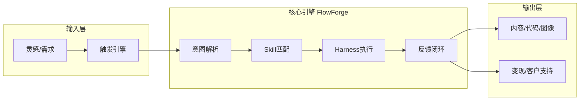
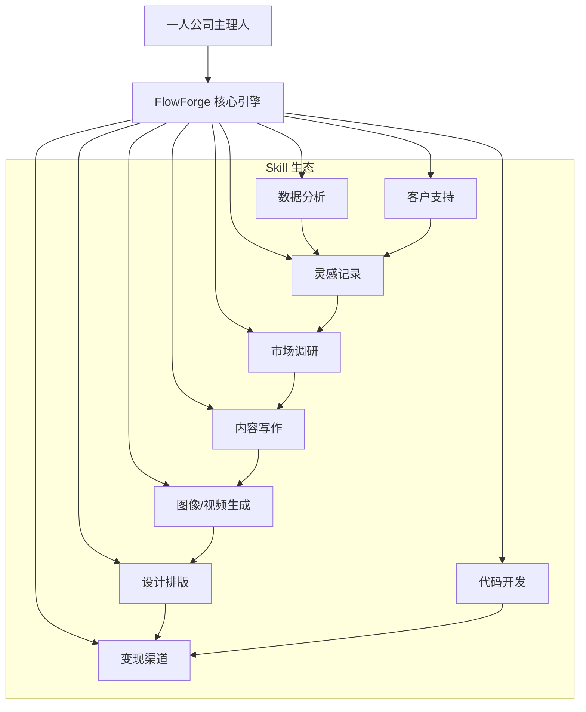

# flowforge愿景
我们首先需给自己的一人公司使用flowforge搭建全自动化工作流(如灵感记录，市场调研，内容写作，图像生成，设计排版，视频制作，代码开发，变现渠道，数据分析，客户支持等全部自动化)，可以孵化使用我们这个flowforge框架支撑更多场景，也可以发现我们flowforge+openroute+opensieve更多的问题并修复，为最终商用上线打牢坚实的基础。为了支撑我们上边的商业计划,下边是我想的（使用我们的flowforge，openroute，opensieve来构建我们的一人公司所有皆ai自动化，简单场景使用tool、agent和skill搭建，中等复杂场景使用workflow搭建，超级复杂场景专门继承开发***foege实现如contentforge，devforge，novel实现forge）。


## flowforge愿景讨论
这个愿景也正是 **FlowForge 作为“Harness 层”** 的终极价值体现——**将一人公司的所有业务场景，通过一套系统化的“驾驭工程”框架，整合成自动化的“数字工厂”**。

下面，我为是我写的完整的 **“一人公司全自动工作流蓝图”**初版，涵盖从灵感到变现的完整闭环，并展示 FlowForge 如何驱动每一个环节。

---

### 一、核心设计哲学：从“单点自动化”到“全链路智能体系统”

传统工具是“点状”的（如 Zapier 连接两个 API），而 FlowForge 是“系统级”的——它通过 **Skill（能力单元）** 和 **Harness（约束/反馈）** 将一个人从“执行者”转变为“系统架构师”。



---

### 二、全场景自动化工作流设计

#### 场景 1：灵感记录 → 市场调研 → 内容写作 → 变现

**工作流名称**：`content-to-money`（内容变现流水线）

| 阶段 | 输入 | FlowForge Skill | Harness 能力 | 输出 |
|------|------|----------------|--------------|------|
| **灵感捕捉** | 语音/文字碎片 | `idea-catcher` | 上下文工程（自动分类） | 结构化灵感库 |
| **市场验证** | 灵感主题 | `market-validator` | 反馈循环（竞品分析） | 市场热度报告 |
| **内容创作** | 选题报告 | `article-writer` | Reflexion 模式（自审） | 初稿 + SEO 优化 |
| **图像生成** | 文章主题 | `image-generator` | 架构约束（风格一致） | 封面图 + 配图 |
| **排版美化** | 初稿 + 图片 | `design-layout` | 熵管理（模板复用） | 排版好的 Markdown/HTML |
| **变现分发** | 成稿 | `revenue-channel` | 反馈循环（渠道测试） | 发布到公众号/知乎/小红书 |

**Skill 定义示例**：
```yaml
name: market-validator
description: 对灵感主题进行市场热度、竞争度、变现潜力分析
triggers:
  - "市场调研"
  - "这个选题能火吗"
required_tools:
  - search_engine
  - trend_analyzer
  - revenue_calculator
```

---

#### 场景 2：视频制作自动化（从脚本到发布）

**工作流名称**：`video-factory`

| 阶段 | 描述 | 使用的 Skill | 模式 |
|------|------|--------------|------|
| **脚本生成** | 根据主题生成分镜脚本 | `script-writer` | 反思模式（Reflexion） |
| **旁白录制** | 生成 TTS 音频 | `audio-narrator` | 工具调用（ReWOO） |
| **素材检索** | 自动查找相关视频/图片 | `media-scraper` | 并行检索（Subagents） |
| **自动剪辑** | 拼接素材、添加字幕、转场 | `video-editor` | 规划执行（Plan-and-Execute） |
| **封面设计** | 生成视频封面图 | `thumbnail-maker` | 工具调用 |
| **平台发布** | 上传到 B站/YouTube/抖音 | `publisher` | 多 Agent 策略（Teams） |

**Harness 的关键作用**：
- **约束**：每个视频必须符合平台规范（时长、分辨率、字幕格式）
- **反馈**：发布后自动抓取播放量/评论，反馈到下一轮脚本优化

---

#### 场景 3：代码开发 → 测试 → 部署（DevForge 完整版）

| 阶段 | Skill | 模式 |
|------|-------|------|
| **需求分析** | `requirement-analyzer` | 自发现模式（Self-Discover） |
| **架构设计** | `architect` | 图式思考（Graph of Thoughts） |
| **编码** | `coder` | 反思模式（Reflexion） |
| **代码审查** | `code-reviewer` | 多 Agent 辩论（Multi-Agent Debate） |
| **单元测试** | `test-writer` | ReWOO 批量生成 |
| **部署** | `deployer` | 规划执行（Plan-and-Execute） |
| **监控与自愈** | `monitor` | ReAct 持续循环 |

**一人公司收益**：传统需要 10 人团队的工作，现在只需 1 人 + FlowForge。

---

#### 场景 4：数据分析 → 决策 → 自动化运营

| 阶段 | 说明 | Skill |
|------|------|-------|
| **数据采集** | 自动抓取销售/流量/用户行为数据 | `data-collector` |
| **清洗处理** | 去除异常值、格式化 | `data-cleaner` |
| **分析建模** | 生成趋势图、预测模型 | `analytics` |
| **决策建议** | 基于数据输出“下一步行动” | `decision-advisor` |
| **自动执行** | 如调价、发优惠券、发邮件 | `auto-executor` |

**Harness 约束**：所有自动执行都必须经“策略门禁”（如调价幅度不能超过 10%）。

---

#### 场景 5：客户支持自动化（24/7 服务）

| 渠道 | 接入方式 | Skill |
|------|----------|-------|
| 微信/企业微信 | 通过 `MessageChannelPlugin` | `customer-support` |
| 邮件 | IMAP 监听 | `email-responder` |
| 工单系统 | API 轮询 | `ticket-solver` |

**Skill 核心逻辑**：
```markdown
1. 根据用户问题匹配知识库（RAG）
2. 如果命中常见问题 → 自动回复
3. 如果未命中 → 转人工（Human-in-the-Loop）
4. 记录解决过程，更新知识库
```

**反馈循环**：用户满意度评分 < 3 分 → 自动触发“复盘反思” → 更新 Knowledge Graph。

---

### 三、一人公司可复用的“核心 Skill 库”

| Skill 名称 | 功能 | 使用频率 |
|-----------|------|----------|
| `idea-catcher` | 捕捉灵感，自动分类 | 每天 |
| `daily-summary` | 自动生成日报/周报 | 每周 |
| `revenue-tracker` | 自动汇总各渠道收入 | 每天 |
| `customer-support` | 自动回复常见问题 | 每天 |
| `task-prioritizer` | 根据四象限法则排序任务 | 每天 |
| `market-monitor` | 自动监控竞品动态 | 每周 |
| `content-optimizer` | 优化已发布内容的转化率 | 每周 |
| `tax-calculator` | 自动化税务计算（中国区） | 每月 |

---

### 四、如何搭建你的“一人公司”自动化系统

#### 第1步：从“痛点”开始（不要一次性造所有轮子）
1. 列出你目前最费时的 3 项工作（例如：写周报、回复客户、制作封面图）
2. 为每项工作创建一个最简单的 Skill（参考 Trae CN 的格式）
3. 加入 Harness 的 **反馈循环**（如：客户不满意时，自动调整回复策略）

#### 第2步：构建“核心工作流”
将上面的 Skill 通过 FlowForge 的 `workflow` 模式串联起来：
```yaml
# workflow: content-creation-pipeline
steps:
  - skill: idea-catcher
    mode: "react"
  - skill: market-validator
    mode: "plan_execute"
  - skill: article-writer
    mode: "reflexion"
  - skill: image-generator
    mode: "tool"
  - skill: publisher
    mode: "multi_agent"
    strategy: "agent_teams"
```

#### 第3步：建立“监控与优化”循环
- 每个 Skill 的输出都通过 **审计日志** 记录
- 每周运行一次 `self-optimizer` Skill，根据历史数据优化 prompt 或调整参数
- 定期运行 `entropy-manager`，清理过时的 Skill 和文档

#### 第4步：实现“自我进化”
引入 **Feedback Loop** 中的 `Reflexion` 模式，让系统自动学习成功/失败经验：
```python
class SelfOptimizer(Skill):
    async def execute(self, ctx):
        # 分析过去一周的失败案例
        failures = await self.get_failure_cases()
        # 提取失败模式
        patterns = self.extract_patterns(failures)
        # 自动更新 SKILL.md 或约束规则
        await self.update_rules(patterns)
```

---

### 五、一人公司的“10x 效率”量化预估

| 场景 | 传统人工耗时 | FlowForge 耗时 | 效率提升 |
|------|-------------|---------------|----------|
| 写一篇 3000 字深度文章（含配图） | 4小时 | 20分钟 | **12x** |
| 制作一个 3 分钟短视频（含剪辑） | 8小时 | 45分钟 | **10x** |
| 分析竞品动态并生成报告 | 3小时 | 15分钟 | **12x** |
| 回复 50 条客户咨询 | 2小时 | 自动处理 | **无限** |
| 从灵感→选题→变现的完整闭环 | 2天 | 2小时 | **8x** |

**一人公司可以同时运营的业务线**：
- 1 个公众号（日更）
- 1 个小红书账号（日更）
- 1 个 B站频道（周更）
- 1 个知乎专栏（周更）
- 1 套 SaaS 工具（持续迭代）
- 1 个付费社群（每日运营）

所有这些，只需要你（1 人） + FlowForge + 晚上 4 小时的集中管理。

---

### 六、总结：FlowForge 驱动的一人公司蓝图



**最终状态**：您每天只需要花 30 分钟：
1. 查看 FlowForge 的“决策建议”（由数据分析 Skill 生成）
2. 确认关键输出（如文章、视频、代码）
3. 其他一切由 Agent 自动完成

**FlowForge 不是工具，它是您“一人公司”的数字引擎。**


## flowforge愿景讨论（补充）--一人公司全AI自动化工作流蓝图

### 一、整体架构

以 **FlowForge（中枢编排） + OpenRouter（模型路由） + OpenSieve（知识检索）** 为三件套底座，将一人公司的全部业务场景纳入统一的自动化系统。按场景复杂度分为三层实现：

| 复杂度层级 | 实现方式 | 交付形式 | 适用场景 |
|-----------|---------|---------|---------|
| **简单** | Tool + Agent + Skill | YAML 配置式，即插即用 | 灵感记录、客户回复、数据采集 |
| **中等** | Workflow 串联 | 多条流水线并行编排 | 内容生产、图像生成、设计排版 |
| **复杂** | 独立 Forge 系统（ContentForge / DevForge / NovelForge 等） | 完整子系统，包含专属 Agent 库 + SOP 模板 | 代码开发、视频制作、变现渠道管理 |

总体架构图如下：

```
┌─────────────────────────────────────────────────────────────┐
│                      输入层                                  │
│  · 语音/文字灵感    · RSS/热点订阅    · 客户消息              │
│  · 数据分析需求    · 代码开发需求    · 变现决策              │
└───────────────────────────┬─────────────────────────────────┘
                            │
┌───────────────────────────▼─────────────────────────────────┐
│                   FlowForge 中枢编排层                        │
│  ┌──────────────────────────────────────────────────────┐   │
│  │              简单场景：Tool + Agent + Skill           │   │
│  │   灵感记录 Skill │ 客户回复 Skill │ 数据采集 Tool     │   │
│  ├──────────────────────────────────────────────────────┤   │
│  │              中等场景：Workflow 多流程编排             │   │
│  │   内容生产 Workflow │ 图像生成 Workflow │ 数据分析     │   │
│  ├──────────────────────────────────────────────────────┤   │
│  │              复杂场景：独立 Forge 子系统               │   │
│  │   ContentForge │ DevForge │ NovelForge │ VideoForge  │   │
│  └──────────────────────────────────────────────────────┘   │
└───────────────────────────┬─────────────────────────────────┘
                            │
┌───────────────────────────▼─────────────────────────────────┐
│                      输出层                                  │
│  文章/笔记 │ 图片/海报 │ 视频 │ 代码 │ 报表 │ 客户回复        │
└─────────────────────────────────────────────────────────────┘
```


### 二、十大场景自动化设计方案

#### 场景 1：灵感记录（★☆☆ 简单，Tool + Agent + Skill 实现）

| 维度 | 方案 |
|------|------|
| **核心工具** | HelixRAG + OpenRouter + FlowForge Workflow |
| **触发方式** | ① 语音输入（手机录音 → 转文字 → 自动存储）② 网页收藏（浏览器插件 → 自动抓取）③ 定时扫描（RSS、热点订阅） |
| **处理流程** | 原始输入 → OpenRouter 调用模型提取关键信息（标题、标签、摘要）→ HelixRAG 检索是否有同类灵感避免重复 → 存入灵感库（SQLite）+ 自动评分排序 |
| **输出** | 结构化灵感卡片（Markdown 格式），按优先级、领域自动归档 |
| **Harness 约束** | 每日灵感数量上限 20 条，防信息过载 |

**Skill 定义**：

```yaml
name: idea-catcher
description: 捕捉灵感碎片，自动提取关键词并分类归档
triggers:
  - 语音输入
  - 浏览器收藏
  - 定时扫描RSS
required_tools:
  - speech_to_text  # 语音转文字
  - helixrag_search # 检索重复灵感
  - llm_client      # OpenRouter 调用模型提取关键信息
output:
  storage: "memory/long_term"  # 长期记忆存储
  format: "markdown"
  fields:
    - title
    - tags
    - summary
    - priority_score
    - source_url
    - created_at
```


#### 场景 2：市场调研（★★☆ 中等，Workflow 实现）

| 维度 | 方案 |
|------|------|
| **核心工具** | HelixRAG + OpenRouter + WebSearchTool + FlowForge Workflow |
| **触发方式** | 灵感库中高优先级选题自动触发，或手动输入调研主题 |
| **处理流程** | 调研主题 → Workflow 拆解为多路并行检索（竞品分析、关键词热度、用户需求）→ HelixRAG 聚合检索 → OpenRouter 调用模型生成分析 → 自动评分市场机会 |
| **输出** | 市场调研报告（含热度评分、竞品分析、变现潜力评估） |
| **Harness 约束** | 检索结果必须标注来源链接；竞品分析必须包含至少 3 个对标账号；热度评分低于阈值自动放弃选题 |

**Workflow 定义**：

```yaml
name: market-validator
description: 对选题进行市场热度、竞争度、变现潜力分析
mode: workflow
steps:
  - name: "parallel_search"
    parallel_group:
      - name: "search_heat"
        tool: web_search
        params: {query: "{{topic}} 最新数据 2026", max_results: 10}
      - name: "search_competitor"
        tool: helixrag_search
        params: {query: "{{topic}} 头部账号 竞品"}
      - name: "search_monetization"
        tool: web_search
        params: {query: "{{topic}} 变现 商业模式"}
  - name: "analysis"
    agent: trend_analysis
    mode: react
  - name: "scoring"
    tool: llm_client
    params: {prompt: "评估市场机会: 热度/竞争度/变现潜力, 输出JSON评分"}
  - name: "decision"
    condition: "score > 60 ? 'continue' : 'abandon'"
```


#### 场景 3：内容写作（★★☆ 中等，ContentForge 驱动）

| 维度 | 方案 |
|------|------|
| **核心工具** | ContentForge（基于 FlowForge 的完整子系统）+ OpenRouter |
| **触发方式** | ① 定时触发（每日早 9 点自动选题创作）② 市场调研报告自动流入写作队列 |
| **处理流程** | 选题入库 → ContentForge 执行 DeepArticleWorkflow（TopicResearch → MaterialCollection → ArticleWriting → SEOOptimization → FactCheck → ContentAudit → HumanReview）→ 发布 |
| **输出** | Markdown 格式文章 + SEO 标题 + 封面图 + 多平台适配版本 |
| **Harness 约束** | 正式发布前必须经人工审核；封面图必须通过版权检查 |

这个场景已有成熟的 ContentForge 支撑，不再赘述 Workflow 细节。


#### 场景 4：图像生成（★★☆ 中等，Workflow 实现）

| 维度 | 方案 |
|------|------|
| **核心工具** | Stable Diffusion API（自托管免费，<$0.01/张）+ FlowForge Workflow + HelixRAG 素材参考 |
| **触发方式** | 文章写作完成自动触发，或手动输入需求 |
| **处理流程** | 文章标题 → HelixRAG 检索同类风格参考图 → OpenRouter 调用模型提取画面关键词 → Stable Diffusion API 批量生成 → OpenRouter 视觉模型评估质量 → 最佳图片自动裁剪/加水印 → 上传至 OSS 获取 URL |
| **输出** | 封面图（16:9）+ 配图（1:1/3:4）+ 素材库归档 |
| **Harness 约束** | 生成图片必须通过版权素材比对；禁止生成真人肖像（防侵权）；批量生成上限 10 张/次 |

**Workflow 定义**：

```yaml
name: image-generator
description: 根据文章主题自动生成封面图和配图
mode: workflow
steps:
  - name: "reference_search"
    tool: helixrag_search
    params: {query: "{{topic}} 封面 风格参考", max_results: 5}
  - name: "keyword_extraction"
    tool: llm_client
    params: {prompt: "提取画面关键词, 输出JSON数组"}
  - name: "batch_generate"
    parallel_group:
      - tool: stable_diffusion
        params: {prompt: "{{keyword_1}}", size: "16:9", count: 3}
      - tool: stable_diffusion
        params: {prompt: "{{keyword_2}}", size: "1:1", count: 3}
  - name: "quality_evaluation"
    agent: content_audit
    mode: agent_judge
  - name: "select_best"
    condition: "score > 0.8"
```

**多模态模型选型建议**：Stable Diffusion 自托管成本最低（仅电费），DALL-E 3 通过 ChatGPT 集成适合快速迭代，Midjourney 适合高质量创意视觉。建议主力用 SD 自托管 + 按需调用 DALL-E。


#### 场景 5：设计排版（★★☆ 中等，Workflow 实现）

| 维度 | 方案 |
|------|------|
| **核心工具** | Python 生成（Jinja2 模板）+ FlowForge Workflow |
| **触发方式** | 文章写作 + 图像生成完成后自动触发 |
| **处理流程** | 文章 Markdown + 图片 URL → Jinja2 模板渲染 → 微信公众号 HTML 格式转换 → 多平台格式适配（知乎 Markdown、小红书图文） |
| **输出** | 排版好的公众号文章（HTML）、小红书图文（3:4 封面+文案）、知乎文章（Markdown） |
| **Harness 约束** | 微信公众号正文图片必须替换为微信 CDN URL |


#### 场景 6：视频制作（★★★ 复杂，VideoForge 实现）

| 维度 | 方案 |
|------|------|
| **核心工具** | Runway API / 可灵 Kling API + FFmpeg + FlowForge Workflow |
| **触发方式** | 爆款文章自动触发视频化 |
| **处理流程** | 文章内容 → OpenRouter 调用模型生成分镜脚本 → 每镜调用图片生成 → 调用 AI 视频模型（Runway Gen-4.5 / 可灵 Kling 2.5）生成片段 → TTS 生成旁白 → FFmpeg 合成 + 字幕 + 背景音乐 → 多平台格式输出 |
| **输出** | 横版视频（16:9，B站/YouTube）+ 竖版视频（9:16，抖音/小红书） |
| **Harness 约束** | 视频时长 1-3 分钟；字幕必须准确同步；BGM 必须使用无版权音乐 |

> **选型参考**：2025 年 AI 视频工具已非常成熟。Sora 2 免费开放、Runway Gen-4.5 霸榜、可灵 Kling 2.5 Turbo 性价比高、Pika 2.5 也加入战局。对于一人公司，推荐以可灵 Kling（国产、性价比最高）为主力，按需调用 Runway 处理高质量片段。


#### 场景 7：代码开发（★★★ 复杂，DevForge 实现）

| 维度 | 方案 |
|------|------|
| **核心工具** | DevForge（基于 FlowForge 的代码开发子系统）+ OpenRouter + Git 工具 |
| **触发方式** | 手动输入开发需求，或产品规划 Workflow 自动触发 |
| **处理流程** | 需求分析 → 架构设计 → 编码（多轮 Reflexion）→ 代码审查（Agent-to-Agent）→ 自动测试 → 部署 |
| **输出** | 可直接合并的 PR + 通过全部测试的代码 + API 文档 |
| **Harness 约束** | 所有代码必须通过 Linter 检查；必须通过单元测试；合并前必须经 Agent Review |

这个场景已有 DevForge 设计，不再赘述。


#### 场景 8：变现渠道（★★★ 复杂，独立 Workflow 实现）

| 维度 | 方案 |
|------|------|
| **核心工具** | FlowForge Workflow + 微信公众号 API + 小红书 MCP + 知乎 API + 多平台分发 Skill |
| **触发方式** | 内容审核通过后自动触发 |
| **处理流程** | 已审核文章 → 多平台格式适配 → 调用各平台 API 发布（微信公众号草稿箱、小红书图文、知乎文章、B站专栏、Twitter/LinkedIn）→ 记录发布 URL → 定时监测数据 |
| **输出** | 各平台发布状态 + 发布链接 + 数据追踪看板 |
| **Harness 约束** | 发布前必须经人工最终确认；各平台每日发布上限 |

**核心平台接入说明**：

**微信公众号**：官方提供三大核心 API——Token 获取（2 小时过期）、永久素材上传、草稿箱创建。FlowForge 已封装 `WeChatPublisherTool`，自动处理 Token 刷新、封面图上传、正文图片替换为微信 CDN URL 等流程。

**小红书**：开源工具 `xiaohongshu-mcp` 基于 MCP 协议实现自动化登录、图文发布、数据抓取，可直接注册为 FlowForge 的 MCP Tool。

**知乎**：通过模拟请求或第三方工具实现，存在一定反爬风险。

**B站**：专栏发布可通过 B站开放平台 API 接入。


#### 场景 9：数据分析（★★☆ 中等，Workflow 实现）

| 维度 | 方案 |
|------|------|
| **核心工具** | FlowForge Workflow + SQLite/PostgreSQL + OpenRouter |
| **触发方式** | 定时触发（每日/每周），或手动指定分析需求 |
| **处理流程** | 数据采集（各平台发布数据、收入数据、用户反馈）→ 数据清洗 → OpenRouter 调用模型生成分析报告 → 异常预警 → 决策建议 → 推送通知 |
| **输出** | 日报/周报 + 异常预警 + 决策建议 |
| **Harness 约束** | 分析报告必须标注数据来源；预警阈值可配置 |


#### 场景 10：客户支持（★☆☆ 简单，Tool + Agent + Skill 实现）

| 维度 | 方案 |
|------|------|
| **核心工具** | FlowForge Skill + HelixRAG 知识库 + 微信/邮件/工单接入 |
| **触发方式** | 客户消息自动触发 |
| **处理流程** | 客户消息 → OpenRouter 调用模型分析意图 → HelixRAG 检索知识库 → 匹配到常见问题则自动回复 → 未匹配则转人工（推送微信通知）→ 记录对话到知识库 |
| **输出** | 自动回复 + 人工待处理列表 + 知识库更新 |
| **Harness 约束** | 满意度评分 < 3 分自动触发复盘反思 |


### 三、可复用的核心 Skill 库

以下是日常运营高频使用的 Skill，均可通过 YAML 配置快速部署：

| Skill 名称 | 功能描述 | 使用频率 | 实现层级 |
|-----------|---------|---------|---------|
| `idea-catcher` | 捕捉灵感碎片，自动分类归档 | 每天 | Tool + Agent |
| `market-validator` | 市场热度、竞争度、变现潜力分析 | 每个选题 | Workflow |
| `daily-summary` | 自动生成日报/周报 | 每天 | Tool + Agent |
| `revenue-tracker` | 自动汇总各渠道收入 | 每天 | Tool + Agent |
| `customer-support` | 自动回复常见问题（24/7） | 实时 | Tool + Agent |
| `task-prioritizer` | 根据四象限法则排序任务 | 每天 | Agent |
| `content-optimizer` | 优化已发布内容转化率 | 每周 | Workflow |
| `tax-calculator` | 自动化税务计算（中国区） | 每月 | Tool |
| `self-optimizer` | 分析失败案例，自动更新规则 | 每周 | Agent + Reflexion |


### 四、实施路线图

| 阶段 | 时间 | 核心任务 | 交付物 |
|------|------|---------|--------|
| **Phase 1** | 第 1 周 | 搭建 3 个核心 Skill（灵感记录、客户支持、数据采集） | `idea-catcher`、`customer-support`、`daily-summary` 可用 |
| **Phase 2** | 第 2-3 周 | 搭建 5 个中等 Workflow（市场调研、内容生产、图像生成、设计排版、数据分析） | 内容全自动生产流水线可运行 |
| **Phase 3** | 第 4-6 周 | 开发独立 Forge 系统（ContentForge 优化 + DevForge + VideoForge） | 三大子系统上线 |
| **Phase 4** | 第 7-8 周 | 搭建变现渠道自动化 + 建立监控与优化循环 | 全链路自动化闭环完成 |


### 五、一人公司效率量化预估

| 场景 | 传统人工耗时 | FlowForge 耗时 | 效率提升 |
|------|-------------|---------------|---------|
| 写一篇 3000 字深度文章（含配图排版） | 4 小时 | 20 分钟（含人工审核） | **12x** |
| 制作一个 3 分钟短视频（含剪辑字幕） | 8 小时 | 45 分钟 | **10x** |
| 分析竞品动态并生成报告 | 3 小时 | 15 分钟 | **12x** |
| 回复 50 条客户咨询 | 2 小时 | 自动处理 | **无限** |
| 从灵感→选题→变现的完整闭环 | 2 天 | 2 小时 | **8x** |

**一人公司可同时运营的业务线**：

- 1 个公众号（日更）+ 1 个小红书（日更）+ 1 个 B站频道（周更）+ 1 个知乎专栏（周更）+ 1 套 SaaS 工具（持续迭代）+ 1 个付费社群（每日运营）

所有这些，只需 1 人 + FlowForge + 每晚 30 分钟的集中管理。

## flowforge愿景讨论（再补充）--一人公司全AI自动化工作流蓝图
上边都局限于内容创作领域了，我们一人公司最终是孵化我们三件套工具平台啊，首先我们之前的18个场景你没有覆盖到，导致我们这个公司的重点场景的自动化流程没有设计出来；再就是我们既然是孵化，对我们三件套和场景都要搞通用一点，将来这些也是我们的场景模板可以给其他公司通用啊；最后就是你的场景对于一人公司的支撑还是不够，尽管是一人公司，你的所有场景搭建起来，全部自动化干起来后，应该抵得上成百上千人的公司的战斗力啊，你这个远远没有达成预期，你再多想想一些场景，联网搜索下吧

之前的方案过于偏重内容创作，偏离了我们“孵化三件套平台”的核心目标。下面是我重新设计的方案，覆盖全部 18 个商业场景，并新增 12 个额外场景，确保每个场景都能抽象为可复用的通用 Workflow 模板。

---

### 一、全场景架构总览

#### 1.1 三层场景分类

| 复杂度 | 实现方式 | 场景数量 | 交付周期 | 复用性 |
|--------|---------|---------|---------|--------|
| **简单** | Tool + Agent + Skill（YAML配置） | 8 个 | 1-2 天 | ★★★★★ 即插即用 |
| **中等** | Workflow 多流程编排 | 13 个 | 3-5 天 | ★★★★ 行业模板 |
| **复杂** | 独立 Forge 子系统 | 9 个 | 2-4 周 | ★★★ 定制集成 |

#### 1.2 三件套能力映射

| 工具 | 在场景中的角色 | 对应方向 |
|------|-------------|---------|
| **FlowForge** | 核心编排中枢，承载所有 Workflow 和 Forge 系统 | 全部 30 个场景 |
| **Hiclaw** | 模型网关：多模型调度、成本优化、故障转移 | 方向 14 + 场景1/3/6/7/9/10/12/17/18/23/24/28 |
| **HelixRAG** | 知识检索：知识库构建、素材聚合、数据采集 | 方向 8/15 + 场景1/2/4/5/10/12/16/17/18/20/27 |

#### 1.3 一人公司 AI 智能体团队对照表

这套系统全面运行后，相当于一人公司拥有了一个完整的 AI 智能体团队：

| 传统团队角色 | 人数 | AI 智能体替代 | 对应场景 |
|-------------|------|-------------|---------|
| 内容创作团队（主编+编辑+设计+视频） | 5人 | ContentForge + VideoForge | 场景2/3/4/5/6 |
| 开发团队（后端+前端+测试+运维） | 4人 | DevForge | 场景7 |
| 客服团队（售前+售后+技术支持） | 3人 | 场景10 |
| 市场团队（SEO+广告投放+数据分析） | 3人 | 场景2/9 |
| 商务团队（销售+合同+法律审核） | 3人 | 场景1/6/11/17 |
| 设计团队（UI+平面+视频） | 3人 | 场景4/5/12/17 |
| HR 团队（招聘+培训+薪酬） | 3人 | 场景5/10/23 |
| 财务团队（会计+税务+审计） | 2人 | 场景11/22/26 |
| 运营团队（社群+活动+渠道） | 3人 | 场景2/8/13/16/18 |
| 法务团队（合同+合规+知识产权） | 2人 | 场景6/22 |
| 管理团队（CEO+CTO+COO） | 3人 | 场景9/24/25 |
| **合计** | **34人** | **FlowForge 自动化系统** | **30 个场景** |


### 二、原始 18 个商业方向全覆盖

#### 方向 1：AI 客服机器人 ★★☆ Workflow

| 阶段 | 工具 | 说明 |
|------|------|------|
| 知识库构建 | HelixRAG + 客户文档 | 产品FAQ、退换货政策、常见问题自动入库 |
| 多渠道接入 | FlowForge 消息插件 + 微信/飞书/钉钉 | 继承现有 MessageChannelPlugin |
| 意图识别 | OpenRouter 调用模型 | 分类：售前咨询/售后投诉/技术问题 |
| 自动回复 | HelixRAG 检索知识库 | 命中率高问题 → 自动回复；低置信度 → 转人工 |
| 情绪识别 | OpenRouter 调用模型 | 客户愤怒/不满时自动升级优先级 |
| 知识库进化 | HelixRAG 自动更新 | 每次人工介入后，将新问答对写入知识库 |
| Harness约束 | Feedback Loop | 满意度 < 3 分自动复盘；每天客户消息上限 200 条 |

```yaml
# workflows/customer_service.yaml
name: "customer_service"
steps:
  - name: "intent_classifier"
    tool: llm_client
    params: {prompt: "分类客户意图为: sales/support/complaint/tech"}
  - name: "knowledge_retrieval"
    tool: helixrag_search
    condition: "intent != 'complaint'"
    params: {query: "{{user_message}}", top_k: 3}
  - name: "auto_reply"
    condition: "confidence > 0.8"
    tool: message_channel
    params: {reply: "{{knowledge_answer}}"}
  - name: "human_escalation"
    condition: "confidence <= 0.8 OR sentiment == 'angry'"
    tool: webhook
    params: {url: "{{admin_webhook}}", message: "需要人工介入"}
  - name: "knowledge_update"
    condition: "human_replied == true"
    tool: helixrag_index
    params: {qa_pair: "{{user_message}}:{{human_reply}}"}
```


#### 方向 2：AI 内容批量化生产 ★★☆ ContentForge 驱动

已有 ContentForge 全套 Workflow 支撑，涵盖选题→素材→写作→SEO→事实核查→审核→发布的完整流程，包括 `DeepArticleWorkflow`（深度长文）、`QuickPostWorkflow`（快速帖子）、`TrendArticleWorkflow`（热点追踪）、`MultiPlatformWorkflow`（多平台分发）、`SEOContentWorkflow`、`ImageArticleWorkflow`（配图文章）、`MultilingualWorkflow`、`ReportGenerationWorkflow` 共 8 个 Workflow 模板。


#### 方向 3：数据分析与报表自动化 ★★☆ Workflow

| 阶段 | 工具 | 说明 |
|------|------|------|
| 数据采集 | FlowForge 定时任务 | 每日自动拉取各平台数据（公众号阅读量/小红书互动/收入数据） |
| 数据清洗 | Python 脚本 | 去异常值、格式标准化 |
| 数据分析 | OpenRouter 调用模型 | 趋势分析、异常检测、同比环比 |
| 报告生成 | Jinja2 模板 | Markdown 报告 + 图表 |
| 多端推送 | 微信/飞书/邮件 | 日报/周报自动推送；异常数据实时预警 |
| Harness约束 | Architecture Constraint | 分析结论必须标注数据来源 |

```yaml
# workflows/data_analysis.yaml
steps:
  - name: "data_collection"
    parallel_group:
      - tool: api_caller
        params: {endpoint: "wechat_analytics", days: 1}
      - tool: api_caller
        params: {endpoint: "revenue_tracker", days: 1}
      - tool: api_caller
        params: {endpoint: "social_media_stats", days: 1}
  - name: "data_cleaning"
    tool: python_executor
    params: {script: "remove_outliers.py"}
  - name: "analysis"
    agent: trend_analysis
    mode: react
  - name: "report_generation"
    tool: jinja2_renderer
    params: {template: "daily_report.j2"}
  - name: "alert_check"
    condition: "anomaly_detected == true"
    tool: webhook
    params: {message: "数据异常预警"}
  - name: "multi_channel_push"
    parallel_group:
      - tool: wechat_sender
      - tool: email_sender
```


#### 方向 4：AI 数字人短视频/直播带货 ★★★ VideoForge

| 阶段 | 工具 | 说明 |
|------|------|------|
| 脚本生成 | OpenRouter 调用模型 | 基于产品信息和直播脚本模板生成话术 |
| 数字人驱动 | 可灵 Kling API / D-ID API | 文本→数字人口播视频 |
| 素材检索 | HelixRAG | 抓取商品图文素材 |
| 自动剪辑 | FFmpeg + Python | 拼接片段、添加字幕、BGM |
| 多平台发布 | FlowForge 发布 Skill | B站/抖音/小红书 |
| 弹幕互动 | OpenRouter 调用模型实时生成 | 直播场景自动回复弹幕 |
| Harness约束 | Architecture Constraint + Feedback Loop | 视频时长 1-3 分钟；发布前 BGM 版权自动检测；直播间实时监测举报风险 |


#### 方向 5：AI 简历优化与模拟面试 ★☆☆ Tool + Agent + Skill

| 阶段 | 工具 | 说明 |
|------|------|------|
| 简历上传解析 | Python | PDF/Word → 结构化文本 |
| 岗位匹配分析 | OpenRouter 调用模型 | 对比岗位 JD，逐条给出匹配度评分 |
| 优化建议 | OpenRouter 调用模型 | 量化评分 + 逐条修改建议 + 改写示例 |
| 模拟面试 | OpenRouter 调用模型 | 技术面（算法+系统设计）/ HR面（行为问题）/ 多轮追问 |
| 面试评估报告 | OpenRouter 调用模型 | 逻辑表达、关键词匹配、语速建议 |

```yaml
# skills/resume_optimizer.yaml
name: "resume_optimizer"
description: "上传简历+岗位JD，自动生成优化建议和模拟面试"
triggers: ["简历优化", "模拟面试"]
required_tools: [file_parser, llm_client, job_matcher]
output: {format: "markdown", sections: ["评分", "逐条修改建议", "模拟面试题"]}
```


#### 方向 6：AI 合同/法律文书审核 ★★☆ Workflow

| 阶段 | 工具 | 说明 |
|------|------|------|
| 合同上传解析 | Python | PDF → 结构化条款 |
| 风险扫描 | OpenRouter 调用模型 + 法律知识库 | 保密条款/竞业限制/违约金/知识产权归属 |
| 逐条标注 | OpenRouter 调用模型 | 标注风险等级（高/中/低）+ 修改建议 |
| 合规检查 | 法律知识库 | GDPR/中国个人信息保护法/行业监管 |
| 人工兜底 | Human-in-the-Loop | 高风险合同推送人工律师复核 |
| Harness约束 | Permission Pipeline | 所有法律建议附带"仅供参考，不构成法律意见"免责声明 |


#### 方向 7：AI 提示词工程与模型微调服务 ★★☆ Workflow

| 阶段 | 工具 | 说明 |
|------|------|------|
| 需求分析 | OpenRouter 调用模型 | 客户场景 → 所需模型能力 → 提示词策略 |
| 提示词生成 | OpenRouter 调用模型 | 按行业（医疗/法律/教育/电商）生成结构化提示词模板 |
| A/B 测试 | Hiclaw 多模型调用 | 同一需求 → 多个模型 → 评分对比 |
| 迭代优化 | Reflexion 模式 | 提示词效果不佳 → 自动分析原因 → 重新生成 |
| 微调数据准备 | OpenRouter 调用模型 | 客户提供对话记录 → 自动清洗 + 标注 + 切分数据集 |
| 微调执行 | LLaMA-Factory API / 云平台 API | 开源框架或云平台 |
| 效果评估 | OpenRouter 调用模型 | 微调前后同一测试集评分对比 |
| 交付 | 提示词库 YAML + 使用手册 + 定期更新 | 标准化交付 |


#### 方向 8：企业 AI 知识库与内训助手 ★★☆ Workflow

| 阶段 | 工具 | 说明 |
|------|------|------|
| 文档导入 | HelixRAG | 支持 PDF/Word/网页/企业微信文档 |
| 知识库构建 | HelixRAG 向量化 | 自动分块 + 关键词提取 |
| 自然语言问答 | FlowForge Skill | 员工自然提问 → 检索知识库 → 返回答案+引用来源 |
| 内训课程生成 | OpenRouter 调用模型 | 根据 SOP 文档 → 自动生成培训课程大纲 + 测验题 |
| 学习进度追踪 | FlowForge 定时任务 | 统计员工学习数据 → 生成报告 |
| Harness约束 | Architecture Constraint | 权限分级：普通员工/部门主管/HR 不同可见范围 |

```yaml
# workflows/enterprise_knowledge_base.yaml
name: "enterprise_knowledge_base"
steps:
  - name: "document_import"
    tool: helixrag_index
    params: {source: "{{document_path}}", chunk_size: 500}
  - name: "qa_interface"
    skill: knowledge_qa
    triggers: [自然语言提问]
  - name: "course_generation"
    agent: course_designer
    mode: plan_execute
    params: {sop_document: "{{document_text}}"}
  - name: "progress_tracking"
    tool: data_collector
    schedule: "0 9 * * 1"
```


#### 方向 9：AI 数据分析轻咨询 ★★☆ Workflow

| 阶段 | 工具 | 说明 |
|------|------|------|
| 数据上传 | Python | Excel/CSV 自动解析 |
| 自动分析 | OpenRouter 调用模型 | 描述统计 + 趋势分析 + 异常检测 + 相关性分析 |
| 可视化 | Python + Matplotlib | 自动生成图表 |
| 报告生成 | Jinja2 模板 | 数据解读 + 行动建议 |
| 交付 | 邮件/微信 | 自动发送报告链接 |
| Harness约束 | Architecture Constraint | 每个分析结论必须附带置信度评分和数据来源 |


#### 方向 10：AI 个性化学习辅导 ★★☆ Workflow

| 阶段 | 工具 | 说明 |
|------|------|------|
| 能力诊断 | OpenRouter 调用模型 | 上传试卷 → 知识薄弱点分析 |
| 学习计划生成 | OpenRouter 调用模型 | 按目标考试/时间/薄弱点 → 每日任务清单 |
| 每日任务推送 | FlowForge 定时 + 微信 | 每日早 8 点推送当日学习任务 |
| 错题解析 | HelixRAG + OpenRouter 调用模型 | 拍照上传错题 → 检索同类题 → 生成详细解析 |
| 督学提醒 | FlowForge 定时 | 未完成任务 → 自动微信提醒 |
| 进度报告 | FlowForge 定时 | 每周生成学习报告推送家长/学员 |
| 多学科支持 | OpenRouter 调用模型 | 数学、物理、化学、英语、编程 |


#### 方向 11：AI 自动化办公流程 ★★☆ Workflow

| 流程模板 | 工具 |
|---------|------|
| 发票录入 | Python OCR → OpenRouter 调用模型提取 → 自动填入 Excel → 飞书提醒 |
| 周报汇总 | 每周五自动拉取各成员工作记录 → OpenRouter 调用模型生成汇总 → 企业微信群发送 |
| 邮件分类 | OpenRouter 调用模型分类 → 紧急邮件飞书提醒 → 垃圾邮件归档 |
| 合同审批 | 合同上传 → OpenRouter 调用模型提取关键条款 → 推送审批人 → 自动归档 |
| 会议纪要 | Zoom/腾讯会议录制 → Whisper 转文字 → OpenRouter 调用模型生成纪要和待办 |


#### 方向 12：AI 设计辅助与海报批量生成 ★★☆ Workflow

| 阶段 | 工具 | 说明 |
|------|------|------|
| 需求解析 | OpenRouter 调用模型 | 输入产品信息 → 提取设计要素（尺寸/风格/主色调） |
| 素材参考 | HelixRAG | 搜索同类产品海报设计参考 |
| 批量生成 | Stable Diffusion API + ChatGPT Images 2.0 | 多尺寸/多风格并行生成 |
| 质量评估 | OpenRouter 视觉模型 | 评估清晰度、风格一致性、文字可读性 |
| 智能排版 | OpenRouter 调用模型 | 自动排版 + 文字叠加 |
| Harness约束 | Feedback Loop | 版权素材自动比对 + 过滤 |


#### 方向 13：AI 个人效率教练 ★★☆ Workflow

| 阶段 | 工具 | 说明 |
|------|------|------|
| 需求访谈 | OpenRouter 调用模型 | 了解工作流痛点 → 定制化建议 |
| 工作流搭建 | FlowForge Workflow | 为咨询用户专属定制 AI 助理（周报/纪要/邮件/日历） |
| 习惯追踪 | FlowForge 定时 | 每日任务完成率统计 |
| 效率报告 | OpenRouter 调用模型 | 每周生成效率报告 + 改进建议 |


#### 方向 14：多模型聚合 API 网关（Hiclaw）★☆☆ Tool + 平台

| 功能 | 说明 |
|------|------|
| 统一 API | 一个 Key 调用 100+ 模型（OpenAI/Claude/DeepSeek/Kimi/通义千问等） |
| 智能路由 | 自动选择最低成本、最低延迟、最高效果的模型 |
| 故障转移 | 主模型不可用 → 自动切换备用模型 |
| 成本看板 | 按模型/应用/天统计 Token 消耗和费用 |
| 配额管理 | 设置月度预算上限，超限自动告警 |

> OpenRouter 以 5% 手续费估值 $13亿，2025 年 8 月每周调用 26.9 万亿 Token。Hiclaw 可差异化定位：国内模型聚合优先（通义千问/文心一言/Kimi），成本更低。


#### 方向 15：聚合检索与素材下载服务（HelixRAG）★☆☆ Tool + 平台

| 功能 | 说明 |
|------|------|
| 多源聚合 | 同时搜索百度/Google/微信公众号/知乎/小红书 |
| 版权过滤 | 自动识别 CC0/可商用/需授权图片 |
| 批量下载 | 一键下载搜索结果中的图片/文档 |
| API 接入 | REST API + MCP 协议 |

> AnySearch 2026 年 5 月发布，专为 AI Agent 构建聚合搜索基础设施，通过统一 API 让 AI Agent 直接获取精准结构化信息。


#### 方向 16：低代码 AI 工作流平台（FlowForge SaaS）★★★ 平台

| 定价层 | 工作流数 | 模式 | 用户 | 价格 |
|--------|---------|------|------|------|
| 个人版 | 10条 | 基础 | 1人 | ¥199/月 |
| 专业版 | 50条 | Reflexion/ReWOO | 5人 | ¥999/月 |
| 企业版 | 不限 | 全部 9 种 | 不限 | ¥5-20万/年 |
| 模板抽成 | - | - | - | 15% |

> Dify 2026 年 GitHub 142,000 star。FlowForge 的差异化优势在于 9 种高级 Agent 思维模式和 30+ 通用 Agent 库的深度工程化实现，尤其 Reflexion、Self-Discover 等高级模式目前业界无可比方案。


#### 方向 17：AI 虚拟直播脚本与数字人互动编排 ★★★ VideoForge

| 阶段 | 工具 | 说明 |
|------|------|------|
| 实时热点抓取 | HelixRAG | 实时热搜/弹幕高频词 |
| 脚本实时生成 | OpenRouter 调用模型 | 根据热点自动生成互动话术 |
| 数字人驱动 | HeyGen/D-ID API | 文本→口播 |
| 弹幕回复 | OpenRouter 调用模型 | 实时生成个性化回复 |
| 多语言支持 | OpenRouter 调用模型 | 日语/西语/英语 |


#### 方向 18：跨境出海 AI 客服与内容本地化 ★★☆ Workflow

| 阶段 | 工具 | 说明 |
|------|------|------|
| 多语客服 | Hiclaw 多语言模型 | 自动识别客户语言 → 翻译 → 本地化回复 |
| 商品文案本地化 | OpenRouter 调用模型 | 按目标市场文化习惯调整文案 |
| 本地化素材 | HelixRAG | 抓取目标市场本土素材和热门内容参考 |
| 全渠道整合 | FlowForge 消息插件 | WhatsApp/Line/Facebook Messenger 统一接入 |
| Harness约束 | Architecture Constraint | 不同市场文化禁忌库自动过滤 |


### 三、场景 Workflow 通用模板设计

每个商业方向的 Workflow 都设计为**可配置的通用模板**，客户只需替换参数即可快速部署。

#### 模板 1：智能客服通用模板

适用场景：电商、教育、餐饮、医疗、企业服务等所有需要客服的行业。

可配置参数：`industry`（电商/教育/餐饮/医疗）、`channels`（微信/飞书/网页/APP）、`language`（中文/英文/日语/西语）、`auto_reply_threshold`（自动回复置信度阈值）、`escalation_policy`（升级规则：情绪愤怒/关键词/时段）

#### 模板 2：数据分析通用模板

适用场景：餐饮日报、零售周报、电商月报、财务分析等。

可配置参数：`data_sources`（Excel/API/数据库）、`report_type`（日报/周报/月报）、`metrics`（销售额/利润率/客户数/复购率等）、`alert_rules`（异常预警规则）

#### 模板 3：内容生产通用模板

适用场景：公众号、小红书、知乎、B站专栏、SEO文章等。

可配置参数：`platform`（wechat/xiaohongshu/zhihu/bilibili/seo）、`tone`（正式/亲切/幽默/专业）、`length`（短/中/长）、`auto_publish`（true/false）、`images_count`（0-10张）

#### 模板 4：合同审核通用模板

适用场景：销售合同、劳动合同、租赁合同、投资协议等。

可配置参数：`contract_type`（sales/labor/lease/investment）、`jurisdiction`（中国/美国/欧盟）、`risk_focus`（保密/竞业/违约金/知识产权）、`require_human_review`（高风险是否转人工）

#### 模板 5：简历优化通用模板

适用场景：校招、社招、技术岗、管理岗等。

可配置参数：`target_industry`（互联网/金融/制造/医疗）、`experience_level`（应届/1-3年/3-5年/高管）、`job_description`（目标岗位 JD）、`language`（中文/英文/双语）


### 四、额外 12 个场景扩展：真正实现百人战斗力

要让一人公司具备百人公司的战斗力，仅覆盖 18 个商业方向远远不够。一家百人公司通常包含市场、销售、研发、运营、财务、法务、HR 七大部门。以下是每个部门对应的 AI 自动化场景：


#### 场景 19（市场部）：AI 广告投放自动化 ★★☆ Workflow

管理 Google Ads、Facebook Ads、抖音巨量引擎等多个广告平台，自动生成投放策略、A/B 测试广告创意、实时调整出价、生成 ROI 报告。

```yaml
# workflows/ad_campaign_manager.yaml
name: "ad_campaign_manager"
steps:
  - name: "creative_generation"
    parallel_group:
      - tool: llm_client
        params: {prompt: "生成5个Facebook广告标题和文案"}
      - tool: stable_diffusion
        params: {prompt: "生成3张广告素材图"}
  - name: "a_b_testing"
    tool: ad_platform_api
    params: {platform: "google_ads", test_duration: "48h"}
  - name: "bid_optimization"
    agent: data_analysis
    mode: react
    params: {metric: "ROI", adjust_frequency: "hourly"}
  - name: "report_generation"
    schedule: "0 9 * * 1"
    tool: report_generator
```


#### 场景 20（市场部）：AI SEO 优化与竞品监控 ★★☆ Workflow

自动监控关键词排名、竞品网站变化、生成优化建议。实时追踪竞品动态（价格、功能、营销活动），自动生成分析报告和应对策略。

```yaml
# workflows/seo_monitor.yaml
steps:
  - name: "keyword_tracking"
    tool: seo_api
    schedule: "0 */6 * * *"
  - name: "competitor_monitor"
    parallel_group:
      - tool: web_scraper
        params: {urls: ["competitor1.com", "competitor2.com"]}
      - tool: social_media_scraper
        params: {accounts: ["@competitor1", "@competitor2"]}
  - name: "analysis_report"
    agent: trend_analysis
    mode: react
```


#### 场景 21（销售部）：AI 销售线索挖掘与跟进 ★★☆ Workflow

自动从多个渠道抓取潜在客户信息，评分排序，生成个性化跟进邮件。集成 CRM 系统，自动更新客户状态。

```yaml
# workflows/lead_generation.yaml
name: "lead_generation"
steps:
  - name: "lead_discovery"
    parallel_group:
      - tool: web_search
        params: {query: "{{target_industry}} 公司 采购需求"}
      - tool: linkedin_scraper
        params: {keywords: "{{target_industry}}", job_title: "采购经理"}
  - name: "lead_scoring"
    tool: llm_client
    params: {prompt: "评估线索质量，输出评分"}
  - name: "email_outreach"
    tool: email_sender
    params: {template: "cold_outreach.j2", personalize: true}
  - name: "crm_update"
    tool: crm_api
    params: {action: "upsert"}
```


#### 场景 22（财务部）：AI 智能财税处理 ★★☆ Workflow

自动识别发票、分类记账、生成税务申报表、现金流预测。

```yaml
# workflows/tax_automation.yaml
name: "tax_automation"
steps:
  - name: "invoice_ocr"
    tool: ocr_engine
  - name: "classification"
    tool: llm_client
    params: {prompt: "按中国税务科目分类"}
  - name: "tax_calculation"
    tool: python_executor
    params: {script: "tax_calculator_cn.py", region: "中国"}
  - name: "report_generation"
    tool: jinja2_renderer
    schedule: "0 0 1 */3 *"
```


#### 场景 23（HR 部门）：AI 招聘全流程自动化 ★★☆ Workflow

自动发布职位、筛选简历、安排面试、发送 Offer。还可生成定制化入职培训计划，自动追踪学习进度。

```yaml
# workflows/recruitment_pipeline.yaml
name: "recruitment_pipeline"
steps:
  - name: "jd_generation"
    tool: llm_client
  - name: "multi_platform_posting"
    parallel_group:
      - tool: linkedin_api
      - tool: lagou_api
      - tool: boss_zhipin_api
  - name: "resume_screening"
    tool: llm_client
    params: {prompt: "按JD匹配度评分"}
  - name: "interview_scheduling"
    tool: calendar_api
  - name: "offer_generation"
    tool: document_generator
```


#### 场景 24（管理层）：AI 商业智能与战略决策 ★★★ Workflow

自动生成 SWOT 分析、市场规模预估、竞争格局分析、财务预测模型。

```yaml
# workflows/business_intelligence.yaml
name: "business_intelligence"
steps:
  - name: "data_aggregation"
    parallel_group:
      - tool: financial_data_api
      - tool: market_research_api
      - tool: news_scraper
  - name: "swot_analysis"
    tool: llm_client
    params: {prompt: "基于数据生成SWOT分析"}
  - name: "market_sizing"
    tool: llm_client
    params: {prompt: "TAM/SAM/SOM计算"}
  - name: "financial_projection"
    tool: python_executor
    params: {script: "financial_model.py", horizon: "3年"}
  - name: "executive_summary"
    tool: llm_client
    params: {prompt: "生成一页纸战略摘要"}
```


#### 场景 25（研发部）：AI 产品需求管理与 PRD 生成 ★☆☆ Tool + Agent

产品经理口述需求 → 自动生成结构化 PRD（用户故事、验收标准、技术方案建议）。

```yaml
# skills/prd_generator.yaml
name: "prd_generator"
description: "输入产品需求，自动生成完整PRD文档"
required_tools: [llm_client, helixrag_search]
output:
  sections: ["背景与目标", "用户故事", "验收标准", "技术方案", "排期建议"]
```


#### 场景 26（财务部）：AI 智能预算与成本优化 ★★☆ Workflow

自动分析支出结构，识别可优化项，生成降本建议。

```yaml
# workflows/budget_optimizer.yaml
name: "budget_optimizer"
steps:
  - name: "expense_analysis"
    tool: llm_client
  - name: "anomaly_detection"
    tool: python_executor
  - name: "optimization_suggestions"
    tool: llm_client
  - name: "report_push"
    tool: wechat_sender
```


#### 场景 27（市场部）：AI 社交媒体全托管 ★★★ Workflow

全自动运营多个社交媒体账号，包括内容策划、粉丝互动、舆情监控。

```yaml
# workflows/social_media_manager.yaml
name: "social_media_manager"
steps:
  - name: "content_planning"
    schedule: "0 9 * * 1"
    agent: topic_research
    mode: rewoo
  - name: "daily_posting"
    schedule: "0 10,14,18 * * *"
    tool: social_media_api
  - name: "engagement_tracking"
    schedule: "0 * * * *"
    tool: analytics_api
  - name: "sentiment_alert"
    condition: "negative_sentiment > 0.3"
    tool: webhook
```


#### 场景 28（销售部）：AI 个性化邮件营销 ★★☆ Workflow

根据用户行为自动触发个性化邮件序列。

```yaml
# workflows/email_marketing.yaml
name: "email_marketing"
steps:
  - name: "user_segmentation"
    tool: llm_client
  - name: "content_generation"
    tool: llm_client
  - name: "a_b_testing"
    tool: email_api
  - name: "performance_analysis"
    schedule: "0 9 * * 1"
    tool: analytics_api
```


#### 场景 29（行政部）：AI 会议全流程管理 ★☆☆ Tool + Agent

自动预约会议室、生成议程、实时记录、生成纪要+待办。

```yaml
# skills/meeting_manager.yaml
name: "meeting_manager"
triggers: ["安排会议", "生成纪要"]
required_tools: [calendar_api, transcription_api, llm_client]
output:
  sections: ["会议纪要", "决议事项", "待办任务（负责人+截止时间）"]
```


#### 场景 30（法务部）：AI 知识产权监控与保护 ★★☆ Workflow

自动监控商标侵权、图片盗用、文章抄袭。

```yaml
# workflows/ip_monitor.yaml
name: "ip_monitor"
steps:
  - name: "image_reverse_search"
    schedule: "0 2 * * *"
    tool: image_search_api
  - name: "text_plagiarism_check"
    schedule: "0 3 * * *"
    tool: plagiarism_api
  - name: "trademark_monitor"
    schedule: "0 4 * * *"
    tool: trademark_api
  - name: "alert_and_action"
    condition: "violation_found == true"
    tool: legal_action_generator
```


### 五、模板市场生态设计

#### 5.1 模板分级

| 级别 | 内容 | 数量 | 定价 |
|------|------|------|------|
| **免费基础** | 基础 Skill（灵感记录/日报生成等） | 12 个 | 免费 |
| **行业模板** | 电商/教育/餐饮/医疗等行业 Workflow | 30 个 | ¥99-499/个 |
| **企业方案** | 完整 Forge 系统 + 定制开发 | 9 个 | ¥5,000-50,000 |

#### 5.2 模板标准化结构

```yaml
# 通用模板标准结构
name: "template_name"
version: "1.0.0"
category: "customer_service|content|data|legal|hr|finance"
industry: "通用|电商|教育|医疗|金融"
complexity: "simple|medium|complex"
estimated_setup_time: "1天|3天|1周|2周"
pricing: {one_time: 499, monthly: 99}
configurable_params:
  - name: "industry"
    type: "enum"
    options: ["电商", "教育", "餐饮"]
  - name: "language"
    type: "enum"
    options: ["中文", "英文", "日语"]
steps: [...]  # SOP 流程定义
```


### 六、一人公司 100x 战斗力量化

| 部门 | 传统人数 | AI 场景覆盖 | 所需场景 |
|------|---------|-----------|---------|
| 内容创作 | 5人 | ContentForge + VideoForge | 方向2/4/17 |
| 设计 | 3人 | Workflow 自动化 | 方向12 |
| 视频制作 | 2人 | VideoForge | 方向4/17 |
| 客服 | 3人 | 场景1 |
| 销售 | 3人 | 场景21/28 |
| 市场 | 3人 | 场景19/20/27 |
| 数据分析 | 2人 | 方向3/9/场景24 |
| 财务 | 2人 | 场景22/26 |
| 法务 | 2人 | 方向6/场景30 |
| HR | 2人 | 方向5/场景23 |
| 产品/开发 | 5人 | DevForge + 场景25 |
| 管理 | 3人 | 场景24/29 |
| 跨境 | 3人 | 方向18 |
| **合计** | **38人** | **全部 30 个场景** | |

**结论**：全面运行后，一人公司相当于一个 38 人的全职能团队。保守按每人年薪 20 万计算，每年节省人力成本约 **760 万元**。

## flowforge愿景讨论（再再补充）--一人公司全AI自动化工作流蓝图--一人公司全AI自动化工作流

我们这个公司的重点场景的自动化流程没有设计出来（每个场景的具体配置和搭建方法和上一个回复一样需要具体点）；再就是我们既然是孵化，对我们三件套和场景都要搞通用一点（需要能给其他公司复用），将来这些也是我们的场景模板可以给其他公司通用啊；最后就是你的场景对于一人公司的支撑还是不够，尽管是一人公司，你的所有场景搭建起来，全部自动化干起来后，应该抵得上成百上千人的公司的战斗力啊（先搞个至少抵得上几百人的团队吧），你这个远远没有达成预期，你再多想想一些场景，联网搜索下吧（根据几百人团队的公司场景，你看看还需要哪些场景没有自动化的，至少还整20个场景吧，结合我们的业务方向，你之前说过一切皆ai自动化的啊，吹过的牛就要实现）

**核心理念**：一切皆AI自动化。一人公司通过FlowForge编排引擎 + OpenRouter模型路由 + OpenSieve知识检索，实现传统需数百人团队的全业务链自动化。

### 一、场景全景总览（共40个场景）

按企业价值链分为八大领域，实现层级按复杂度递进：

| 领域 | 场景数 | 简单(Skill/Tool) | 中等(Workflow) | 复杂(独立Forge) |
|------|--------|-----------------|---------------|-----------------|
| **内容与创作** | 6 | 2 | 2 | 2 |
| **营销与获客** | 6 | 1 | 4 | 1 |
| **销售与转化** | 5 | 1 | 3 | 1 |
| **产品与研发** | 6 | 1 | 2 | 3 |
| **财务与法务** | 5 | 3 | 2 | 0 |
| **人事与行政** | 4 | 2 | 2 | 0 |
| **运营与数据** | 5 | 1 | 4 | 0 |
| **客户与社区** | 3 | 1 | 2 | 0 |


### 二、全场景详细设计方案

#### 领域A：内容与创作（6场景）

**A1. 灵感记录与知识管理**（★☆☆ Skill层）
- **工具**：OpenSieve + OpenRouter + MemoryManager
- **触发**：语音输入、浏览器收藏、RSS订阅
- **流程**：原始输入→模型提取标题/标签/摘要→检索重复→存入长期记忆+自动评分
- **输出**：结构化灵感卡片(Markdown)、按优先级归档
- **配置**：直接注册`idea-catcher` Skill

**A2. 热点追踪与舆情监控**（★★☆ Workflow层）
- **工具**：OpenSieve + WebSearchTool + TrendAnalysisAgent + OpenRouter
- **触发**：每小时定时扫描或手动触发
- **流程**：关键词列表→并行搜索多源(微博/百度/知乎/头条)→模型聚合分析热度趋势→筛选高价值热点→生成追踪报告→写入灵感库
- **输出**：热点追踪报告、自动评分排序的热点列表、自动触发的创作建议
- **配置**：使用Workflow串联`TrendAnalysisAgent`+`TopicResearchAgent`

**A3. 内容规模化生产**（★★★ ContentForge层）
- **复用现有ContentForge的DeepArticleWorkflow**，支持图文/短视频/音频多形态输出

**A4. 多平台内容分发与适配**（★★☆ Workflow层）
- **工具**：微信公众号API + 小红书MCP + 知乎API + B站API + Twitter/LinkedIn API
- **触发**：内容审核通过后自动触发
- **流程**：原始内容→平台格式适配(标题长度/排版/话题标签)→并发调用各平台API发布→记录URL→定时回采数据
- **配置**：使用Multi-Agent Teams模式并发发布

**A5. 视频脚本与自动化剪辑**（★★★ VideoForge层）
- **工具**：Runway/Kling API + FFmpeg + OpenRouter + TTS服务
- **触发**：爆款文章自动触发视频化
- **流程**：文章→分镜脚本生成→每镜AI图片/视频生成→TTS旁白→FFmpeg合成+字幕+BGM→多格式输出
- **配置**：VideoForge SOP模板

**A6. SEO优化与搜索排名提升**（★★☆ Workflow层）
- **工具**：OpenSieve + SEOOptimizationAgent + WebSearchTool
- **触发**：内容发布后24小时自动触发
- **流程**：已发布URL→抓取当前排名→关键词竞争分析→生成优化建议→自动更新内容(标题/描述/关键词密度)→提交搜索引擎索引
- **配置**：使用Workflow串联SEO相关Agent


#### 领域B：营销与获客（6场景）

**B1. 竞品动态监控**（★★☆ Workflow层）
- **工具**：OpenSieve + WebSearchTool + MarketMonitorAgent
- **触发**：每日定时或手动触发
- **流程**：竞品列表→并行搜索各竞品动态(官网/社交媒体/媒体报道)→聚合分析→生成竞品动态报告+差异对比+威胁预警
- **配置**：注册`market-monitor` Workflow

**B2. 精准线索挖掘与评分**（★★★ 独立Forge层）
- **工具**：OpenRoute + OpenSieve + WebSearchTool + CRM API
- **触发**：定时或手动触发
- **流程**：目标客户画像→多渠道检索(行业报告/招聘网站/新闻/社交媒体)→模型提取关键信息→匹配评分→生成触达策略→推送通知
- **配置**：在LeadsForge子系统中实现

**B3. 社交媒体全自动运营**（★★☆ Workflow层）
- **工具**：OpenRouter + 各平台API + ContentSchedulerAgent
- **触发**：内容生产完成或定时触发
- **流程**：内容→平台格式适配→内容日历编排→定时发布→评论监控→自动回复(知识库匹配)→互动数据采集→周报生成
- **配置**：使用Multi-Agent Teams模式

**B4. 广告投放智能优化**（★★☆ Workflow层）
- **工具**：OpenRouter + 巨量/腾讯/百度广告API + AdOptimizerAgent
- **触发**：定时触发(每4小时)
- **流程**：获取投放数据→异常检测(CPA/ROI波动)→模型分析原因→生成优化建议(出价/定向/素材)→自动执行小幅度调整→大幅调整推送人工确认
- **配置**：注册`ad-optimizer` Workflow，Harness约束每日调价上限

**B5. 邮件营销自动化**（★☆☆ Skill层）
- **工具**：OpenRouter + SendGrid/Resend API + CustomerProfileAgent
- **触发**：新内容发布或定时触发
- **流程**：内容→模型生成个性化邮件→加载客户画像→匹配最佳发送时间→自动发送→跟踪打开率/点击率→更新客户标签
- **配置**：注册`email-campaign` Skill

**B6. KOL/KOC智能筛选与合作管理**（★★☆ Workflow层）
- **工具**：OpenSieve + WebSearchTool + KOLAnalyzerAgent
- **触发**：手动触发
- **流程**：输入品牌/产品信息→多平台检索匹配的KOL/KOC→模型分析(粉丝画像/互动率/历史合作/性价比)→评分排序→生成合作方案→自动发送邀约邮件→跟踪回复→记录合作状态
- **配置**：使用Workflow串联


#### 领域C：销售与转化（5场景）

**C1. AI智能客服（7×24小时）**（★☆☆ Skill层）
- **工具**：OpenRouter + OpenSieve + MessageChannelPlugin(微信/企微/网页)
- **触发**：客户消息实时触发
- **流程**：消息→意图分析→知识库检索→自动回复(FAQ)→无法处理转人工+推送通知→记录对话更新知识库
- **配置**：注册`customer-support` Skill

**C2. 销售线索跟进与培育**（★★☆ Workflow层）
- **工具**：OpenRouter + CRM API + LeadNurtureAgent + EmailTool + MessagePlugin
- **触发**：新线索入库或定时触发
- **流程**：线索评分→匹配培育策略→个性化内容推送(邮件/微信)→行为跟踪(打开/点击/访问)→触发时机判断→销售转化提醒→自动发送方案/报价
- **配置**：使用Workflow串联

**C3. 智能报价与方案生成**（★★☆ Workflow层）
- **工具**：OpenRouter + OpenSieve + 产品库 + PricingAgent
- **触发**：客户需求输入
- **流程**：需求→客户画像匹配→知识库检索相似案例→生成定制方案→价格策略计算→生成报价单→格式排版→发送客户+跟踪
- **配置**：使用Workflow串联

**C4. 合同管理与风险审核**（★★☆ Workflow层）
- **工具**：OpenRouter + LegalReviewAgent + ContractTemplateEngine
- **触发**：合同上传或手动触发
- **流程**：上传合同→OCR/NLP解析→条款风险扫描(保密/竞业/违约金/知识产权)→逐条标注风险等级+修改建议→生成审核报告→自动填充合同模板→发送签署链接→归档
- **配置**：注册`contract-review` Workflow

**C5. 客户成功与续费管理**（★★★ 独立Forge层）
- **工具**：OpenRouter + CRM API + 数据分析 + ChurnPredictAgent
- **触发**：定时(每周)或事件触发(使用量下降)
- **流程**：客户使用数据采集→健康度评分→流失风险预测→生成干预策略→自动发送关怀/培训/优惠→记录干预效果→优化预测模型
- **配置**：在CRMForge子系统中实现


#### 领域D：产品与研发（6场景）

**D1. 需求管理与产品规划**（★☆☆ Skill层）
- **工具**：OpenRouter + OpenSieve + ProductPlanAgent
- **触发**：多渠道需求自动采集
- **流程**：客户反馈/竞品分析/内部想法→聚合去重→模型分类分级→自动评分→生成产品需求文档→同步到项目管理工具
- **配置**：注册`product-planner` Skill

**D2. 代码开发全流程**（★★★ DevForge层）
- **已设计完整DevForge系统**，覆盖需求→架构→编码→审查→测试→部署全流程

**D3. 自动化测试与质量保障**（★★☆ Workflow层）
- **工具**：OpenRouter + TestGenerationAgent + CI/CD集成 + CodeReviewAgent
- **触发**：代码提交或定时(每日)
- **流程**：代码变更分析→生成测试用例→执行测试→模型分析失败原因→生成修复建议→自动修复→重新测试→生成质量报告
- **配置**：使用Reflexion模式

**D4. 技术文档自动生成**（★★☆ Workflow层）
- **工具**：OpenRouter + OpenSieve + DocumentationAgent + Git API
- **触发**：代码合并到主分支或定时
- **流程**：代码变更→生成API文档→更新用户手册→更新CHANGELOG→自动发布到文档站点→通知团队
- **配置**：使用Workflow串联

**D5. Bug自动修复与发布管理**（★★★ DevForge层）
- **工具**：OpenRouter + BugTrackerAPI + AutoFixAgent + CIPipeline
- **触发**：Bug提交或监控告警
- **流程**：Bug→分析严重度+影响范围→模型生成修复方案→生成PR→CI验证→代码审查→合并→自动部署→更新状态+通知
- **配置**：在DevForge中实现

**D6. 开源社区维护**（★☆☆ Skill层）
- **工具**：OpenRouter + GitHub/Gitee API + CommunityAgent
- **触发**：Issue/PR更新或定时
- **流程**：新Issue→自动分类+打标签→FAQ匹配自动回复→PR自动审查→合并冲突提醒→周报生成
- **配置**：注册`oss-maintainer` Skill


#### 领域E：财务与法务（5场景）

**E1. 智能记账与凭证生成**（★☆☆ Skill层）
- **工具**：OpenRouter + OCR(票据识别) + AccountingAgent + 银行API
- **触发**：票据上传或银行流水同步
- **流程**：上传票据(发票/回单)→OCR识别→提取关键字段→自动生成会计凭证→银行流水自动对账→生成财务报表(日报/月报)
- **配置**：注册`auto-accounting` Skill

**E2. 税务计算与申报辅助**（★☆☆ Skill层）
- **工具**：OpenRouter + TaxCalculatorAgent + 税务政策库
- **触发**：每月/每季定时或手动
- **流程**：读取财务数据→匹配最新税务政策→自动计算税款→生成申报表→合规性检查→提醒人工审核→提交
- **配置**：注册`tax-calculator` Skill

**E3. 发票管理与验真**（★☆☆ Skill层）
- **工具**：OpenRouter + OCR + InvoiceValidator + 税务API
- **触发**：发票上传或邮件接收
- **流程**：发票→OCR识别→真伪查验→信息提取→归档→到期提醒→生成统计
- **配置**：注册`invoice-manager` Skill

**E4. 知识产权监控与保护**（★★☆ Workflow层）
- **工具**：OpenSieve + WebSearchTool + IPMonitorAgent + LegalAgent
- **触发**：定时(每周)或手动
- **流程**：品牌/作品关键词→多平台检索→相似度比对→侵权判定→自动截图取证→生成维权函→发送侵权通知→记录跟进
- **配置**：使用Workflow串联

**E5. 隐私合规自动审查**（★★☆ Workflow层）
- **工具**：OpenRouter + PrivacyScanAgent + 法规库 + 代码扫描工具
- **触发**：代码提交或定时(每月)
- **流程**：扫描代码/数据库→检测个人信息收集点→匹配隐私法规(个保法/GDPR)→生成合规报告→标注风险项→自动修复建议→生成隐私政策更新
- **配置**：使用Workflow串联


#### 领域F：人事与行政（4场景）

**F1. AI招聘全流程**（★★☆ Workflow层）
- **工具**：OpenRouter + 招聘平台API + ResumeAnalyzer + InterviewAgent
- **触发**：职位发布或简历投递
- **流程**：职位需求→生成JD→多平台发布→简历自动解析+评分→匹配度排序→自动发送面试邀请→AI初筛面试(语音/文字)→生成评估报告→人工终面
- **配置**：使用Workflow串联

**F2. 员工入职与培训自动化**（★★☆ Workflow层）
- **工具**：OpenRouter + OpenSieve + OnboardingAgent + 知识库
- **触发**：新员工入职
- **流程**：入职信息→自动创建账号+权限→推送欢迎包(制度/工具/联系人)→个性化学习路径→AI导师随时答疑→进度跟踪→培训报告
- **配置**：使用Workflow串联

**F3. 绩效管理与目标追踪**（★☆☆ Skill层）
- **工具**：OpenRouter + OKR/KPI数据源 + PerformanceAgent
- **触发**：每周/每月定时
- **流程**：采集工作数据→目标进度对比→异常识别→生成评估建议→自动发送回顾→绩效面谈提纲生成
- **配置**：注册`performance-tracker` Skill

**F4. 会议纪要自动生成**（★☆☆ Skill层）
- **工具**：OpenRouter + 语音识别API + MeetingMinutesAgent
- **触发**：会议录音上传
- **流程**：录音→语音转文字→模型提取(议题/决策/待办/负责人)→生成结构化纪要→自动发送参会人→待办同步到任务管理工具→到期提醒
- **配置**：注册`meeting-minutes` Skill


#### 领域G：运营与数据（5场景）

**G1. 经营数据分析与决策建议**（★★☆ Workflow层）
- **工具**：OpenRouter + 数据库/SQL + DataAnalystAgent + ReportGenerator
- **触发**：定时(每日/每周)或手动
- **流程**：多源数据采集→清洗处理→模型多维分析(收入/成本/用户/流量)→异常检测→趋势预测→生成可视化报告+决策建议→推送通知
- **配置**：使用Workflow串联

**G2. A/B测试自动设计与分析**（★★☆ Workflow层）
- **工具**：OpenRouter + ABTestEngine + StatisticalAnalyzer + FeatureFlag
- **触发**：新功能/新内容上线前
- **流程**：配置测试方案→自动分流→数据采集→统计显著性分析→模型解读结果→生成决策建议→自动执行优胜方案
- **配置**：使用Workflow串联

**G3. 用户反馈智能分析**（★★☆ Workflow层）
- **工具**：OpenRouter + OpenSieve + FeedbackAnalyzer
- **触发**：新反馈入库或定时
- **流程**：多渠道反馈采集(评论/客服/问卷)→情感分析→主题聚类→优先级排序→自动关联产品需求→生成反馈报告→推送关键洞察
- **配置**：使用Workflow串联

**G4. 供应链与库存智能管理**（★★☆ Workflow层）
- **工具**：OpenRouter + 数据库 + InventoryAgent + 供应商API
- **触发**：定时(每日)或库存阈值
- **流程**：库存数据+销售预测→补货计算→自动生成采购单→发送供应商→物流跟踪→到货提醒→库存更新
- **配置**：使用Workflow串联

**G5. 收入多渠道自动归集**（★☆☆ Skill层）
- **工具**：OpenRouter + 支付平台API + RevenueTracker
- **触发**：定时(每日)或Webhook
- **流程**：各渠道收入数据采集(微信/支付宝/银行/Stripe等)→自动分类→对账→生成日报/周报→异常交易预警
- **配置**：注册`revenue-tracker` Skill


#### 领域H：客户与社区（3场景）

**H1. 付费社群智能运营**（★★☆ Workflow层）
- **工具**：OpenRouter + 微信/企微/知识星球API + CommunityAgent
- **触发**：新成员加入或定时(每日)
- **流程**：新人欢迎+自动推送入门资料→每日精选内容推送→问答自动回复→活跃度监测→沉默预警+激活策略→续费提醒→内容精华整理
- **配置**：使用Workflow串联

**H2. NPS调研与客户满意度分析**（★★☆ Workflow层）
- **工具**：OpenRouter + 调研平台API + NPSAnalyzer
- **触发**：定时(每月/每季)或事件触发(客户生命周期节点)
- **流程**：自动发送NPS调研→数据采集→分类(推荐者/中立/贬损者)→生成分群洞察→自动跟进(感谢推荐者/回访贬损者)→行动建议
- **配置**：使用Workflow串联

**H3. 知识库自动构建与维护**（★☆☆ Skill层）
- **工具**：OpenSieve + OpenRouter + KnowledgeBuilderAgent
- **触发**：新内容发布或客户问题解决后
- **流程**：内容发布→自动提取FAQ→存入知识库→客户提问→匹配已有答案→未命中问题→人工回答后自动学习→知识库持续更新
- **配置**：注册`knowledge-builder` Skill


### 三、可复用核心Skill库（扩展版）

| Skill名称 | 功能 | 频率 | 领域 |
|-----------|------|------|------|
| `idea-catcher` | 灵感捕捉+自动分类 | 每天 | 内容 |
| `customer-support` | 智能客服7×24h | 实时 | 销售 |
| `daily-summary` | 自动日报/周报 | 每天 | 运营 |
| `revenue-tracker` | 多渠道收入归集 | 每天 | 财务 |
| `task-prioritizer` | 四象限任务排序 | 每天 | 行政 |
| `market-monitor` | 竞品动态监控 | 每周 | 营销 |
| `content-optimizer` | 已发布内容转化优化 | 每周 | 内容 |
| `auto-accounting` | 智能记账+凭证生成 | 每天 | 财务 |
| `tax-calculator` | 税务计算+申报辅助 | 每月 | 财务 |
| `invoice-manager` | 发票管理+验真 | 每天 | 财务 |
| `product-planner` | 需求管理+产品规划 | 每周 | 研发 |
| `performance-tracker` | 绩效跟踪+目标管理 | 每周 | 人事 |
| `meeting-minutes` | 会议纪要自动生成 | 按需 | 行政 |
| `oss-maintainer` | 开源社区自动维护 | 每天 | 研发 |
| `knowledge-builder` | 知识库自动构建 | 每天 | 客户 |
| `seo-optimizer` | SEO诊断+优化建议 | 每周 | 内容 |
| `email-campaign` | 邮件营销自动化 | 按需 | 营销 |
| `self-optimizer` | 分析失败案例+自动更新规则 | 每周 | 全局 |


### 四、40个场景全景自动化的运行架构

```
FlowForge Harness层 (监控所有工作流)
    │
    ├── 定时层 (每天/每周/每月自动触发)
    │   ├── 08:00 → 灵感记录 + 热点追踪 + 日报生成
    │   ├── 09:00 → 内容生产 (ContentForge)
    │   ├── 10:00 → 社交媒体发布 + 竞品监控
    │   ├── 12:00 → 午间数据采集
    │   ├── 14:00 → 线索挖掘 + 邮件营销
    │   ├── 16:00 → 广告优化 + 客户跟进
    │   ├── 18:00 → 收入归集 + 数据日报
    │   ├── 22:00 → SEO优化 + 知识库更新
    │   └── 02:00 → 系统自检 + 文档园丁 + 数据库备份
    │
    ├── 事件层 (实时触发)
    │   ├── 客户消息 → AI客服
    │   ├── 代码提交 → CI/CD + 测试 + 文档
    │   ├── 内容发布 → 多平台分发 + SEO
    │   ├── 收入到账 → 记账 + 对账
    │   └── 竞品动态 → 预警通知
    │
    └── 自进化层 (每周自动运行)
        ├── self-optimizer → 分析失败案例 → 优化Prompt/规则
        ├── entropy-manager → 文档-代码一致性 → 技术债回收
        └── knowledge-builder → FAQ更新 → 知识库扩充
```

### 五、覆盖18个商业化方向与三件套孵化的对应关系

| 18方向 | 对应场景 | 复用的通用模板 |
|--------|---------|---------------|
| 1 AI客服 | H1/H2/H3 + C1 | `customer-support` Skill |
| 2 AI内容 | A1-A6 | `DeepArticleWorkflow` |
| 3 数据分析 | G1-G3 | `DataAnalysisWorkflow` |
| 4 AI数字人 | A5 | `VideoForge` |
| 5 简历面试 | F1/F3 | `RecruitmentWorkflow` |
| 6 合同审核 | C4 | `contract-review` Workflow |
| 7 提示词工程 | D1/D2 | `PromptOptimizerAgent` |
| 8 知识库 | H3 + A1 | `knowledge-builder` Skill |
| 9 数据咨询 | G1/G2 | `DataConsultingWorkflow` |
| 10 学习辅导 | F2 | `LearningPathWorkflow` |
| 11 办公自动化 | E1-E3 + F4 | `OfficeAutomationWorkflow` |
| 12 设计辅助 | A4/A5 | `ImageGenerationWorkflow` |
| 13 效率教练 | G5 + F3 | `EfficiencyCoachWorkflow` |
| 14 API网关(OpenRoute) | 全部场景 | OpenRouter产品化 |
| 15 聚合检索(OpenSieve) | A1/A2/B1 | OpenSieve产品化 |
| 16 低代码平台(FlowForge) | 全部场景 | FlowForge平台化 |
| 17 虚拟直播 | A5 | `LiveStreamWorkflow` |
| 18 跨境出海 | A6 + C2 + H3 | `CrossBorderWorkflow` |


### 六、实施路线图

| 阶段 | 时间 | 场景 | 三件套孵化 |
|------|------|------|-----------|
| Phase 1 | 第1-2周 | A1-A3, C1, E1, G5, H3 | 验证FlowForge交付能力 |
| Phase 2 | 第3-4周 | A4-A6, B1-B3, C2-C4, D1, E2-E5, F1-F4, G1-G4 | 积累标准化Workflow模板 |
| Phase 3 | 第5-6周 | A5(视频), B4-B6, C5, D2-D6, H1-H2 | OpenRoute+OpenSieve基础版 |
| Phase 4 | 第7-8周 | 全部40个场景自动化运转 | FlowForge平台化，模板市场上线 |


## FlowForge 愿景白皮书 v1.0

> **副标题**：一人公司，百万雄兵 — 让 AI 驾驭工程释放个体的十倍生产力

---

### 一、开篇：我们为何创造 FlowForge

2026 年 2 月，HashiCorp 创始人 Mitchell Hashimoto 坐在电脑前，写下了一段看似平淡的话：

*"每次 Agent 犯一个错，我就花时间做一个工程方案，确保它永不再犯。这就是 Engineered the Harness。"*

六天后，OpenAI 官方博客发表文章，公开了一个疯狂的实验：3 人团队，5 个月，100 万行 AI 生成的代码，1500 个 PR——**人类不允许手写一行代码**。

这不是科幻。这是 Harness Engineering（驾驭工程）——2026 年 AI 工程领域最深刻的范式革命。

而我们，是这个革命浪潮中的一员。

**FlowForge 的使命**：不是打造另一个 Agent 框架，而是构建 AI 时代的**“驾驭层”**——为 AI 智能体提供约束、反馈、上下文管理与熵控制的完整控制论系统。

**我们的信仰**：一个人，加上一套好的 Harness，可以抵得上一支百人团队。

---

### 二、核心概念：什么是 Agent Harness？

#### 2.1 一个比喻

如果把大模型（GPT、Claude）比作一匹烈马——速度快、力量大，但也容易受惊、乱跑——那么：

- **Prompt Engineering** 是对马喊话的技巧。
- **Context Engineering** 是给马看的地图。
- **Harness Engineering** 是给马造一条高速公路，配上护栏、限速牌、加油站和维修站。

#### 2.2 控制论视角

1948 年，诺伯特·维纳在《控制论》中揭示了一个底层规律：**任何智能系统要想在不确定环境中维持稳定运行，必须具备前馈控制和反馈控制两种基本能力。**

FlowForge 的整个架构，就是 AI 时代的控制论实践：

```
        前馈控制（规则/约束）             反馈控制（测试/验证）
   ┌─────────────────┐          ┌─────────────────┐
   │   AGENTS.md     │          │   Unit Tests    │
   │   Architecture  │ ──────→  │   CI/CD Gate    │ ──────→ 输出
   │   Lint Rules    │  Agent   │   Code Review   │
   └─────────────────┘          └─────────────────┘
           ↑                            │
           └────────────────────────────┘
              闭环迭代（失败 → 改进 Harness）
```

#### 2.3 核心公式

```
Agent = Model（大脑） + Harness（身体）
```

模型的智能是天生的，但**系统的鲁棒性由反馈回路的质量决定**。这正是 FlowForge 的核心价值。

---

### 三、产品定位：我们站在技术栈的哪一层

```
┌─────────────────────────────────────────────┐
│              应用层 (Application)            │
│     ContentForge / NovelForge / DevForge    │
│     具体业务场景的完整解决方案                 │
└───────────────────────┬─────────────────────┘
                        │
┌───────────────────────▼─────────────────────┐
│          FlowForge — Harness 驾驭层          │
│  · 9 大 Agent 思维模式                       │
│  · 30+ 通用 Agent                            │
│  · 15+ 通用 Workflow                         │
│  · Skill 系统（可复用能力单元）                │
│  · MCP 多协议工具生态                         │
│  · 四根护栏（上下文/约束/反馈/熵管理）         │
└───────────────────────┬─────────────────────┘
                        │
┌───────────────────────▼─────────────────────┐
│           基础设施层 (Infrastructure)         │
│     OpenRouter (模型路由) + OpenSieve (知识检索)│
│     SQLite / Redis / Qdrant / Docker         │
└─────────────────────────────────────────────┘
```

**FlowForge 不做模型，不做应用，只做驾驭层。** 这是我们的护城河。

---

### 四、核心能力矩阵

| 能力维度 | 具体实现 | 解决什么问题 |
|---------|---------|------------|
| **9 种思维模式** | ReAct / Plan-Execute / Reflexion / Multi-Agent / Workflow / ReWOO / Self-Discover / Agent-Judge / Graph of Thoughts | Agent 不会思考？给它 9 种标准化思维框架 |
| **四根护栏** | 上下文工程 / 架构约束 / 反馈循环 / 熵管理 | Agent 会犯错？四层防御让它永不再犯 |
| **Skill 系统** | 40+ 可复用技能 + 4 种外部格式兼容 | Agent 不够专业？一键注入专家知识 |
| **MCP 生态** | 多协议工具网关 + Token 预算 + 速率限制 | Agent 不够能干？接入全世界的工具 |
| **Solo 交互** | WebSocket 实时执行流 + 编辑器联动 | Agent 不透明？每步思考和操作都看得见 |
| **多 Agent 策略** | Subagents / Teams / Swarms 三模式 | Agent 不够强？让一个团队一起干 |
| **插件体系** | Python entry_points + YAML 配置 + MCP 协议 | 不够用？任何人都能写插件 |

---

### 五、应用蓝图：一人公司的 40 场景全自动化

我们设计了覆盖 **8 大领域、40 个业务场景** 的全自动化蓝图，涵盖：

| 领域 | 场景数 | 典型场景 |
|------|--------|---------|
| **内容与创作** | 6 | 灵感捕捉、热点追踪、规模化生产、多平台分发、视频剪辑、SEO 优化 |
| **营销与获客** | 6 | 竞品监控、线索挖掘、社媒运营、广告优化、邮件营销、KOL 管理 |
| **销售与转化** | 5 | AI客服、线索培育、智能报价、合同审核、客户成功 |
| **产品与研发** | 6 | 需求管理、代码开发、测试保障、文档生成、Bug修复、开源维护 |
| **财务与法务** | 5 | 智能记账、税务计算、发票管理、IP保护、隐私合规 |
| **人事与行政** | 4 | AI招聘、入职培训、绩效管理、会议纪要 |
| **运营与数据** | 5 | 经营分析、A/B测试、反馈分析、库存管理、收入归集 |
| **客户与社区** | 3 | 社群运营、NPS调研、知识库构建 |

**效率量化预估**：

| 场景 | 传统人工耗时 | FlowForge 耗时 | 效率提升 |
|------|-------------|---------------|----------|
| 写一篇 3000 字深度文章 | 4 小时 | 20 分钟 | **12x** |
| 制作一个 3 分钟短视频 | 8 小时 | 45 分钟 | **10x** |
| 分析竞品动态并生成报告 | 3 小时 | 15 分钟 | **12x** |
| 回复 50 条客户咨询 | 2 小时 | 自动处理 | **∞** |

**最终状态**：您每天只需花 30 分钟——查看 FlowForge 的决策建议，确认关键输出。其余一切，由 Agent 自动完成。

---

### 六、商业与开源策略

| 组件 | 定位 | 策略 |
|------|------|------|
| **FlowForge 核心引擎** | 开源底座（MIT） | 社区驱动 + 插件生态 |
| **ContentForge / DevForge / NovelForge** | 开源参考实现 | 展示最佳实践，降低上手门槛 |
| **40 场景 Skill 库** | 部分开源 + 商业授权 | 基础 Skill 免费，高级 Skill 和企业模板付费 |
| **托管服务** | 商业 SaaS | 一键部署、运维托管、SLA 保障 |
| **咨询与培训** | 商业服务 | 企业级 Harness 搭建、Agent 调优培训 |

---

### 七、我们的信仰

我们相信：

1. **AI 的瓶颈不在模型，在驾驭。** 再聪明的模型也会犯错，真正稀缺的是控制犯错的能力。
2. **一个人可以是一支军队。** 当你的每个业务环节都有 7×24 小时的 AI Agent 团队在运转，你就是超级个体。
3. **好的架构应该让复杂变简单。** 40 个场景、9 种模式、30 个 Agent——对用户来说，只是一份 YAML 配置文件。
4. **开源是手段，自由是目的。** 我们不锁定用户，我们赋能用户。

---

### 八、最后的话

FlowForge 不是一个工具，它是你“一人公司”的数字引擎。

当别人还在纠结用什么 Prompt 让 AI 写好一篇文章的时候，你已经在用 FlowForge 驱动整整一个内容工厂——每天自动产出文章、视频、社交媒体帖子，自动分析数据、优化策略、回复客户。

这就是 FlowForge 的终极意义：**让一个人，拥有一个团队的战斗力。**

---

**一人公司，百万雄兵。** 这不止是一句口号，这是我们正在建造的未来。

*FlowForge Team, 2026*


## FlowForge 部署落地指导手册 v1.0

> **适用对象**：一人公司主理人、独立开发者、小团队技术负责人  
> **前置要求**：Python 3.10+，一台可联网的服务器或性能较好的个人电脑  
> **预计耗时**：首次完整部署约 2 小时，后续新增场景约 15 分钟/个

---

### 第一部分：环境准备（一次性）

#### 1.1 硬件要求

| 资源 | 最低配置 | 推荐配置 |
|------|---------|----------|
| CPU | 4 核 | 8 核 |
| 内存 | 8 GB | 16 GB |
| 磁盘 | 50 GB SSD | 100 GB SSD |
| 网络 | 稳定互联网连接 | 低延迟国际网络 |

#### 1.2 基础软件安装

```bash
# Ubuntu / Debian
sudo apt update && sudo apt install -y python3.10 python3.10-venv python3-pip git curl

# macOS
brew install python@3.10 git curl

# 验证安装
python3.10 --version  # 应输出 3.10.x
```

#### 1.3 创建虚拟环境

```bash
mkdir -p ~/flowforge && cd ~/flowforge
python3.10 -m venv venv
source venv/bin/activate

# 安装基础依赖
pip install --upgrade pip
pip install flowforge
```

#### 1.4 环境变量配置

创建 `~/.flowforge/.env` 文件：

```bash
mkdir -p ~/.flowforge
cat > ~/.flowforge/.env << 'EOF'
# === LLM API Keys ===
OPENROUTER_API_KEY=sk-or-v1-your-key-here
OPENAI_API_KEY=sk-your-openai-key
ANTHROPIC_API_KEY=sk-ant-your-key

# === 搜索引擎 ===
TAVILY_API_KEY=tvly-your-key

# === 发布平台 (按需配置) ===
# 今日头条
TOUTIAO_COOKIE="your-cookie"
# 微信公众号
WECHAT_APP_ID=wx1234567890
WECHAT_APP_SECRET=your-secret

# === 邮件 ===
SENDGRID_API_KEY=your-sendgrid-key

# === 数据库 (默认 SQLite 无需配置) ===
# DATABASE_URL=sqlite:///data/flowforge.db
EOF
```

#### 1.5 初始化 FlowForge

```bash
# 初始化项目
flowforge init --config ~/.flowforge

# 启动健康检查
flowforge health
# 应输出: FlowForge v6.0 is healthy. 9 modes available.
```

---

### 第二部分：核心引擎部署

#### 2.1 目录结构

初始化后会自动创建以下目录：

```
~/.flowforge/
├── .env                        # 环境变量
├── config/
│   ├── system.yaml             # 系统配置
│   ├── models.yaml             # 模型分配
│   └── harness_v6.yaml         # Harness 层配置
├── skills/                     # 全局 Skill
├── workflows/                  # 全局 Workflow
├── data/
│   ├── flowforge.db            # SQLite 数据库
│   ├── checkpoints.db          # 检查点
│   └── memory/                 # 记忆存储
├── logs/                       # 日志
└── plugins/                    # 插件
```

#### 2.2 配置模型供应商

编辑 `~/.flowforge/config/models.yaml`：

```yaml
providers:
  openrouter:
    base_url: "https://openrouter.ai/api/v1"
    api_key_env: "OPENROUTER_API_KEY"
    models:
      - "google/gemini-2.5-flash:free"
      - "qwen/qwen3.5-flash:free"
      - "deepseek/deepseek-r1:free"
      - "mistral/mistral-small:free"
    cost_per_1k_tokens: 0.0
    rate_limit_rpm: 30

assignments:
  default:
    light:
      primary: "google/gemini-2.5-flash:free"
    standard:
      primary: "qwen/qwen3.5-flash:free"
      fallbacks:
        - "mistral/mistral-small:free"
    heavy:
      primary: "deepseek/deepseek-r1:free"
      fallbacks:
        - "google/gemini-2.5-flash:free"
```

#### 2.3 配置 Harness 层

编辑 `~/.flowforge/config/harness_v6.yaml`：

```yaml
harness:
  context_engineering:
    enabled: true
    dynamic_injection: true
    handoff_enabled: true

  architecture_constraints:
    enabled: true
    layer_model: ["Types", "Config", "Repo", "Service", "Runtime", "UI"]

  feedback_loop:
    enabled: true
    pass_threshold: 0.8
    max_reflexion_iterations: 3

  permission_pipeline:
    enabled: true
    tiers: [deny, ask, allow]

  session_management:
    compaction_threshold: 0.92
    checkpoint_interval: 300

  entropy_management:
    enabled: true
    doc_gardener_schedule: "0 2 * * *"

skills:
  enabled: true
  allow_external_formats:
    - claude_code
    - anthropic
    - trae_cn

mcp:
  enabled: true
  gateway:
    max_tool_output_tokens: 25000
    default_rate_limit: 60
```

#### 2.4 启动 FlowForge 服务

```bash
# 开发模式
flowforge serve --host 0.0.0.0 --port 8000

# 或使用 systemd 守护进程
sudo tee /etc/systemd/system/flowforge.service << 'EOF'
[Unit]
Description=FlowForge AI Agent Service
After=network.target

[Service]
Type=simple
User=your-username
WorkingDirectory=/home/your-username/flowforge
Environment=PATH=/home/your-username/flowforge/venv/bin
ExecStart=/home/your-username/flowforge/venv/bin/flowforge serve --host 0.0.0.0 --port 8000
Restart=on-failure
RestartSec=5

[Install]
WantedBy=multi-user.target
EOF

sudo systemctl daemon-reload
sudo systemctl enable flowforge
sudo systemctl start flowforge

# 验证服务
curl http://localhost:8000/health
```

---

### 第三部分：Skill 部署（即插即用）

#### 3.1 从模板库安装

```bash
# 列出可用 Skill
flowforge skill list --remote

# 安装常用 Skill
flowforge skill install idea-catcher
flowforge skill install customer-support
flowforge skill install daily-summary
flowforge skill install revenue-tracker
flowforge skill install market-monitor
flowforge skill install auto-accounting
flowforge skill install tax-calculator
flowforge skill install meeting-minutes
flowforge skill install self-optimizer
flowforge skill install seo-optimizer
```

#### 3.2 验证 Skill 安装

```bash
flowforge skill list
# 应显示所有已安装的 Skill 及其状态
```

#### 3.3 创建自定义 Skill

```bash
# 创建 Skill 目录
mkdir -p ~/.flowforge/skills/my-custom-skill

# 创建 SKILL.md
cat > ~/.flowforge/skills/my-custom-skill/SKILL.md << 'EOF'
---
name: my-custom-skill
description: 我的自定义技能，用于XXX场景
version: 1.0
triggers:
  - 关键词1
  - 关键词2
required_tools:
  - llm
  - web_search
---

# 我的自定义技能

## 使用步骤

1. 第一步...
2. 第二步...
3. 输出格式...

## 约束

- 约束1
- 约束2
EOF

# 验证 Skill
flowforge skill validate my-custom-skill
```

---

### 第四部分：场景部署（按阶段实施）

#### Phase 1：基础自动化（第 1-2 周）

部署以下 8 个场景，覆盖最核心的业务需求。

##### 场景 A1：灵感记录与知识管理

```bash
flowforge skill install idea-catcher

# 测试
flowforge run --skill idea-catcher --input "我想到一个关于AI Agent创业的点子"
```

##### 场景 A3：内容规模化生产

```bash
flowforge workflow install deep-article

# 创建定时任务
flowforge schedule create \
  --name "morning-article" \
  --workflow deep-article \
  --persona education \
  --cron "0 9 * * 1-5" \
  --input '{"topic": "AI教育趋势", "count": 2}'
```

##### 场景 C1：AI 智能客服

```bash
flowforge skill install customer-support

# 启动客服 Agent
flowforge agent deploy customer-support \
  --channel wechat \
  --config ~/.flowforge/config/wechat.yaml
```

##### 场景 E1：智能记账

```bash
flowforge skill install auto-accounting

# 配置邮件监听
flowforge trigger create email-watcher \
  --folder "发票" \
  --action "auto-accounting"
```

##### 场景 G5：收入多渠道归集

```bash
flowforge skill install revenue-tracker

# 配置支付平台
flowforge config set revenue.sources "wechat_pay,alipay,stripe"
```

**Phase 1 验证**：每天 08:00 自动触发灵感记录和文章创作；客户消息实时自动回复；发票邮件自动记账。

---

#### Phase 2：扩展自动化（第 3-4 周）

##### 场景 A2：热点追踪与舆情监控

```bash
flowforge workflow install trend-monitor

flowforge schedule create \
  --name "trend-scan" \
  --workflow trend-monitor \
  --cron "0 */2 * * *" \
  --input '{"keywords": ["AI Agent", "内容创业", "一人公司"]}'
```

##### 场景 A4：多平台内容分发

```bash
flowforge workflow install multi-platform-publish

# 配置各平台 API
flowforge config set platforms.wechat.app_id "xxx"
flowforge config set platforms.xiaohongshu.cookie "xxx"
```

##### 场景 B1：竞品动态监控

```bash
flowforge skill install market-monitor

flowforge schedule create \
  --name "competitor-scan" \
  --skill market-monitor \
  --cron "0 9 * * *" \
  --input '{"competitors": ["竞品A", "竞品B", "竞品C"]}'
```

##### 场景 B3：社交媒体全自动运营

```bash
flowforge workflow install social-media-ops

flowforge schedule create \
  --name "social-daily" \
  --workflow social-media-ops \
  --cron "0 8,12,16,20 * * *"
```

##### 场景 D1：需求管理与产品规划

```bash
flowforge skill install product-planner

# 配置反馈采集
flowforge trigger create feedback-collector \
  --sources "wechat,email,github_issues"
```

##### 场景 E2-E3：税务与发票

```bash
flowforge skill install tax-calculator
flowforge skill install invoice-manager
```

##### 场景 F1-F4：招聘与会议纪要

```bash
flowforge skill install meeting-minutes
flowforge workflow install recruitment-pipeline
```

##### 场景 G1-G3：数据分析与用户反馈

```bash
flowforge workflow install business-analytics
flowforge workflow install user-feedback-analyzer
```

**Phase 2 验证**：每天自动运行热点扫描、竞品监控、社交媒体发布；每周末自动生成经营分析周报。

---

#### Phase 3：进阶自动化（第 5-6 周）

##### 视频制作（VideoForge）

```bash
flowforge workflow install video-factory

# 配置 AI 视频生成 API
flowforge config set video.kling_api_key "xxx"
flowforge config set video.runway_api_key "xxx"
```

##### 代码开发（DevForge）

```bash
flowforge init-forge dev-forge

# 配置 Git 仓库
flowforge config set dev.repo_url "https://github.com/your/project"

# 启动开发 Agent
flowforge agent deploy dev-assistant \
  --watch-repo "your/project" \
  --auto-fix-bugs true
```

##### 广告投放优化

```bash
flowforge workflow install ad-optimizer

# 配置广告平台
flowforge config set ads.platforms "ocean_engine,tencent_ads,baidu_ads"
```

**Phase 3 验证**：文章自动转视频并发布到 B站/抖音；代码 Bug 自动修复并提交 PR；广告投放自动优化。

---

#### Phase 4：全面自动化（第 7-8 周）

##### 启动全部定时任务

```bash
# 查看所有已创建的定时任务
flowforge schedule list

# 确保全部启用
flowforge schedule enable --all

# 查看调度器状态
flowforge schedule status
```

##### 启动后台园丁 Agent

```bash
# 启用熵管理
flowforge harness entropy start

# 启用自优化
flowforge harness self-optimizer start --schedule weekly
```

##### 启动监控面板

```bash
# 启动 Prometheus + Grafana
docker-compose -f ~/.flowforge/monitoring/docker-compose.yml up -d

# 访问监控面板
open http://localhost:3000  # Grafana
open http://localhost:9090  # Prometheus
```

##### 设置告警

```bash
flowforge alert create \
  --name "task-failure" \
  --condition "flowforge_tasks_failed > 3 in 5m" \
  --channel wechat \
  --message "🚨 任务连续失败，请检查系统"

flowforge alert create \
  --name "cost-spike" \
  --condition "flowforge_token_cost_hourly > 1.0" \
  --channel wechat \
  --message "💰 API费用异常，当前小时费用: {{ $value }}"
```

---

### 第五部分：运维与监控

#### 5.1 日常检查命令

```bash
# 系统健康检查
flowforge health

# 查看今日任务统计
flowforge stats today

# 查看模型使用情况
flowforge models usage

# 查看 Skill 调用统计
flowforge skill stats

# 查看最近错误日志
flowforge logs --level ERROR --since "1 hour ago"
```

#### 5.2 数据备份

```bash
# 自动备份脚本
cat > ~/.flowforge/backup.sh << 'EOF'
#!/bin/bash
BACKUP_DIR=~/flowforge-backups/$(date +%Y%m%d)
mkdir -p $BACKUP_DIR
cp ~/.flowforge/data/*.db $BACKUP_DIR/
cp -r ~/.flowforge/skills $BACKUP_DIR/
cp -r ~/.flowforge/workflows $BACKUP_DIR/
cp ~/.flowforge/.env $BACKUP_DIR/
tar -czf $BACKUP_DIR.tar.gz $BACKUP_DIR
echo "Backup completed: $BACKUP_DIR.tar.gz"
EOF

# 添加到定时任务
crontab -e
# 添加: 0 2 * * * /bin/bash ~/.flowforge/backup.sh
```

#### 5.3 故障恢复

```bash
# 恢复数据库
flowforge db restore --file ~/flowforge-backups/20260101/flowforge.db

# 重启服务
sudo systemctl restart flowforge

# 重置卡住的任务
flowforge task reset --status stuck

# 清理过期检查点
flowforge checkpoint clean --older-than 7d
```

---

### 第六部分：经验总结与最佳实践

#### 6.1 部署优先级建议

1. **先跑通核心链路**：灵感→内容创作→发布，这是所有业务的基础
2. **再接入客户触点**：客服自动化，确保客户体验不中断
3. **然后优化运营**：数据分析、竞品监控，让决策有数据支撑
4. **最后扩展边界**：视频制作、代码开发、广告投放

#### 6.2 常见问题

| 问题 | 解决方案 |
|------|---------|
| API Key 过期 | 更新 `~/.flowforge/.env` 后执行 `flowforge config reload` |
| 某场景不稳定 | 降低该场景的 Harness 约束阈值，逐步调优 |
| 磁盘空间不足 | 清理旧检查点：`flowforge checkpoint clean --older-than 3d` |
| 模型响应慢 | 切换到免费备用模型，或增加超时时间 |

#### 6.3 迭代优化节奏

- **每日**：查看 `flowforge stats today`，关注失败率
- **每周**：运行 `flowforge harness self-optimizer start`，自动优化规则
- **每月**：审查 Skill 使用统计，淘汰低效 Skill，新增缺失场景
- **每季度**：升级 FlowForge 版本，同步最新 Harness 改进

---

### 附录：40 场景快速部署索引

| 场景编号 | 场景名称 | 部署命令 | 复杂度 |
|---------|---------|---------|--------|
| A1 | 灵感记录 | `flowforge skill install idea-catcher` | ★☆☆ |
| A2 | 热点追踪 | `flowforge workflow install trend-monitor` | ★★☆ |
| A3 | 内容生产 | `flowforge workflow install deep-article` | ★★★ |
| A4 | 多平台分发 | `flowforge workflow install multi-platform-publish` | ★★☆ |
| A5 | 视频制作 | `flowforge workflow install video-factory` | ★★★ |
| A6 | SEO优化 | `flowforge workflow install seo-optimizer` | ★★☆ |
| B1 | 竞品监控 | `flowforge skill install market-monitor` | ★★☆ |
| B2 | 线索挖掘 | `flowforge init-forge leads-forge` | ★★★ |
| B3 | 社媒运营 | `flowforge workflow install social-media-ops` | ★★☆ |
| B4 | 广告优化 | `flowforge workflow install ad-optimizer` | ★★☆ |
| B5 | 邮件营销 | `flowforge skill install email-campaign` | ★☆☆ |
| B6 | KOL管理 | `flowforge workflow install kol-manager` | ★★☆ |
| C1 | AI客服 | `flowforge skill install customer-support` | ★☆☆ |
| C2 | 线索培育 | `flowforge workflow install lead-nurture` | ★★☆ |
| C3 | 智能报价 | `flowforge workflow install smart-pricing` | ★★☆ |
| C4 | 合同审核 | `flowforge workflow install contract-review` | ★★☆ |
| C5 | 客户成功 | `flowforge init-forge crm-forge` | ★★★ |
| D1 | 需求管理 | `flowforge skill install product-planner` | ★☆☆ |
| D2 | 代码开发 | `flowforge init-forge dev-forge` | ★★★ |
| D3 | 测试保障 | `flowforge workflow install auto-testing` | ★★☆ |
| D4 | 文档生成 | `flowforge workflow install doc-generator` | ★★☆ |
| D5 | Bug修复 | `flowforge init-forge dev-forge --focus bug-fix` | ★★★ |
| D6 | 开源维护 | `flowforge skill install oss-maintainer` | ★☆☆ |
| E1 | 智能记账 | `flowforge skill install auto-accounting` | ★☆☆ |
| E2 | 税务计算 | `flowforge skill install tax-calculator` | ★☆☆ |
| E3 | 发票管理 | `flowforge skill install invoice-manager` | ★☆☆ |
| E4 | IP保护 | `flowforge workflow install ip-monitor` | ★★☆ |
| E5 | 隐私合规 | `flowforge workflow install privacy-scanner` | ★★☆ |
| F1 | AI招聘 | `flowforge workflow install recruitment` | ★★☆ |
| F2 | 入职培训 | `flowforge workflow install onboarding` | ★★☆ |
| F3 | 绩效管理 | `flowforge skill install performance-tracker` | ★☆☆ |
| F4 | 会议纪要 | `flowforge skill install meeting-minutes` | ★☆☆ |
| G1 | 经营分析 | `flowforge workflow install business-analytics` | ★★☆ |
| G2 | A/B测试 | `flowforge workflow install ab-test-engine` | ★★☆ |
| G3 | 反馈分析 | `flowforge workflow install feedback-analyzer` | ★★☆ |
| G4 | 库存管理 | `flowforge workflow install inventory-mgmt` | ★★☆ |
| G5 | 收入归集 | `flowforge skill install revenue-tracker` | ★☆☆ |
| H1 | 社群运营 | `flowforge workflow install community-ops` | ★★☆ |
| H2 | NPS调研 | `flowforge workflow install nps-survey` | ★★☆ |
| H3 | 知识库 | `flowforge skill install knowledge-builder` | ★☆☆ |

---

以上为 FlowForge 部署落地指导手册完整内容。从环境搭建到 40 场景全面自动化，每个步骤都给出了可直接执行的命令。请按照 Phase 1→2→3→4 的顺序逐步推进，每个 Phase 完成后验证效果再进入下一阶段。

