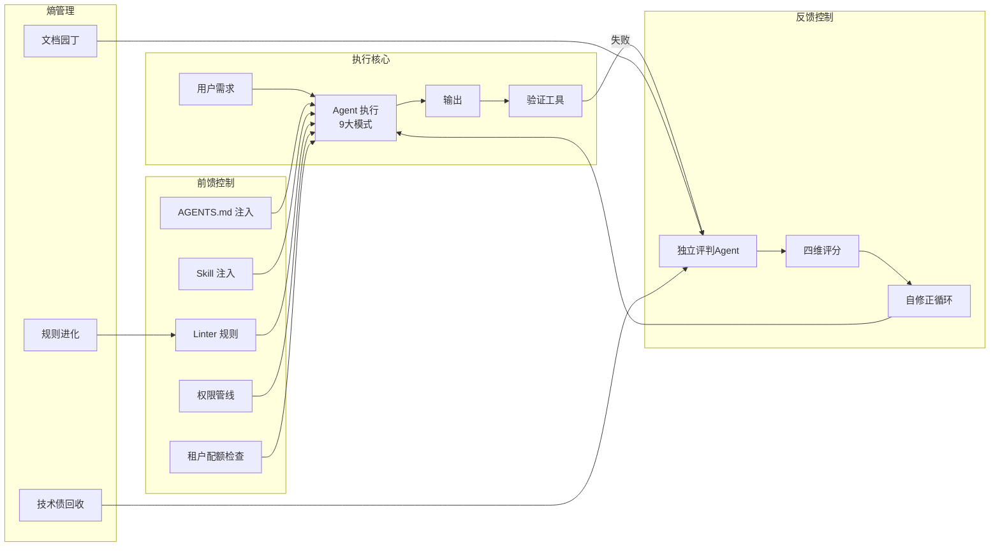
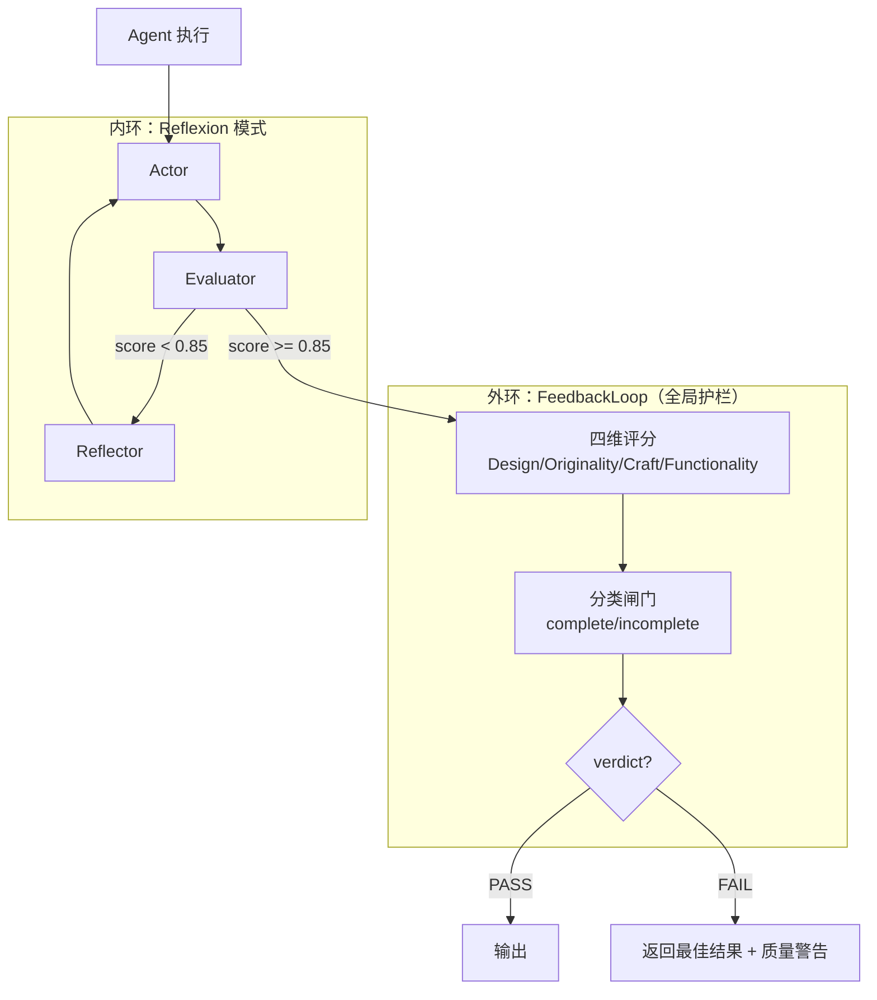
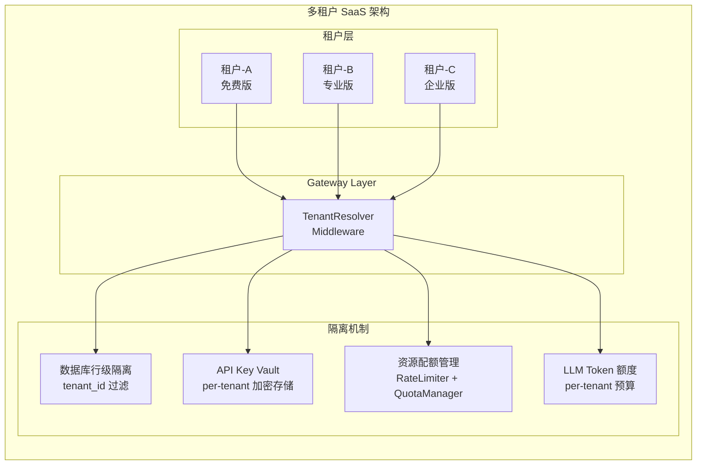
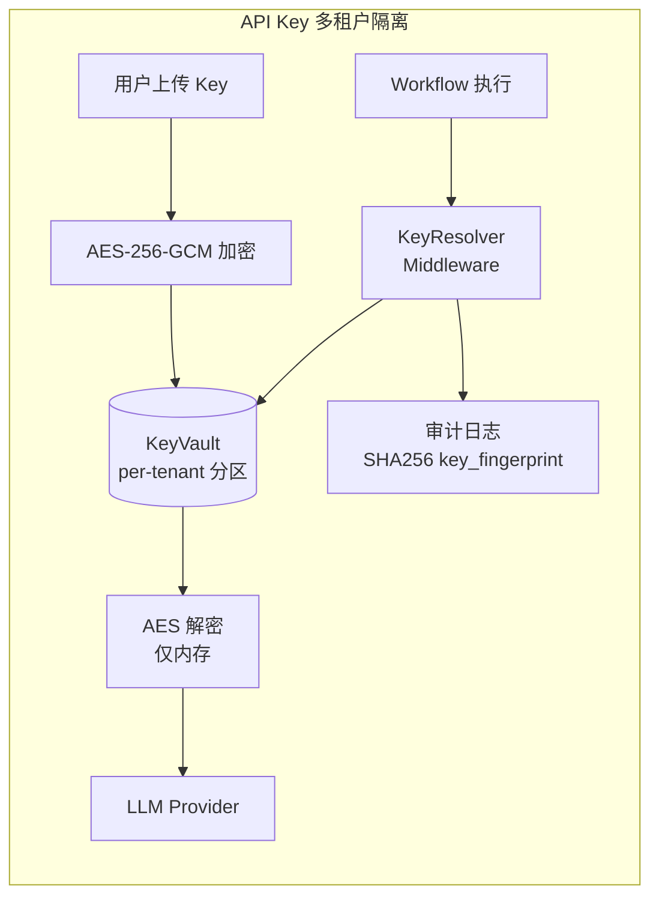
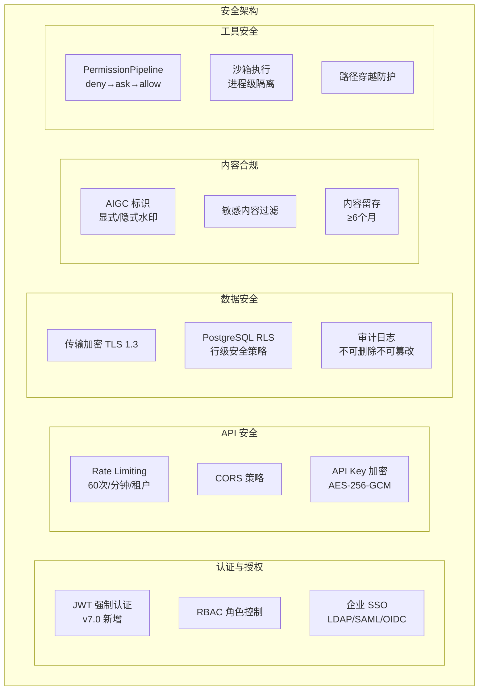
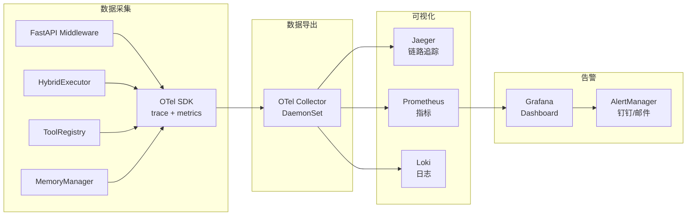
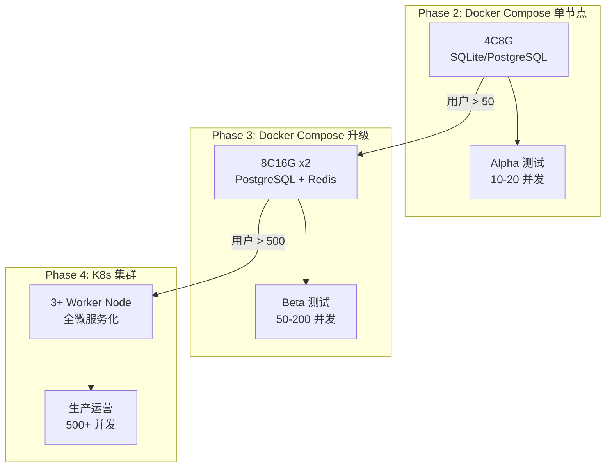
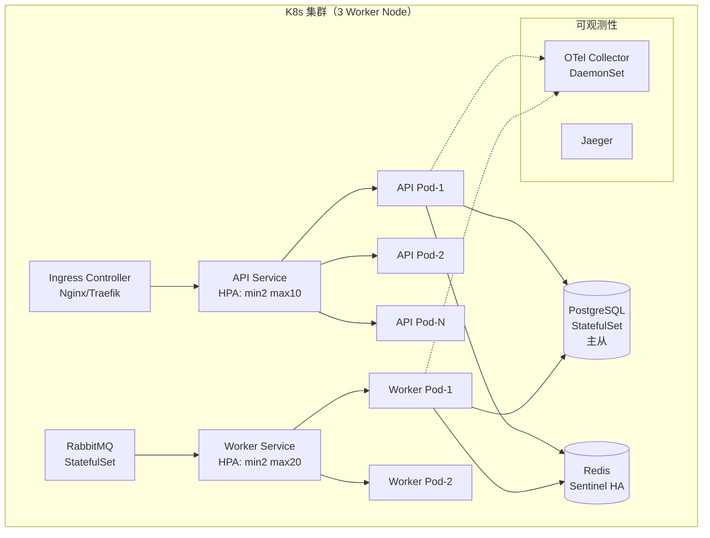

# FlowForge v7.0 架构设计

> **定位**：从 Agent 编排框架进化为 **Agent 驾驭层 (Harness Layer)**——为 AI Agent 提供约束、反馈、上下文管理与熵控制的完整控制论系统，同时具备多租户、生产级部署与全链路可观测性。
> **哲学**：让架构成为配置，让扩展成为插件，让 Harness 负责约束、验证和进化。
> **关系声明**：FlowForge 是独立开源项目（MIT），ContentForge 是其应用层参考实现。
> **版本说明**：本文档基于 v6.0 架构，合并五轮多角色评审（架构师/Agent工程师/全栈工程师/CEO/产品专家）的全部发现，修复所有架构不一致问题，新增多租户隔离层、安全架构、可观测性架构与生产部署架构。v6.0 及更早版本已归档至 `docs/archive/`。

---

## 修订历史

| 版本 | 日期 | 核心变更 |
|------|------|---------|
| v4.0 | 2026-04 | 九大模式 + 通用 Agent/Workflow 库 |
| v5.0 | 2026-04 | 三层防御 + 协作增强 + 安全工具 |
| v6.0 | 2026-05 | Harness 驾驭层 + Skill 系统 + MCP 模块 |
| **v7.0** | 2026-05 | **评审驱动大修**：统一 SafetyLevel 枚举、统一压缩阈值 0.92、统一 BaseModeExecutor 接口、统一 HybridExecutor.run() 签名、TaskContext 字段补全、API 升级至 v6.0、新增多租户隔离层、DI 容器替代全局单例、SQLite→PostgreSQL 迁移路径、Alembic 数据库迁移、安全加固、生产部署架构、OpenTelemetry 可观测性、WorkflowExecutor mode 尊重修复、ContentAuditAgent judge_model 支持、并行组数据竞争修复 |

---

## 1. 项目概述与设计目标

FlowForge 是一个解耦了业务逻辑的通用 Agent 操作系统内核，封装了业界主流的 9 种 Agent 架构模式，提供统一的工具注册、状态管理、可观测性接口，并通过 **四根 Harness 护栏**（上下文工程、架构约束、反馈循环、熵管理）为 Agent 提供完整的控制回路，让开发者通过声明式配置（YAML/JSON）即可组合出可控、可观测、可进化的智能体工作流。

### 1.1 核心公式

```
Agent = Model (Brain) + Harness (Body)
FlowForge = Harness Layer = 前馈控制 + 反馈控制 + 熵管理 + 可观测性
```

### 1.2 设计目标

| 维度 | 目标 |
|------|------|
| **通用性** | 核心不感知业务概念，只定义 TaskContext 和 Agent/Tool 接口 |
| **完整性** | 内置 9 种主流 Agent 模式，支持混合编排 |
| **可扩展性** | 任何新模式、新工具可通过注册机制热插拔；支持 MCP、OpenAPI、GraphQL、Skill 等协议接入 |
| **生产就绪** | 内置 Harness 四根护栏、三层防御、追踪、指标、检查点、Persona 锁、Human-in-the-Loop、Solo 实时交互、多租户隔离、安全加固 |
| **开源友好** | MIT 许可证，完善的文档和例子，支持通过 `pip install flowforge` 安装 |
| **高性能** | 基于 asyncio 异步执行，支持并行步骤和流式输出；PostgreSQL 生产后端支撑 500+ 并发 |
| **多租户** | 行级隔离 + 资源配额 + API Key 加密存储，SaaS/私有部署双模式 |

### 1.3 与 ContentForge 的关系

FlowForge 是独立开源项目（MIT），ContentForge 是其应用层参考实现。FlowForge 可以完全不依赖 ContentForge 运行，其他项目可以通过 `pip install flowforge` 独立使用。

---

## 2. 架构总览

### 2.1 七层架构模型

FlowForge v7.0 在 v6.0 六层架构基础上，新增第七层——**多租户隔离层**，作为横切关注点贯穿所有层级：

```
┌─────────────────────────────────────────────────────────────────────┐
│  7. 多租户隔离层 (Multi-Tenant Isolation Layer) ★ v7.0 新增        │
│     TenantContext | 行级隔离 | API Key Vault | 资源配额 | 计费      │
│     （横切层：贯穿 1-6 层所有组件）                                   │
├─────────────────────────────────────────────────────────────────────┤
│  6. 应用层 (Application Layer)                                      │
│     ContentForge / NovelForge / 其他业务系统                        │
├─────────────────────────────────────────────────────────────────────┤
│  5. 接入层 (Gateway Layer)                                          │
│     FastAPI REST API v6.0 + WebSocket (Solo/Events) + Web UI + CLI │
├─────────────────────────────────────────────────────────────────────┤
│  4. Harness 驾驭层 (Harness Layer) ★ v6.0 核心                      │
│     上下文工程 | 架构约束 | 反馈循环 | 熵管理 | 权限管线 | 会话管理  │
├─────────────────────────────────────────────────────────────────────┤
│  3. 执行引擎层 (Engine Layer)                                       │
│     HybridExecutor (TAOR循环) | ModeRegistry (9大模式) | Scheduler  │
├─────────────────────────────────────────────────────────────────────┤
│  2. 能力层 (Capability Layer)                                       │
│     Tool生态 (MCP/OpenAPI/GraphQL) | Skill系统 | Agent库 | Memory   │
├─────────────────────────────────────────────────────────────────────┤
│  1. 基础设施层 (Infrastructure Layer)                               │
│     SQLite(dev)/PostgreSQL(prod) | Redis | Qdrant/Milvus | LLM API │
└─────────────────────────────────────────────────────────────────────┘
```

**依赖方向**：应用层 → 接入层 → Harness 层 → 执行引擎层 → 能力层 → 基础设施层。严禁反向依赖。多租户隔离层作为横切层，通过 Middleware/Decorator/Repository 过滤等方式注入各层，不改变单向依赖规则。

### 2.2 完整架构图

```mermaid
graph TB
    subgraph "7. 多租户隔离层（横切）"
        TC[TenantContext Middleware]
        TV[API Key Vault<br/>AES-256-GCM]
        TQ[QuotaManager<br/>资源配额]
        TB[BillingEngine<br/>计费引擎]
    end

    subgraph "6. 应用层"
        CF[ContentForge]
        NF[NovelForge]
    end

    subgraph "5. 接入层"
        API[FastAPI REST API v6.0]
        WS[WebSocket<br/>Solo/Events]
        WEB[Web UI<br/>Next.js]
        CLI[CLI]
    end

    subgraph "4. Harness 驾驭层"
        HO[HarnessOrchestrator]
        CE[ContextEngine]
        ACE[ArchConstraintEngine]
        FL[FeedbackLoop]
        EM[EntropyManager]
        PP[PermissionPipeline]
        SM[SessionManager<br/>阈值=0.92]
    end

    subgraph "3. 执行引擎层"
        HE[HybridExecutor<br/>run&#40;ctx, mode_hint&#41;]
        MR[ModeRegistry<br/>9大模式]
        SCH[Scheduler]
        DM[DefenseLayer<br/>L1/L2/L3]
    end

    subgraph "2. 能力层"
        TR[ToolRegistry<br/>SafetyLevel枚举]
        AR[AgentRegistry]
        SKR[SkillRegistry<br/>4格式适配]
        MCP[MCP Broker<br/>4层架构]
        MM[MemoryManager<br/>5种记忆]
    end

    subgraph "1. 基础设施层"
        DB[(SQLite/PostgreSQL<br/>Alembic迁移)]
        REDIS[(Redis)]
        VEC[(Qdrant/Milvus)]
        LLM[LLM API<br/>多Provider]
        OTEL[OpenTelemetry<br/>Collector]
    end

    CF --> API
    NF --> API
    API --> HO
    API --> HE
    WS --> HE
    HO --> CE
    HO --> ACE
    HO --> FL
    HO --> EM
    HO --> PP
    HO --> SM
    HE --> MR
    HE --> DM
    MR --> TR
    MR --> AR
    MR --> SKR
    MR --> MCP
    HE --> MM
    TR --> DB
    AR --> DB
    MM --> DB
    MM --> REDIS
    MM --> VEC
    TR --> LLM

    TC -.-> API
    TC -.-> HE
    TC -.-> TR
    TV -.-> TR
    TQ -.-> HE
    TB -.-> API

    API -.-> OTEL
    HE -.-> OTEL
```



### 2.3 控制回路设计



---

## 3. 核心接口设计

### 3.1 接口兼容性声明

FlowForge v7.0 的 `BaseAgent` 和 `BaseTool` 接口与 v6.0 **完全兼容**，现有 Agent 实现**无需修改一行代码**即可迁移。v7.0 新增/修改的接口均有默认值，不破坏现有代码。

**v7.0 统一修复清单**：

| # | 不一致项 | v6.0 状态 | v7.0 统一方案 |
|---|---------|----------|-------------|
| 1 | SafetyLevel 命名 | 代码 `normal`，文档 `safe/moderate/dangerous` 和 `readonly/normal/dangerous` 混用 | **统一为 SafetyLevel 枚举**：`READONLY` / `NORMAL` / `DANGEROUS` |
| 2 | 压缩阈值 | 文档 0.92，部分代码/配置 0.85 | **统一为 0.92 (92%)** |
| 3 | BaseModeExecutor 接口 | 文档与代码一致但缺模板方法说明 | **统一为 _prepare/_execute_core/_postprocess + run() 模板方法 + _on_enter/_on_exit 钩子** |
| 4 | HybridExecutor.run() 签名 | 文档 `run(context, mode_hint)`，代码 `run(context, mode_hint, _is_substep)` | **统一为 `run(context: TaskContext, mode_hint: str = None)`**，`_is_substep` 为内部参数 |
| 5 | TaskContext 字段 | 文档列出 `input_data`/`checkpoint`/`executor`，代码已实现 | **确认统一**：`input_data` + `checkpoint` + `executor` 为必含字段 |
| 6 | API 版本 | v4.0 | **升级至 v6.0**，新增 Harness/Skill/MCP/trace 端点 |

### 3.2 SafetyLevel 枚举 — v7.0 统一定义

```python
from enum import Enum

class SafetyLevel(str, Enum):
    """工具安全等级枚举 — v7.0 全局统一命名
    
    历史变体映射：
    - safe → READONLY
    - moderate → NORMAL  
    - readonly → READONLY
    - normal → NORMAL
    - dangerous → DANGEROUS
    """
    READONLY = "readonly"      # 只读操作（搜索、检索）— 无需审批
    NORMAL = "normal"          # 常规操作（LLM 调用、文件写入）— 仅并发时需注意
    DANGEROUS = "dangerous"    # 危险操作（代码执行、删除、发布）— 需人工审批
```

**BaseTool 安全等级更新**：

```python
class BaseTool(ABC):
    name: str = "base"
    description: str = ""
    parameters_schema: Dict[str, Any] = {}
    safety_level: SafetyLevel = SafetyLevel.NORMAL    # ★ v7.0：使用枚举
    is_concurrency_safe: bool = True

    @abstractmethod
    async def execute(self, input: ToolInput) -> ToolOutput:
        ...
```

**安全等级语义表**：

| SafetyLevel | 值 | 含义 | 审批要求 | 示例工具 |
|-------------|---|------|---------|---------|
| `READONLY` | `"readonly"` | 只读操作 | 无需审批 | web_search, tavily_search |
| `NORMAL` | `"normal"` | 常规操作 | 仅并发时需注意 | llm_client, file_rw |
| `DANGEROUS` | `"dangerous"` | 危险操作 | 需人工审批 | python_executor, shell_command, wechat_publisher |

**向后兼容**：`safety_level` 字段接受字符串值，内部自动映射到枚举：

```python
def _normalize_safety_level(value) -> SafetyLevel:
    """兼容旧字符串值"""
    mapping = {
        "safe": SafetyLevel.READONLY,
        "moderate": SafetyLevel.NORMAL,
        "readonly": SafetyLevel.READONLY,
        "normal": SafetyLevel.NORMAL,
        "dangerous": SafetyLevel.DANGEROUS,
    }
    if isinstance(value, SafetyLevel):
        return value
    return mapping.get(str(value).lower(), SafetyLevel.NORMAL)
```

### 3.3 TaskContext — 任务上下文（v7.0 完整定义）

```python
class TaskContext:
    """运行时任务上下文 — v7.0 完整字段定义"""
    
    # ── 核心标识 ──
    task_id: str                              # 唯一任务 ID
    persona: Optional[str] = None             # Persona 标识（Persona 锁依据）
    input_data: dict                          # ★ 必含：原始输入数据
    metadata: dict                            # 附加元数据
    
    # ── 执行状态 ──
    state: dict                               # 分层 TypedDict (BaseState → TopicState → ...)
    mode: Optional[str] = None                # 执行模式: react/reflexion/workflow/...
    interaction_mode: str = "solo"            # 交互模式: standard / solo / auto
    
    # ── 注册表引用 ──
    tools: Optional[ToolRegistry] = None      # 工具注册表
    agents: Optional[AgentRegistry] = None    # Agent 注册表
    
    # ── 基础设施引用 ──
    checkpoint: Optional[CheckpointManager] = None   # ★ 必含：检查点管理器
    event_bus: Optional[EventBus] = None             # 事件总线
    memory: Optional[MemoryManager] = None           # 记忆管理器
    executor: Optional['HybridExecutor'] = None      # ★ 必含：执行器引用（Workflow 嵌套调用）
    
    # ── Harness 控制 ──
    harness_enabled: bool = True              # 是否启用 Harness 层
    
    # ── v7.0 多租户 ──
    tenant_id: Optional[str] = None           # ★ v7.0 新增：租户 ID
    
    # ── 元数据 ──
    created_at: str                           # ISO-8601 创建时间
```

### 3.4 BaseAgent — Agent 抽象

```python
class BaseAgent(ABC):
    name: str
    description: str
    default_mode: Optional[str] = "react"

    @abstractmethod
    async def execute(self, input: AgentInput) -> AgentOutput:
        """核心执行方法"""
        pass

    async def execute_with_context(self, input: AgentInput, context: TaskContext) -> AgentOutput:
        """带上下文的执行方法，默认调用 execute (可选覆写)"""
        return await self.execute(input)
```

### 3.5 BaseModeExecutor — 模式执行器抽象（v7.0 统一接口）

```python
class BaseModeExecutor(ABC):
    """模式执行器抽象 — v7.0 统一接口定义
    
    模板方法模式：
    run() = _prepare() → _on_enter() → _execute_core() → _on_exit() → _postprocess()
    
    子类只需实现 _execute_core()，其余钩子可选覆写。
    """
    mode_name: str
    capabilities: List[str] = []  # ["retrieval", "planning", "reasoning", "generation", "evaluation"]

    async def _prepare(self, ctx: TaskContext) -> TaskContext:
        """准备阶段：上下文初始化、资源加载（可选覆写）"""
        return ctx

    @abstractmethod
    async def _execute_core(self, ctx: TaskContext) -> dict:
        """核心执行逻辑（必须实现）"""
        pass

    async def _postprocess(self, ctx: TaskContext, result: dict) -> dict:
        """后处理：结果格式化、日志记录（可选覆写）"""
        return result

    # ★ 生命周期钩子
    async def _on_enter(self, ctx: TaskContext):
        """进入执行前钩子：初始化、日志、事件发射（可选覆写）"""
        pass

    async def _on_exit(self, ctx: TaskContext, result: dict) -> dict:
        """退出执行后钩子：重复检测、资源清理（可选覆写）"""
        return result

    async def run(self, ctx: TaskContext) -> dict:
        """模板方法 — 定义执行骨架，子类不应覆写"""
        ctx = await self._prepare(ctx)
        await self._on_enter(ctx)
        result = await self._execute_core(ctx)
        result = await self._on_exit(ctx, result)
        return await self._postprocess(ctx, result)
```

### 3.6 HybridExecutor — 混合调度入口（v7.0 统一签名）

```python
class HybridExecutor:
    """核心任务执行引擎 — v7.0 统一签名"""

    def __init__(self, mode_registry: ModeRegistry, agent_registry: AgentRegistry,
                 tool_registry, event_bus: EventBus, task_repo=None, audit_repo=None,
                 memory_manager: MemoryManager = None,
                 checkpointer_path: str = "data/checkpoints.db",
                 state_db_path: str = "data/states.db",
                 harness=None):
        ...

    async def run(self, context: TaskContext, mode_hint: str = None,
                  _is_substep: bool = False) -> dict:
        """执行任务 — v7.0 统一签名
        
        Args:
            context: TaskContext 任务上下文（必含 input_data/checkpoint/executor）
            mode_hint: 可选模式名称覆盖。None 时从 context.mode 或自动建议获取
            _is_substep: 内部参数，子步骤执行时跳过并发检查和状态持久化
            
        Returns:
            模式执行器产出的结果字典
            
        Raises:
            ConflictError: Persona 已有运行中任务且非子步骤
        """
        persona = context.persona or "default"

        if not _is_substep:
            # 保存任务状态
            self._task_contexts[context.task_id] = context
            self.state_manager.save_state(context.task_id, {
                "task_id": context.task_id, "persona": persona,
                "mode": mode_hint or context.mode or "auto", "status": "pending",
                "input_data": context.input_data,
                "interaction_mode": context.interaction_mode,
                "tenant_id": context.tenant_id,  # ★ v7.0
            })

            # Persona 锁
            if persona in self._running_tasks:
                raise ConflictError(...)

        # 模式选择
        if mode_hint is None and context.mode is None:
            mode = self.mode_registry.suggest_mode(context.input_data.get("task", ""))
        else:
            mode = mode_hint or context.mode

        # 上下文水合
        context.tools = self.tool_registry
        context.agents = self.agent_registry
        context.executor = self
        context.mode = mode
        context.checkpoint = self.checkpoint_manager
        context.event_bus = self.event_bus

        # 执行
        try:
            # v6.0+ Harness pre_execute hook
            if self.harness and context.harness_enabled:
                await self.harness.pre_execute(context)

            result = await asyncio.wait_for(
                self.mode_registry.get(mode).run(context),
                timeout=TASK_TIMEOUT_SECONDS,
            )

            # v6.0+ Harness post_execute hook
            if self.harness and context.harness_enabled:
                result = await self.harness.post_execute(result, context)

            return result
        except asyncio.TimeoutError:
            ...
        except Exception as e:
            ...
        finally:
            if not _is_substep and persona in self._running_tasks:
                del self._running_tasks[persona]

    async def submit_review(self, task_id: str, verdict: str,
                            feedback: str = "", edited_draft: str = ""): ...
    async def pause_task(self, task_id: str): ...
    async def resume_task(self, task_id: str): ...
    async def get_task_snapshot(self, task_id: str) -> dict: ...
```

### 3.7 ModeRegistry — 模式注册中心

```python
class ModeRegistry:
    def register(self, executor: BaseModeExecutor): ...
    def get(self, mode_name: str) -> BaseModeExecutor: ...
    def suggest_mode(self, task_description: str) -> str: ...
    def list_modes(self) -> List[str]: ...
```

---

## 4. 九大内置模式详解

| 模式名称 | 英文 | 核心机制 | 适用场景 |
|---------|------|---------|----------|
| `react` | ReAct | Thought → Action → Observation 循环（MAX_STEPS=8, 含循环检测） | 需要多步动态检索或工具调用 |
| `plan_execute` | Plan-and-Execute | Planner 生成步骤清单，Executor 依次执行 | 路径明确、步骤可预测的任务 |
| `reflexion` | Reflexion | Actor → Evaluator → Reflector → 记忆 (MAX_ITERATIONS=4, QUALITY_THRESHOLD=0.85) | 需要反复打磨才能达标的任务 |
| `multi_agent` | Multi-Agent | Subagents/Teams/Swarms 三策略，Orchestrator 分发 | 需要多角色配合的复杂任务 |
| `workflow` | Workflow / Orchestration | 预定义的 DAG 流程，可混合其他模式（禁止嵌套Workflow，max_depth=3） | 长流程、端到端的业务流水线 |
| `graph_of_thoughts` | Graph of Thoughts | 图式推理，多思路聚合、交叉验证 | 复杂推理、数学证明、多源情报融合 |
| `rewoo` | ReWOO | 一次性规划所有工具调用，批量执行 | 确定性多 API 调用，需高吞吐 |
| `self_discover` | Self-Discover | 任务前自动发现最佳推理结构 | 不确定领域，先验知识未知的任务 |
| `agent_judge` | Agent-as-Judge | 用独立 Agent 作为评判者，提供定性反馈 | 无外部评分标准，依赖"审美"或"逻辑"评价 |

### 4.1 WorkflowExecutor 模式尊重修复（v7.0 Bug Fix B3）

**v6.0 Bug**：WorkflowExecutor 检测到 step 有 agent 时，直接调用 `agent.execute_with_context()`，绕过 HybridExecutor 的 mode 调度，导致 YAML 中的 `mode` 配置成为"僵尸配置"。

**v7.0 修复**：WorkflowExecutor 必须通过 HybridExecutor.run() 调度，强制 mode 生效。新增 `mode_executor_passthrough` 选项控制行为：

```python
# WorkflowExecutor._execute_sop_steps() 中的 Agent 执行路径

if agent_name and ctx.agents:
    agent = ctx.agents.get(agent_name)
    if agent:
        # ★ v7.0 修复：尊重 step 的 mode 配置
        step_mode = step.get("mode")
        passthrough = ctx.metadata.get("mode_executor_passthrough", False)
        
        if step_mode and not passthrough:
            # 通过 HybridExecutor 调度，强制 mode 生效
            sub_input_data = {**ctx.state, **context_data}
            if agent_name:
                sub_input_data["_target_agent"] = agent_name
            sub_ctx = TaskContext.from_parent(
                ctx, input_data=sub_input_data,
                metadata={"_workflow_depth": depth + 1}
            )
            sub_result = await ctx.executor.run(
                sub_ctx, mode_hint=step_mode, _is_substep=True
            )
            context_data[step.get("output", step_name)] = sub_result
        else:
            # 兼容模式：直接调用 agent（mode 不生效）
            merged_data = {**ctx.state, **context_data}
            agent_input = AgentInput(params=merged_data)
            agent_output = await asyncio.wait_for(
                agent.execute_with_context(agent_input, ctx),
                timeout=step_timeout,
            )
            context_data.update(agent_output.result)
```

### 4.2 并行组数据竞争修复（v7.0 Bug Fix B2）

**v6.0 Bug**：Workflow 的 `parallel_group` 执行时，多个子步骤共享同一个 `context_data` 引用，状态变更可能产生数据竞争。

**v7.0 修复**：并行步骤使用 `copy.deepcopy(context_data)` 创建独立副本，结果合并时进行冲突检测：

```python
async def _execute_parallel(self, ctx, group, context_data):
    """v7.0：deepcopy 防止数据竞争"""
    results = {}
    tasks = []
    for item in group:
        mode = item.get("mode", "plan_execute")
        # ★ v7.0 修复：deepcopy 防止并行步骤间的数据竞争
        sub_ctx = TaskContext.from_parent(
            ctx, input_data=copy.deepcopy(context_data)
        )
        tasks.append(ctx.executor.run(sub_ctx, mode_hint=mode, _is_substep=True))
    completed = await asyncio.gather(*tasks, return_exceptions=True)
    for item, result in zip(group, completed):
        if isinstance(result, Exception):
            if item.get("on_error", "abort") == "skip":
                continue
            raise result
        results[item.get("output", item["name"])] = result
    return results
```

### 4.3 ContentAuditAgent judge_model 支持（v7.0 Bug Fix B1）

**v6.0 Bug**：ContentAuditAgent 不支持独立 Judge 模型，硬编码 persona，使用与生成 Agent 相同的模型，导致"自我美化"。

**v7.0 修复**：增加 `judge_model` 参数，调用独立模型实例：

```python
class ContentAuditAgent(BaseAgent):
    name = "content_audit"
    description = "内容审核 Agent：多维度质量评估，使用 Agent-Judge 模式"
    default_mode = "agent_judge"

    def __init__(self, judge_model: Optional[str] = None):
        """★ v7.0 修复：支持独立 Judge 模型
        
        Args:
            judge_model: 独立评判模型名称。None 时使用默认模型。
                         推荐使用与生成 Agent 不同的模型以避免自我美化。
        """
        self.judge_model = judge_model

    async def execute_with_context(self, input: AgentInput, context: TaskContext) -> AgentOutput:
        # ...
        assess_params = {
            "messages": [{"role": "user", "content": assess_prompt}],
            "stream": False, "task_id": context.task_id,
            "agent_name": self.name, "persona": context.persona or "default",
        }
        # ★ v7.0 修复：使用独立 Judge 模型
        if self.judge_model:
            assess_params["model"] = self.judge_model
        # ...
```

---

## 5. Harness 驾驭层设计

### 5.1 上下文工程（Context Engineering）

```python
class ContextEngine:
    """上下文工程引擎：按需知识注入 + 交接机制"""

    def __init__(self, knowledge_base, llm_client, memory_manager):
        self.kb = knowledge_base
        self.llm = llm_client
        self.memory = memory_manager

    async def build_handoff_artifacts(self, ctx: TaskContext) -> dict:
        """构建会话交接物"""
        artifacts = {
            "init_script": await self._generate_init_script(ctx),
            "progress_log": await self._build_progress_log(ctx),
            "feature_checklist": await self._build_feature_checklist(ctx),
        }
        await self.memory.save("project", f"handoff_{ctx.task_id}", artifacts)
        return artifacts

    async def inject_dynamic_context(self, task: dict, persona: str) -> str:
        """按需注入上下文：规则 + 历史教训 + 交接物"""
        context_parts = []
        rules = await self.kb.retrieve(f"rules:{persona}", top_k=5)
        if rules:
            context_parts.append(f"【项目规则】\n{rules}")
        mistakes = await self.kb.retrieve(f"mistakes:{task.get('domain', '')}", top_k=3)
        if mistakes:
            context_parts.append(f"【同类任务历史教训】\n{mistakes}")
        handoff = await self.memory.retrieve("project", f"handoff_{task.get('parent_task_id')}")
        if handoff:
            context_parts.append(f"【上次会话交接】\n{handoff}")
        return "\n\n".join(context_parts)
```

### 5.2 会话管理（SessionManager）— 压缩阈值统一为 0.92

**v7.0 统一**：压缩阈值全局统一为 `0.92`（92%），消除 v6.0 中 0.85 与 0.92 的不一致。

```python
class SessionManager:
    """会话管理引擎 — v7.0 压缩阈值统一为 0.92"""

    COMPACTION_THRESHOLD = 0.92  # ★ v7.0 统一：92% 阈值触发（与 Claude Code 实测对齐）
    MAX_TOOL_OUTPUT_TOKENS = 25000
    TOOL_OUTPUT_WARNING_TOKENS = 10000

    def __init__(self, checkpoint_mgr, memory_manager, llm_client,
                 max_context_tokens: int = 128000):
        self.checkpoint = checkpoint_mgr
        self.memory = memory_manager
        self.llm = llm_client
        self.max_context_tokens = max_context_tokens

    async def compact_if_needed(self, messages: list, ctx: TaskContext) -> list:
        """92% 阈值触发自动压缩"""
        total_tokens = sum(count_tokens(str(m)) for m in messages)
        utilization = total_tokens / self.max_context_tokens
        if utilization >= self.COMPACTION_THRESHOLD:
            critical = self._extract_critical(messages)
            summary = await self._summarize(messages[:-20], ctx)
            await self.checkpoint.save(ctx.task_id, ctx.state, messages, "auto_compact")
            return [{"role": "system", "content": f"[会话摘要] {summary}"}] + critical
        return messages
```

### 5.3 架构约束（Architecture Constraints）

```python
class ArchitectureConstraintEngine:
    """架构约束引擎：分层依赖 + Linter 规则 + CI 门禁"""

    LAYER_ORDER = ["Types", "Config", "Repo", "Service", "Runtime", "UI"]

    def __init__(self, layer_config_path: str = "config/layer_mapping.yaml"):
        self.layer_mapping = self._load_layer_mapping(layer_config_path)

    def check_dependency_direction(self, from_module: str, to_module: str) -> bool:
        """检查依赖方向是否合法"""
        from_layer = self._resolve_layer(from_module)
        to_layer = self._resolve_layer(to_module)
        if from_layer == "unknown" or to_layer == "unknown":
            return True
        try:
            return self.LAYER_ORDER.index(from_layer) < self.LAYER_ORDER.index(to_layer)
        except ValueError:
            return True

    async def validate_agent_output(self, output: 'AgentOutput', ctx: 'TaskContext') -> list:
        """验证 Agent 输出是否符合架构约束"""
        violations = []
        for dep in self._extract_dependencies(output):
            if not self.check_dependency_direction(dep["from"], dep["to"]):
                violations.append({
                    "rule": "layer_dependency",
                    "violation": f"反向依赖: {dep['from']} → {dep['to']}",
                    "fix": f"遵循分层依赖: {' → '.join(self.LAYER_ORDER)}",
                })
        if violations:
            ctx.event_bus.emit(ctx.task_id, "constraint.violation", {"violations": violations})
        return violations
```

### 5.4 反馈循环（Feedback Loop）

FeedbackLoop 是**全局护栏**（外环），与 Reflexion 模式（内环）形成**串行关系**——Reflexion 内环先跑完，然后交给 FeedbackLoop 外环做终审。



**evaluation_mode 三档配置**：

| 模式 | LLM 调用次数 | 适用场景 |
|------|-------------|---------|
| `full` | 2 次（四维评分 + 分类闸门） | 需要深度质量评估 |
| `lightweight`（默认） | 1 次（仅分类闸门） | 日常运行 |
| `skip` | 0 次 | 跳过外环（内环 Reflexion 仍生效） |

### 5.5 熵管理（Entropy Management）

内置核心能力（NOT 插件），包含：
- **文档园丁 (DocGardener)**：后台每天凌晨扫描文档-代码不一致
- **技术债跟踪器 (DebtTracker)**：优先级排序 + 持续小额偿还
- **规则进化器 (RuleEvolution)**：每次 Agent 失败转化为一条工程规则

### 5.6 权限管线（Permission Pipeline）

三层管线：deny → ask → allow（deny 永远胜出），四级动作分级：

| 动作级别 | 含义 | 默认处理 |
|---------|------|---------|
| `read` | 只读操作 | auto_approved |
| `suggest` | 生成建议 | prompt_user |
| `prepare` | 生成 PR/变更计划 | prompt_user |
| `execute` | 执行部署/改配置/删除 | require_approval |

### 5.7 HarnessOrchestrator — 统一入口

```python
class HarnessOrchestrator:
    """Harness 驾驭层统一入口"""

    def __init__(self, config):
        self.context = ContextEngine(...)
        self.constraints = ArchitectureConstraintEngine(...)
        self.feedback = FeedbackLoop(...)
        self.entropy = EntropyManager(...)

    async def pre_execute(self, ctx: TaskContext):
        """执行前：上下文注入 + 熵管理轻量检查"""
        await self.context.inject_dynamic_context(ctx.input_data, ctx.persona or "default")
        await self.entropy.check_debt(ctx)

    async def post_execute(self, result: dict, ctx: TaskContext) -> dict:
        """执行后：架构约束验证 + 反馈评估"""
        violations = await self.constraints.validate_agent_output(result, ctx)
        if not violations:
            evaluation = await self.feedback.evaluate_agent_output(
                result, ctx, evaluation_mode=ctx.metadata.get("evaluation_mode", "lightweight"))
            if evaluation["verdict"] == "FAIL":
                result["_quality_warning"] = evaluation
        return result
```

---

## 6. Skill 系统架构

### 6.1 SkillAdapter 模式

通过适配器模式实现 4 种主流 Skill 格式的统一接入：

| 格式 | 适配器 | 特性支持 |
|------|--------|---------|
| **FlowForge** | `FlowForgeAdapter` | 完整 YAML + Markdown |
| **Claude Code** | `ClaudeCodeAdapter` | YAML frontmatter + Markdown body |
| **Anthropic** | `AnthropicAdapter` | YAML frontmatter + Markdown body |
| **Trae CN** | `TraeCNAdapter` | YAML frontmatter + triggers（中文触发词）+ Markdown body |

### 6.2 SkillRegistry — 双层加载 + 置信度评分

```python
class SkillRegistry:
    """Skill 注册中心：双层加载 + 格式自动检测 + 置信度评分"""

    def __init__(self, global_dir: str = "~/.flowforge/skills",
                 project_dir: str = "./.flowforge/skills"):
        self.global_dir = Path(global_dir).expanduser()
        self.project_dir = Path(project_dir)
        self._skills: Dict[str, Skill] = {}
        self._usage_stats: Dict[str, dict] = {}
        self._load_all()

    def match_skill(self, query: str, context: TaskContext = None) -> List[tuple]:
        """匹配 Skill，返回 (Skill, confidence) 列表，按置信度降序"""
        scored = []
        query_lower = query.lower()
        for skill in self._skills.values():
            score = 0
            for trigger in skill.triggers:
                if trigger.lower() in query_lower:
                    score += len(trigger) / 10
            if context:
                for tool_name in skill.required_tools:
                    if tool_name in context.state.get("recent_tool_calls", []):
                        score += 0.5
                if context.interaction_mode == "solo":
                    score *= 1.2
            if score > 0:
                scored.append((skill, score))
        scored.sort(key=lambda x: x[1], reverse=True)
        return scored
```

### 6.3 Combo Skills — 组合技

支持声明式定义多 Skill 串联管道：

```yaml
name: book-to-article
description: 读书写作一条龙：提取精华→下载封面→生成书评
version: 1.0.0
combo:
  pipeline:
    - skill: book-essence-extractor
      output_key: essence
    - skill: image-downloader
      output_key: cover_image
      depends_on: [essence]
    - skill: article-outline
      input:
        topic: "{{essence.title}}"
        image: "{{cover_image.url}}"
      output_key: article
```

---

## 7. MCP 模块架构

### 7.1 四层架构

```
┌─────────────────────────────────────────────────────────────┐
│  L1: MCP Client（协议层）                                     │
│  · JSON-RPC 2.0 客户端                                       │
│  · tools/list / tools/call / resources/read                   │
│  · 动态工具发现 + 延迟加载（5分钟 TTL 缓存）                   │
├─────────────────────────────────────────────────────────────┤
│  L2: MCP Gateway（治理层）                                    │
│  · 工具白名单 (Allow-List)                                    │
│  · Token 预算管理（25K 默认上限）                              │
│  · 速率限制（60次/分钟默认）                                   │
│  · 权限管线集成                                               │
├─────────────────────────────────────────────────────────────┤
│  L3: MCP Broker（代理层）                                     │
│  · 多服务器聚合 (Server Aggregation)                          │
│  · tool_name → server_name 索引（非遍历）                     │
│  · 熔断（5次连续失败触发）+ 重试（3次，指数退避）              │
├─────────────────────────────────────────────────────────────┤
│  L4: MCP Tool Adapter（适配层）                               │
│  · MCP Tool → FlowForge BaseTool 转换                        │
│  · 自动 Schema 生成                                          │
│  · 流式支持 (execute_stream)                                  │
└─────────────────────────────────────────────────────────────┘
```

### 7.2 MCPBroker — 索引路由

```python
class MCPBroker:
    """MCP 代理：多服务器聚合 + 索引路由 + 熔断/重试"""

    MAX_RETRIES = 3
    CIRCUIT_BREAKER_THRESHOLD = 5

    async def call_tool(self, tool_name: str, arguments: dict,
                        server: str = None) -> Dict:
        if server:
            return await self._call_with_retry(server, tool_name, arguments)
        # 直接查索引，无需遍历所有服务器
        server_name = self._tool_index.get(tool_name)
        if server_name:
            return await self._call_with_retry(server_name, tool_name, arguments)
        # 索引未命中时，降级到遍历搜索（并更新索引）
        for name, client in self._clients.items():
            tools = await client.list_tools()
            for tool in tools:
                self._tool_index[tool["name"]] = name
                if tool["name"] == tool_name:
                    return await self._call_with_retry(name, tool_name, arguments)
        return {"error": f"Tool '{tool_name}' not found in any MCP server"}
```

---

## 8. 通用 Agent 库与 Workflow 库

### 8.1 设计原则 (Rule of Three)

通用 Agent 至少经过两个业务场景验证后才纳入通用库。每个 Agent 标注**验证状态**：✅ 已验证 / 🔄 设计中 / 📅 待验证。

### 8.2 内容创作类 Agent (✅ 已验证)

| # | Agent 名称 | 核心能力 | 默认模式 | v7.0 修复 |
|---|-----------|---------|---------|----------|
| 1 | TopicResearchAgent | 多级检索策略 | `rewoo` | — |
| 2 | MaterialCollectionAgent | 并行多源检索 | `rewoo` | — |
| 3 | ArticleWritingAgent | 三层生成管道 | `reflexion` | — |
| 4 | SEOOptimizationAgent | 标题/关键词优化 | `plan_execute` | — |
| 5 | FactCheckAgent | 链接有效性检查 | `react` | — |
| 6 | **ContentAuditAgent** | LLM 质量评分 | `agent_judge` | **★ v7.0：支持 judge_model** |
| 7 | HeadlineOptimizer | A/B 测试式标题 | `reflexion` | — |
| 8 | ContentRepurposer | 多格式转换 | `plan_execute` | — |
| 9 | TrendAnalysisAgent | 热点趋势分析 | `react` | — |
| 10 | PublishingAgent | 多平台发布 | `plan_execute` | — |
| 11 | ImageResearchAgent | 语义匹配图片 | `rewoo` | — |
| 12 | MultilingualAgent | 多语言翻译 | `plan_execute` | — |

---

## 9. 多租户隔离层（v7.0 新增）

> ★ v7.0 核心新增——解决架构师评审中"零多租户支持"的系统性缺口

### 9.1 租户隔离方案：行级隔离（Shared Database, Shared Schema）



### 9.2 TenantContext — 租户上下文

```python
class TenantTier(str, Enum):
    FREE = "free"
    PRO = "pro"
    ENTERPRISE = "enterprise"

class QuotaLimits(BaseModel):
    max_concurrent_workflows: int = 2       # 免费版: 2, 专业版: 20, 企业版: 100
    max_workflows_per_day: int = 10         # 免费版: 10, 专业版: 200, 企业版: unlimited
    max_llm_tokens_per_month: int = 100000  # 免费版: 100K, 专业版: 5M, 企业版: 50M
    max_skills: int = 5                     # 免费版: 5, 专业版: 50, 企业版: unlimited
    max_team_members: int = 1               # 免费版: 1, 专业版: 10, 企业版: unlimited
    marketplace_access: bool = False        # 免费版: False, 专业版+: True

class TenantContext:
    """租户上下文 — v7.0 新增"""
    tenant_id: str
    tier: TenantTier
    quotas: QuotaLimits
    api_key_vault_id: str
```

### 9.3 数据库行级隔离

所有核心表增加 `tenant_id` 列，Repository 层自动注入过滤条件：

```python
class TenantFilteredRepository(BaseRepository):
    """v7.0：所有 Repository 继承此类，自动注入 tenant_id 过滤"""

    async def find_all(self, **filters):
        filters["tenant_id"] = get_current_tenant_id()
        return await super().find_all(**filters)

    async def create(self, entity):
        entity.tenant_id = get_current_tenant_id()
        return await super().create(entity)
```

### 9.4 API Key 多租户隔离



**安全约束**：
- 租户 A 不可读取租户 B 的 Key
- Key 仅在内存中解密，不落盘
- Key 使用后立即从内存清除
- 审计日志记录 Key 使用（不记录明文）

### 9.5 数据库多租户方案对比

| 方案 | 隔离强度 | 运维成本 | 资源利用率 | 推荐场景 |
|------|:---:|:---:|:---:|------|
| **行级隔离**（Shared DB, Shared Schema, tenant_id） | ⭐⭐ | ⭐⭐⭐ | ⭐⭐⭐ | SaaS 标准版（推荐） |
| **Schema 隔离**（Shared DB, Separate Schema） | ⭐⭐⭐ | ⭐⭐ | ⭐⭐ | 企业私有部署 |
| **库级隔离**（Separate DB per Tenant） | ⭐⭐⭐⭐ | ⭐ | ⭐ | 金融/政务等高合规场景 |

**推荐路径**：Phase 2 采用行级隔离，Phase 3 企业版支持 Schema 隔离选项，Phase 4 高合规场景支持库级隔离。

---

## 10. DI 容器（v7.0 替代全局单例）

### 10.1 问题

v6.0 使用 `app/deps.py` 中的全局单例模式，存在以下问题：
- 隐式依赖：组件间通过全局变量引用，依赖关系不可见
- 测试困难：无法替换组件为 Mock
- 多租户冲突：全局单例无法区分租户

### 10.2 解决方案：轻量 DI 容器

```python
class DIContainer:
    """轻量依赖注入容器 — v7.0 替代全局单例"""

    def __init__(self):
        self._factories: Dict[str, Callable] = {}
        self._instances: Dict[str, Any] = {}
        self._singleton_flags: Dict[str, bool] = {}

    def register(self, name: str, factory: Callable, singleton: bool = True):
        """注册组件工厂"""
        self._factories[name] = factory
        self._singleton_flags[name] = singleton

    def get(self, name: str) -> Any:
        """获取组件实例"""
        if name in self._instances:
            return self._instances[name]
        if name not in self._factories:
            raise KeyError(f"Component '{name}' not registered")
        instance = self._factories[name](self)
        if self._singleton_flags.get(name, True):
            self._instances[name] = instance
        return instance

    def override(self, name: str, instance: Any):
        """测试用：替换组件实例"""
        self._instances[name] = instance
```

### 10.3 组件注册

```python
def create_container(config_path: str = "config/system.yaml") -> DIContainer:
    """创建并配置 DI 容器"""
    container = DIContainer()
    config = load_config(config_path)

    container.register("config", lambda c: config)
    container.register("event_bus", lambda c: EventBus())
    container.register("mode_registry", lambda c: ModeRegistry())
    container.register("agent_registry", lambda c: AgentRegistry())
    container.register("tool_registry", lambda c: ToolRegistry())
    container.register("memory_manager", lambda c: MemoryManager(c.get("config")))
    container.register("checkpoint_manager", lambda c: CheckpointManager(...))
    container.register("harness", lambda c: HarnessOrchestrator(c.get("config")))
    container.register("executor", lambda c: HybridExecutor(
        mode_registry=c.get("mode_registry"),
        agent_registry=c.get("agent_registry"),
        tool_registry=c.get("tool_registry"),
        event_bus=c.get("event_bus"),
        harness=c.get("harness"),
        memory_manager=c.get("memory_manager"),
    ))

    return container
```

### 10.4 FastAPI 集成

```python
# app/deps.py — v7.0 使用 DI 容器

from flowforge.core.di import DIContainer

_container: Optional[DIContainer] = None

def init_container(config_path: str = "config/system.yaml"):
    global _container
    _container = create_container(config_path)

def get_container() -> DIContainer:
    return _container

# FastAPI Depends
def get_executor() -> HybridExecutor:
    return get_container().get("executor")

def get_event_bus() -> EventBus:
    return get_container().get("event_bus")
```

---

## 11. 数据库迁移策略（v7.0 新增）

### 11.1 SQLite → PostgreSQL 迁移路径

| 阶段 | 数据库 | 适用场景 | 并发上限 |
|------|--------|---------|---------|
| **开发/Alpha** | SQLite | 单用户开发测试 | ~20 并发 Workflow |
| **Beta** | PostgreSQL | 多租户 SaaS | ~200 并发 Workflow |
| **生产** | PostgreSQL + Redis | 高并发生产环境 | ~500+ 并发 Workflow |

### 11.2 Alembic 迁移管理

```python
# alembic/env.py — v7.0 数据库迁移配置

from alembic import context
from flowforge.memory.models import Base  # SQLAlchemy models

target_metadata = Base.metadata

def run_migrations_online():
    """在线迁移：连接数据库执行迁移"""
    engine = create_engine(config.get_main_option("sqlalchemy.url"))
    with engine.connect() as connection:
        context.configure(connection=connection, target_metadata=target_metadata)
        with context.begin_transaction():
            context.run_migrations()
```

### 11.3 迁移脚本示例

```python
# alembic/versions/001_add_tenant_id.py

def upgrade():
    """v7.0：所有核心表增加 tenant_id 列"""
    for table in ["tasks", "workflows", "agents", "tools", "skills", "audit_logs"]:
        op.add_column(table, sa.Column('tenant_id', sa.String(36), nullable=True))
        # 为已有数据设置默认租户
        op.execute(f"UPDATE {table} SET tenant_id = 'default' WHERE tenant_id IS NULL")
        op.alter_column(table, 'tenant_id', nullable=False)
        op.create_index(f'ix_{table}_tenant_id', table, ['tenant_id'])

def downgrade():
    for table in ["tasks", "workflows", "agents", "tools", "skills", "audit_logs"]:
        op.drop_index(f'ix_{table}_tenant_id', table)
        op.drop_column(table, 'tenant_id')
```

---

## 12. 安全架构（v7.0 新增）

### 12.1 安全架构总览



### 12.2 JWT 强制认证

```python
# v7.0：所有 API 端点强制 JWT 认证

from fastapi import Depends, HTTPException
from fastapi.security import HTTPBearer

security = HTTPBearer()

async def get_current_user(token = Depends(security)):
    """JWT 认证中间件"""
    try:
        payload = jwt.decode(token.credentials, SECRET_KEY, algorithms=["HS256"])
        return payload
    except jwt.InvalidTokenError:
        raise HTTPException(status_code=401, detail="Invalid authentication token")

async def get_current_tenant(user = Depends(get_current_user)) -> TenantContext:
    """从 JWT 提取租户上下文"""
    tenant_id = user.get("tenant_id", "default")
    return await tenant_store.get_context(tenant_id)
```

### 12.3 Rate Limiting

```python
class RateLimiter:
    """v7.0：per-tenant 速率限制"""

    def __init__(self, redis_client):
        self.redis = redis_client

    async def check(self, tenant_id: str, endpoint: str, limit: int = 60,
                    window: int = 60) -> bool:
        """滑动窗口速率检查"""
        key = f"rate_limit:{tenant_id}:{endpoint}"
        current = await self.redis.incr(key)
        if current == 1:
            await self.redis.expire(key, window)
        return current <= limit
```

### 12.4 AIGC 内容标识

```python
class AIGCLabeler:
    """v7.0：AIGC 内容标识 — 合规要求"""

    async def label_content(self, content: str, metadata: dict) -> dict:
        """为 AI 生成内容添加标识"""
        return {
            "content": content,
            "aigc_label": {
                "is_ai_generated": True,
                "model": metadata.get("model", "unknown"),
                "timestamp": datetime.utcnow().isoformat(),
                "watermark": self._generate_invisible_watermark(content),
            }
        }

    def _generate_invisible_watermark(self, content: str) -> str:
        """生成不可见水印（零宽字符嵌入）"""
        import hashlib
        signature = hashlib.sha256(content.encode()).hexdigest()[:8]
        watermark = "".join(chr(0x200B + int(c, 16)) for c in signature)
        return watermark
```

### 12.5 合规体系

| 合规要求 | 功能需求 | 实现优先级 |
|----------|----------|:---:|
| **AIGC 标识** | 所有 AI 生成内容标记 + 元数据水印 | 🔴 P0 |
| **内容留存** | 输入+输出日志留存 ≥6 个月 | 🔴 P0 |
| **算法备案** | 算法元数据管理系统 | 🟡 P1 |
| **等保二级** | 4A + 传输加密 + 备份 | 🟡 P1 |
| **个保法** | 隐私政策 + 用户同意 + 数据删除 | 🔴 P0 |

---

## 13. 可观测性架构（v7.0 新增）

### 13.1 OpenTelemetry 集成



### 13.2 分布式追踪

```python
from opentelemetry import trace
from opentelemetry.sdk.trace import TracerProvider
from opentelemetry.sdk.trace.export import BatchSpanExporter

# 初始化
provider = TracerProvider()
provider.add_span_processor(BatchSpanExporter(OTLPEndpoint))
trace.set_tracer_provider(provider)

tracer = trace.get_tracer("flowforge")

# HybridExecutor.run() 中注入 trace
class HybridExecutor:
    async def run(self, context: TaskContext, mode_hint: str = None, ...) -> dict:
        with tracer.start_as_current_span(
            f"flowforge.task.run",
            attributes={
                "task.id": context.task_id,
                "task.mode": mode_hint or context.mode or "auto",
                "task.persona": context.persona or "default",
                "task.tenant_id": context.tenant_id or "default",
            }
        ) as span:
            # ... 执行逻辑
            span.set_attribute("task.status", "completed")
            return result
```

### 13.3 Prometheus 指标

| 指标名 | 类型 | 标签 | 说明 |
|--------|------|------|------|
| `flowforge_tasks_total` | Counter | mode, status, tenant_id | 任务总数 |
| `flowforge_execution_duration_seconds` | Histogram | mode, persona, tenant_id | 执行耗时 |
| `flowforge_token_usage_total` | Counter | model, provider, tenant_id | Token 消耗 |
| `flowforge_tool_calls_total` | Counter | tool_name, status, tenant_id | 工具调用数 |
| `flowforge_persona_running` | Gauge | persona, tenant_id | 当前运行中的 Persona |
| `flowforge_tenant_quota_utilization` | Gauge | tenant_id, resource | 租户配额利用率 |

### 13.4 SLO 目标

| SLI | SLO 目标 | 测量方式 |
|-----|----------|----------|
| Workflow 提交成功率 | ≥ 99.5% | `submitted / (submitted + rejected)` |
| Workflow 完成率 | ≥ 95% | `completed / submitted`（排除用户取消） |
| API P99 延迟 | ≤ 2s | Gateway middleware 采集 |
| LLM 调用可用率 | ≥ 99.9% | 多 Provider 聚合 |
| 检查点恢复成功率 | ≥ 98% | `resumed / resume_attempts` |

---

## 14. 生产部署架构（v7.0 新增）

### 14.1 三阶段部署策略



### 14.2 多阶段 Docker 构建

```dockerfile
# v7.0：多阶段构建，生产镜像最小化

# ---- 构建阶段 ----
FROM python:3.11-slim AS builder
WORKDIR /app
COPY requirements.txt .
RUN pip install --no-cache-dir --user -r requirements.txt

# ---- 运行阶段 ----
FROM python:3.11-slim AS runtime
WORKDIR /app

# 安全：非 root 用户
RUN groupadd -r flowforge && useradd -r -g flowforge flowforge

# 仅复制安装好的包和应用代码
COPY --from=builder /root/.local /home/flowforge/.local
COPY . /app

ENV PATH=/home/flowforge/.local/bin:$PATH
USER flowforge

# 健康检查
HEALTHCHECK --interval=30s --timeout=5s --retries=3 \
    CMD python -c "import httpx; httpx.get('http://localhost:8000/health')"

EXPOSE 8000
CMD ["uvicorn", "flowforge.app.main:app", "--host", "0.0.0.0", "--port", "8000"]
```

### 14.3 K8s 部署拓扑



### 14.4 健康检查端点

```python
# v7.0：标准健康检查端点

@app.get("/health")
async def health_check():
    """存活检查（Liveness）"""
    return {"status": "ok", "version": "7.0"}

@app.get("/ready")
async def readiness_check():
    """就绪检查（Readiness）"""
    checks = {
        "database": await _check_database(),
        "redis": await _check_redis(),
        "llm_api": await _check_llm_api(),
    }
    all_ok = all(checks.values())
    return JSONResponse(
        status_code=200 if all_ok else 503,
        content={"status": "ready" if all_ok else "degraded", "checks": checks}
    )
```

---

## 15. API 版本升级（v7.0：v4.0 → v6.0）

### 15.1 API 路由前缀

所有 API 路由前缀从 `/api/v4.0/` 升级至 `/api/v6.0/`，保持向后兼容：

| 版本 | 前缀 | 状态 |
|------|------|------|
| v4.0 | `/api/v4.0/` | 已废弃（重定向到 v6.0） |
| v6.0 | `/api/v6.0/` | **当前有效** |

### 15.2 新增端点

| 端点 | 方法 | 说明 |
|------|------|------|
| `/api/v6.0/harness/status` | GET | Harness 层状态查询 |
| `/api/v6.0/harness/feedback` | POST | 触发反馈评估 |
| `/api/v6.0/skills/` | GET | Skill 列表 |
| `/api/v6.0/skills/{name}` | GET | Skill 详情 |
| `/api/v6.0/skills/match` | POST | Skill 匹配 |
| `/api/v6.0/mcp/servers` | GET | MCP 服务器列表 |
| `/api/v6.0/mcp/tools` | GET | MCP 工具列表 |
| `/api/v6.0/mcp/call` | POST | MCP 工具调用 |
| `/api/v6.0/trace/{task_id}` | GET | 分布式追踪查询 |
| `/api/v6.0/tenants/` | GET | 租户列表（管理员） |
| `/api/v6.0/tenants/{id}/quotas` | GET/PUT | 租户配额管理 |
| `/api/v6.0/tenants/{id}/keys` | GET/POST/DELETE | 租户 API Key 管理 |

---

## 16. 三层防御架构

| 防御层 | 位置 | 机制 | 默认值 |
|--------|------|------|--------|
| **L1 超时** | `ToolRegistry.execute()` | 单次工具调用超时 | 120s |
| **L2 重复检测** | `BaseModeExecutor._on_exit()` | hash-based 重复检测钩子 | threshold=3 |
| **L3 自修正** | `WorkflowExecutor._handle_step_error()` | `on_error: "reflexion_retry"` 策略 | retry_count=2 |

---

## 17. 事件系统

### 17.1 EventBus 事件类型

- `task.start`, `task.complete`, `task.error`, `task.paused`, `task.resumed`
- `mode.enter`, `mode.exit`
- `agent.start`, `agent.end`
- `tool.start`, `tool.end`
- `llm.start`, `llm.reasoning`, `llm.stream`, `llm.end`
- `draft.update`, `step.intermediate`
- `review.ready`, `review.submitted`
- `token.stats`
- `constraint.violation`（★ v7.0 新增）
- `content_audit.assess_start`, `content_audit.assess_complete`（★ v7.0 新增）
- `content_audit.compliance_start`, `content_audit.compliance_complete`（★ v7.0 新增）

### 17.2 Solo 事件映射

17 种 FlowForge 事件 → 16 种 Solo 事件类型全映射，WebSocket 专用通道 `/ws/solo/{task_id}`。

---

## 18. Memory 模块

| 记忆类型 | 存储后端 | Phase 1 支持 |
|---------|---------|-------------|
| **工作记忆** | Python dict / TaskContext.state | ✅ |
| **短期记忆** | SQLite + TTL | ✅ |
| **长期记忆** | SQLite/PostgreSQL | ✅ |
| **语义记忆** | Qdrant/Milvus | ❌ Phase 3+ |
| **情景记忆** | SQLite | ✅ |

---

## 19. 配置化与启动

### 19.1 harness_v7.yaml 配置示例

```yaml
flowforge:
  version: "7.0"
  mode: "harness"  # harness | framework

harness:
  enabled: true  # 灰度开关

  context_engineering:
    enabled: true
    agents_md_path: "config/AGENTS.md"
    dynamic_injection: true
    handoff_enabled: true

  architecture_constraints:
    enabled: true
    layer_model: ["Types", "Config", "Repo", "Service", "Runtime", "UI"]
    linter_rules_path: "config/linter_rules.yaml"
    layer_mapping_path: "config/layer_mapping.yaml"
    ci_gate: "fail_on_violation"

  feedback_loop:
    enabled: true
    evaluation_mode: "lightweight"  # full | lightweight | skip
    evaluator_model: "sonnet-4.6"
    scoring_dimensions: [design_quality, originality, craft, functionality]
    pass_threshold: 0.8
    max_reflexion_iterations: 3

  permission_pipeline:
    enabled: true
    tiers: [deny, ask, allow]
    action_levels:
      read: auto_approved
      suggest: prompt_user
      prepare: prompt_user
      execute: require_approval

  session_management:
    compaction_threshold: 0.92    # ★ v7.0 统一：92%
    max_tool_output_tokens: 25000
    handoff_enabled: true
    checkpoint_interval: 300

  entropy_management:
    enabled: true
    doc_gardener_schedule: "0 2 * * *"
    debt_collection_schedule: "weekly"
    capture_failures_to_rules: true

# ★ v7.0 新增：多租户配置
tenant:
  isolation_level: "row"  # row | schema | database
  default_tier: "free"
  api_key_encryption:
    algorithm: "AES-256-GCM"
    master_key_env: "FLOWFORGE_MASTER_KEY"
  quotas:
    free:
      max_concurrent_workflows: 2
      max_workflows_per_day: 10
      max_llm_tokens_per_month: 100000
    pro:
      max_concurrent_workflows: 20
      max_workflows_per_day: 200
      max_llm_tokens_per_month: 5000000
    enterprise:
      max_concurrent_workflows: 100
      max_workflows_per_day: -1  # unlimited
      max_llm_tokens_per_month: 50000000

# ★ v7.0 新增：安全配置
security:
  jwt:
    enabled: true
    secret_key_env: "FLOWFORGE_JWT_SECRET"
    expiration_hours: 24
  rate_limiting:
    enabled: true
    default_limit: 60  # requests per minute per tenant
  aigc_labeling:
    enabled: true
    watermark: true
  content_retention:
    enabled: true
    retention_days: 180  # 6 months

# ★ v7.0 新增：可观测性配置
observability:
  opentelemetry:
    enabled: true
    endpoint: "http://localhost:4317"
    service_name: "flowforge"
  prometheus:
    enabled: true
    port: 9090
  logging:
    level: "INFO"
    format: "json"  # json | text
    output: "stdout"  # stdout | file

# ★ v7.0 新增：数据库配置
database:
  driver: "sqlite"  # sqlite | postgresql
  sqlite:
    path: "data/flowforge.db"
  postgresql:
    host: "${POSTGRES_HOST:localhost}"
    port: 5432
    database: "flowforge"
    user: "${POSTGRES_USER:flowforge}"
    password: "${POSTGRES_PASSWORD}"
    pool_size: 20
    max_overflow: 10
  alembic:
    enabled: true
    migrations_path: "alembic/versions"

modes:
  - name: react; enabled: true
  - name: plan_execute; enabled: true
  - name: reflexion; enabled: true
  - name: multi_agent; enabled: true
  - name: workflow; enabled: true
  - name: rewoo; enabled: true
  - name: self_discover; enabled: true
  - name: agent_judge; enabled: true
  - name: graph_of_thoughts; enabled: true

agents:
  - name: writer; module: my_agents.writer; default_mode: reflexion

tools:
  - name: openai; provider: openrouter; api_key: "${OPENROUTER_API_KEY}"
  - name: search; provider: tavily; api_key: "${TAVILY_API_KEY}"

skills:
  enabled: true
  global_dir: "~/.flowforge/skills"
  project_dir: "./.flowforge/skills"
  auto_discover: true
  allow_external_formats: [claude_code, anthropic, trae_cn]
  combo_enabled: true

mcp:
  enabled: true
  servers:
    - name: "filesystem"
      transport: "stdio"
      command: "npx"
      args: ["-y", "@anthropic/mcp-server-filesystem", "/tmp"]
  gateway:
    max_tool_output_tokens: 25000
    default_rate_limit: 60
  broker:
    max_retries: 3
    circuit_breaker_threshold: 5
```

### 19.2 编程式启动

```python
from flowforge.core.di import create_container

# 创建 DI 容器（替代全局单例）
container = create_container("config/harness_v7.yaml")

# 获取组件
forge = container.get("executor")
harness = container.get("harness")

# 启动后台园丁 Agent
harness.entropy.start_garden_agents()

# 执行任务
result = await forge.run(
    context=TaskContext(
        task_id="task-001",
        persona="education",
        input_data={"topic": "武汉中考政策分析"},
        tenant_id="tenant-abc",  # ★ v7.0
    ),
    mode_hint="workflow",
)
```

---

## 20. v6.0 → v7.0 迁移映射表

| v6.0 模块/概念 | v7.0 模块/概念 | 迁移策略 |
|---------------|---------------|---------|
| `safety_level: "normal"` (str) | `SafetyLevel.NORMAL` (enum) | **增强**：字符串自动映射到枚举，向后兼容 |
| `COMPACTION_THRESHOLD = 0.85` | `COMPACTION_THRESHOLD = 0.92` | **统一**：全局统一为 0.92 |
| `app/deps.py` 全局单例 | `core/di.py` DI 容器 | **替换**：全局单例 → DI 容器，测试可 Mock |
| 无 `tenant_id` | `TaskContext.tenant_id` | **新增**：所有表增加 tenant_id 列 |
| SQLite only | SQLite(dev) / PostgreSQL(prod) | **增强**：Alembic 迁移管理 |
| 无 JWT | JWT 强制认证 | **新增**：所有 API 端点认证 |
| 无 Rate Limiting | per-tenant 速率限制 | **新增**：Redis 滑动窗口 |
| API Key 明文 | AES-256-GCM 加密存储 | **增强**：Key Vault |
| 无 AIGC 标识 | AIGC 标识 + 水印 | **新增**：合规要求 |
| 无 OpenTelemetry | OTel 集成 | **新增**：分布式追踪 + 指标 |
| WorkflowExecutor 跳过 mode | `mode_executor_passthrough` 选项 | **修复**：默认尊重 mode 配置 |
| ContentAuditAgent 无 judge_model | `judge_model` 参数 | **修复**：支持独立评判模型 |
| 并行组共享 context_data | `copy.deepcopy(context_data)` | **修复**：消除数据竞争 |
| API v4.0 | API v6.0 | **升级**：新增 Harness/Skill/MCP/trace/tenant 端点 |
| 无数据库迁移 | Alembic | **新增**：版本化迁移管理 |
| 单阶段 Docker | 多阶段 Docker + K8s | **增强**：生产级部署 |

---

## 21. 竞品分析

### 21.1 三维定位模型

```
                    Agent 思维复杂度
                         ▲
                         │
                    ┌────┴────┐
                    │FlowForge│  ← "Agent 驾驭层 (Harness Layer)"
                    │ 9种内置 │
                    │ 思维模式 │
                    │+四根护栏 │
                    │+多租户   │
                    └─────────┘
                         │
         ┌───────────────┼───────────────┐
         │               │               │
    ┌────▼────┐    ┌─────▼─────┐    ┌───▼────┐
    │ CrewAI  │    │LangGraph  │    │ Dify   │
    │ 角色扮演 │    │ 底层引擎  │    │ 低代码  │
    └─────────┘    └───────────┘    └────────┘
    ───────────────────────────────────────────►
              业务完整性 / 易用性
```

### 21.2 竞品深度对比表

| 维度 | LangGraph | Dify | CrewAI | **FlowForge v7.0** |
|:---|:---|:---|:---|:---|
| **核心定位** | 底层状态机 | 低代码平台 | 角色扮演 | **Agent 驾驭层** |
| **内置思维模式** | 0 | 0 | 0 | **9种可组合模式** |
| **Harness 护栏** | 无 | 无 | 无 | **四根护栏** |
| **多租户** | 无 | 企业版 | 无 | **行级隔离 + 配额** |
| **安全加固** | 无 | 基础 | 无 | **JWT + Rate Limit + AIGC** |
| **可观测性** | LangSmith | 基础 | 无 | **OpenTelemetry + SLO** |
| **生产部署** | Cloud | Cloud | 无 | **Docker/K8s 双模式** |

---

## 22. 开源与社区

- **许可证**：MIT
- **文档**：MkDocs + Material 主题
- **示例仓库**：`flowforge-examples`
- **插件机制**：Python 标准入口点 (`flowforge.tools`, `flowforge.modes`, `flowforge.agents`)
- **版本管理**：v1.0~v3.0 已归档至 `docs/archive/`，v4.0~v6.0 已合并入 v7.0

---

**以上为 FlowForge 架构设计文档 v7.0。** 本文档合并了 v6.0 的全部内容，并基于五轮多角色评审（架构师/Agent工程师/全栈工程师/CEO/产品专家）的发现进行了系统性修复和增强：

**关键不一致修复**：
1. SafetyLevel 命名统一为 `READONLY/NORMAL/DANGEROUS` 枚举
2. 压缩阈值统一为 `0.92`
3. BaseModeExecutor 接口统一为模板方法模式
4. HybridExecutor.run() 签名统一为 `run(context, mode_hint)`
5. TaskContext 字段确认包含 `input_data/checkpoint/executor`
6. API 版本升级至 v6.0，新增 Harness/Skill/MCP/trace/tenant 端点

**架构改进**：
7. 多租户隔离层（tenant_id + 行级隔离 + API Key Vault + 资源配额）
8. SQLite→PostgreSQL 迁移路径（Alembic 迁移管理）
9. DI 容器替代全局单例 deps.py
10. 数据库迁移策略（Alembic）
11. 安全加固（JWT 强制认证 + Rate Limiting + API Key 加密 + AIGC 标识）
12. 生产部署（多阶段 Docker + K8s-ready + 健康检查）
13. 可观测性（OpenTelemetry 集成 + 分布式追踪 + SLO）
14. WorkflowExecutor mode 尊重修复（mode_executor_passthrough）
15. ContentAuditAgent judge_model 支持
16. 并行组数据竞争修复（deepcopy context_data）

本文档为唯一有效版本，所有接口定义以本文档为准。
