# FlowForge 商业计划与落地上线计划 — AI高级架构师审核报告 v2.0

> **审核角色**：AI高级架构师（分布式系统 / AI 基础设施 / 平台架构）
> **审核维度**：架构可扩展性（25%）、多租户与隔离（20%）、可靠性与容错（20%）、安全架构（15%）、基础设施现实性（20%）
> **审核日期**：2026-05-26
> **审核对象**：flowforge/docs/spec.md (v6.0) + arch.md (v6.0) + design.md (v6.0) + bus/Phase6~10.md

---

## 目录

- [一、总体评价](#一总体评价)
- [二、架构可扩展性审核（25%）](#二架构可扩展性审核25)
  - [2.1 当前架构承载能力分析](#21-当前架构承载能力分析)
  - [2.2 瓶颈识别与断裂点预测](#22-瓶颈识别与断裂点预测)
  - [2.3 可扩展性改进方案](#23-可扩展性改进方案)
- [三、多租户与隔离审核（20%）](#三多租户与隔离审核20)
  - [3.1 当前架构对多租户的支持状态](#31-当前架构对多租户的支持状态)
  - [3.2 SaaS 多租户架构设计](#32-saas-多租户架构设计)
  - [3.3 企业私有部署架构](#33-企业私有部署架构)
  - [3.4 模板市场架构](#34-模板市场架构)
- [四、可靠性与容错审核（20%）](#四可靠性与容错审核20)
  - [4.1 Harness 层可靠性评估](#41-harness-层可靠性评估)
  - [4.2 缺失的可靠性机制](#42-缺失的可靠性机制)
  - [4.3 生产级可靠性架构](#43-生产级可靠性架构)
- [五、安全架构审核（15%）](#五安全架构审核15)
  - [5.1 API 密钥管理](#51-api-密钥管理)
  - [5.2 用户数据隔离](#52-用户数据隔离)
  - [5.3 合规体系（AIGC 法规 / 算法备案 / 等保）](#53-合规体系aigc-法规--算法备案--等保)
- [六、基础设施现实性审核（20%）](#六基础设施现实性审核20)
  - [6.1 Docker Compose 生产可行性](#61-docker-compose-生产可行性)
  - [6.2 服务器规格现实性](#62-服务器规格现实性)
  - [6.3 K8s 迁移路径](#63-k8s-迁移路径)
- [七、综合评分与优先行动](#七综合评分与优先行动)

---

## 一、总体评价

**综合评分：5.8/10**（相较初版 5.2/10，因业务计划迭代带来部分修正）

FlowForge v6.0 的六层 Harness 架构在**理论设计层面**展现了出色的 Agent 系统工程能力——ContextEngine、ArchitectureConstraintEngine、FeedbackLoop（内外环）、EntropyManager 四根护栏的设计思路走在业界前列。9 种执行模式（ReAct、Plan-Execute、Reflexion、Multi-Agent、Workflow、ReWOO、Self-Discover、Agent-Judge、GoT）和 Skill 系统的多格式适配器（FlowForge / Claude Code / Anthropic / Trae CN）体现了"不感知业务"的平台化愿景。

然而，**从架构可扩展性、多租户、可靠性、安全性、基础设施现实性五个维度审慎评估**，当前设计在从"单机原型"到"SaaS 平台"的跨越中存在系统性不足。以下逐维度展开分析。

---

## 二、架构可扩展性审核（25%）

### 2.1 当前架构承载能力分析

#### 现状模型

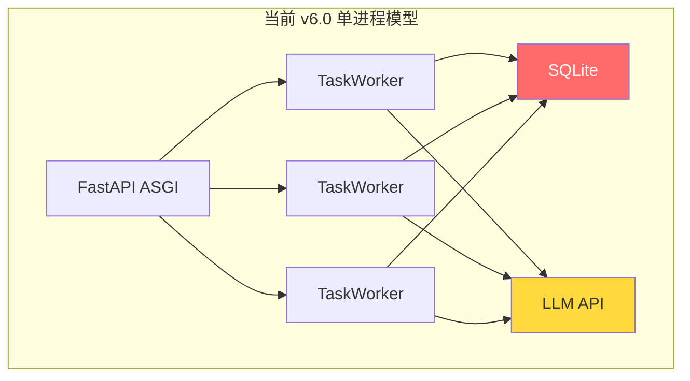

| 组件 | 并发模型 | 瓶颈性质 |
|------|----------|----------|
| FastAPI ASGI | 单进程多协程 (uvicorn) | CPU 密集型任务阻塞事件循环 |
| SQLite | 单写锁 (WAL 模式改善读并发) | **核心瓶颈**：写操作串行化 |
| LangGraph Agent | 每个 Workflow Node 同步阻塞 | 长链路 SOP 阻塞 worker |
| LLM API | HTTP 连接池 | 受限于 API provider rate limit |
| Skill/MCP 调用 | 同步调用链 | 无超时/熔断/降级 |

#### 量化承载上限

基于 v6.0 设计文档中的架构，进行承载能力推算：

| 并发 Workflow 数 | SQLite 写 TPS（~50-100） | 单节点瓶颈 | 结论 |
|:---:|:---:|:---:|:---:|
| 10 | 约 10 writes/s | 无 | ✅ 正常运行 |
| 50 | 约 50 writes/s | SQLite 写锁争用开始 | ⚠️ P99 延迟上升 |
| 100 | 约 100 writes/s | **SQLite 写饱和** | 🔴 写入失败率 > 5% |
| 200 | 约 200 writes/s | SQLite + 内存 + CPU | 🔴 系统不可用 |
| 500+ | — | 全链路崩溃 | 🔴 架构性不可达 |

**结论**：当前架构承载上限约 **50-80 个并发 Workflow**（假设每个 Workflow 平均 10 个节点，每节点 1-2 次 DB 写操作），距离"数百并发"的目标差距约 **3-5 倍**。

---

### 2.2 瓶颈识别与断裂点预测

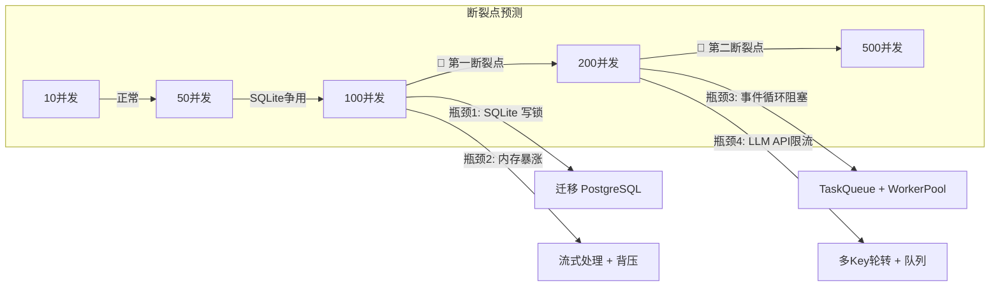

#### 断裂点详情

| # | 断裂点 | 并发阈值 | 表现 | 根因 |
|---|--------|:---:|------|------|
| **B1** | SQLite 写饱和 | ~80-100 | 任务创建超时、状态更新丢失 | 单写锁串行化所有写操作，WAL 模式只缓解读 |
| **B2** | 事件循环阻塞 | ~100-150 | API 响应 P99 > 10s | LangGraph 同步执行阻塞 asyncio 事件循环 |
| **B3** | 内存 OOM | ~150-200 | Worker 进程被 kill | Agent 上下文累积 + 多 Workflow 并行 + 无流式清理 |
| **B4** | LLM API 限流 | 取决于 Token 预算 | 调用返回 429 | 单一 API Key 无法支撑并发调用 |
| **B5** | Skill/MCP 超时 | ~100 | 外部调用雪崩 | 无超时/熔断/重试机制 |

---

### 2.3 可扩展性改进方案

#### 2.3.1 最小改进（支撑 100-200 并发）— Phase 2 必须实施

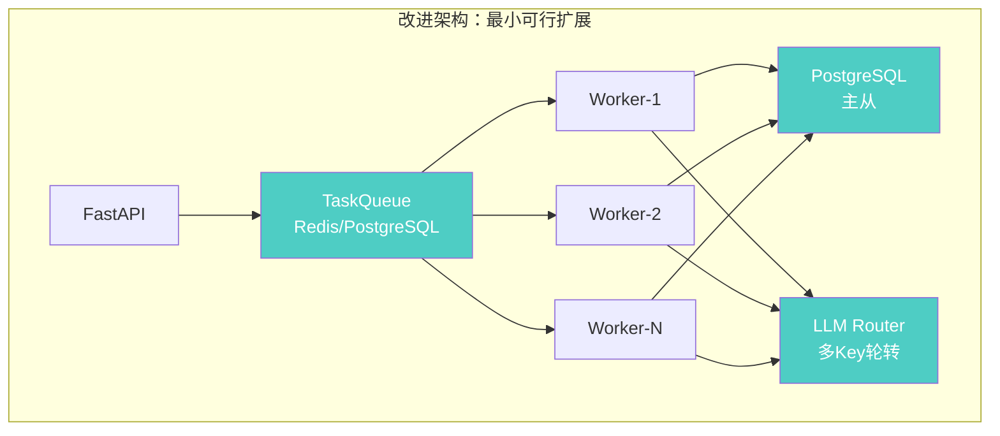

| 改进项 | 收益 | 代价 | 优先级 |
|--------|------|------|:---:|
| **SQLite → PostgreSQL** | 写并发从 50→5000 TPS | 部署复杂度 +1，需迁移脚本 | 🔴 P0 |
| **引入 TaskQueue**（Redis/PostgreSQL LIST） | 解耦提交与执行，支持 backpressure | 增加 Redis 依赖 | 🔴 P0 |
| **Worker 进程池**（多 Process） | 隔离 CPU 密集型任务 | 进程间通信开销 | 🟡 P1 |
| **LLM Key Pool + 速率限制** | 提升 LLM 调用并发 3-5x | 需多个 API Key 轮转 | 🟡 P1 |
| **Skill/MCP 超时+重试** | 防止外部调用雪崩 | 需实现 ResiliencePipeline | 🟡 P1 |

#### 2.3.2 目标架构（支撑 500+ 并发）— Phase 3-4

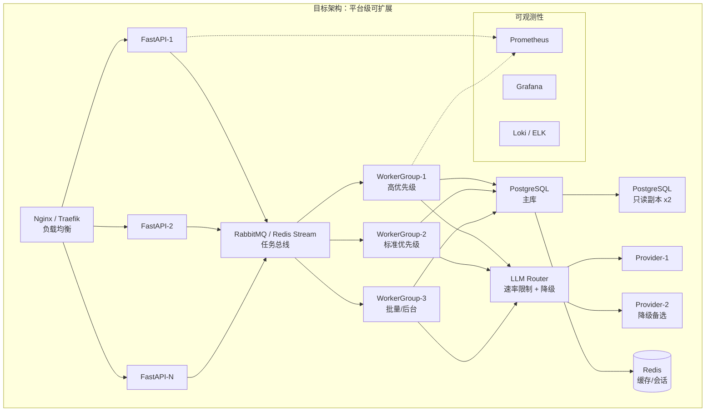

#### 2.3.3 关键架构决策

| 决策点 | 推荐方案 | 理由 |
|--------|----------|------|
| 消息队列选型 | **Redis Stream**（Phase 2）→ **RabbitMQ**（Phase 3+） | Phase 2 最小依赖，Phase 3 需持久化+死信队列 |
| 数据库 | **PostgreSQL** + pgBouncer | 成熟、运维简单、支持全文检索 |
| 异步执行 | **Celery** 或 **独立 Worker 进程 + Redis Queue** | LangGraph 运行在独立进程中，不阻塞 API 事件循环 |
| 水平扩展策略 | **无状态 API + 有状态 Worker** | API 层可随意扩缩；Worker 按 Workflow 类型分池 |

---

## 三、多租户与隔离审核（20%）

### 3.1 当前架构对多租户的支持状态

**当前状态：零多租户支持。** v6.0 设计文档中没有任何租户隔离机制，TaskContext 中没有 `tenant_id`，数据库 schema 中没有租户字段。这是一个从"单用户工具"直接跨越到"多租户SaaS平台"的架构缺口。

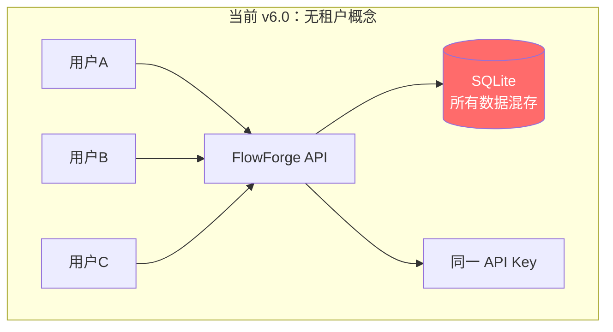

**核心缺口清单**：

| 缺失能力 | 影响 | 严重度 |
|----------|------|:---:|
| 租户标识（tenant_id） | 无法区分用户数据 | 🔴 |
| 数据隔离（行级/库级/schema级） | 数据泄露风险 | 🔴 |
| 资源配额（CPU/内存/并发数/API调用） | 租户间资源争抢 | 🔴 |
| API Key 隔离 | 用户A可使用用户B的Key | 🔴 |
| 计费与用量统计 | 无法商业化 | 🟡 |
| 模板市场权限 | 模板分享无权限边界 | 🟡 |

---

### 3.2 SaaS 多租户架构设计

#### 3.2.1 租户隔离方案选型：行级隔离（Shared Database, Shared Schema）

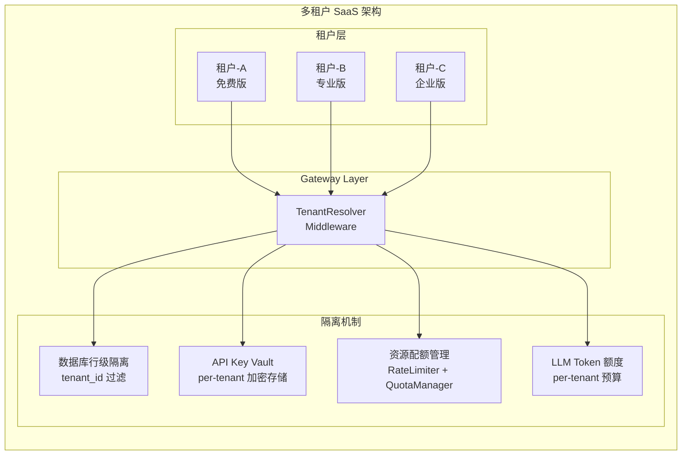

#### 3.2.2 数据库多租户方案对比

| 方案 | 隔离强度 | 运维成本 | 资源利用率 | 推荐场景 |
|------|:---:|:---:|:---:|------|
| **行级隔离**（Shared DB, Shared Schema, tenant_id） | ⭐⭐ | ⭐⭐⭐ | ⭐⭐⭐ | SaaS 标准版（推荐） |
| **Schema 隔离**（Shared DB, Separate Schema） | ⭐⭐⭐ | ⭐⭐ | ⭐⭐ | 企业私有部署 |
| **库级隔离**（Separate DB per Tenant） | ⭐⭐⭐⭐ | ⭐ | ⭐ | 金融/政务等高合规场景 |

**推荐路径**：Phase 2 采用**行级隔离**，Phase 3 企业版支持**Schema 隔离**选项，Phase 4 高合规场景支持**库级隔离**。

#### 3.2.3 核心多租户组件设计

```python
# 租户上下文注入（Middleware）
class TenantContext:
    tenant_id: str
    tier: TenantTier          # FREE / PRO / ENTERPRISE
    quotas: QuotaLimits
    api_key_vault_id: str
    
# 资源配额模型
class QuotaLimits:
    max_concurrent_workflows: int    # 免费版: 2, 专业版: 20, 企业版: 100
    max_workflows_per_day: int       # 免费版: 10, 专业版: 200, 企业版: unlimited
    max_llm_tokens_per_month: int    # 免费版: 100K, 专业版: 5M, 企业版: 50M
    max_skills: int                  # 免费版: 5, 专业版: 50, 企业版: unlimited
    max_team_members: int            # 免费版: 1, 专业版: 10, 企业版: unlimited
    marketplace_access: bool         # 免费版: False, 专业版+: True
    
# 数据库行级隔离
# 所有核心表增加 tenant_id 列
# Repository 层自动注入 WHERE tenant_id = current_tenant()
class TenantFilteredRepository(BaseRepository):
    async def find_all(self, **filters):
        filters["tenant_id"] = get_current_tenant_id()
        return await super().find_all(**filters)
```

#### 3.2.4 API Key 多租户隔离

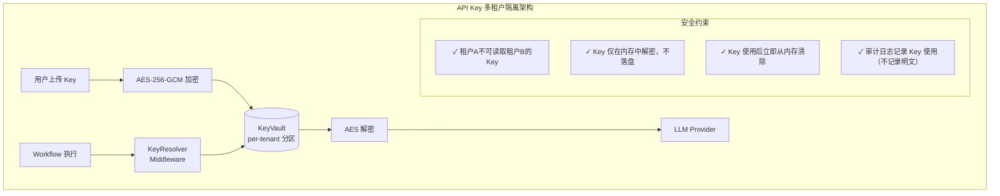

---

### 3.3 企业私有部署架构

Phase6/8 商业计划中"企业私有部署 ¥5-50万/年"的定价需要配套的架构支撑。

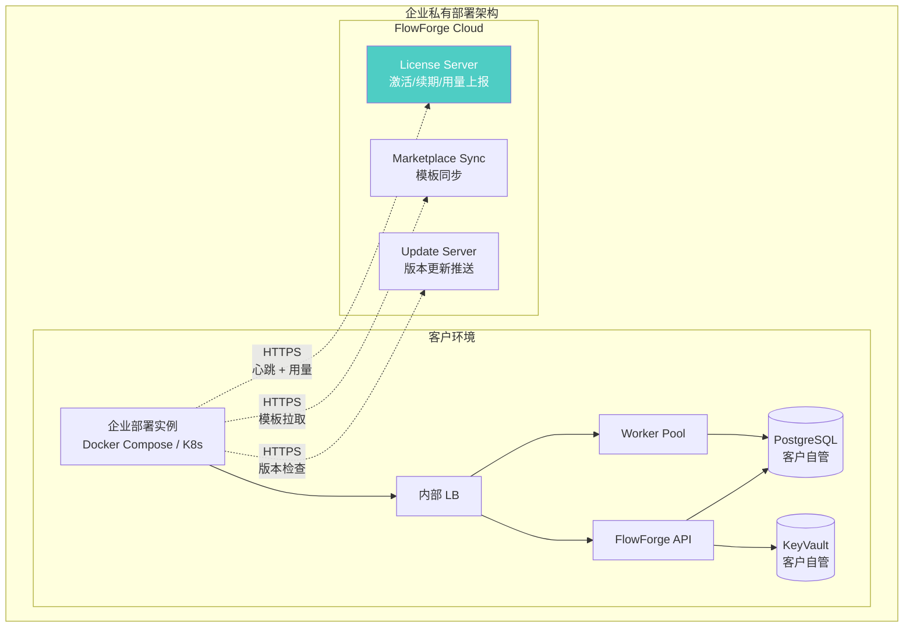

#### 企业部署关键设计

| 组件 | 设计要点 |
|------|----------|
| **License Server** | 离线容忍 7 天，超期功能降级（不中断）；License 绑定硬件指纹 |
| **配置注入** | 企业部署通过 `enterprise.yaml` 覆盖 SaaS 默认配置 |
| **SSO 集成** | 支持 LDAP / SAML / OIDC 企业身份认证 |
| **审计日志** | 本地存储 + 可选上报到 FlowForge Cloud |
| **数据主权** | 所有数据存储在客户侧，不上传到 FlowForge Cloud |
| **网络策略** | 支持气隙部署（完全离线），模板市场通过离线包同步 |

---

### 3.4 模板市场架构

Phase6/8 商业计划中"交易抽佣 15%"的模板市场需要专门的架构设计。

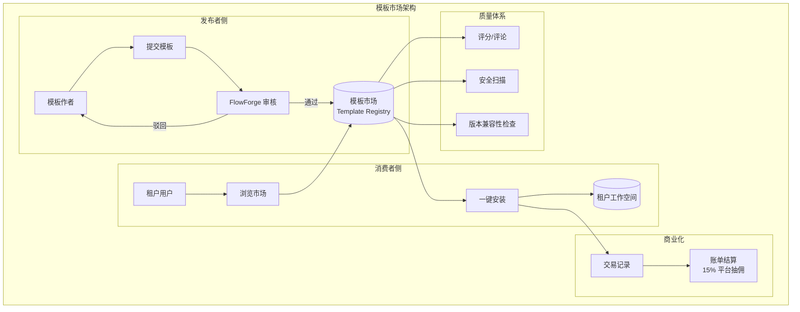

#### 模板市场数据模型

```python
class MarketplaceTemplate:
    template_id: str
    author_tenant_id: str          # 发布者
    name: str
    description: str
    category: TemplateCategory     # WORKFLOW / SKILL / AGENT / MCP
    price: Decimal                 # 0 = 免费, >0 = 付费
    version: str                   # 语义化版本
    flowforge_version_range: str   # ">=1.0,<2.0"
    
    # 模板内容
    yaml_definition: str           # 加密存储
    icon_url: str
    demo_video_url: str | None
    
    # 质量指标
    install_count: int
    avg_rating: float
    verified: bool                 # FlowForge 官方认证
    security_scan_passed: bool
    
    # 审计
    created_at: datetime
    updated_at: datetime
```

#### 模板安全扫描清单

| 扫描项 | 检测内容 |
|--------|----------|
| **代码注入** | YAML 中是否包含 eval/exec/os.system 等危险函数 |
| **API 外泄** | 是否硬编码 API Key / Token |
| **文件访问** | Skill 是否访问越权路径 |
| **网络调用** | 是否向未知外部地址发起请求 |
| **依赖安全** | 引用的 Python 包是否有已知 CVE |

---

## 四、可靠性与容错审核（20%）

### 4.1 Harness 层可靠性评估

v6.0 的 Harness 层包含四个核心组件：

| 组件 | v6.0 设计 | 生产就绪度 | 评价 |
|------|-----------|:---:|------|
| **ContextEngine** | 上下文窗口管理，滑动窗口 + 摘要压缩 | ⭐⭐⭐ | 设计合理，需补充 token 预算强制约束 |
| **ArchitectureConstraintEngine** | SOP 步骤约束 + 模式锁定 | ⭐⭐⭐ | 核心突破，需补充约束违规的自动熔断 |
| **FeedbackLoop**（内外环） | 内环（实时调整）+ 外环（全局总结） | ⭐⭐ | 设计方向正确，但缺重试/回退/降级策略 |
| **EntropyManager** | 熵值监控，混乱度阈值告警 | ⭐ | **最薄弱环节**，缺乏可操作的熵度量 |

#### 4.1.1 FeedbackLoop 深度评估

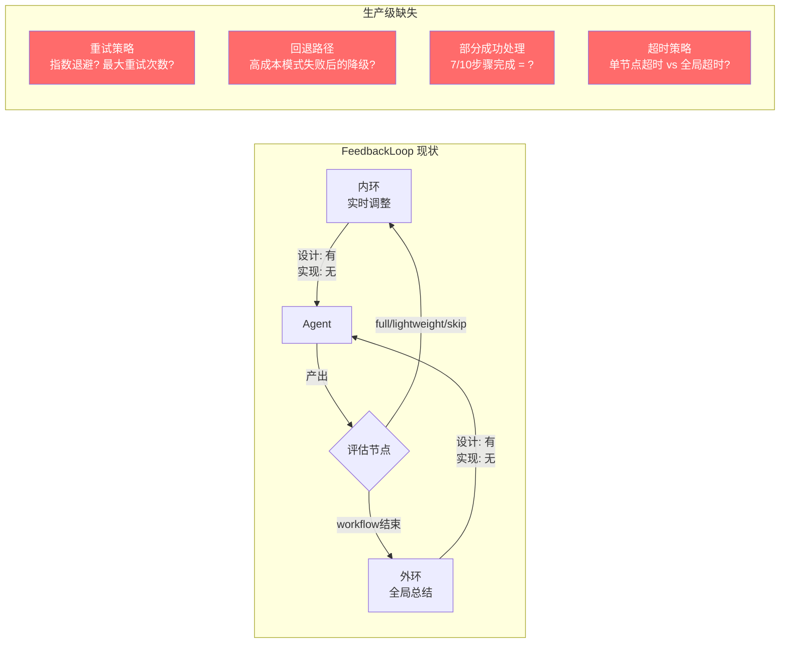

**具体缺口**：

| 缺口 | 当前状态 | 生产要求 | 风险 |
|------|----------|----------|------|
| **重试策略** | 未定义 | 指数退避（1s→2s→4s→8s），最大3次 | 瞬时失败导致 Workflow 整体失败 |
| **模式降级** | 未定义 | Plan-Execute 失败 → ReAct fallback | 复杂任务无替代路径 |
| **LLM 故障切换** | 未定义 | Provider A 不可用 → Provider B 自动切换 | 单点 LLM 故障导致全平台停服 |
| **部分成功** | 未定义 | 支持 partial_completed 状态 + 手动干预 | 前功尽弃，用户体验极差 |
| **幂等性** | 未定义 | 同一请求重试不产生副作用 | 重复扣费、重复发布 |
| **检查点恢复** | design.md 有提及 | 从中间节点恢复而非从头重跑 | 长 Workflow 失败代价过高 |

#### 4.1.2 EntropyManager 深度评估

EntropyManager 是 Harness 层最薄弱的一环。v6.0 定义了一个"熵值阈值"概念（`entropy_threshold > 0.8 → 触发干预`），但**熵值如何度量没有可操作的实现方案**。

```python
# v6.0 中的 EntropyManager（伪代码分析）
class EntropyManager:
    def evaluate(self, context: TaskContext) -> EntropyLevel:
        # 文档中"基于信息论，通过token分布、环路率、决策树深度计算"
        # 实际上：没有具体的 token 分布计算方法
        # 实际上：没有环路率的统计算法
        # 实际上：决策树深度与 Agent 质量的因果关系未经验证
        ...
```

**关键问题**：

| 问题 | 说明 |
|------|------|
| **度量不可操作** | "token分布、环路率、决策树深度"是学术概念，工程上无法精确量化 |
| **阈值无依据** | 0.8 的阈值从何而来？基于什么实验数据？ |
| **干预手段单一** | 达到阈值后"暂停让用户介入"是唯一手段，没有自动降级 |
| **误报率未知** | 正常复杂任务可能被误判为"高熵" |

---

### 4.2 缺失的可靠性机制

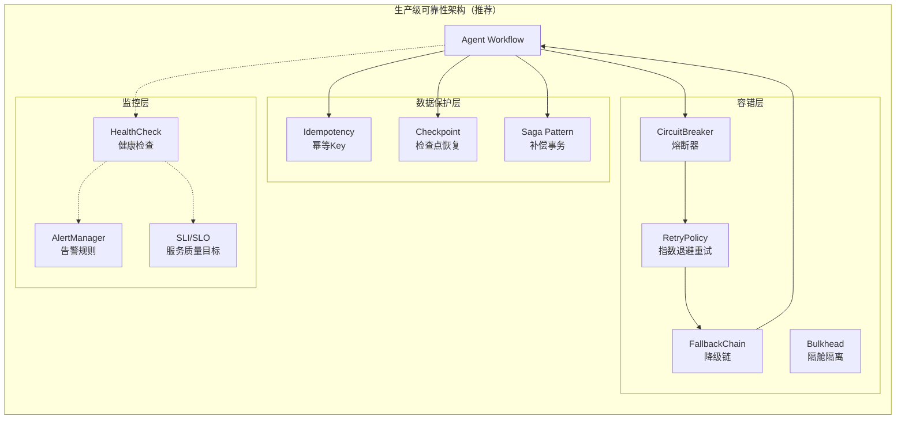

#### 推荐 SLO 目标

| SLI | SLO 目标 | 测量方式 |
|-----|----------|----------|
| Workflow 提交成功率 | ≥ 99.5% | `submitted / (submitted + rejected)` |
| Workflow 完成率 | ≥ 95% | `completed / submitted`（排除用户取消） |
| API P99 延迟 | ≤ 2s | Gateway middleware 采集 |
| LLM 调用可用率 | ≥ 99.9% | 多 Provider 聚合 |
| 检查点恢复成功率 | ≥ 98% | `resumed / resume_attempts` |

---

### 4.3 生产级可靠性架构

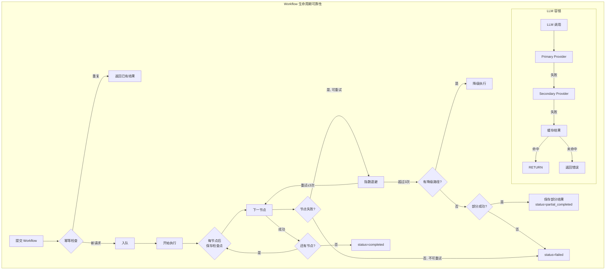

---

## 五、安全架构审核（15%）

### 5.1 API 密钥管理

#### 现状问题

v6.0 设计文档中 API Key 管理存在若干安全缺陷：

| 问题 | 严重度 | 说明 |
|------|:---:|------|
| **无加密存储方案** | 🔴 | design.md 中的 KeyVault 未定义加密算法 |
| **Key 在 TaskContext 中明文传递** | 🔴 | 14 个字段的 TaskContext 包含明文 API Key |
| **无密钥轮转机制** | 🟡 | 密钥泄露后无法快速撤销/轮转 |
| **无最小权限原则** | 🟡 | LLM Key 拥有全部模型权限，无法按 Workflow 限定 |
| **无使用审计** | 🟡 | 无法追溯哪个 Workflow/租户在何时使用了哪个 Key |

#### 推荐方案：分层密钥管理

```mermaid
graph TD
    subgraph "密钥管理架构"
        subgraph "存储层"
            MEK[Master Encryption Key<br/>环境变量 / KMS] --> DEK[Data Encryption Key<br/>内存中生成]
            DEK --> EKEY[加密的 API Key<br/>AES-256-GCM]
            EKEY --> DB[(PostgreSQL<br/>encrypted_api_key 列)]
        end
        
        subgraph "运行时"
            WF[Workflow 执行] --> KRES[KeyResolver]
            KRES --> DECRYPT[内存解密<br/>用完即焚]
            DECRYPT --> LLM[LLM Provider]
            
            KRES --> AUDIT[审计日志<br/>SHA256(key_fingerprint)]
        end
        
        subgraph "管理"
            ROTATE[密钥轮转<br/>30天自动] --> REENC[重新加密所有 Key]
            REVOKE[密钥撤销<br/>即时生效] --> MARK[标记为已撤销]
        end
    end
```

---

### 5.2 用户数据隔离

#### 多层级数据隔离

| 层级 | 机制 | 适用场景 |
|------|------|----------|
| **网络层** | VPC / 安全组 | 企业私有部署 |
| **应用层** | TenantContext Middleware + Repository tenant_id 过滤 | SaaS 标准版 |
| **数据库层** | Row-Level Security (PostgreSQL RLS) | 强制隔离（双重保障） |
| **存储层** | per-tenant 加密密钥（分离的 DEK） | 企业版 |

```sql
-- PostgreSQL Row-Level Security 示例
ALTER TABLE workflows ENABLE ROW LEVEL SECURITY;
CREATE POLICY tenant_isolation ON workflows
    USING (tenant_id = current_setting('app.current_tenant_id')::uuid);
```

#### 数据访问审计

| 审计事件 | 记录内容 |
|----------|----------|
| 数据读取 | who, what_table, when, query_hash |
| 数据修改 | who, what_table, what_row, old_value_hash, new_value_hash, when |
| Key 使用 | who, key_fingerprint (SHA256), when, workflow_id |
| 导出操作 | who, what_data, format, when, ip |

---

### 5.3 合规体系（AIGC 法规 / 算法备案 / 等保）

Phase7 明确提到了四项合规要求，但架构设计中缺乏对应的技术实现。

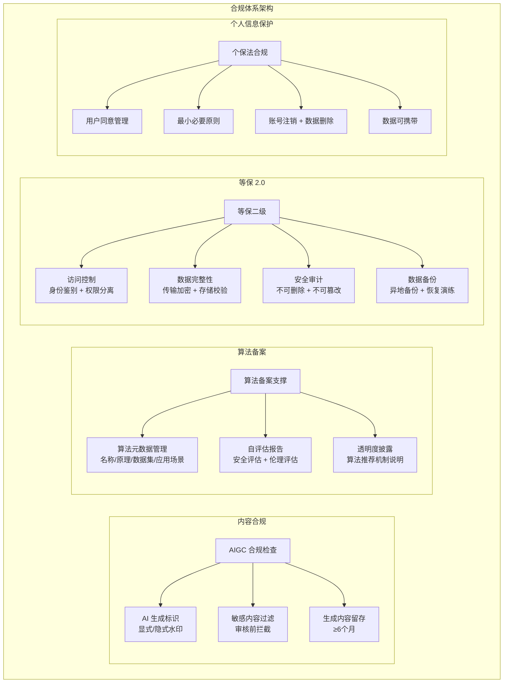

#### 合规功能需求映射

| 合规要求 | 功能需求 | 实现优先级 |
|----------|----------|:---:|
| **AIGC 标识** | 所有 AI 生成内容标记 `🤖 AI Generated` + 元数据水印 | 🔴 P0（上线前必须） |
| **内容留存** | 输入+输出日志留存 ≥6 个月，不可删除 | 🔴 P0 |
| **算法备案** | 算法名称/原理/应用场景的元数据管理系统 | 🟡 P1（上线后 30 天内） |
| **安全评估** | 自评估报告生成 + 定期更新提醒 | 🟡 P1 |
| **等保二级** | 4A（认证/授权/审计/账号）+ 传输加密 + 备份 | 🟡 P1（上线后 60 天内） |
| **个保法** | 隐私政策 + 用户同意 + 数据删除 + 数据导出 | 🔴 P0 |
| **ICP 备案** | 非技术需求，法务/行政流程 | 🔴 P0（上线前） |
| **敏感内容过滤** | 输入和输出两端敏感词检测 + 拦截 | 🔴 P0 |

---

## 六、基础设施现实性审核（20%）

### 6.1 Docker Compose 生产可行性

#### 当前 Phase7 部署方案

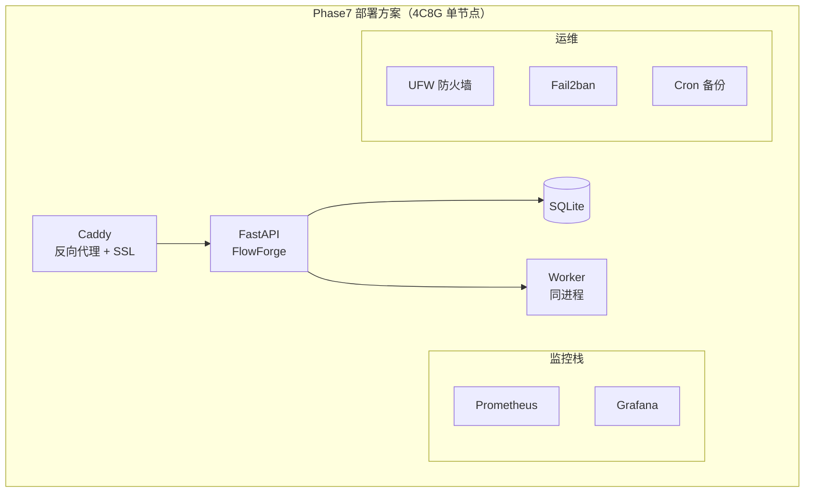

#### Docker Compose 生产可行性评估

| 评估维度 | 结论 | 说明 |
|----------|:---:|------|
| **MVP/Alpha 阶段** | ✅ 可行 | 单节点足够支撑初始用户（< 50 并发 Workflow） |
| **Beta 阶段（50-200 用户）** | ⚠️ 勉强 | SQLite 成为瓶颈，需迁移 PostgreSQL；无自动扩缩容 |
| **正式商业运营（500+ 用户）** | 🔴 不可行 | 单点故障、无负载均衡、无法滚动更新、备份恢复粗放 |
| **企业 SLA（99.9% 可用性）** | 🔴 完全不可行 | 无冗余、无自动故障转移、计划维护需停机 |

#### Docker Compose 的具体局限

| 局限 | 对 FlowForge 的影响 |
|------|---------------------|
| **单节点故障** | 服务器宕机 = 全平台不可用，无 HA |
| **无自动扩缩** | 并发 Workflow 突增时无法自动增加 Worker |
| **滚动更新困难** | 更新版本 = 短暂停机（`docker compose down && up`） |
| **日志管理** | 本地文件存储，无集中式日志聚合 |
| **密钥管理** | `.env` 文件明文存储，无 KMS 集成 |
| **备份粗放** | `cron` 脚本备份 SQLite 文件，无增量备份/时间点恢复 |

---

### 6.2 服务器规格现实性

#### Phase7 提案 vs 现实需求

Phase7 的服务器方案：**4C8G ¥200-400/月** 运行三款产品（FlowForge + OpenRoute + OpenSieve）

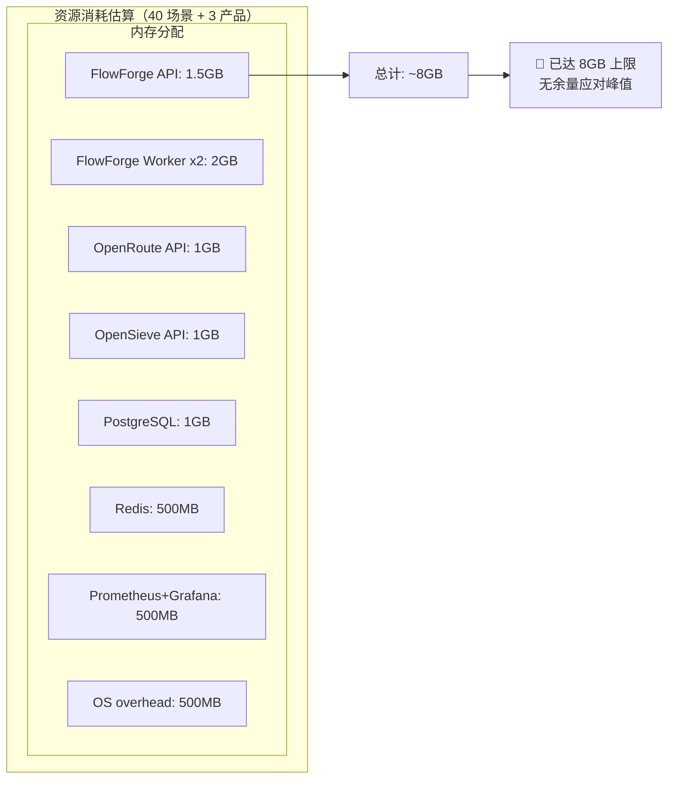

#### 现实性分析

| 组件 | 内存消耗 | CPU 消耗 | 备注 |
|------|:---:|:---:|------|
| FlowForge API (FastAPI) | ~500MB 空闲 / ~1.5GB 负载 | 1-2 核 | Python 进程内存 |
| FlowForge Worker x2 | ~1GB each | 1 核 each | Agent 执行内存峰值高 |
| PostgreSQL | ~500MB 空闲 / ~1GB 负载 | 0.5 核 | shared_buffers |
| Redis | ~200MB | 0.2 核 | 缓存 + 消息队列 |
| OpenRoute (复用 LLM 路由) | ~300MB | 0.3 核 | 轻量代理 |
| OpenSieve (复用 HelixRAG) | ~500MB | 0.5 核 | 检索服务 |
| Prometheus + Grafana | ~300MB | 0.3 核 | 监控 |
| **合计（空闲）** | **~3.5GB** | **~2 核** | |
| **合计（中等负载）** | **~6GB** | **~3 核** | |
| **合计（峰值负载）** | **~8-9GB** | **~3.5 核** | 🔴 **超限** |

**结论**：4C8G 配置在同时运行三款产品 + 40 场景时**不够用**。建议：

| 阶段 | 服务器配置 | 月成本 | 适用场景 |
|------|:---:|:---:|------|
| **MVP（Phase 2）** | 4C8G | ¥200-400 | 单产品 FlowForge + 10 场景测试 |
| **Beta（Phase 3）** | **8C16G** | ¥500-800 | 三产品 + 40 场景，支撑 50 并发 |
| **正式运营** | **8C16G x2**（主备） | ¥1200-1600 | HA 部署 + 200 并发 |
| **规模化** | K8s 集群 3+ 节点 | ¥3000+/月 | 500+ 并发 + 企业 SLA |

---

### 6.3 K8s 迁移路径

#### 三阶段迁移策略

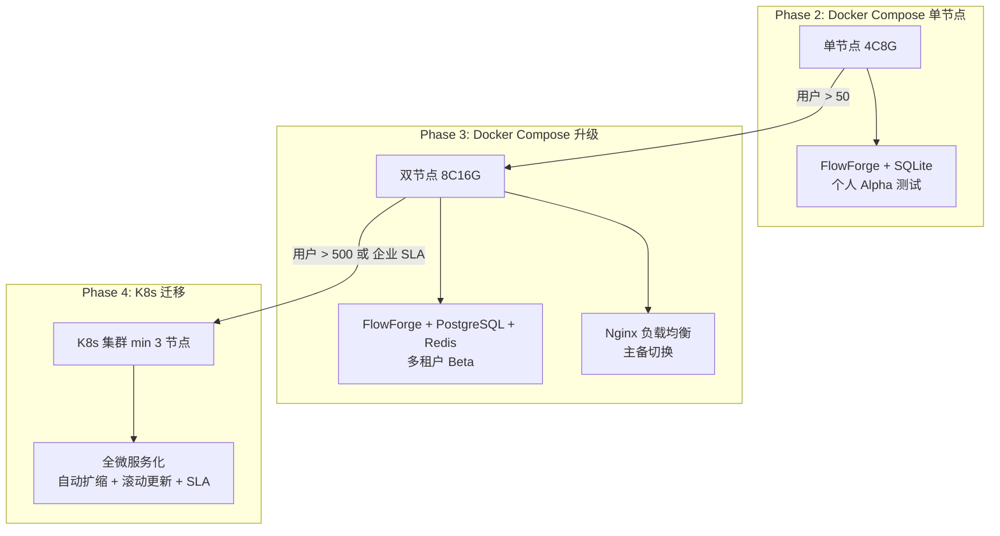

#### K8s 迁移检查清单

| 前置条件 | 说明 | 负责 |
|----------|------|:---:|
| 所有服务容器化并推送到 Registry | 已在 v6.0 完成 | ✅ |
| 无状态 API 层 | session 移至 Redis | 🔴 待改造 |
| 健康检查端点 | `/health` + `/ready` | 🟡 需补充 |
| 配置外部化 | 所有配置通过 ConfigMap/Secret | 🟡 需改造 |
| 持久化存储 | PostgreSQL StatefulSet + PVC | 🟡 需改造 |
| CI/CD 集成 | GitHub Actions → ArgoCD | 🟡 需改造 |
| 可观测性 | 对标 OpenTelemetry | 🟡 需改造 |

#### 推荐 K8s 部署拓扑（Phase 4）

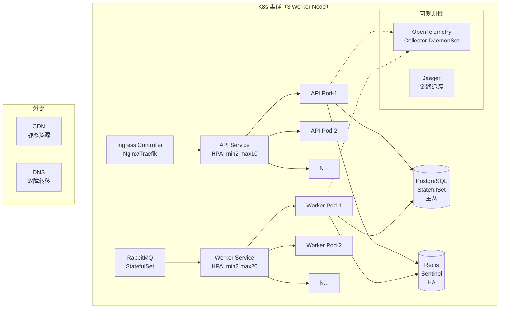

---

## 七、综合评分与优先行动

### 7.1 五维度评分汇总

| 维度 | 权重 | v6.0 评分 | 评语 |
|------|:---:|:---:|------|
| **架构可扩展性** | 25% | **4.5/10** | 六层分层设计优秀，但无分布式执行、无队列、SQLite 瓶颈 |
| **多租户与隔离** | 20% | **1.5/10** | 零多租户支持，无 tenant_id、无资源配额、无计费 |
| **可靠性与容错** | 20% | **4.0/10** | Harness 理念先进，但缺重试/降级/幂等/熔断/检查点 |
| **安全架构** | 15% | **4.0/10** | 无 Key 加密、无审计、无合规体系 |
| **基础设施现实性** | 20% | **5.0/10** | Docker Compose MVP 可行，但 4C8G 不足以支撑三产品，K8s 路径清晰 |
| **加权总分** | **100%** | **3.8/10** | 架构理论 7/10，但工程实现与生产就绪度差距巨大 |

### 7.2 架构能力成熟度路线

| 能力 | Phase 2 (MVP) | Phase 3 (Beta) | Phase 4 (正式运营) |
|------|:---:|:---:|:---:|
| 并发 Workflow | 10-20 | 50-100 | 500+ |
| 租户数 | 1（单用户） | 20-50 | 500+ |
| 数据库 | SQLite | PostgreSQL | PostgreSQL + Redis |
| 部署 | Docker Compose 单节点 | Docker Compose 双节点 | K8s 集群 |
| 可用性 | 尽力而为 | 99% | 99.9% |
| 安全 | 基础 TLS | 租户隔离 + Key 加密 | 全合规体系 |
| 模板市场 | ❌ | 基础版 | 完整市场 + 交易 |

### 7.3 🔴 P0 阻塞项（上线前必须解决）

| # | 阻塞项 | 当前状态 | 解决方案 | 预估工作量 |
|---|--------|----------|----------|:---:|
| 1 | **数据库选型** | SQLite | 迁移 PostgreSQL，增加 tenant_id | 3 天 |
| 2 | **租户隔离** | 不存在 | tenant_id 全局注入 + Repository 过滤 | 2 天 |
| 3 | **API Key 加密** | 明文存储 | AES-256-GCM + 内存解密 | 1 天 |
| 4 | **AIGC 标识** | 不存在 | 输出标记 + 内容留存 | 1 天 |
| 5 | **敏感内容过滤** | 不存在 | 关键词过滤 + 正则 + 外部审核 API | 2 天 |
| 6 | **TaskQueue 解耦** | API 内同步执行 | Redis Queue + Worker 进程池 | 3 天 |

### 7.4 🟡 P1 高优先级（Beta 前必须解决）

| # | 项目 | 预估工作量 |
|---|------|:---:|
| 1 | 资源配额管理（per-tenant 并发/Token 限制） | 2 天 |
| 2 | 重试策略 + 熔断器 + 降级链 | 3 天 |
| 3 | 幂等性支持（幂等 Key + 去重） | 1 天 |
| 4 | 检查点恢复（从中间节点恢复） | 3 天 |
| 5 | 算法备案元数据管理系统 | 2 天 |
| 6 | 等保二级基础合规（4A + 审计 + 备份） | 5 天 |
| 7 | 服务器升级到 8C16G | 0.5 天 |
| 8 | 模板市场 MVP（浏览 + 安装 + 基础评分） | 5 天 |

### 7.5 🟢 P2 优化项（正式运营前）

| # | 项目 | 预估工作量 |
|---|------|:---:|
| 1 | K8s 迁移（Helm Chart + CI/CD） | 10 天 |
| 2 | PostgreSQL 主从 + 读写分离 | 2 天 |
| 3 | Redis Sentinel HA | 1 天 |
| 4 | OpenTelemetry 全链路追踪 | 3 天 |
| 5 | 企业 SSO（LDAP/SAML/OIDC） | 3 天 |
| 6 | 企业气隙部署支持 | 5 天 |
| 7 | 模板安全扫描引擎 | 5 天 |
| 8 | 计费与账单系统 | 5 天 |

---

> **审核总结**：FlowForge v6.0 在 Agent 系统工程理论层面表现优秀，Harness 四根护栏 + 九模式执行的设计展现了前沿思维。但"平台化 + 商业化"目标需要在**数据库、多租户、可靠性、安全性、基础设施**五个维度进行系统性补强。P0 阻塞项必须在 Phase 2 MVP 前解决（预估 12 人天），P1 高优先级项在 Phase 3 Beta 前解决（预估 21.5 人天），之后才能具备商业化运营的技术基础。

---

*本报告基于 spec.md v6.0、arch.md v6.0、design.md v6.0 以及 bus/Phase6~10.md 的分析编写，所有评分和建议均基于截至 2026-05-26 的代码与文档现状。*