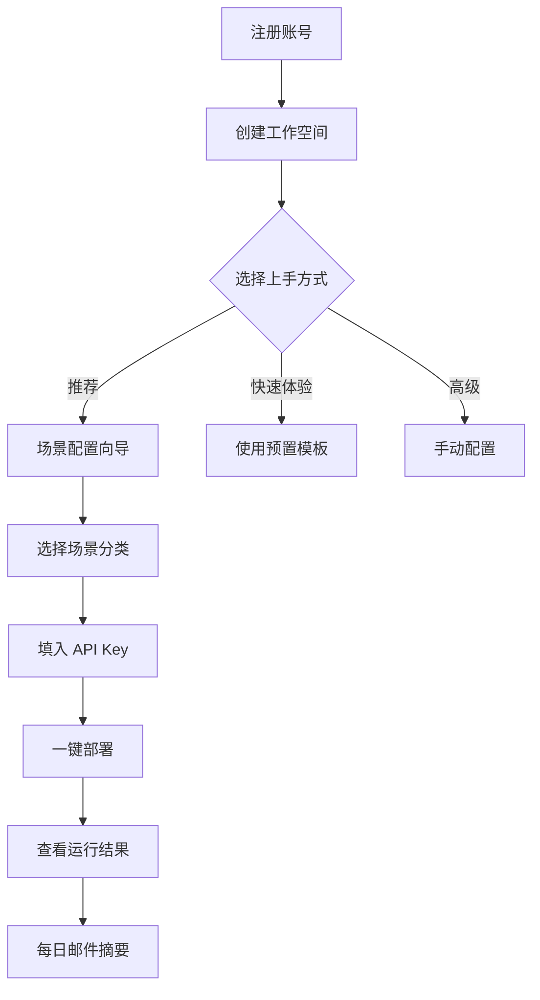

# FlowForge 全栈前端规格说明书

> **基于**：fullstack_review.md 的全栈评审发现
> **核心目标**：定义 FlowForge 前端 UI/UX 需求，弥补当前前端（约 15% 完成度）与后端（约 50% 完成度）之间的巨大差距
> **版本**：v1.0 — 2026-05-26

---

## 第一章：前端技术栈重构（P0 — 必须立即实施）

### 1.1 当前问题

当前前端使用**内联 `style={{}}` 对象**而非 Tailwind CSS 类名，**不使用 shadcn/ui 组件**。这与 spec.md 声称的 "Tailwind + shadcn/ui" 技术栈完全不符。40 个场景的 UI 无法用内联样式维护。

### 1.2 目标技术栈

| 层 | 技术 | 版本 | 用途 |
|----|------|------|------|
| 框架 | Next.js | 14.2+ | App Router + SSR |
| UI 组件库 | shadcn/ui | latest | 声明式组件（Button/Card/Dialog/Table 等） |
| CSS | Tailwind CSS | 3.4+ | 原子化样式 |
| 状态管理（服务端） | @tanstack/react-query | 5.x | API 缓存 + 自动刷新 + 乐观更新 |
| 状态管理（客户端） | zustand | 4.x | 全局 UI 状态（侧栏折叠/主题/工作空间） |
| 表单 | react-hook-form + zod | latest | 类型安全表单 + 校验 |
| 图表 | recharts | 2.x | 数据分析看板 |
| 认证 | next-auth | 5.x (Auth.js) | JWT 认证 + 会话管理 |
| 拖拽 | @dnd-kit/core | latest | Workflow 可视化编辑器 |
| 实时通信 | 原生 WebSocket | — | Solo 执行流（已有 useSoloWebSocket hook） |
| 错误监控 | @sentry/nextjs | latest | 前端错误收集 |
| 测试 | Playwright | latest | E2E 测试 |
| 类型 | TypeScript | 5.4+ | 全量类型覆盖 |

### 1.3 新增 package.json 依赖

```json
{
  "dependencies": {
    "@radix-ui/react-dialog": "^1.0.5",
    "@radix-ui/react-dropdown-menu": "^2.0.6",
    "@radix-ui/react-select": "^2.0.0",
    "@radix-ui/react-tabs": "^1.0.4",
    "@radix-ui/react-toast": "^1.1.5",
    "@radix-ui/react-tooltip": "^1.0.7",
    "@radix-ui/react-popover": "^1.0.7",
    "@radix-ui/react-slot": "^1.0.2",
    "@radix-ui/react-label": "^2.0.2",
    "@radix-ui/react-separator": "^1.0.3",
    "@radix-ui/react-switch": "^1.0.3",
    "@tanstack/react-query": "^5.0.0",
    "zustand": "^4.5.0",
    "react-hook-form": "^7.50.0",
    "@hookform/resolvers": "^3.3.0",
    "zod": "^3.22.0",
    "recharts": "^2.12.0",
    "next-auth": "5.0.0-beta",
    "@dnd-kit/core": "^6.1.0",
    "@dnd-kit/sortable": "^8.0.0",
    "@dnd-kit/utilities": "^3.2.0",
    "date-fns": "^3.6.0"
  },
  "devDependencies": {
    "tailwindcss": "^3.4.0",
    "postcss": "^8.4.0",
    "autoprefixer": "^10.4.0",
    "@sentry/nextjs": "^8.0.0",
    "@playwright/test": "^1.40.0"
  }
}
```

### 1.4 shadcn/ui 组件初始化清单

```bash
# 必须添加的 shadcn/ui 组件
npx shadcn-ui@latest add button card dialog dropdown-menu
npx shadcn-ui@latest add table badge tabs
npx shadcn-ui@latest add form input select textarea
npx shadcn-ui@latest add toast tooltip popover
npx shadcn-ui@latest add switch label separator
npx shadcn-ui@latest add sheet accordion avatar
npx shadcn-ui@latest add skeleton scroll-area command
```

---

## 第二章：40 场景的前端 UI/UX 需求矩阵

### 2.1 场景→页面映射总表

每个场景对应一个或多个前端页面。下表标识了当前缺失页面：

| 场景编号 | 场景名称 | 需要的 UI 页面 | 当前状态 | 优先级 |
|---------|---------|---------------|---------|--------|
| **全局** | 用户认证 | 登录/注册/忘记密码/工作空间选择 | 🔴 不存在 | P0 |
| **全局** | 全局导航 | 侧栏导航 + 面包屑 + 快速搜索（⌘K） | 🟡 部分存在（Sidebar.tsx） | P0 |
| A1 | 灵感记录 | 灵感看板（卡片/列表视图）+ 快速记录弹窗 | 🔴 不存在 | P0 |
| A2 | 热点追踪 | 热点监控面板（实时榜单+趋势图）+ 报告详情页 | 🔴 不存在 | P0 |
| A3 | 内容生产 | 文章创作流（Solo 面板已有基础）+ 版本对比 | 🟡 Solo 组件已有 | P1 |
| A4 | 多平台分发 | 平台账号绑定页 + 发布记录面板 + 发布预览 | 🔴 不存在 | P0 |
| A5 | 视频制作 | 视频任务管理 + 预览播放器 + 分镜审核 | 🔴 不存在 | P2 |
| A6 | SEO优化 | SEO 诊断报告页 + 优化建议卡片 | 🔴 不存在 | P1 |
| B1 | 竞品监控 | 竞品列表管理 + 动态时间线 + 对比报告 | 🔴 不存在 | P1 |
| B2 | 线索挖掘 | 线索看板（KanBan）+ 线索详情 + 评分历史 | 🔴 不存在 | P2 |
| B3 | 社媒运营 | 内容日历（日历视图）+ 定时发布队列 + 互动监控 | 🔴 不存在 | P1 |
| B4 | 广告优化 | 广告账户管理 + 投放数据看板 + 优化建议面板 | 🔴 不存在 | P2 |
| B5 | 邮件营销 | 邮件模板编辑器 + 发送列表 + 效果追踪 | 🔴 不存在 | P2 |
| B6 | KOL管理 | KOL 搜索/筛选 + 合作管理（状态流转）+ 效果评估 | 🔴 不存在 | P2 |
| C1 | AI客服 | 对话记录查看 + 知识库关联 + 转人工面板 | 🔴 不存在 | P1 |
| C2 | 线索培育 | 培育序列配置 + 触发条件设置 + 转化漏斗图 | 🔴 不存在 | P2 |
| C3 | 智能报价 | 报价方案生成 + 模板管理 + 发送记录 | 🔴 不存在 | P2 |
| C4 | 合同审核 | 合同上传 + 风险标注（高亮）+ 审核报告 + 签署追踪 | 🔴 不存在 | P1 |
| C5 | 客户成功 | 客户 360 视图 + 健康度仪表盘 + 流失预警列表 | 🔴 不存在 | P2 |
| D1 | 需求管理 | 需求看板（拖拽排序）+ PRD 生成 + 优先级投票 | 🔴 不存在 | P1 |
| D2 | 代码开发 | DevForge 集成（已有 DevForge 独立 UI） | 🟡 DevForge 已独立 | P2 |
| D3 | 测试保障 | 测试用例面板 + 结果矩阵 + 覆盖率报告 | 🔴 不存在 | P2 |
| D4 | 文档生成 | 文档版本树 + 变更对比（Diff View）+ 发布管理 | 🔴 不存在 | P2 |
| D5 | Bug修复 | Bug 看板（优先级/状态）+ 自动修复 PR 列表 | 🔴 不存在 | P2 |
| D6 | 开源维护 | Issue/PR 分类面板 + 自动回复规则配置 | 🔴 不存在 | P2 |
| E1 | 智能记账 | 票据上传 + 凭证列表 + 分类统计图 | 🔴 不存在 | P1 |
| E2 | 税务计算 | 税种配置 + 申报表生成 + 申报日历 | 🔴 不存在 | P2 |
| E3 | 发票管理 | 发票 OCR 上传 + 查验结果 + 到期提醒 | 🔴 不存在 | P2 |
| E4 | IP保护 | 监控关键词配置 + 侵权检测结果 + 维权函生成 | 🔴 不存在 | P2 |
| E5 | 隐私合规 | 合规扫描结果 + 风险项标注 + 修复建议 | 🔴 不存在 | P2 |
| F1 | AI招聘 | 职位管理 + 简历筛选（评分排序）+ 面试安排日历 | 🔴 不存在 | P2 |
| F2 | 入职培训 | 学习路径编辑 + 进度仪表盘 + 测验管理 | 🔴 不存在 | P2 |
| F3 | 绩效管理 | OKR/KPI 配置 + 进度看板 + 评估报告 | 🔴 不存在 | P2 |
| F4 | 会议纪要 | 录音上传 + 纪要编辑 + 待办同步 | 🔴 不存在 | P2 |
| G1 | 经营分析 | 综合数据看板（图表仪表盘）+ 日报/周报推送 | 🔴 不存在 | P1 |
| G2 | A/B测试 | 实验配置 + 实时数据 + 显著性结论 | 🔴 不存在 | P2 |
| G3 | 反馈分析 | 反馈聚合面板 + 情感趋势图 + 主题词云 | 🔴 不存在 | P1 |
| G4 | 库存管理 | 库存看板 + 采购单生成 + 物流追踪 | 🔴 不存在 | P2 |
| G5 | 收入归集 | 多渠道收入仪表盘 + 对账面板 + 异常预警 | 🔴 不存在 | P2 |
| H1 | 社群运营 | 成员管理 + 内容排期 + 活跃度仪表盘 | 🔴 不存在 | P2 |
| H2 | NPS调研 | 调研配置 + 实时结果 + 分群分析 | 🔴 不存在 | P2 |
| H3 | 知识库 | FAQ 编辑器 + 搜索测试 + 覆盖率报告 | 🔴 不存在 | P1 |
| **模板市场** | — | 模板浏览/搜索/详情/安装/我的模板 | 🔴 不存在 | P0 |
| **场景配置向导** | — | 40 场景 Step-by-step 配置表单 | 🔴 不存在 | P0 |
| **Skill 管理** | — | Skill 安装/启用/配置/日志 | 🔴 不存在 | P0 |
| **Workflow 编辑器** | — | 可视化 DAG 拖拽编辑器 | 🔴 不存在 | P0 |
| **定时任务管理** | — | Cron 配置 + 历史记录 + 执行日志 | 🔴 不存在 | P0 |

**统计**：
- 🔴 完全缺失：**43 个页面/面板**
- 🟡 部分存在：**4 个**
- 🟢 基本就绪：**0 个**

### 2.2 P0 优先级页面详细设计（第 1-2 周必须完成）

#### 2.2.0 用户认证系统

```
/auth/login          — 登录页（邮箱+密码 / OAuth）
/auth/register       — 注册页（邮箱验证）
/auth/forgot-password — 忘记密码
/auth/workspace      — 工作空间选择/创建
```

**核心组件**：
- `LoginForm`：使用 react-hook-form + zod 校验
- `AuthContext`：用 next-auth SessionProvider 包裹
- `ProtectedRoute`：HOC 检查认证状态
- API：对接后端 `POST /api/v1/auth/login`、`POST /api/v1/auth/register`

#### 2.2.1 仪表盘首页（重构现有 page.tsx）

现有仪表盘使用内联样式，需重写为 shadcn/ui 组件：

```tsx
// 重写后的仪表盘首页结构
<DashboardLayout>
  <PageHeader title="FlowForge 运行概览" />
  <div className="grid grid-cols-1 md:grid-cols-3 gap-4">
    <StatsCard title="活跃任务" value={status.running} icon={Activity} />
    <StatsCard title="待审核" value={status.pending_review} icon={ClipboardCheck} />
    <StatsCard title="今日 Token 消耗" value={status.today_tokens} icon={Zap} />
  </div>
  <div className="grid grid-cols-1 lg:grid-cols-3 gap-6 mt-6">
    <Card className="lg:col-span-2">
      <CardHeader><CardTitle>最近任务</CardTitle></CardHeader>
      <CardContent>
        <DataTable columns={taskColumns} data={tasks} />
      </CardContent>
    </Card>
    <Card>
      <CardHeader><CardTitle>系统健康</CardTitle></CardHeader>
      <CardContent>
        <HealthIndicator services={services} />
      </CardContent>
    </Card>
  </div>
</DashboardLayout>
```

#### 2.2.2 模板市场

```
/templates              — 模板浏览（网格/列表视图）
/templates/[id]         — 模板详情（描述/参数/评价/安装按钮）
/templates/[id]/configure — 模板参数配置向导
/my/templates           — 我的模板（已安装列表）
```

**API 合约**（后端需同步实现）：

```
GET    /api/v1/templates?category=&industry=&complexity=&page=&limit=
GET    /api/v1/templates/{id}
POST   /api/v1/templates/{id}/install
POST   /api/v1/templates/{id}/configure  → body: { params: { industry: "电商", ... } }
GET    /api/v1/my/templates
DELETE /api/v1/my/templates/{id}
POST   /api/v1/templates/{id}/reviews    → body: { rating: 4, comment: "..." }
```

**前端组件树**：
```
TemplateMarketPage
├── TemplateSearchBar (搜索 + 分类/行业/复杂度 过滤器)
├── TemplateGrid
│   └── TemplateCard[] (名称/描述/难度/价格/安装次数/评分)
└── TemplateDetailSheet (侧栏详情面板)
    ├── TemplateDescription
    ├── TemplateParamsForm (配置表单)
    └── InstallButton
```

#### 2.2.3 Workflow 可视化编辑器

基于 `@xyflow/react`（已有依赖，版本 12.10.2）实现拖拽式 DAG 编辑器：

```
/workflows              — Workflow 列表
/workflows/[id]/edit    — 可视化编辑器
/workflows/new          — 从模板新建
```

**核心功能**：
1. **节点面板**：左侧可拖拽的 Agent/Tool/Skill/Human 节点列表
2. **画布**：React Flow 画布，支持拖拽连线、节点配置
3. **属性面板**：右侧选中节点的参数配置表单
4. **模式选择器**：每个节点可指定 9 种执行模式
5. **YAML 预览/导出**：实时显示生成的 Workflow YAML

```tsx
// WorkflowEditor 核心结构
<WorkflowEditor>
  <NodePalette>  {/* 左侧 */}
    <DraggableNode type="agent" label="TopicResearch" />
    <DraggableNode type="tool" label="web_search" />
    <DraggableNode type="human" label="审核节点" />
    <DraggableNode type="parallel" label="并行组" />
  </NodePalette>
  <ReactFlow
    nodes={nodes}
    edges={edges}
    onNodesChange={onNodesChange}
    onEdgesChange={onEdgesChange}
    onConnect={onConnect}
  >
    <Background />
    <Controls />
    <MiniMap />
  </ReactFlow>
  <PropertiesPanel>  {/* 右侧 */}
    <NodeConfig selectedNode={selectedNode} />
    <ModeSelector />
  </PropertiesPanel>
</WorkflowEditor>
```

#### 2.2.4 场景配置向导（一键部署 UI）

这是 Phase10 "零代码上手" 的关键交付物。用 Step-by-step 表单替代 YAML 手写。

```
/scenarios              — 40 场景总览
/scenarios/new          — 场景配置向导
/scenarios/[id]         — 已部署场景的仪表盘
```

**配置向导流程**（以 A1 灵感记录为例）：

```tsx
// 6 步向导
<ScenarioWizard>
  <Step1_SelectScenario>  {/* 选择场景分类 */}
  <Step2_SelectMode>      {/* 选择触发方式：语音/浏览器/手动 */}
  <Step3_ConfigureTools>  {/* 配置所需 API Key（OpenRouter/OpenSieve） */}
  <Step4_SetParams>       {/* 设置参数：去重阈值/每日上限/推送时间 */}
  <Step5_Preview>         {/* 预览生成的 YAML + 确认 */}
  <Step6_Deploy>          {/* 一键部署 + 部署状态 */}
</ScenarioWizard>
```

**交互要求**：
- 每步都有"上一步"按钮
- 参数输入框旁有 `Tooltip` 解释每个参数含义
- 第 5 步显示生成的 YAML（折叠模式，高级用户可展开编辑）
- 第 6 步显示实时部署日志（WebSocket 推送）

#### 2.2.5 Skill 管理面板

```
/skills                 — Skill 列表（已安装 + 可安装）
/skills/[name]          — Skill 详情 + 配置
```

**功能**：
- 浏览可安装 Skill（从模板市场 API 拉取）
- 一键安装/卸载
- 查看 Skill 调用统计（次数/成功率/平均耗时）
- 启用/禁用开关

#### 2.2.6 定时任务管理

```
/schedules              — 定时任务列表
/schedules/new          — 新建定时任务
/schedules/[id]         — 定时任务详情 + 历史执行记录
```

**核心表单字段**：
- Cron 表达式（提供可视化 Cron 构建器：分钟/小时/日/月/周 下拉选择）
- 关联 Workflow/Skill（下拉搜索）
- 输入参数（动态表单，根据所选 Workflow 的参数 Schema 自动生成）
- 启用/暂停开关

---

## 第三章：WebSocket 实时交互需求

### 3.1 当前状态

后端 WebSocket 实现较好（`ConnectionManager` + 事件缓冲 + 序列号），前端 Solo UI 的 `useSoloWebSocket` hook 也较完整。需要扩展到更多场景。

### 3.2 需要 WebSocket 的前端页面

| 页面 | WebSocket 通道 | 推送事件 |
|------|---------------|---------|
| Solo 编辑器 | `/ws/solo/{task_id}` | 17 种事件（已完成） |
| 仪表盘 | `/ws/events` | `task.status_change`, `review.ready`, `system.health` |
| Workflow 编辑器 | `/ws/workflow/{id}` | `workflow.step_update`, `workflow.step_error` |
| 任务详情 | `/ws/tasks/{id}` | `task.progress`, `agent.thinking`, `tool.execute` |
| 场景配置向导 | `/ws/deploy/{session_id}` | `deploy.progress`, `deploy.complete`, `deploy.error` |
| 模板安装 | `/ws/install/{template_id}` | `install.progress`, `install.complete` |

### 3.3 新增通用 WebSocket Hook

```typescript
// hooks/useFlowForgeWS.ts — 通用 WebSocket hook
interface UseFlowForgeWSOptions {
  channel: string;           // WebSocket 路径
  taskId?: string;
  onEvent: (event: FlowForgeEvent) => void;
  onError?: (error: Event) => void;
  reconnect?: boolean;       // 默认 true
  maxReconnect?: number;     // 默认 10
}

function useFlowForgeWS(options: UseFlowForgeWSOptions) {
  // 连接管理 + 自动重连 + 事件分发
}
```

---

## 第四章：多租户仪表盘与分析需求

### 4.1 工作空间（Workspace）概念

FlowForge 需要多租户支持（当前代码库中 workspace 概念已存在于 `workspace.py`，但前端未接入）：

- 每个用户可创建多个工作空间
- 每个工作空间有独立的 Agent/Workflow/Skill/API Key 配置
- 工作空间之间数据隔离

### 4.2 工作空间管理 UI

```
/workspaces             — 工作空间列表
/workspaces/[id]        — 工作空间仪表盘（含用量统计）
/workspaces/[id]/settings — 工作空间设置
```

### 4.3 用量分析仪表盘

每个工作空间的独立分析页面：

| 指标 | 图表类型 | 数据来源 |
|------|---------|---------|
| Token 消耗（按模型/按天） | 堆叠面积图 | `flowforge_token_usage_total` |
| 任务执行量（按状态/按模式） | 柱状图 | `flowforge_tasks_total` |
| 工具调用分布（按工具名） | 饼图 | `flowforge_tool_calls_total` |
| 执行耗时趋势（P50/P95/P99） | 折线图 | `flowforge_execution_duration_seconds` |
| LLM API 费用（按模型/按天） | 双轴图（用量+费用） | `flowforge_token_cost_hourly` |
| 审核通过率 | 仪表盘 | 任务状态统计 |
| 场景覆盖率（40 场景启用率） | 雷达图 | 场景安装统计 |

```tsx
// 用量仪表盘核心结构
<AnalyticsDashboard workspaceId={id}>
  <DateRangePicker />  {/* 时间范围选择 */}
  <div className="grid grid-cols-1 md:grid-cols-2 lg:grid-cols-3 gap-4">
    <MetricCard title="本月 Token" value="1.2M" trend="+12%" />
    <MetricCard title="本月费用" value="¥45.80" trend="-3%" />
    <MetricCard title="场景运行中" value="18/40" trend="+2" />
  </div>
  <div className="grid grid-cols-1 lg:grid-cols-2 gap-6 mt-6">
    <Card>
      <CardHeader><CardTitle>Token 消耗趋势</CardTitle></CardHeader>
      <CardContent><AreaChart data={tokenData} /></CardContent>
    </Card>
    <Card>
      <CardHeader><CardTitle>任务执行统计</CardTitle></CardHeader>
      <CardContent><BarChart data={taskData} /></CardContent>
    </Card>
  </div>
</AnalyticsDashboard>
```

---

## 第五章：非技术用户入职体验设计

### 5.1 首次使用引导流程



### 5.2 关键 UX 要求

| 功能 | UX 要求 |
|------|---------|
| API Key 配置 | 支持从 `.env` 文件拖拽导入，或逐字段粘贴。每个 Key 旁有 "在哪获取？" 链接指向教程 |
| YAML 配置 | 默认隐藏。提供 "高级模式" 开关。错误时高亮出错行 + 显示修复建议 |
| 错误提示 | 非技术语言描述。例："连接模型失败" 而非 "HTTP 401 Unauthorized" |
| 进度展示 | 任何超过 3 秒的操作显示进度条或骨架屏 |
| 帮助入口 | 每个页面右下角固定 "?" 按钮，点击弹出场景相关帮助文档 |

### 5.3 40 场景分类浏览页

```
/scenarios
├── 内容与创作（6） → 卡片：灵感记录、热点追踪、内容生产、多平台分发、视频制作、SEO优化
├── 营销与获客（6） → ...
├── 销售与转化（5） → ...
├── 产品与研发（6） → ...
├── 财务与法务（5） → ...
├── 人事与行政（4） → ...
├── 运营与数据（5） → ...
└── 客户与社区（3） → ...
```

每个分类卡片显示：已启用场景数/总场景数、本周运行次数、最后一次运行时间。

---

## 第六章：多平台发布 UI

### 6.1 平台账号绑定页

```
/settings/platforms     — 平台账号管理
```

每个平台一个配置卡片：
- **微信公众号**：AppID + AppSecret 表单
- **小红书**：扫码登录按钮（启动 MCP 登录流程）
- **知乎**：Cookie 粘贴框
- **头条号**：账号密码表单（加密存储）
- **B站**：Access Token 配置
- **Twitter/X**：OAuth 授权按钮

### 6.2 发布记录面板

```
/publish/history        — 发布历史（按时间线）
/publish/queue          — 发布队列（待发布/发布中/已完成/失败）
```

每条记录显示：平台图标 + 文章标题 + 发布状态（成功✅/失败❌/审核中⏳）+ 发布时间 + 链接 + 数据（阅读/点赞/评论）

---

## 第七章：实现路线图

### Phase 1（第 1-2 周）：技术栈重构 + P0 页面

| 任务 | 产出 |
|------|------|
| 安装 Tailwind CSS + shadcn/ui | `tailwind.config.ts` + 20+ UI 组件 |
| 重写全局布局（Layout + Sidebar） | `app/layout.tsx` 使用 Tailwind |
| 实现用户认证流 | 登录/注册/工作空间选择页面 |
| 重写仪表盘首页 | 使用 Card/Table/Badge 组件 |
| 模板市场（后端 API + 前端页面） | 7 个 REST 端点 + 4 个页面 |
| 场景配置向导 V1（仅 A1-A6） | 6 场景的 Step-by-step 表单 |

### Phase 2（第 3-4 周）：Workflow 编辑器 + Skill 管理

| 任务 | 产出 |
|------|------|
| Workflow 可视化编辑器 | React Flow 拖拽画布 + YAML 生成 |
| Skill 管理面板 | 安装/启用/统计 |
| 定时任务管理 UI | Cron 可视化构建器 |
| 多平台账号绑定 UI | 6 平台配置卡片 |
| 发布记录面板 | 时间线 + 队列视图 |

### Phase 3（第 5-6 周）：数据分析 + 场景覆盖

| 任务 | 产出 |
|------|------|
| 用量分析仪表盘 | 7 种图表 + 时间范围选择 |
| 场景配置向导 V2（全部 40 场景） | 40 场景完整表单 |
| 知识库管理 UI | FAQ 编辑器 + 搜索测试 |
| SEO 诊断报告页 | 评分 + 建议卡片 |

### Phase 4（第 7-8 周）：P1/P2 场景 + 测试

| 任务 | 产出 |
|------|------|
| P1 场景 UI（14 个页面） | 竞品监控/客服/合同/需求/记账/分析等 |
| 前端 E2E 测试 | Playwright 覆盖核心用户流程 |
| 错误监控接入 | Sentry 配置 |
| 响应式适配 | 移动端 Solo 编辑器适配 |
| P2 场景 UI（启动但可延后） | 22 个页面基础框架 |

---

## 附录 A：前端组件库清单（预期 shadcn/ui 封装组件）

```
components/
├── ui/                        # shadcn/ui 基础组件（自动生成）
│   ├── button.tsx
│   ├── card.tsx
│   ├── dialog.tsx
│   ├── dropdown-menu.tsx
│   ├── form.tsx
│   ├── input.tsx
│   ├── select.tsx
│   ├── table.tsx
│   ├── tabs.tsx
│   ├── toast.tsx
│   ├── tooltip.tsx
│   └── ...
├── layout/                    # 布局组件
│   ├── AppLayout.tsx          # 全局布局（侧栏 + 顶栏 + 内容区）
│   ├── Sidebar.tsx            # 可折叠侧栏导航（重写现有）
│   ├── BreadcrumbNav.tsx      # 面包屑
│   └── CommandPalette.tsx     # ⌘K 快速搜索
├── dashboard/                 # 仪表盘组件
│   ├── StatsCard.tsx
│   ├── HealthIndicator.tsx
│   ├── TaskDataTable.tsx
│   └── TokenUsageChart.tsx
├── workflow/                  # Workflow 编辑器组件
│   ├── WorkflowCanvas.tsx
│   ├── NodePalette.tsx
│   ├── PropertiesPanel.tsx
│   ├── ModeSelector.tsx
│   └── YamlPreview.tsx
├── wizard/                    # 配置向导组件
│   ├── ScenarioWizard.tsx
│   ├── StepIndicator.tsx
│   ├── ApiKeyStep.tsx
│   └── DeployProgress.tsx
├── template/                  # 模板市场组件
│   ├── TemplateCard.tsx
│   ├── TemplateGrid.tsx
│   ├── TemplateDetail.tsx
│   └── TemplateInstallButton.tsx
├── publish/                   # 发布组件
│   ├── PlatformCard.tsx
│   ├── PublishHistory.tsx
│   └── PublishQueue.tsx
├── analytics/                 # 分析组件
│   ├── DateRangePicker.tsx
│   ├── MetricCard.tsx
│   └── ChartContainer.tsx
└── auth/                      # 认证组件
    ├── LoginForm.tsx
    ├── RegisterForm.tsx
    ├── WorkspaceSelector.tsx
    └── ProtectedRoute.tsx
```

---

> **结论**：前端需要从约 2,500 行内联样式代码重写为约 25,000+ 行的 shadcn/ui + Tailwind 组件体系，新增至少 43 个页面/面板。建议以 **模板市场 → 场景配置向导 → Workflow 编辑器 → 数据分析看板** 的顺序逐步交付，优先让非技术用户能通过 Web UI 完成场景的一键部署。